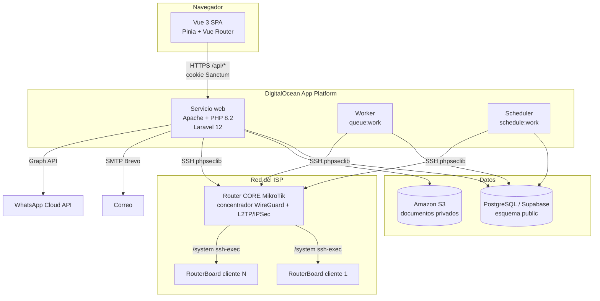
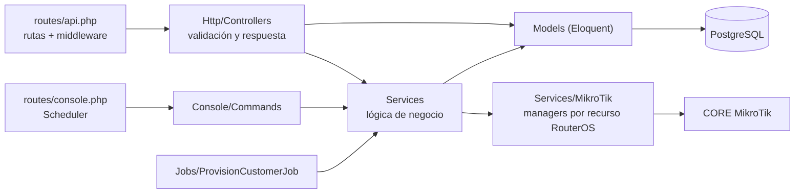
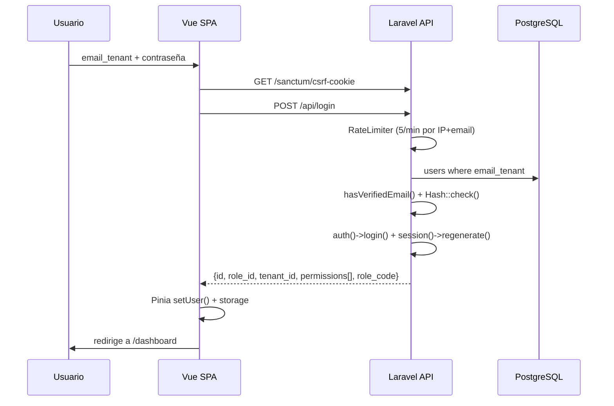
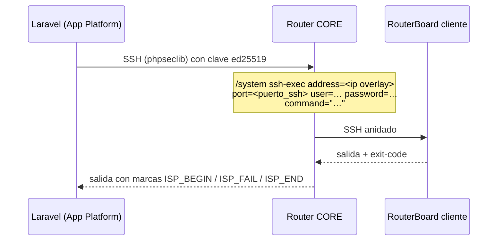
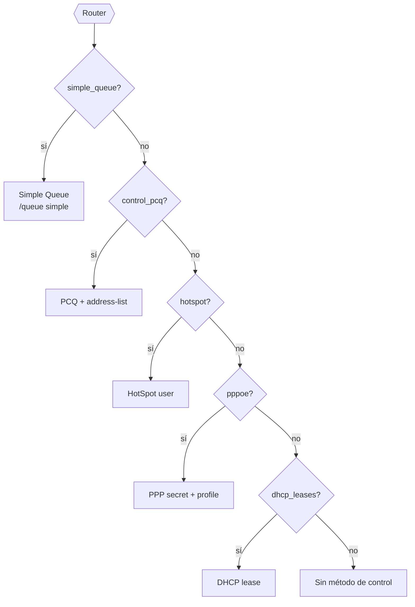
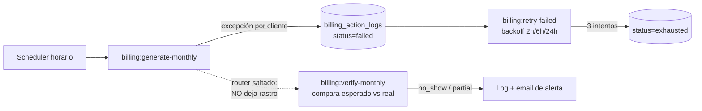
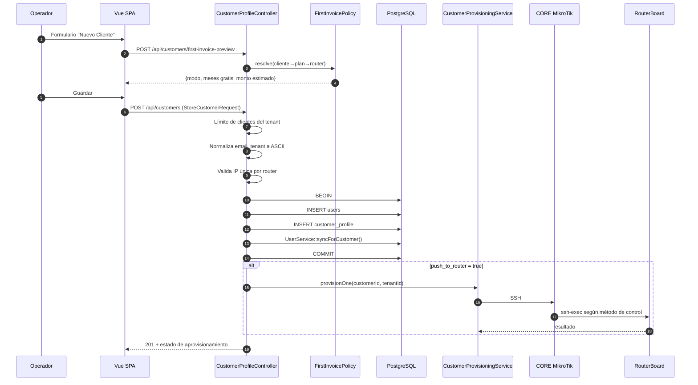

# ARQUITECTURA — ISPWatch

> Documento de arquitectura técnica. Todo lo aquí descrito está verificado contra el código
> del repositorio y contra el esquema real de la base de datos (`public` en Supabase).
> Cuando algo **no** puede inferirse del código se marca explícitamente como
> `⚠️ No inferible del código`.

**Última actualización:** 2026-07-30 (post-remediación) · Rama: `feat/first-invoice-free-months`

---

## Índice

1. [Visión general](#1-visión-general)
2. [Stack tecnológico](#2-stack-tecnológico)
3. [Arquitectura general](#3-arquitectura-general)
4. [Frontend](#4-frontend)
5. [Backend](#5-backend)
6. [Base de datos](#6-base-de-datos)
7. [Servicios externos](#7-servicios-externos)
8. [Integración MikroTik (el núcleo diferencial)](#8-integración-mikrotik-el-núcleo-diferencial)
9. [Multi-tenancy](#9-multi-tenancy)
10. [Automatización y planificador](#10-automatización-y-planificador)
11. [Flujo de datos extremo a extremo](#11-flujo-de-datos-extremo-a-extremo)
12. [Dependencias críticas](#12-dependencias-críticas)
13. [Despliegue](#13-despliegue)

---

## 1. Visión general

ISPWatch es una plataforma **multi-tenant** de gestión operativa para Proveedores de
Servicios de Internet (ISP). Combina en un solo sistema:

- **CRM/ERP de clientes** (altas, prospectos, instalaciones, documentos, inventario).
- **Facturación automática** dirigida por la configuración de cada router.
- **Aprovisionamiento y control de red** sobre routers MikroTik RouterOS.
- **Corte y reconexión automática** de clientes morosos.
- **Soporte técnico** (tickets, cargos por servicio, estadísticas).

La particularidad arquitectónica del producto es que **la facturación y el corte están
acoplados a la infraestructura de red**: cada router MikroTik lleva su propia configuración
de facturación (`billing`), y el sistema ejecuta acciones reales sobre el equipo
(colas, secrets PPPoE, reglas de firewall) como consecuencia del estado financiero del cliente.

---

## 2. Stack tecnológico

### Backend

| Componente | Versión | Rol |
|---|---|---|
| PHP | `^8.2` | Runtime |
| Laravel Framework | `^12.0` | Framework HTTP, ORM, cola, scheduler |
| Laravel Sanctum | `^4.2` | Autenticación SPA por cookie de sesión |
| Livewire + Volt | `^3.6` / `^1.7` | Dependencia heredada de Breeze. **Sin uso**: `routes/auth.php` se eliminó y no hay componentes Volt |
| barryvdh/laravel-dompdf | `^3.1` | Generación de PDF (facturas, contratos, actas) |
| maatwebsite/excel | `^3.1` | Importación/exportación masiva Excel |
| phpseclib/phpseclib | `^3.0` | SSH hacia el CORE MikroTik |
| league/flysystem-aws-s3-v3 | `^3.0` | Almacenamiento privado S3 de documentos |
| ezyang/htmlpurifier | `^4.17` | Saneado de HTML en plantillas de documentos |
| doctrine/dbal | `^4.4` | Cambios de esquema en migraciones |
| guzzlehttp/guzzle | `^7.9` | Cliente HTTP (WhatsApp Cloud API) |

### Frontend

| Componente | Versión | Rol |
|---|---|---|
| Vue | `^3.5` | SPA |
| Vue Router | `^4.6` | Enrutado con guardas de permisos |
| Pinia | `^3.0` | Estado de sesión (`stores/auth.js`) |
| Vite | `^6.4` | Bundler / dev server |
| TailwindCSS | `^3.4` | Estilos |
| Leaflet | `^1.9` | Mapa de clientes y topología |
| axios | `^1.16` | Cliente HTTP con interceptores |
| xlsx (SheetJS) | `^0.18` | Lectura de plantillas Excel en navegador |
| @vueup/vue-quill | `^1.2` | Editor de plantillas de documentos |
| oh-vue-icons / unplugin-icons | — | Iconografía |

### Datos e infraestructura

| Componente | Rol |
|---|---|
| PostgreSQL (Supabase, pooler) | Base de datos principal |
| PostGIS | Tipo geográfico en `sectorial.coordinates` |
| Driver `database` | Cache, cola y sesión en producción |
| DigitalOcean App Platform | Hosting (web + worker de cola + scheduler) |
| Amazon S3 | Documentos de cliente (bucket privado, URLs firmadas a 30 min) |
| Brevo SMTP | Correo transaccional |

---

## 3. Arquitectura general

Aplicación **monolítica Laravel** que sirve una **SPA Vue 3** desde el mismo dominio.
No hay separación de despliegue frontend/backend: `resources/js` se compila con Vite a
`public/build` y se entrega desde la vista Blade `resources/views/app.blade.php`.



### Capas del backend



**Regla de diseño observada:** los controladores validan y traducen HTTP; la lógica de
negocio vive en `app/Services`; el acceso a RouterOS está encapsulado en
`app/Services/MikroTik/*` con un *manager* por recurso (colas, secrets, hotspot, firewall…).

---

## 4. Frontend

### Estructura

```
resources/js/
├── main.js / app.js        # bootstrap de la SPA
├── router/index.js         # 40+ rutas, todas lazy-loaded
├── stores/auth.js          # Pinia: sesión, permisos, refresh
├── services/
│   ├── api.js              # instancia axios + manejador global de 401
│   ├── billing.js
│   └── api/                # 19 módulos: customers, routers, plans, …
├── composables/            # useNotification, usePermissions,
│                           # useProvisionPolling, useTableControls
├── layouts/DefaultLayout.vue
├── components/             # Sidebar, BillingPanel, DatePicker, …
├── pages/                  # 44 páginas + subcarpeta Billing/
└── utils/                  # customerName.js, image.js
```

### Sesión y permisos en el cliente

- El login (`POST /api/login`) devuelve el objeto de usuario con `permissions` (array
  proveniente de `role.permissions` en BD) y `role_code`.
- `stores/auth.js` lo guarda en `localStorage` (con "recordarme") o `sessionStorage`.
- La guarda de `vue-router` (`router.beforeEach`) bloquea la navegación si
  `to.meta.permission` no está en el array de permisos.
- `hasPermission()` del store es el **espejo exacto** de `CheckPermission` en el backend,
  bypass de superadministrador (`role_id == 1`) incluido. Si cambias uno, cambia el otro.
- El tenant **no** se envía en las peticiones: el backend lo deriva siempre del usuario
  autenticado.
- Un `401` en cualquier respuesta borra `userData` y redirige a `/`.



---

## 5. Backend

### Middleware registrado (`bootstrap/app.php`)

| Alias | Clase | Función |
|---|---|---|
| `permission` / `can_do` | `CheckPermission` | Exige uno o varios permisos con **semántica OR** (`permission:a,b`); **bypass si `role_id == 1`** |
| `staff_profile` | `CheckStaffProfile` | Pese al nombre, comprueba `role.code ∈ {admin, staff}` o `role_id == 1`; **no** exige fila en `staff_profile` |
| `throttle:<limitador>` | Laravel | Límite de peticiones: `api` (120/min), `router-ops` (10/min), `bulk-ops` (5/min) |
| *(global)* | `SecurityHeaders` | CSP, HSTS, X-Frame-Options, COOP, `object-src 'none'`, `base-uri`, `form-action`, `frame-src 'self' blob:` (los PDF generados en el navegador se muestran en un `<iframe>`; **sin `data:`**). **Sin `unsafe-eval` ni `unsafe-inline` en `script-src`**. Fijada por `SecurityHeadersTest`: una regresión de CSP no falla en el servidor, falla en el navegador y sin dejar logs |
| *(api, prepend)* | `EnsureFrontendRequestsAreStateful` | Sanctum SPA |

`trustProxies(at: '*')` está activo (necesario tras el balanceador de DigitalOcean).
Las `QueryException` se traducen a JSON 422 con mensaje amigable vía `App\Helpers\ErrorMessages`.

### Servicios de dominio (`app/Services`)

| Servicio | Líneas | Responsabilidad |
|---|---|---|
| `BillingService` | 1432 | Generación mensual, numeración, pagos, asignación, anulación, notificación |
| `OverdueSuspensionService` | 412 | Corte automático por mora según config del router |
| `CustomerProvisioningService` | 338 | Aprovisionar un cliente según el **método de control** del router |
| `RouterProvisioningService` | 218 | Suspender/reactivar en el router |
| `RouterPolicyInstallerService` | 151 | Instalar reglas de bloqueo en el router |
| `InstallationBillingService` | 253 | Facturar la instalación (costo + adicionales − descuento) |
| `PaymentReminderService` | 209 | Recordatorios de pago (email/WhatsApp): **un mensaje por cliente** con todas sus facturas pendientes |
| `TrafficHistoryService` | 164 | Muestreo y agregación de tráfico WAN |
| `VpnService` | 945 | Generación y verificación de scripts de túnel (WireGuard v7 · L2TP/IPSec v6) |
| `RouterApiService` | 912 | Protocolo API nativo MikroTik (puerto 8728) |
| `MikroTikSshService` | 603 | SSH directo/vía CORE |
| `WhatsAppService` | 162 | WhatsApp Cloud API (Meta Graph v18) |
| `ContractNumberService` | 62 | Reserva el consecutivo de contratos por tenant (`lockForUpdate`) |
| `Templates/*` | — | Render, saneado y resolución de placeholders de documentos |

#### Consecutivo de contratos

Todo contrato firmado desde la plataforma lleva un número irrepetible dentro del tenant, con
el formato `PREFIJO` + consecutivo de 5 dígitos. El prefijo lo configura cada ISP
(`tenant.contract_prefix`, pestaña **Plantillas de documentos**) y es **texto libre**: `CNO/`,
`Contrato N° `, `FIBRA_2026.` son todos válidos; vacío equivale a `CTR`. El separador `-` se
añade sólo cuando el prefijo termina en letra o dígito, para no duplicar el que ya puso el ISP.

**El número que se imprime y el nombre del archivo son dos cosas distintas**, y esa separación
es el punto de todo el diseño:

| | Quién lo decide | Función |
|---|---|---|
| Número impreso en el PDF y guardado en `contract_number` | El ISP, tal cual lo escribió | `ContractNumberService::format()` |
| Nombre del archivo en S3 | El sistema, saneado a ASCII seguro | `ContractNumberService::fileName()` |

`fileName()` usa `Str::ascii()` (mapa propio de Laravel, sin depender de `intl` ni de `iconv`,
así el resultado es idéntico en Windows y en el contenedor Linux), reemplaza lo que no sea
`[A-Za-z0-9._-]` por `-` y cae a `contrato` si no queda nada. La parte numérica siempre
sobrevive, así que dos contratos del mismo cliente nunca colisionan aunque sus prefijos se
saneen al mismo texto: `CNO/00001` → `contrato_CNO-00001.pdf`.

Como el espacio final del prefijo es significativo (`Contrato N° `), el campo está exceptuado
del middleware `TrimStrings` en `bootstrap/app.php`.

El mecanismo es el mismo que el de facturas (`BillingService::generateInvoiceNumber`): el
contador vive en la fila del tenant (`tenant.next_contract_number`) y se reserva dentro de
una transacción con `lockForUpdate`, de modo que dos firmas simultáneas no puedan obtener
el mismo número. La **UK** `(tenant_id, contract_number)` en `customer_documents` es la red
de seguridad si alguna vez se saltara esa ruta.

Dos consecuencias de diseño que conviene tener presentes:

1. **El número se reserva antes de renderizar**, porque va impreso en el encabezado del PDF
   (`Contrato No. …`) — no se puede asignar después de generar el archivo. Si el render
   falla, ese número queda quemado: es preferible un hueco en la secuencia a dos contratos
   con el mismo número.
2. **La vista previa no consume secuencia.** Tanto `contract-data` como el preview de
   plantillas muestran `ContractNumberService::format()` sobre el contador actual sin
   incrementarlo; es orientativo, no una reserva.

Los PDF que el ISP sube a mano (`type = contrato`, `signed = false`) **no** reciben número:
no se puede sellar por dentro un archivo ajeno, y un consecutivo que no aparece en el papel
prometería una trazabilidad que el documento no tiene.

### Plantillas de documentos (`app/Services/Templates`)

Cada tenant puede personalizar el cuerpo de 3 documentos (factura, contrato, hoja de
instalación), almacenado en `document_templates.body_html` (una fila por
`tenant_id` + `type`). Sin fila, o con `is_active = false`, se usa la vista Blade legacy
(`billing/invoice_pdf`, `documents/contract_pdf`, `documents/installation_sheet_pdf`) —
zero-regression: personalizar es opt-in.

**`TemplateRenderer`** es el único punto de entrada (`renderInvoice`, `renderContract`,
`renderInstallationSheet` + sus `preview*`). Con fila activa, decide entre dos modos según
`is_advanced_mode`:

| | Modo seguro (`is_advanced_mode = false`) | Modo avanzado (`true`) |
|---|---|---|
| Qué edita el tenant | Un fragmento de body, insertado en un shell Blade fijo (`documents/shells/*_shell.blade.php`) | El documento HTML completo (`<html><head><style>…</style></head><body>…</body></html>`) |
| Sanitizer | `TemplateSanitizer` — allowlist acotado (`p`,`ul`,`table`,`span[style]`…), sin `<div>` ni `` | `AdvancedTemplateSanitizer` — allowlist amplio (`div`,`table`,`img[src]`,`h1-h6`,`class`…), `id`/`style` en todos los tags (`Attr.EnableID=true`, auditoría 2026-08-03) + CSS vía `Filter.ExtractStyleBlocks`/CSSTidy |
| Render | `Pdf::loadView('documents.shells.*_shell', ['body' => $html, …])` | `Pdf::loadHTML($html)` directo, sin shell |

**Tamaño y orientación de página** (2026-08-05) — cada plantilla lleva su propio
`page_size` / `page_orientation` y `TemplateRenderer::applyPaper()` los aplica con
`setPaper()` en los 6 caminos (3 `render*` + 3 `preview*`), en ambos modos. La ruta legacy
(sin fila en `document_templates`) **no** se toca: sigue con el default de
`config/dompdf.php`, que es lo que hacían todas antes.

El motivo es concreto y no cosmético: un contrato a dos columnas — el formato CRC estándar
en Colombia, y el que exportan sistemas como WispHub — necesita ~950 px de ancho. A4
vertical da ~698 px útiles a 96 dpi, así que dompdf aprieta el diseño y descuadra la
maquetación entera; A4 horizontal da ~1027 px y cabe intacto. Sin esta opción, la única
salida era rediseñar el contrato, que es un formato regulado.

`applyPaper()` **revalida** contra `DocumentTemplate::PAGE_SIZES`/`PAGE_ORIENTATIONS`
aunque `UpdateDocumentTemplateRequest` ya validó en la entrada: `setPaper()` con un tamaño
desconocido no lanza excepción, se queda en silencio con un canvas raro, y eso es peor que
ignorar el valor. Una fila con basura (escritura directa a la BD, migración desde otro
sistema) cae al default.

**Dos vistas previas distintas, ninguna con su propio renderizador:**

| | Qué previsualiza | Punto de entrada |
|---|---|---|
| **De plantilla** (Configuración → Plantillas) | Un `body_html` en borrador, con datos de muestra | `TemplateRenderer::preview*` |
| **De documento real** (detalle de instalación) | La hoja **de esa orden**, sin firmas, para que el cliente o el prospecto lea lo que va a firmar | `CustomerInstallationController::buildSheetPdf()`, el mismo que usa `/sign` antes de guardar el `CustomerDocument` |

La segunda no persiste nada (ni documento, ni firma, ni cambio de estado) y acepta la hoja
en borrador para reflejar lo que el técnico tiene en pantalla sin haberla guardado. Que
comparta `buildSheetPdf()` con la firma es el punto: lo que el cliente lee y lo que se
archiva no pueden divergir.

**Un documento firmado por tipo** (2026-08-05): `sign()` y `signContract()` devuelven `409`
si ya existe la hoja de esa orden / el contrato de ese cliente, en vez de acumular PDF casi
idénticos sin saber cuál vale. El contrato se comprueba **antes** de `ContractNumberService::allocate()`
para no gastar un consecutivo en un documento que no se genera. El bloqueo mira los
`customer_documents` con `signed = true` (las fotos van con `signed = false`), así que borrar
el anterior habilita volver a firmar.

**Las fotos de la instalación no van dentro del PDF** (2026-08-05): se retiró la galería de
la vista legacy, del shell y el bloque `{{instalacion.fotos}}`. Se consultan en los documentos
del cliente; dentro del PDF nunca llegaron a verse porque se resolvían con `public_path()`
mientras se almacenan en S3. Reponerlas exigiría incrustarlas como data URI leyéndolas de S3.

**Placeholders** — dos tipos, mismo motor de sustitución (`PlaceholderResolver::apply()`,
`BlockMarkerInjector`), reutilizado sin cambios entre ambos modos:

- **Escalares** (`{{cliente.nombre}}`, `{{factura.total}}`…) — texto plano, `htmlspecialchars()`
  al sustituir. Un token desconocido (typo, o de otro tipo de documento — ej. `{{factura.*}}`
  dentro de un contrato) se blanquea a `''`; es una decisión consciente, no un bug: un typo
  nunca debe romper el render. Desde el 2026-08-06 ya **no** es silencioso —
  `TemplateDiagnostics` lo reporta por `X-Template-Warnings` (ver más abajo).
- **De bloque** (`{{factura.tabla_items}}`, `{{instalacion.firma_cliente}}`,
  `{{instalacion.firma_tecnico}}`, `{{empresa.logo}}`) — HTML de confianza pre-renderizado por el
  servidor (tabla de ítems, galería de fotos, imagen de firma/logo), **nunca** sanitizado (necesita
  ``/`colspan`, prohibidos en el allowlist del tenant). Se insertan vía `BlockMarkerInjector`:
  cada token se reemplaza primero por un marcador opaco de alta entropía (`Str::random()`), el HTML
  se sanitiza/procesa, y sólo entonces se localiza el marcador en el árbol DOM (`DOMDocument`) y se
  reemplaza por el fragmento real — nunca con un `str_replace` directo, porque el tenant podría
  haber puesto el token dentro de un atributo HTML y corromper la estructura. Un marcador que no
  se pudo insertar (posición inalcanzable) se blanquea igual, se loguea, y se reporta vía el
  header `X-Template-Warnings` en el endpoint de vista previa.
  `{{empresa.logo}}` (auditoría 2026-08-03) resuelve a una ruta LOCAL en disco
  (`public_path('storage/'.$tenant->logo)`, mismo patrón que `invoice_shell.blade.php`), nunca una
  URL — inmune a `enable_remote=false` porque dompdf no hace ningún fetch de red. Es el primer
  bloque presente en **contrato**, rompiendo deliberadamente la invariante previa de "contrato sin
  bloques" (`config/document_placeholder_blocks.php`). `BlockPlaceholderResolver::resolveLogo()`
  normaliza backslashes a `/` en la ruta antes de renderizar el fragmento — el serializador de
  libxml usado por `BlockMarkerInjector` percent-codifica `\` en atributos URI, lo que rompería la
  ruta en un entorno de desarrollo Windows (en producción, Linux, la ruta ya usa `/` y nunca ocurre).
  `{{contrato.firma_cliente}}` (auditoría 2026-08-04) es el segundo bloque de contrato — en modo
  seguro la firma la sigue imprimiendo el shell fijo (`contract_shell.blade.php`, fuera de
  `body_html`), pero en **modo avanzado no hay shell**: sin este bloque, la firma real que
  `CustomerDocumentController::signContract()` captura y pasa a `TemplateRenderer::renderContract()`
  no tenía NINGÚN lugar donde insertarse — se perdía en silencio en cualquier contrato de modo
  avanzado. Descubierto al preparar un HTML real de prueba para validar contra producción, no en
  el diseño original del modo avanzado (2026-08-01).

**Plantillas base** (`DocumentStarterLibrary`, auditoría 2026-08-06) — el editor abría en
blanco. El sistema siempre tuvo un formato base (`resources/views/documents/*.blade.php`, el
que usa cuando no hay plantilla personalizada), pero vivía en Blade con acceso a objetos
(`$invoice->total`), así que no era ni editable ni mostrable en el editor: el tenant tenía que
escribir un documento entero desde cero o pegar el de otro sistema — que es justamente de
donde venían los reportes de plantillas migradas. Los cuerpos viven en
`resources/document-starters/{tipo}/{slug}.html` como **HTML plano, no vistas Blade**: Blade
interpretaría `{{marcador}}` como una expresión PHP y reventaría al compilar. El catálogo
(`config/document_template_starters.php`) fija además el modo y el papel con los que cada
plantilla tiene sentido — el contrato CRC es a dos columnas y sólo cabe en horizontal; el
contrato mexicano se abre en Carta y no en A4. Hay 9: factura y acta de instalación genéricas,
y 7 contratos (genérico + los formatos regulados de Colombia, México, Argentina, Perú, Chile y
Bolivia). El
`slug` llega por URL: sólo se convierte en ruta de disco después de existir en el catálogo,
nunca por concatenación. Dos pruebas cierran el ciclo: ninguna plantilla base puede usar un
marcador que el sistema no resuelva, y todas tienen que producir un PDF real sin avisos.

**El editor visual es un iframe, no un editor de texto enriquecido** (auditoría 2026-08-06).
Hasta esa fecha el modo seguro usaba Quill, que normaliza cualquier HTML a su propio modelo
interno: tablas, `<div>`, `<style>` y documentos completos no existen para él. Como el
interruptor de modo avanzado sólo cambiaba qué componente se monta sobre el mismo `draftHtml`,
salir de modo avanzado hacía que Quill parseara el documento del tenant, se quedara con lo que
entendía —casi nada— y **reescribiera el resultado vacío en el modelo**. No era que "no
renderizara": borraba. `HtmlDocumentEditor.vue` edita dentro de un `<iframe>` con el body en
`contentEditable`, lo que resuelve las dos cosas a la vez: preserva el HTML tal cual (el
navegador no lo normaliza a ningún modelo) y aísla el `<style>` del tenant, que en la misma
página se aplicaría al panel de configuración entero. El componente recuerda si el valor que
recibió era un documento completo o un fragmento, para devolver lo mismo que le dieron — el
modo seguro guarda un fragmento que va dentro del shell fijo, el avanzado un documento entero,
y confundirlos rompe el render.

**El editor edita dentro de la hoja real, no dentro de la pantalla** (auditoría 2026-08-06,
segunda pasada). El iframe fija el ancho del body al **área imprimible de verdad**: tamaño de
papel a 96 dpi (el `dpi` de `config/dompdf.php`) menos 96 px de margen — los 1.27 cm por lado
que mete dompdf. Eso da 698 px en A4 vertical y 1027 px en horizontal, exactamente las cifras
medidas el 2026-08-05. Sin esa restricción el editor era tan ancho como el panel, así que un
diseño de 950 px se veía perfecto ahí y en el PDF se salía de su columna y se montaba sobre la
de al lado. Encima se dibujan los cortes de página con `html::before` — un pseudo-elemento, que
no existe en el DOM y por tanto es imposible que acabe dentro del HTML guardado. La misma hoja
de estilos marca las `` remotas en rojo translúcido: el navegador las descarga y dompdf no
(`enable_remote = false`), así que sin marcarlas el editor prometía una imagen que el PDF nunca
iba a mostrar. Todo eso vive en un `<style>` con id conocido que `readValue()` quita de una
copia del documento antes de serializar, junto con el `contenteditable` del body.

`HtmlDocumentEditor` emite además una medición (`@fit`) con el ancho que pide el contenido
frente al que deja la hoja, y la pantalla la convierte en un aviso accionable con el número
exacto y un botón para girar la hoja. Es la causa nº 1 de los PDF con los textos montados.

> **Límite conocido:** el editor es un navegador y el PDF lo genera dompdf, que implementa un
> subconjunto pobre de CSS. El ancho de hoja, los cortes de página y las imágenes remotas ya
> están cubiertos, pero `float`, `position` y flexbox seguirán comportándose distinto. La
> paridad exacta exige cambiar el motor por un navegador headless — ver `MEJORAS_RECOMENDADAS.md`.

**Diagnóstico de la plantilla** (`TemplateDiagnostics`, auditoría 2026-08-06) — capa aparte
del render, que **no** cambia lo que se sustituye: inspecciona el `body_html` **crudo** (antes
de sanear, que es lo que el tenant ve en el editor) y devuelve hallazgos con un mensaje ya
armado. Existe porque "token desconocido → blanco" y "el sistema no funciona" son
indistinguibles desde la interfaz: el usuario ve su HTML correcto y los datos vacíos, sin
ninguna pista. Detecta seis cosas: marcador de otro sistema con llaves (`{{plan_internet.precio}}`)
y sin llaves (`NUMERO_CONTRATO_TAG`, que aquí es texto y se imprime literal), token válido pero
de **otro tipo** de documento, typo genuino (sugerencia por distancia de Levenshtein, con
umbral corto a propósito: una sugerencia equivocada manda a cambiar el marcador que sí estaba
bien), `` remota (dompdf con `enable_remote = false` nunca la descarga) y los bloques
huérfanos que ya reportaba `BlockMarkerInjector`. Las equivalencias viven en
`config/document_placeholder_aliases.php` — catálogo **de diagnóstico**, no de resolución: la
traducción no es automática porque una equivalencia puede no aplicar al caso concreto
(`fecha_instalacion` es la fecha de firma en un contrato y la de la orden en una hoja de
instalación) y porque traducir en silencio dejaría la plantilla guardada diciendo una cosa y
el PDF imprimiendo otra. Se expone por `X-Template-Warnings` en la vista previa y por la clave
`warnings` al guardar (guardar **activa** la plantilla: es el momento en que más importa).

**Reglas de seguridad no negociables** (ambos sanitizers, verificadas con test dedicado —
`TemplateSanitizerTest`, `AdvancedTemplateSanitizerTest`): `<script>` y atributos `on-*` siempre
bloqueados (nunca se activa `HTML.Trusted`); `url()`, `@import`, `expression()`, `behavior` en
CSS siempre bloqueados (ninguna propiedad que sólo tenga sentido con `url()` está en el
allowlist); `position`/`top`/`left`/`right`/`bottom`/`z-index` nunca disponibles (requieren
`CSS.Trusted`, que tampoco se activa — evita overlays que oculten/falsifiquen contenido en un
documento fiscal/legal); `config/dompdf.php` fuerza `enable_remote = false` explícito (no
depende del default del paquete).

**Correcciones de paginación para dompdf** (`AdvancedTemplateSanitizer::fixDompdfPaginationQuirks()`,
auditoría 2026-08-04) — una sola pasada de DOM sobre el body ya saneado, motivada por plantillas
reales exportadas del editor WYSIWYG de WispHub que producían PDFs con páginas en blanco:
(a) `page-break-before` en el **primer** elemento del documento se retira (dompdf inserta una página
vacía porque no hay página anterior de la que romper; un navegador lo ignora) — el resto de saltos
se respeta tal cual; (b) las **alturas fijas** (`height`, atributo o CSS) se retiran de toda la
familia `<table>`, no de ``/`<div>` donde son legítimas. Medido sobre un contrato real: sólo
quitando las alturas, el PDF pasa de 8 páginas con 3 en blanco a 7 con 1. `width` **sí** se conserva
como atributo en `table`/`td`/`th` — es como esas plantillas arman su layout de columnas, y sin él
dompdf cae en auto-layout y rompe la maquetación.

> **Limitación conocida, no corregida en el sanitizer:** dompdf no parte una celda de tabla entre
> páginas — si un `<td>` excede el alto de la hoja, lo empuja entero (dejando la anterior en blanco)
> y **recorta el excedente sin avisar**. La solución es del lado de la plantilla (usar `<div>` para
> contenido largo, no una celda). No se automatiza porque saber si el contenido desbordará exige
> renderizar, y convertir tablas a divs a ciegas alteraría el diseño del tenant. Ver
> `docs/MEJORAS_RECOMENDADAS.md` P-8.

`AdvancedTemplateSanitizer` habilita `id` (`Attr.EnableID=true`, auditoría 2026-08-03) — necesario
porque plantillas reales de clientes exportadas de WispHub usan selectores CSS por id
(`#clausulas{...}`), que antes se perdían en silencio (`id` se descarta siempre si no está este
flag, aunque esté declarado en `HTML.Allowed`, verificado empíricamente). HTMLPurifier valida el
valor (rechaza ids con sintaxis inválida, ej. `javascript:alert(1)`) y fuerza unicidad en todo el
documento (un `id` duplicado se descarta en la 2ª aparición) — no es un bypass. El riesgo típico
de este flag (colisión de id con la página que aloja el contenido) no aplica aquí: la salida es
siempre un PDF standalone vía `Pdf::loadHTML()`, nunca se embebe en otra página. Una plantilla ya
guardada **antes** de este fix perdió su `id` de forma permanente en `body_html` (la sanitización
corre una sola vez, al guardar) — requiere volver a pegar/guardar el HTML para recuperarlo.

### Managers MikroTik (`app/Services/MikroTik`)

| Manager | Recurso RouterOS |
|---|---|
| `QueueManager` | `/queue simple` |
| `PcqManager` | `/queue type` + `/ip firewall address-list` |
| `HotspotManager` | `/ip hotspot user` + `user profile` |
| `PppProfileManager` / `PppSecretManager` | `/ppp profile`, `/ppp secret` |
| `DhcpLeaseManager` | `/ip dhcp-server lease` |
| `IpMacBindingManager` | ARP estático + filtro por par IP/MAC |
| `FirewallRulesManager` | `/ip firewall filter` + `address-list` de suspendidos |
| `SuspensionManager` | Alta/baja en la address-list de morosos |
| `InterfaceReader` | Lectura robusta de interfaces WAN (multi-variante) |
| `RouterEndpointResolver` | Resuelve la IP real del router en el overlay (en WireGuard es fija; en L2TP corrige la deriva del pool) |
| `SshTunnel` / `SshTunnelManager` | Túnel SSH hacia el CORE |
| `MikroTikApiProtocol` / `MikroTikConnectionManager` | Protocolo binario API |

### Comandos Artisan (`app/Console/Commands`)

| Comando | Propósito |
|---|---|
| `billing:generate-monthly {period?}` | Genera facturas del periodo (idempotente) |
| `billing:retry-failed` | Reintenta facturas fallidas con backoff 2h/6h/24h |
| `billing:verify-monthly` | Auditoría de *no-show*: detecta routers que no facturaron |
| `billing:auto-cut` | Corte automático por mora |
| `billing:reconcile-suspensions` | Reconcilia DB ⇄ RouterBoard (re-corta lo no confirmado) |
| `billing:verify-cuts` | Auditoría de *no-show* de cortes |
| `vpn:verify-tunnels` | Alerta los routers sin túnel vivo contra el CORE |
| `billing:send-reminders` | Recordatorios de pago |
| `billing:process-overdue` | Procesamiento manual de morosos |
| `billing:simulate` | Simulador del ciclo completo |
| `billing:void-courtesy {period?}` | Anula facturas de planes de cortesía |
| `billing:generate-tenant {tenant} {period} {--dry-run}` | Facturación puntual por tenant |
| `traffic:collect` | Muestreo de contadores WAN |
| `traffic:prune {--days=30}` | Poda de muestras finas |
| `migrate:both` | **Aplica migraciones a `ispwatch_dev` y `public` a la vez** |
| `db:sync-dev` | Copia `public` → `ispwatch_dev` |
| `db:fix-sequences` | Repara secuencias de PostgreSQL desincronizadas |
| `documents:migrate-to-s3 {--dry-run}` | Migra documentos locales a S3 |
| `router:diagnose-wan` | Diagnóstico de interfaz WAN |

---

## 6. Base de datos

- **Motor:** PostgreSQL sobre Supabase (pooler `aws-0-us-east-1.pooler.supabase.com:5432`).
- **Separación dev/prod por esquema:** la variable `DB_SCHEMA` selecciona `public`
  (producción) o `ispwatch_dev` (desarrollo) **dentro de la misma base de datos**.
  Por eso existe el comando `migrate:both`.
- **55 tablas de aplicación** + tablas de infraestructura Laravel (`cache`, `jobs`,
  `sessions`, `migrations`, `personal_access_tokens`) + tablas PostGIS
  (`spatial_ref_sys`, vistas `geometry_columns`/`geography_columns`).
- **RLS activado** en el esquema `public` (rol `anon` recibe 401): el frontend ya no
  accede directamente a Supabase, todo el acceso a datos pasa por la API Laravel.

Detalle completo en [`BASE_DATOS.md`](BASE_DATOS.md).

---

## 7. Servicios externos

| Servicio | Uso | Configuración |
|---|---|---|
| **Supabase (PostgreSQL)** | Base de datos | `DB_*` |
| **Amazon S3** | Documentos de cliente (cédulas, contratos firmados) — bucket privado, URL temporal de 30 min | `AWS_*`, `FILESYSTEM_DISK` |
| **Brevo (SMTP)** | Correo transaccional: verificación, factura creada, recordatorio, tickets | `MAIL_*` |
| **WhatsApp Cloud API (Meta Graph v18)** | Plantillas de recordatorio de pago | `WHATSAPP_ACCESS_TOKEN`, `WHATSAPP_PHONE_NUMBER_ID`, `WHATSAPP_BUSINESS_ACCOUNT_ID` |
| **Google Maps JS API** | Mapa de clientes (clave **por tenant**, cifrada en BD) | `tenant.google_maps_api_key` |
| **MikroTik CORE** | Punto de entrada SSH/API a toda la red de routers | `MIKROTIK_CORE_*` |
| **Converza** | Sistema externo que lee `router_outage_events` en **solo lectura** y difunde por WhatsApp la falla masiva | Contrato de datos, no HTTP |

> ⚠️ El lado Converza de la integración de falla masiva **no está en este repositorio**;
> ISPWatch únicamente registra los eventos append-only.

---

## 8. Integración MikroTik (el núcleo diferencial)

### Topología de conexión

Los RouterBoards de los clientes **no son accesibles directamente desde Internet**.
Se conectan por túnel contra un router **CORE** central. ISPWatch alcanza cada
router en dos saltos.

### Transporte del túnel: WireGuard o L2TP, por router

La columna `router.vpn_transport` decide el transporte de cada equipo. **No es una
migración en curso, es un estado permanente**: WireGuard existe desde RouterOS 7.1
y en v6 no lo hay.

| | WireGuard (v7) | L2TP/IPsec (v6) |
|---|---|---|
| Flujos | uno solo (UDP) | IKE udp/500 **+** datos udp/1701 |
| Identidad del peer | clave pública | IP + PSK + usuario PPP |
| IP de overlay | fija (`allowed-address`) | del pool, **deriva** al reconectar |
| Señal de salud | `last-handshake` del peer | presencia en `/ppp active` |
| Rango | `172.18.<tenant>.0/24` | `172.16.<tenant>.0/24` |

**Por qué se agregó WireGuard.** L2TP parte el túnel en dos flujos. Si el router
cliente tiene multi-WAN, balanceo o un src-nat que reescribe el origen, cada flujo
puede salir por una IP pública distinta: el CORE levanta la SA de IPsec contra la
primera, el paquete L2TP llega de la segunda sin política que lo cubra y —con
`use-ipsec=required`— lo rechaza (`no IPsec encryption while it was required`).
Eso dejó `CORE_TOCAIMA` 8 días caído en julio de 2026, con 212 clientes sin
gestión, reintentando cada 12 segundos.

WireGuard no puede fallar así: al ser un único flujo autenticado por clave
pública, el CORE aprende el endpoint venga de la IP que venga. Que la pública del
cliente cambie es irrelevante — lo que rompía era tener **dos a la vez**.

**Para la flota v6, que no puede migrar**, el script de provisión inyecta
obligatoriamente las defensas equivalentes, acotadas a la IP del CORE:
`ISPWatch-CORE-no-mark` (mangle output), `ISPWatch-CORE-no-nat` (srcnat) y
`ISPWatch-CORE-pin` (ruta /32 por el gateway activo, para el caso ECMP).

**Las claves las acuña ISPWatch** con phpseclib (X25519), no el router. Si
esperáramos a que el equipo nos entregara su clave pública haría falta un túnel
previo para leerla, y un router recién instalado no tiene ninguno.

**Trampa conocida:** el `listen-port` del cliente no se puede fijar a ciegas.
13231 es el default de RouterOS y lo ocupa el *Back To Home VPN* de MikroTik; si
choca, la interfaz queda deshabilitada con `Listen port already used`. Como el
cliente es quien disca, ese puerto es indiferente —el único que debe coincidir es
el `endpoint-port`, que es el del CORE—, así que el script busca uno libre.

### Los dos saltos



**Dos problemas resueltos explícitamente en el código** (`BuildsCoreSshExec`):

1. **Puerto SSH del cliente.** RouterOS asume 22; despliegues reales lo mueven.
   Sin `port=` el operador veía `<connection failed> <ip>:22` y creía que el
   cliente bloqueaba. → columna `router.puerto_ssh`.
   ⚠️ Ojo al llenarla a mano: el script de provisión ejecuta
   `/ip service set ssh port=22` en el cliente, así que **pisa** cualquier otro
   valor en el siguiente push. Si un equipo debe servir SSH fuera del 22 hay que
   cambiar también el script, no solo la columna.
2. **Deriva de IP en el overlay.** El secret PPP no tiene `remote-address` fijo, así que
   el CORE reasigna del pool `pool-vpn-<tenant>` en cada reconexión y `router.ip`
   queda obsoleto. → `RouterEndpointResolver` lee `/ppp active` del CORE, empareja por
   `vpn_username` y **reescribe la IP en BD**.

**Escapado de comandos:** el comando interno usa comillas planas `"` (no `\"`), y una
única capa de `addslashes()` la aplica `coreSshExecCommand()`. Todo *statement* va
envuelto en `:do {} on-error={}` y delimitado con centinelas `ISP_BEGIN`/`ISP_FAIL`/`ISP_END`
para poder distinguir un fallo real de una salida vacía.

### Métodos de control (excluyentes)

Un router usa **uno y sólo uno** de estos modos, resuelto por
`CustomerProvisioningService::resolveControlMode()` en este orden de prioridad:



Sobre el modo elegido se pueden aplicar **aditivos**: `ip_bindings` (ARP estático) y
`amarre` (drop por par IP/MAC), gestionados por `IpMacBindingManager`.

### Bloqueo de morosos

`RouterPolicyInstallerService` + `FirewallRulesManager` instalan en el router cliente
(documentado en [`BLOQUEO_MOROSOS_MANUAL.md`](BLOQUEO_MOROSOS_MANUAL.md)):

- `address-list ISPWATCH_SUSPENDIDOS` (con un ancla `0.0.0.0`).
- En `chain=forward`, **al tope de la cadena**: `accept` hacia el portal de pago
  (`PORTAL_IP`) y `drop` incondicional para la lista.
- Al suspender se hace además **flush de conntrack** del cliente, porque sin ello las
  conexiones ya establecidas seguían pasando.

---

## 9. Multi-tenancy

**Modelo:** *shared database, shared schema* con columna `tenant_id`.

- El trait `App\Traits\BelongsToTenant` añade un **global scope** que filtra por
  `tenant_id` y rellena la columna al crear.
- **El `tenant_id` se deriva SIEMPRE del usuario autenticado**, nunca del request
  (mitigación OWASP A01/A04). Sólo en contexto de consola se acepta un `tenant` por
  query param como respaldo para jobs.
- Modelos con el trait: `Router`, `Plan`, `Sectorial`, `Invoice`, `SupportTicket`,
  `Expense`, `ExpenseCategory`, `CustomerInstallation`, `InventoryStock/Device/Provider/Branch`,
  `RouterOutageEvent`, `SectorialHistory/Note/Photo`.
- **Excepción deliberada:** `BulkProvisionRun` **no** lleva el scope, porque los jobs en
  cola corren sin sesión; el filtrado por tenant se hace explícito en el controlador.
- `Role` usa un scope propio que incluye roles del tenant **y** roles globales
  (`tenant_id IS NULL`).

> ⚠️ **Trampa conocida:** si el `tenant_id` del usuario no coincide con el de su rol,
> el scope anula el rol y se produce un falso `403 "No role assigned"`. Por eso tanto
> `AuthController@login` como `CheckPermission` cargan el rol con
> `withoutGlobalScope('tenant')`.

---

## 10. Automatización y planificador

Definido en `routes/console.php`. Requiere `schedule:run` cada minuto en el servidor.

| Frecuencia | Comando | Notas |
|---|---|---|
| Cada hora | `billing:generate-monthly` | `withoutOverlapping`; el gate de día **y hora** está dentro del servicio |
| Cada hora | `billing:retry-failed` | Sólo procesa filas con `next_retry_at` vencido |
| Cada hora | `billing:auto-cut` | Gate por `cut_day` + `cut_time` de cada router |
| Cada hora | `billing:reconcile-suspensions` | Failover DB ⇄ RouterBoard |
| Cada hora | `billing:send-reminders` | `withoutOverlapping`; idempotente por ciclo |
| Diario 06:00 | `billing:verify-monthly` | Auditoría *no-show* de facturación |
| Diario 07:00 | `billing:verify-cuts` | Auditoría *no-show* de cortes |
| Cada 30 min | `vpn:verify-tunnels` | Salud del túnel por router (`last-handshake` WireGuard / `/ppp active` L2TP) |
| Cada 5 min | `traffic:collect` | Sólo routers con `historial_trafico = true` |
| Diario | `traffic:prune --days=30` | Conserva los agregados diarios |

**Diseño de idempotencia y recuperación:** los comandos horarios no dependen de
ejecutarse en el minuto exacto. `generate-monthly` comprueba `today->day >= create_day`,
de modo que si el sistema estuvo caído el día de facturación, recupera al arrancar.



> El *failover* (`billing_action_logs`) sólo ve fallos **por cliente**. Un router entero
> saltado o un cron que nunca corrió no dejan rastro: ese punto ciego lo cubre
> `billing:verify-monthly`, que reconstruye el mismo *gating* y compara esperado vs. real.

---

## 11. Flujo de datos extremo a extremo

Ver el recorrido completo módulo a módulo en [`BITACORA_TECNICA.md`](BITACORA_TECNICA.md#10-flujo-completo-del-sistema).
Resumen del camino más representativo — **alta de cliente con aprovisionamiento**:



---

## 12. Dependencias críticas

Componentes cuyo fallo **detiene una función de negocio completa**:

| Dependencia | Qué rompe si falla | Mitigación existente en el código |
|---|---|---|
| **Router CORE MikroTik** | Todo aprovisionamiento, corte y reconexión | `suspension_action_logs` con reintentos + `billing:reconcile-suspensions` |
| **Componente `scheduler`** | No se factura, no se corta, no se avisa | `billing:verify-monthly` / `verify-cuts` alertan el *no-show* |
| **PostgreSQL / Supabase** | Todo | — |
| **Worker de cola** | Aprovisionamiento masivo asíncrono queda "processing" | Endpoint de estado por `jobId`; el camino síncrono sigue disponible |
| **S3** | Subida y descarga de documentos y firmas | — |
| **SMTP Brevo** | Verificación de correo (bloquea el login de nuevos usuarios), facturas y recordatorios | Envío por WhatsApp como canal alterno en recordatorios |
| **Clave SSH del CORE** | Idéntico a fallo del CORE | Se materializa en `storage/keys/` en el arranque del contenedor |

---

## 13. Despliegue

**Plataforma:** DigitalOcean App Platform, buildpack `php` sobre Ubuntu 22,
región `atl`, egress con **IP dedicada** (necesario para que el CORE la incluya en su
lista blanca).

Dos componentes definidos en `.do/deploy.template.yaml`:

| Componente | Comando | Instancia |
|---|---|---|
| `ispwatch` (servicio web) | materializa la clave SSH → `php artisan migrate --force` → `heroku-php-apache2 public/` | `apps-s-1vcpu-0.5gb` |
| `worker` | materializa la clave SSH → `php artisan queue:work --tries=1 --timeout=120 --max-time=3600` | `apps-s-1vcpu-0.5gb` |
| `scheduler` | materializa la clave SSH → `php artisan schedule:work` | `apps-s-1vcpu-0.5gb` |

Despliegue automático por push a `main` del repositorio `ispwatchcol/ISPWatch`.
La clave privada SSH del CORE viaja como secreto base64 (`MIKROTIK_CORE_SSH_KEY_B64`) y se
escribe a `storage/keys/mikrotik_core_id_ed25519` con permisos `600` en cada arranque.

El componente **`scheduler`** se añadió el 2026-07-30: hasta entonces la especificación no
tenía ninguno, y sin él **nada del ciclo automático ocurría** — ni facturación, ni
recordatorios, ni cortes. Coincide con el incidente histórico que motivó crear
`billing:verify-monthly`.

> 🔧 **Falta aplicar la especificación en DigitalOcean.** Verificar después con
> `php artisan billing:verify-monthly` (debe reportar `ok`, nunca `no_show`).

La plantilla `.do/deploy.template.yaml` **ya no contiene secretos**: todo valor sensible es un
marcador `<<<CAMBIAR:...>>>` declarado como `type: SECRET`. La especificación real vive en
`.do/deploy.yaml`, que está en `.gitignore`. Ver
[`RUNBOOK_ROTACION_SECRETOS.md`](RUNBOOK_ROTACION_SECRETOS.md).
