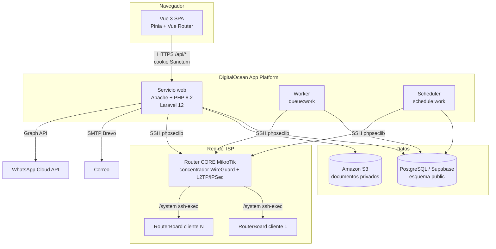
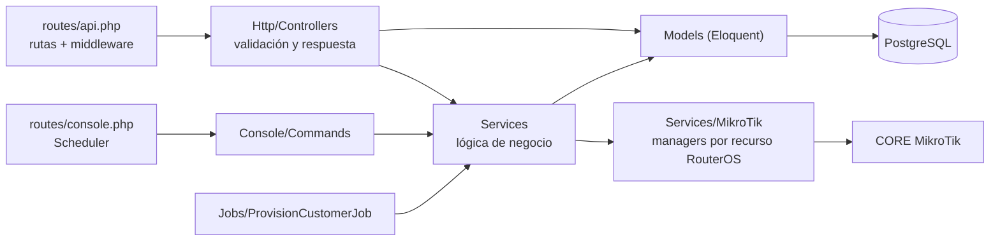
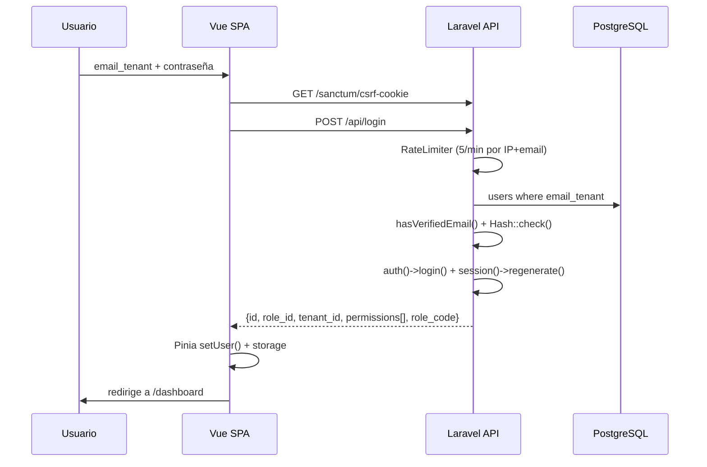
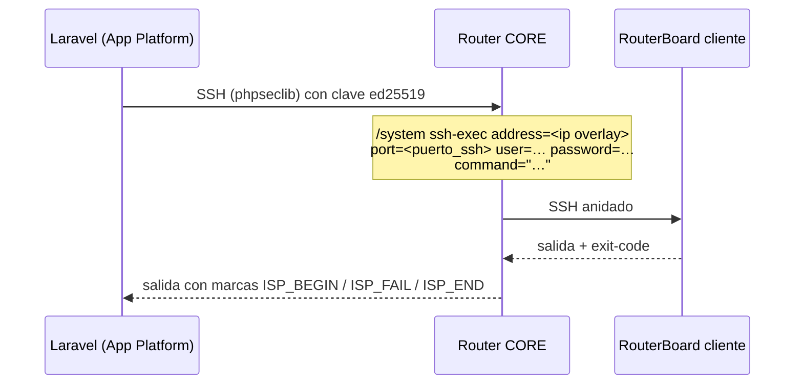
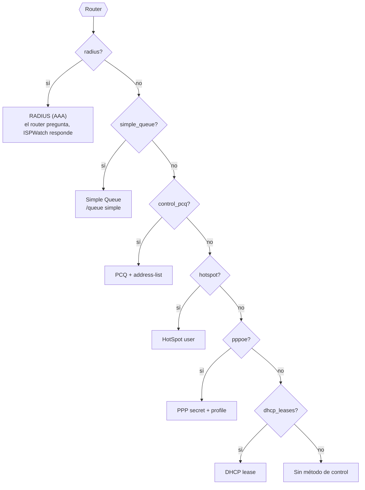
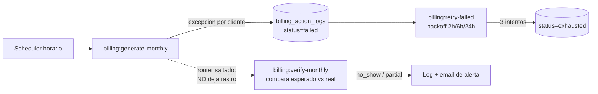
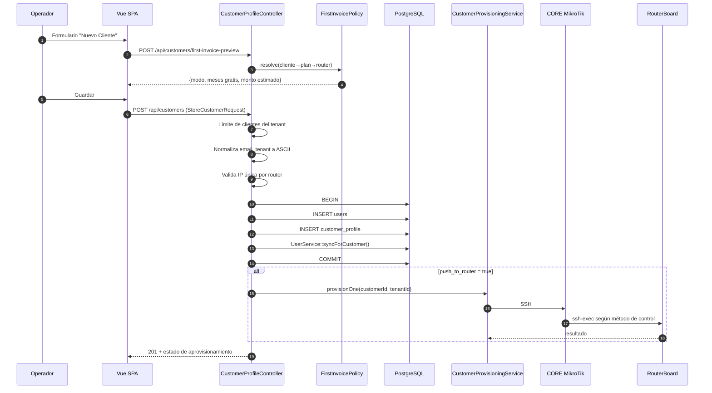

# ARQUITECTURA — ISPWatch

> Documento de arquitectura técnica. Todo lo aquí descrito está verificado contra el código
> del repositorio y contra el esquema real de la base de datos (`public` en Supabase).
> Cuando algo **no** puede inferirse del código se marca explícitamente como
> `⚠️ No inferible del código`.

**Última actualización:** 2026-07-30 (post-remediación) · Rama: `feat/first-invoice-free-months`

---

## Índice

1. [Visión general](#1-visión-general)
2. [Stack tecnológico](#2-stack-tecnológico)
3. [Arquitectura general](#3-arquitectura-general)
4. [Frontend](#4-frontend)
5. [Backend](#5-backend)
6. [Base de datos](#6-base-de-datos)
7. [Servicios externos](#7-servicios-externos)
8. [Integración MikroTik (el núcleo diferencial)](#8-integración-mikrotik-el-núcleo-diferencial)
9. [Multi-tenancy](#9-multi-tenancy)
10. [Automatización y planificador](#10-automatización-y-planificador)
11. [Flujo de datos extremo a extremo](#11-flujo-de-datos-extremo-a-extremo)
12. [Dependencias críticas](#12-dependencias-críticas)
13. [Despliegue](#13-despliegue)
14. [API pública de solo lectura](#14-api-pública-de-solo-lectura)

---

## 1. Visión general

ISPWatch es una plataforma **multi-tenant** de gestión operativa para Proveedores de
Servicios de Internet (ISP). Combina en un solo sistema:

- **CRM/ERP de clientes** (altas, prospectos, instalaciones, documentos, inventario).
- **Facturación automática** dirigida por la configuración de cada router.
- **Aprovisionamiento y control de red** sobre routers MikroTik RouterOS.
- **Corte y reconexión automática** de clientes morosos.
- **Soporte técnico** (tickets, cargos por servicio, estadísticas).

La particularidad arquitectónica del producto es que **la facturación y el corte están
acoplados a la infraestructura de red**: cada router MikroTik lleva su propia configuración
de facturación (`billing`), y el sistema ejecuta acciones reales sobre el equipo
(colas, secrets PPPoE, reglas de firewall) como consecuencia del estado financiero del cliente.

---

## 2. Stack tecnológico

### Backend

| Componente | Versión | Rol |
|---|---|---|
| PHP | `^8.2` | Runtime |
| Laravel Framework | `^12.0` | Framework HTTP, ORM, cola, scheduler |
| Laravel Sanctum | `^4.2` | Autenticación SPA por cookie de sesión |
| Livewire + Volt | `^3.6` / `^1.7` | Dependencia heredada de Breeze. **Sin uso**: `routes/auth.php` se eliminó y no hay componentes Volt |
| barryvdh/laravel-dompdf | `^3.1` | Generación de PDF (facturas, contratos, actas) |
| maatwebsite/excel | `^3.1` | Importación/exportación masiva Excel |
| phpseclib/phpseclib | `^3.0` | SSH hacia el CORE MikroTik |
| league/flysystem-aws-s3-v3 | `^3.0` | Almacenamiento privado S3 de documentos |
| ezyang/htmlpurifier | `^4.17` | Saneado de HTML en plantillas de documentos |
| doctrine/dbal | `^4.4` | Cambios de esquema en migraciones |
| guzzlehttp/guzzle | `^7.9` | Cliente HTTP (WhatsApp Cloud API) |

### Frontend

| Componente | Versión | Rol |
|---|---|---|
| Vue | `^3.5` | SPA |
| Vue Router | `^4.6` | Enrutado con guardas de permisos |
| Pinia | `^3.0` | Estado de sesión (`stores/auth.js`) |
| Vite | `^6.4` | Bundler / dev server |
| TailwindCSS | `^3.4` | Estilos |
| Leaflet | `^1.9` | Mapa de clientes y topología |
| axios | `^1.16` | Cliente HTTP con interceptores |
| xlsx (SheetJS) | `^0.18` | Lectura de plantillas Excel en navegador |
| @vueup/vue-quill | `^1.2` | Editor de plantillas de documentos |
| oh-vue-icons / unplugin-icons | — | Iconografía |

### Datos e infraestructura

| Componente | Rol |
|---|---|
| PostgreSQL (Supabase, pooler) | Base de datos principal |
| PostGIS | Tipo geográfico en `sectorial.coordinates` |
| Driver `database` | Cache, cola y sesión en producción |
| DigitalOcean App Platform | Hosting (web + worker de cola + scheduler) |
| Amazon S3 | Documentos de cliente (bucket privado, URLs firmadas a 30 min) |
| Brevo SMTP | Correo transaccional |

---

## 3. Arquitectura general

Aplicación **monolítica Laravel** que sirve una **SPA Vue 3** desde el mismo dominio.
No hay separación de despliegue frontend/backend: `resources/js` se compila con Vite a
`public/build` y se entrega desde la vista Blade `resources/views/app.blade.php`.



### Capas del backend



**Regla de diseño observada:** los controladores validan y traducen HTTP; la lógica de
negocio vive en `app/Services`; el acceso a RouterOS está encapsulado en
`app/Services/MikroTik/*` con un *manager* por recurso (colas, secrets, hotspot, firewall…).

---

## 4. Frontend

### Estructura

```
resources/js/
├── main.js / app.js        # bootstrap de la SPA
├── router/index.js         # 40+ rutas, todas lazy-loaded
├── stores/auth.js          # Pinia: sesión, permisos, refresh
├── services/
│   ├── api.js              # instancia axios + manejador global de 401
│   ├── billing.js
│   └── api/                # 19 módulos: customers, routers, plans, …
├── composables/            # useNotification, usePermissions,
│                           # useProvisionPolling, useTableControls
├── layouts/DefaultLayout.vue
├── components/             # Sidebar, BillingPanel, DatePicker, …
├── pages/                  # 44 páginas + subcarpeta Billing/
└── utils/                  # customerName.js, image.js
```

### Sesión y permisos en el cliente

- El login (`POST /api/login`) devuelve el objeto de usuario con `permissions` (array
  proveniente de `role.permissions` en BD) y `role_code`.
- `stores/auth.js` lo guarda en `localStorage` (con "recordarme") o `sessionStorage`.
- La guarda de `vue-router` (`router.beforeEach`) bloquea la navegación si
  `to.meta.permission` no está en el array de permisos.
- `hasPermission()` del store es el **espejo exacto** de `CheckPermission` en el backend,
  bypass de superadministrador (`role_id == 1`) incluido. Si cambias uno, cambia el otro.
- El tenant **no** se envía en las peticiones: el backend lo deriva siempre del usuario
  autenticado.
- Un `401` en cualquier respuesta borra `userData` y redirige a `/`.



---

## 5. Backend

### Middleware registrado (`bootstrap/app.php`)

| Alias | Clase | Función |
|---|---|---|
| `permission` / `can_do` | `CheckPermission` | Exige uno o varios permisos con **semántica OR** (`permission:a,b`); **bypass si `role_id == 1`** |
| `staff_profile` | `CheckStaffProfile` | Pese al nombre, comprueba `role.code ∈ {admin, staff}` o `role_id == 1`; **no** exige fila en `staff_profile` |
| `throttle:<limitador>` | Laravel | Límite de peticiones: `api` (120/min), `router-ops` (10/min), `bulk-ops` (5/min) |
| *(global)* | `SecurityHeaders` | CSP, HSTS, X-Frame-Options, COOP, `object-src 'none'`, `base-uri`, `form-action`, `frame-src 'self' blob:` (los PDF generados en el navegador se muestran en un `<iframe>`; **sin `data:`**). **Sin `unsafe-eval` ni `unsafe-inline` en `script-src`**. Fijada por `SecurityHeadersTest`: una regresión de CSP no falla en el servidor, falla en el navegador y sin dejar logs |
| *(api, prepend)* | `EnsureFrontendRequestsAreStateful` | Sanctum SPA |

`trustProxies(at: '*')` está activo (necesario tras el balanceador de DigitalOcean).
Las `QueryException` se traducen a JSON 422 con mensaje amigable vía `App\Helpers\ErrorMessages`.

### Servicios de dominio (`app/Services`)

| Servicio | Líneas | Responsabilidad |
|---|---|---|
| `BillingService` | 1883 | Generación mensual, numeración, pagos, asignación, anulación, notificación, **servicios adicionales recurrentes** |
| `OverdueSuspensionService` | 412 | Corte automático por mora según config del router |
| `CustomerProvisioningService` | 338 | Aprovisionar un cliente según el **método de control** del router |
| `RouterProvisioningService` | 218 | Suspender/reactivar en el router |
| `RouterPolicyInstallerService` | 151 | Instalar reglas de bloqueo en el router |
| `InstallationBillingService` | 253 | Facturar la instalación (costo + adicionales − descuento) |
| `PaymentReminderService` | 209 | Recordatorios de pago (email/WhatsApp): **un mensaje por cliente** con todas sus facturas pendientes |
| `TrafficHistoryService` | 164 | Muestreo y agregación de tráfico WAN |
| `VpnService` | 945 | Generación y verificación de scripts de túnel (WireGuard v7 · L2TP/IPSec v6) |
| `RouterApiService` | 912 | Protocolo API nativo MikroTik (puerto 8728) |
| `MikroTikSshService` | 603 | SSH directo/vía CORE |
| `WhatsAppService` | 162 | WhatsApp Cloud API (Meta Graph v18) |
| `ContractNumberService` | 62 | Reserva el consecutivo de contratos por tenant (`lockForUpdate`) |
| `Inventory/InventoryLedger` | 420 | **Único** punto que mueve existencias: custodia, saldos, kardex |
| `Templates/*` | — | Render, saneado y resolución de placeholders de documentos |

### Custodia de inventario y kardex (`app/Services/Inventory`)

El inventario dejó de ser una lista de equipos para pasar a responder dos preguntas: **quién
tiene qué** y **cómo llegó ahí**. El diseño se apoya en tres reglas.

**1. El catálogo declara cómo se cuenta.** `inventory_stock.is_serialized` separa los equipos
con serial (una fila por aparato en `inventory_device`) de los consumibles (un saldo por
custodio en `inventory_balances`). Sin esa división, un RJ45 obligaría a crear 500 filas y por
eso los materiales acababan escritos a mano en un campo de texto, fuera de todo control.

**2. Existencia y kardex se escriben juntos o no se escriben.** `InventoryLedger` es el único
que toca `inventory_device.status`, `inventory_balances` e `inventory_movements`, siempre dentro
de una transacción. Si eso se hiciera desde los controladores, tarde o temprano alguno movería
existencias sin registrar el movimiento y el historial dejaría de explicar el saldo. Los saldos
se leen con `lockForUpdate()` (salvo en SQLite, donde corre la suite y no hay concurrencia real)
para que dos técnicos descargando material a la vez no lo dejen en negativo.

**3. Cada quien descarga lo suyo.** `canTakeFrom()` decide qué puede tomar un usuario:

| Origen | Quién puede tomarlo |
|---|---|
| Sus propios equipos | Siempre |
| Los del **técnico asignado a la orden** | Cualquiera que llene esa hoja |
| Una bodega / sucursal | Sólo con `view_inventory` |
| La mochila de otro técnico | Nadie — hay que traspasar primero |

La excepción del técnico asignado no es un agujero: es lo que permite que la secretaria capture
en oficina una visita que hizo Juan sin tener que mentir en el kardex traspasándose antes los
equipos a su nombre.

Las pantallas de **Entregas y traspasos** (`/inventory/transfers`) sí pueden mover equipos de
cualquier custodio —recoger lo que un técnico no usó es su función— porque exigen
`view_inventory` y el movimiento queda escrito. Lo que nunca se permite es *consumir* existencias
ajenas en silencio.

### Composición de la factura mensual

Todo lo que entra en la mensualidad de un cliente se arma en un único método,
`BillingService::createMonthlyInvoiceFor()`, por el que pasan **tanto la corrida mensual
como los reintentos del failover** (`retryFailedInvoice`). El orden no es casual:

| # | Paso | Por qué va ahí |
|---|---|---|
| 1 | `Invoice::create` con el cargo del plan | `balance_due` sale del total, **sin atajos**: un mes de cortesía nace en cero porque su subtotal *es* cero |
| 2 | Ítem del plan (`type = plan`) | Prorrateo y cortesía ya resueltos por `FirstInvoicePolicy` |
| 3 | `applyPendingCarryoversTo()` — arrastre de abonos parciales | Se salta en meses de cortesía, a propósito: espera a la siguiente factura cobrable |
| 4 | **`applyAdditionalServicesTo()`** — servicios adicionales recurrentes | Después del arrastre y **antes** del crédito |
| 5 | `applyCreditToInvoice()` — saldo a favor | Aplicarlo antes del paso 4 lo calcularía contra un total incompleto y dejaría `balance_due` mal |
| 6 | Notificación | Decide por `balance_due > 0`, no por el motivo: una cortesía con adicionales **sí** se avisa |

**Servicios adicionales.** Un servicio del catálogo (`additional_services`) asignado a un
cliente (`customer_additional_services`) **no emite factura propia**: entra como un ítem
más (`type = additional_service`) con FK a la asignación. Cuatro filtros, en orden:
ventana de vigencia → cortesía (`charge_on_courtesy_month`) → idempotencia → prorrateo
(`proration_mode`, el mismo vocabulario que `FirstInvoicePolicy`).

Dos detalles que el código señala y conviene no perder:

- **La idempotencia se deriva de los ítems existentes**, no de un contador en la
  asignación: borrar la factura del mes se lleva sus ítems (FK en cascada) y libera el
  periodo. Un contador habría quedado adelantado y ese mes no se cobraría nunca.
- **El `$periodStart` que recibe el método puede no ser el 1º**: en una primera factura
  prorrateada es el día de instalación. Los adicionales razonan sobre el mes natural, que
  se deriva de `$periodEnd->startOfMonth()`.

**Factura de excepción.** La corrida mensual salta a un cliente por siete motivos. En
**dos** de ellos —sin `user_services` activo y plan de cortesía permanente— el cliente
sigue vigente y sencillamente no hay *plan* que cobrarle: si tiene adicionales,
`issueAdditionalOnlyInvoice()` emite una factura sólo con ellos, con
`invoice_type = additional` y el `due_date` del ciclo del router.

En los otros cinco —`exclude_from_billing`, retirado/cancelado, **tope de facturación**,
mes suprimido por borrado manual, política de primera factura— no se emite nada: alguien,
el operador o el propio sistema, ya decidió que a ese cliente no se le cobra.

> El tope de facturación es el que más importa respetar: existe para dejar de acumular
> deuda incobrable en un moroso, así que la factura de adicionales también se frena ahí.

**Fuga silenciosa.** Como en esos cinco casos el servicio sigue "activo" en la ficha pero no
se factura, `pendingAdditionalServiceIds()` lo detecta y lo expone en el catálogo y en la
ficha del cliente. Usa **el mismo filtro que el cobro**, así que no puede señalar como
pendiente algo que el cobro no iba a cobrar igualmente — un indicador que grita en falso se
acaba ignorando.

**Una sola puerta.** `createMonthlyInvoiceFor()` no es la única ruta que crea mensualidades:
el comando one-off `billing:generate-tenant` tiene la suya. Para que no facture de menos,
llama a `BillingService::addRecurringExtrasTo()`, la única API pública de los adicionales.
Esa duplicación es deuda conocida — ver **P-11** en `MEJORAS_RECOMENDADAS.md`.

#### La primera factura se emite al dar de alta al cliente

`BillingService::issueFirstInvoiceOnSignup()` emite, **en el mismo request del alta**, la
mensualidad del mes en curso (el prorrateo). No es una segunda forma de facturar: es la
misma factura que habría emitido la corrida mensual —mismo `invoice_type`, mismo periodo,
misma fórmula (`FirstInvoicePolicy`)— sólo que adelantada al momento en que el cliente
entra al sistema.

**Por qué.** La corrida mensual sólo dispara el día `create_invoice` de cada router, y un
router **sin ese día configurado se salta entero**: sus clientes no reciben mensualidad
nunca. La factura de instalación, en cambio, la emite el módulo de instalaciones en el
acto (`InstallationBillingService`). El resultado era una cuenta a medias — instalación
cobrada, servicio no — y un prorrateo que el formulario le había mostrado al operador en
la vista previa pero que no llegaba a existir.

**Idempotencia.** No hay riesgo de doble cobro: la corrida mensual comprueba el solape de
periodos (`monthlyInvoiceExists`) antes de crear nada, así que al llegar su día ve el mes
ya facturado y lo salta.

**Cuándo NO factura** (devuelve `null`, sin error, y deja el motivo en el log):

| Motivo | Quién decide |
|---|---|
| `exclude_from_billing`, estado de servicio no facturable | el operador |
| sin router, sin config de facturación, sin plan activo, plan de cortesía | los datos del cliente |
| **cobro vencido** (`billing_mode = vencido`) | el router: ahí la primera factura sale cuando el mes ya se consumió; emitirla al alta sería cobrar por adelantado justo a quien eligió no hacerlo |
| **alta retroactiva** (servicio iniciado en un mes anterior) | eso no es "primera factura" sino la mensualidad de siempre: la emite la corrida, con su día y su hora |
| mes ya facturado, factura borrada a propósito, tope de morosidad | el ciclo de cobro |
| política de primera factura `none` | el operador (es el valor por defecto) |

**Nunca tumba el alta.** El cliente ya está commiteado cuando se intenta facturar; un fallo
se registra y el cliente queda creado. `billing:first-invoice {customer}` reintenta a mano
(misma vía, idempotente) y es lo que se usa para los clientes creados antes de esto.
#### Consecutivo de contratos

Todo contrato firmado desde la plataforma lleva un número irrepetible dentro del tenant, con
el formato `PREFIJO` + consecutivo de 5 dígitos. El prefijo lo configura cada ISP
(`tenant.contract_prefix`, pestaña **Plantillas de documentos**) y es **texto libre**: `CNO/`,
`Contrato N° `, `FIBRA_2026.` son todos válidos; vacío equivale a `CTR`. El separador `-` se
añade sólo cuando el prefijo termina en letra o dígito, para no duplicar el que ya puso el ISP.

**El número que se imprime y el nombre del archivo son dos cosas distintas**, y esa separación
es el punto de todo el diseño:

| | Quién lo decide | Función |
|---|---|---|
| Número impreso en el PDF y guardado en `contract_number` | El ISP, tal cual lo escribió | `ContractNumberService::format()` |
| Nombre del archivo en S3 | El sistema, saneado a ASCII seguro | `ContractNumberService::fileName()` |

`fileName()` usa `Str::ascii()` (mapa propio de Laravel, sin depender de `intl` ni de `iconv`,
así el resultado es idéntico en Windows y en el contenedor Linux), reemplaza lo que no sea
`[A-Za-z0-9._-]` por `-` y cae a `contrato` si no queda nada. La parte numérica siempre
sobrevive, así que dos contratos del mismo cliente nunca colisionan aunque sus prefijos se
saneen al mismo texto: `CNO/00001` → `contrato_CNO-00001.pdf`.

Como el espacio final del prefijo es significativo (`Contrato N° `), el campo está exceptuado
del middleware `TrimStrings` en `bootstrap/app.php`.

El mecanismo es el mismo que el de facturas (`BillingService::generateInvoiceNumber`): el
contador vive en la fila del tenant (`tenant.next_contract_number`) y se reserva dentro de
una transacción con `lockForUpdate`, de modo que dos firmas simultáneas no puedan obtener
el mismo número. La **UK** `(tenant_id, contract_number)` en `customer_documents` es la red
de seguridad si alguna vez se saltara esa ruta.

Dos consecuencias de diseño que conviene tener presentes:

1. **El número se reserva antes de renderizar**, porque va impreso en el encabezado del PDF
   (`Contrato No. …`) — no se puede asignar después de generar el archivo. Si el render
   falla, ese número queda quemado: es preferible un hueco en la secuencia a dos contratos
   con el mismo número.
2. **La vista previa no consume secuencia.** Tanto `contract-data` como el preview de
   plantillas muestran `ContractNumberService::format()` sobre el contador actual sin
   incrementarlo; es orientativo, no una reserva.

Los PDF que el ISP sube a mano (`type = contrato`, `signed = false`) **no** reciben número:
no se puede sellar por dentro un archivo ajeno, y un consecutivo que no aparece en el papel
prometería una trazabilidad que el documento no tiene.

### Plantillas de documentos (`app/Services/Templates`)

Cada tenant puede personalizar el cuerpo de 3 documentos (factura, contrato, hoja de
instalación), almacenado en `document_templates.body_html` (una fila por
`tenant_id` + `type`). Sin fila, o con `is_active = false`, se usa la vista Blade legacy
(`billing/invoice_pdf`, `documents/contract_pdf`, `documents/installation_sheet_pdf`) —
zero-regression: personalizar es opt-in.

**`TemplateRenderer`** es el único punto de entrada (`renderInvoice`, `renderContract`,
`renderInstallationSheet` + sus `preview*`). Con fila activa, decide entre dos modos según
`is_advanced_mode`:

| | Modo seguro (`is_advanced_mode = false`) | Modo avanzado (`true`) |
|---|---|---|
| Qué edita el tenant | Un fragmento de body, insertado en un shell Blade fijo (`documents/shells/*_shell.blade.php`) | El documento HTML completo (`<html><head><style>…</style></head><body>…</body></html>`) |
| Sanitizer | `TemplateSanitizer` — allowlist acotado (`p`,`ul`,`table`,`span[style]`…), sin `<div>` ni `` | `AdvancedTemplateSanitizer` — allowlist amplio (`div`,`table`,`img[src]`,`h1-h6`,`class`…), `id`/`style` en todos los tags (`Attr.EnableID=true`, auditoría 2026-08-03) + CSS vía `Filter.ExtractStyleBlocks`/CSSTidy |
| Render | `Pdf::loadView('documents.shells.*_shell', ['body' => $html, …])` | `Pdf::loadHTML($html)` directo, sin shell |

**Tamaño y orientación de página** (2026-08-05) — cada plantilla lleva su propio
`page_size` / `page_orientation` y `TemplateRenderer::applyPaper()` los aplica con
`setPaper()` en los 6 caminos (3 `render*` + 3 `preview*`), en ambos modos. La ruta legacy
(sin fila en `document_templates`) **no** se toca: sigue con el default de
`config/dompdf.php`, que es lo que hacían todas antes.

El motivo es concreto y no cosmético: un contrato a dos columnas — el formato CRC estándar
en Colombia, y el que exportan sistemas como WispHub — necesita ~950 px de ancho. A4
vertical da ~698 px útiles a 96 dpi, así que dompdf aprieta el diseño y descuadra la
maquetación entera; A4 horizontal da ~1027 px y cabe intacto. Sin esta opción, la única
salida era rediseñar el contrato, que es un formato regulado.

`applyPaper()` **revalida** contra `DocumentTemplate::PAGE_SIZES`/`PAGE_ORIENTATIONS`
aunque `UpdateDocumentTemplateRequest` ya validó en la entrada: `setPaper()` con un tamaño
desconocido no lanza excepción, se queda en silencio con un canvas raro, y eso es peor que
ignorar el valor. Una fila con basura (escritura directa a la BD, migración desde otro
sistema) cae al default.

**`PdfPageGeometry`: una sola definición de la geometría** (2026-08-06) — el editor visual
tenía sus propias constantes de papel y margen, copiadas a ojo (1,27 cm en vez de los 1,2 cm
reales de `@page` en `dompdf/lib/res/html.css`). Dos copias del mismo número en dos lenguajes
distintos, y nada fallaba cuando se separaban: sólo el PDF salía distinto a lo que el tenant
veía en pantalla. Ahora el frontend **no calcula ningún milímetro** — pide los números a
`GET /document-templates/{type}` (`page_metrics`, `editor_base_css`, `editor_fragment_css`).

| Qué expone | Para qué |
|---|---|
| `metrics()` / `allMetrics()` | Hoja e área imprimible en px a 96 dpi para las 6 combinaciones de tamaño × orientación (A4 vertical = **703 × 1032 px**, no los 698 × 1027 que el editor asumía) |
| `documentBaseCss()` | Se inyecta en el PDF de modo avanzado **antes** del `<style>` del tenant. Declara lo que dompdf ya hacía por defecto (`@page{margin:1.2cm}`, `body{margin:0}`), así que no mueve ni un píxel de los documentos existentes: su valor es fijar el contrato para que el editor no tenga que adivinarlo |
| `editorBaseCss()` | Apaga las diferencias entre los defaults del navegador y los de dompdf: margen del `body` (8 px vs 0), familia (`serif` → Times-Roman), `font-size: medium` (12 pt) y `line-height: normal` (**1.2** en dompdf, ~1.15 en el navegador — un 4 % de deriva vertical, casi una línea por página) |
| `editorFragmentCss($type)` | Tipografía del shell fijo, para el **modo seguro**: ahí el fragmento no es el documento, va dentro de `.custom-block` del shell y hereda su letra (DejaVu Sans a 9/11/12 px según el tipo) |

`PdfPageGeometryTest` no comprueba que la clase "haga bien la cuenta": lee los valores del
dompdf instalado (su hoja de estilos, `CPDF::$PAPER_SIZES`, `Css\Style::$default_line_height`)
y del Blade de cada shell, y falla si se separan. Es la red que faltaba la primera vez.

**Dos vistas previas distintas, ninguna con su propio renderizador:**

| | Qué previsualiza | Punto de entrada |
|---|---|---|
| **De plantilla** (Configuración → Plantillas) | Un `body_html` en borrador, con datos de muestra | `TemplateRenderer::preview*` |
| **De documento real** (detalle de instalación) | La hoja **de esa orden**, sin firmas, para que el cliente o el prospecto lea lo que va a firmar | `CustomerInstallationController::buildSheetPdf()`, el mismo que usa `/sign` antes de guardar el `CustomerDocument` |

La segunda no persiste nada (ni documento, ni firma, ni cambio de estado) y acepta la hoja
en borrador para reflejar lo que el técnico tiene en pantalla sin haberla guardado. Que
comparta `buildSheetPdf()` con la firma es el punto: lo que el cliente lee y lo que se
archiva no pueden divergir.

**Un documento firmado por tipo** (2026-08-05): `sign()` y `signContract()` devuelven `409`
si ya existe la hoja de esa orden / el contrato de ese cliente, en vez de acumular PDF casi
idénticos sin saber cuál vale. El contrato se comprueba **antes** de `ContractNumberService::allocate()`
para no gastar un consecutivo en un documento que no se genera. El bloqueo mira los
`customer_documents` con `signed = true` (las fotos van con `signed = false`), así que borrar
el anterior habilita volver a firmar.

**Las fotos de la instalación no van dentro del PDF** (2026-08-05): se retiró la galería de
la vista legacy, del shell y el bloque `{{instalacion.fotos}}`. Se consultan en los documentos
del cliente; dentro del PDF nunca llegaron a verse porque se resolvían con `public_path()`
mientras se almacenan en S3. Reponerlas exigiría incrustarlas como data URI leyéndolas de S3.

**Placeholders** — dos tipos, mismo motor de sustitución (`PlaceholderResolver::apply()`,
`BlockMarkerInjector`), reutilizado sin cambios entre ambos modos:

- **Escalares** (`{{cliente.nombre}}`, `{{factura.total}}`…) — texto plano, `htmlspecialchars()`
  al sustituir. Un token desconocido (typo, o de otro tipo de documento — ej. `{{factura.*}}`
  dentro de un contrato) se blanquea a `''`; es una decisión consciente, no un bug: un typo
  nunca debe romper el render. Desde el 2026-08-06 ya **no** es silencioso —
  `TemplateDiagnostics` lo reporta por `X-Template-Warnings` (ver más abajo).
- **De bloque** (`{{factura.tabla_items}}`, `{{instalacion.firma_cliente}}`,
  `{{instalacion.firma_tecnico}}`, `{{empresa.logo}}`) — HTML de confianza pre-renderizado por el
  servidor (tabla de ítems, galería de fotos, imagen de firma/logo), **nunca** sanitizado (necesita
  ``/`colspan`, prohibidos en el allowlist del tenant). Se insertan vía `BlockMarkerInjector`:
  cada token se reemplaza primero por un marcador opaco de alta entropía (`Str::random()`), el HTML
  se sanitiza/procesa, y sólo entonces se localiza el marcador en el árbol DOM (`DOMDocument`) y se
  reemplaza por el fragmento real — nunca con un `str_replace` directo, porque el tenant podría
  haber puesto el token dentro de un atributo HTML y corromper la estructura. Un marcador que no
  se pudo insertar (posición inalcanzable) se blanquea igual, se loguea, y se reporta vía el
  header `X-Template-Warnings` en el endpoint de vista previa.
  `{{empresa.logo}}` (auditoría 2026-08-03) resuelve a una ruta LOCAL en disco
  (`public_path('storage/'.$tenant->logo)`, mismo patrón que `invoice_shell.blade.php`), nunca una
  URL — inmune a `enable_remote=false` porque dompdf no hace ningún fetch de red. Es el primer
  bloque presente en **contrato**, rompiendo deliberadamente la invariante previa de "contrato sin
  bloques" (`config/document_placeholder_blocks.php`). `BlockPlaceholderResolver::resolveLogo()`
  normaliza backslashes a `/` en la ruta antes de renderizar el fragmento — el serializador de
  libxml usado por `BlockMarkerInjector` percent-codifica `\` en atributos URI, lo que rompería la
  ruta en un entorno de desarrollo Windows (en producción, Linux, la ruta ya usa `/` y nunca ocurre).
  `{{contrato.firma_cliente}}` (auditoría 2026-08-04) es el segundo bloque de contrato — en modo
  seguro la firma la sigue imprimiendo el shell fijo (`contract_shell.blade.php`, fuera de
  `body_html`), pero en **modo avanzado no hay shell**: sin este bloque, la firma real que
  `CustomerDocumentController::signContract()` captura y pasa a `TemplateRenderer::renderContract()`
  no tenía NINGÚN lugar donde insertarse — se perdía en silencio en cualquier contrato de modo
  avanzado. Descubierto al preparar un HTML real de prueba para validar contra producción, no en
  el diseño original del modo avanzado (2026-08-01).

**Plantillas base** (`DocumentStarterLibrary`, auditoría 2026-08-06) — el editor abría en
blanco. El sistema siempre tuvo un formato base (`resources/views/documents/*.blade.php`, el
que usa cuando no hay plantilla personalizada), pero vivía en Blade con acceso a objetos
(`$invoice->total`), así que no era ni editable ni mostrable en el editor: el tenant tenía que
escribir un documento entero desde cero o pegar el de otro sistema — que es justamente de
donde venían los reportes de plantillas migradas. Los cuerpos viven en
`resources/document-starters/{tipo}/{slug}.html` como **HTML plano, no vistas Blade**: Blade
interpretaría `{{marcador}}` como una expresión PHP y reventaría al compilar. El catálogo
(`config/document_template_starters.php`) fija además el modo y el papel con los que cada
plantilla tiene sentido — el contrato CRC es a dos columnas y sólo cabe en horizontal; el
contrato mexicano se abre en Carta y no en A4. Hay 9: factura y acta de instalación genéricas,
y 7 contratos (genérico + los formatos regulados de Colombia, México, Argentina, Perú, Chile y
Bolivia). El
`slug` llega por URL: sólo se convierte en ruta de disco después de existir en el catálogo,
nunca por concatenación. Dos pruebas cierran el ciclo: ninguna plantilla base puede usar un
marcador que el sistema no resuelva, y todas tienen que producir un PDF real sin avisos.

**El editor visual es un iframe, no un editor de texto enriquecido** (auditoría 2026-08-06).
Hasta esa fecha el modo seguro usaba Quill, que normaliza cualquier HTML a su propio modelo
interno: tablas, `<div>`, `<style>` y documentos completos no existen para él. Como el
interruptor de modo avanzado sólo cambiaba qué componente se monta sobre el mismo `draftHtml`,
salir de modo avanzado hacía que Quill parseara el documento del tenant, se quedara con lo que
entendía —casi nada— y **reescribiera el resultado vacío en el modelo**. No era que "no
renderizara": borraba. `HtmlDocumentEditor.vue` edita dentro de un `<iframe>` con el body en
`contentEditable`, lo que resuelve las dos cosas a la vez: preserva el HTML tal cual (el
navegador no lo normaliza a ningún modelo) y aísla el `<style>` del tenant, que en la misma
página se aplicaría al panel de configuración entero. El componente recuerda si el valor que
recibió era un documento completo o un fragmento, para devolver lo mismo que le dieron — el
modo seguro guarda un fragmento que va dentro del shell fijo, el avanzado un documento entero,
y confundirlos rompe el render.

**El editor edita dentro de la hoja real, no dentro de la pantalla** (auditoría 2026-08-06,
segunda pasada). El iframe fija el ancho del body al **área imprimible de verdad**, que desde
la tercera pasada llega calculada del backend (`PdfPageGeometry`, ver arriba) en vez de
recalcularse aquí: 703 px en A4 vertical, 1032 px en horizontal. Sin esa restricción el editor
era tan ancho como el panel, así que un diseño de 950 px se veía perfecto ahí y en el PDF se
salía de su columna y se montaba sobre la de al lado. Encima se dibujan los cortes de página
con `html::before` — un pseudo-elemento, que no existe en el DOM y por tanto es imposible que
acabe dentro del HTML guardado. La misma hoja de estilos marca las `` remotas en rojo
translúcido: el navegador las descarga y dompdf no (`enable_remote = false`), así que sin
marcarlas el editor prometía una imagen que el PDF nunca iba a mostrar. La caja de la hoja
fuerza sólo **ancho y centrado**, con `box-sizing: border-box`: el `padding` y los márgenes
verticales del `body` se dejan al tenant porque dompdf **sí** se los aplica, y forzarlos a cero
era otra forma de mostrar un documento que el PDF no iba a reproducir. Todo eso vive en un
`<style>` con id conocido que `readValue()` quita de una copia del documento antes de
serializar, junto con el `contenteditable` del body.

`HtmlDocumentEditor` emite además una medición (`@fit`) con el ancho que pide el contenido
frente al que deja la hoja, y la pantalla la convierte en un aviso accionable con el número
exacto y un botón para girar la hoja. Es la causa nº 1 de los PDF con los textos montados.

**Vista previa del PDF real, al lado del editor** (auditoría 2026-08-06, tercera pasada) —
el editor es un navegador imitando a dompdf y esa imitación tiene un techo. `Configuración →
Plantillas` muestra ahora el **PDF de verdad** en un panel junto al editor: mismo endpoint
`POST /document-templates/{type}/preview`, mismo `TemplateRenderer`, mismo dompdf que los
documentos reales, en un `<iframe>` sobre un blob. Se regenera con *debounce* de 1,2 s tras
dejar de escribir, o al cambiar de modo/tamaño/orientación; las respuestas que llegan
desordenadas se descartan por id de petición, y mientras se regenera **se sigue viendo el PDF
anterior** (poder comparar antes/después de un cambio es la mitad del valor). Con el editor
vacío no se pide nada: `body_html` es obligatorio en el endpoint. Los avisos de
`X-Template-Warnings` se refrescan con cada render, así que el panel de diagnóstico deja de
depender de que alguien pulse "vista previa".

**`{{empresa.logo}}` se dibuja como imagen dentro del editor** — el marcador se sustituye por
la `` real (misma URL de `storage/`, mismas medidas que `documents/blocks/logo.blade.php`)
sólo para mostrarlo, y `readValue()` lo devuelve a texto sobre la copia que serializa, así que
la URL **nunca** se guarda: el día que el tenant cambie de logo, los documentos salen con el
nuevo. La sustitución se hace únicamente en posiciones de texto — el HTML se parte en etiquetas
y contenido y las etiquetas se devuelven intactas — por el mismo motivo que `BlockMarkerInjector`
no inserta bloques dentro de atributos.

> **Límite conocido:** el editor sigue siendo un navegador y el PDF lo genera dompdf, que
> implementa un subconjunto pobre de CSS. El ancho de hoja, los cortes de página, la tipografía
> base, las imágenes y las fuentes no soportadas ya están cubiertos o avisados, pero `float`,
> `position` y flexbox seguirán comportándose distinto — para eso está el panel del PDF real.
> La paridad exacta en el propio editor exige cambiar el motor por un navegador headless — ver
> `MEJORAS_RECOMENDADAS.md`.

**Diagnóstico de la plantilla** (`TemplateDiagnostics`, auditoría 2026-08-06) — capa aparte
del render, que **no** cambia lo que se sustituye: inspecciona el `body_html` **crudo** (antes
de sanear, que es lo que el tenant ve en el editor) y devuelve hallazgos con un mensaje ya
armado. Existe porque "token desconocido → blanco" y "el sistema no funciona" son
indistinguibles desde la interfaz: el usuario ve su HTML correcto y los datos vacíos, sin
ninguna pista. Detecta seis cosas: marcador de otro sistema con llaves (`{{plan_internet.precio}}`)
y sin llaves (`NUMERO_CONTRATO_TAG`, que aquí es texto y se imprime literal), token válido pero
de **otro tipo** de documento, typo genuino (sugerencia por distancia de Levenshtein, con
umbral corto a propósito: una sugerencia equivocada manda a cambiar el marcador que sí estaba
bien), `` remota (dompdf con `enable_remote = false` nunca la descarga), **fuente que
dompdf no tiene** (2026-08-06: sólo conoce las 14 base del PDF y las DejaVu que trae; una
plantilla de Word con `font-family: Calibri` se ve bien en el editor y en el PDF cae a Times,
que es más angosta, así que el texto ocupa distinto y los saltos de página se mueven — no se
avisa si la pila **termina** en una familia conocida, porque entonces sí funciona) y los bloques
huérfanos que ya reportaba `BlockMarkerInjector`. Las equivalencias viven en
`config/document_placeholder_aliases.php` — catálogo **de diagnóstico**, no de resolución: la
traducción no es automática porque una equivalencia puede no aplicar al caso concreto
(`fecha_instalacion` es la fecha de firma en un contrato y la de la orden en una hoja de
instalación) y porque traducir en silencio dejaría la plantilla guardada diciendo una cosa y
el PDF imprimiendo otra. Se expone por `X-Template-Warnings` en la vista previa y por la clave
`warnings` al guardar (guardar **activa** la plantilla: es el momento en que más importa).

**Reglas de seguridad no negociables** (ambos sanitizers, verificadas con test dedicado —
`TemplateSanitizerTest`, `AdvancedTemplateSanitizerTest`): `<script>` y atributos `on-*` siempre
bloqueados (nunca se activa `HTML.Trusted`); `url()`, `@import`, `expression()`, `behavior` en
CSS siempre bloqueados (ninguna propiedad que sólo tenga sentido con `url()` está en el
allowlist); `position`/`top`/`left`/`right`/`bottom`/`z-index` nunca disponibles (requieren
`CSS.Trusted`, que tampoco se activa — evita overlays que oculten/falsifiquen contenido en un
documento fiscal/legal); `config/dompdf.php` fuerza `enable_remote = false` explícito (no
depende del default del paquete).

**Correcciones de paginación para dompdf** (`AdvancedTemplateSanitizer::fixDompdfPaginationQuirks()`,
auditoría 2026-08-04) — una sola pasada de DOM sobre el body ya saneado, motivada por plantillas
reales exportadas del editor WYSIWYG de WispHub que producían PDFs con páginas en blanco:
(a) `page-break-before` en el **primer** elemento del documento se retira (dompdf inserta una página
vacía porque no hay página anterior de la que romper; un navegador lo ignora) — el resto de saltos
se respeta tal cual; (b) las **alturas fijas** (`height`, atributo o CSS) se retiran de toda la
familia `<table>`, no de ``/`<div>` donde son legítimas. Medido sobre un contrato real: sólo
quitando las alturas, el PDF pasa de 8 páginas con 3 en blanco a 7 con 1. `width` **sí** se conserva
como atributo en `table`/`td`/`th` — es como esas plantillas arman su layout de columnas, y sin él
dompdf cae en auto-layout y rompe la maquetación.

**Selectores `html`/`body` del tenant** (`AdvancedTemplateSanitizer`, auditoría 2026-08-06) —
`Filter.ExtractStyleBlocks` valida cada selector contra los elementos de `HTML.Allowed` y tira
la regla entera si no lo reconoce. `body` y `html` no son elementos que HTMLPurifier sepa
modelar (declararlos en `HTML.Allowed` lanza *"Element 'body' is not supported"*), así que
**toda** regla `body { … }` desaparecía en silencio — y ahí es exactamente donde una plantilla
exportada de Word o de otro panel pone su tipografía base: `font-family`, `font-size`,
márgenes, ancho. El PDF salía con los defaults de dompdf mientras el editor mostraba la letra
del tenant: el mismo documento, distinto en cada lado, sin que nada fallara. La solución es un
enmascarado de ida y vuelta — antes de purificar, los selectores `html`/`body` de cada
`<style>` se reescriben como clases y después se devuelven a su nombre. Sólo se toca la parte
de **selector** de cada regla (el CSS se recorre carácter a carácter para distinguir selector
de declaraciones, incluidas las reglas anidadas dentro de un `@media`), y `.body-note`, `#body`
o un valor de declaración que contenga esa palabra quedan intactos. Las **declaraciones** pasan
por el mismo allowlist de CSS que cualquier otra regla: rescatar el selector no abre ningún
agujero, y hay test dedicado que lo verifica.

> Las plantillas guardadas **antes** de este arreglo ya perdieron sus reglas `body`/`html` en
> disco (se descartaron al guardar). Volver a pegar el HTML original las recupera; no hay
> migración posible porque el original no se conservó.

**Imágenes embebidas (`data:`)** (2026-08-06) — `URI.AllowedSchemes` acepta ahora `data`
además de `http`/`https`. Es el único esquema que produce una imagen que de verdad sale en el
PDF: las `http(s)` no se descargan nunca (`enable_remote = false`), así que una imagen pegada
en la plantilla quedaba rota sin alternativa. No es un pase libre — el manejador de
HTMLPurifier sólo acepta `image/jpeg`, `image/gif` y `image/png`, comprueba el tipo **real de
los bytes** (`exif_imagetype`/`getimagesize`, no el mime que declara la URI) y reescribe la URI
a partir de eso; SVG queda fuera precisamente porque puede llevar script. dompdf ya tenía
`data://` en `allowed_protocols`.

> **Limitación conocida, no corregida en el sanitizer:** dompdf no parte una celda de tabla entre
> páginas — si un `<td>` excede el alto de la hoja, lo empuja entero (dejando la anterior en blanco)
> y **recorta el excedente sin avisar**. La solución es del lado de la plantilla (usar `<div>` para
> contenido largo, no una celda). No se automatiza porque saber si el contenido desbordará exige
> renderizar, y convertir tablas a divs a ciegas alteraría el diseño del tenant. Ver
> `docs/MEJORAS_RECOMENDADAS.md` P-8.

`AdvancedTemplateSanitizer` habilita `id` (`Attr.EnableID=true`, auditoría 2026-08-03) — necesario
porque plantillas reales de clientes exportadas de WispHub usan selectores CSS por id
(`#clausulas{...}`), que antes se perdían en silencio (`id` se descarta siempre si no está este
flag, aunque esté declarado en `HTML.Allowed`, verificado empíricamente). HTMLPurifier valida el
valor (rechaza ids con sintaxis inválida, ej. `javascript:alert(1)`) y fuerza unicidad en todo el
documento (un `id` duplicado se descarta en la 2ª aparición) — no es un bypass. El riesgo típico
de este flag (colisión de id con la página que aloja el contenido) no aplica aquí: la salida es
siempre un PDF standalone vía `Pdf::loadHTML()`, nunca se embebe en otra página. Una plantilla ya
guardada **antes** de este fix perdió su `id` de forma permanente en `body_html` (la sanitización
corre una sola vez, al guardar) — requiere volver a pegar/guardar el HTML para recuperarlo.

### Firma remota de contratos (`ContractSigningService` + `PublicContractController`)

El cliente firma su contrato desde un enlace en el celular, sin cuenta ni sesión. Es el
**único punto del sistema donde una petición sin autenticar escribe un documento legal**,
así que casi todo el diseño gira alrededor de esa frase.

**Un solo servicio para los dos caminos.** Existen dos entradas a la misma operación —
firma presencial (`CustomerDocumentController::signContract`, con un empleado autenticado)
y firma remota (`PublicContractController::sign`, autorizada por el token) — y todo lo
delicado es común: el candado de un solo contrato vigente por cliente, la reserva del
consecutivo con `lockForUpdate` y el orden entre reservar, renderizar y guardar.
`ContractSigningService::sign()` es ese punto único; duplicarlo en dos controladores
significaba, tarde o temprano, dos huecos distintos en la numeración del ISP.

**El token no se guarda.** `contract_signature_links.token_hash` es el SHA-256 del token,
igual que `personal_access_tokens`. El token en claro sólo existe en la respuesta que lo
genera. Consecuencia directa y deliberada: **no hay "reenviar el mismo enlace"** — ni el
servidor puede reconstruirlo. Un reenvío es siempre un enlace nuevo, y emitirlo revoca el
anterior dentro de la misma transacción.

**Tres pasos, no uno.** `show` (portada con lo mínimo: nombre de pila y del ISP) → `verify`
(últimos 4 de la cédula; recién ahí sale el contrato completo) → `sign` (que **vuelve** a
exigir esos 4 dígitos, porque un `POST` directo se saltaría `verify` sin despeinarse). Un
cliente sin cédula registrada queda exento de la verificación: lo contrario lo dejaría
encerrado fuera de su propio contrato.

**Defensas por capa.** Por enlace: expiración (72 h), un solo uso, revocable y 5 intentos
de verificación antes de quemarse. Por IP: `throttle:public-contract` (20/min, 120/h), que
es lo único que se puede contar cuando no hay usuario.

**Constancia de firma electrónica.** El PDF remoto lleva impresa la fecha, la hora, la IP y
el dispositivo (`documents/blocks/signature_audit.blade.php`), y el SHA-256 del archivo
queda en `customer_documents.content_sha256`. El hash **no** va dentro del PDF: se calcula
sobre el archivo ya renderizado, así que incluirlo lo cambiaría. La firma **presencial no
lleva constancia** — la presencia un empleado, y sus contratos siguen saliendo byte a byte
como antes de que existiera este flujo.

Esto es **firma electrónica simple** en el sentido de la Ley 527 de 1999: válida por
trazabilidad y consentimiento (la casilla de aceptación es explícita y obligatoria), no
firma digital certificada.

**El contrato se lee en HTML, no en PDF.** `TemplateRenderer::renderContractHtml()` produce
el mismo documento que `renderContract()` pero como cadena, y la página lo muestra en un
`<iframe srcdoc>`. Un PDF embebido era justo lo que no servía: Safari iOS no renderiza un
`data:application/pdf` en un iframe y el visor de Chrome Android abre el documento fuera de
la página, sacando al cliente del flujo a mitad de camino. El iframe además aísla el CSS
del documento, que trae selectores globales (`* { … }`) capaces de repintar la página
entera.

**Envío.** Correo (Brevo SMTP, automático) o enlace `wa.me` con el mensaje ya escrito, que
dispara el operador desde su propio teléfono. No se usa la API de WhatsApp de Meta a
propósito: sólo deja iniciar conversaciones con plantillas aprobadas una a una, mientras
que `wa.me` funciona siempre y sin trámite previo. `sent_at` se marca **sólo** cuando el
servidor envió algo de verdad; afirmar lo contrario ensuciaría la constancia del contrato.

### Managers MikroTik (`app/Services/MikroTik`)

| Manager | Recurso RouterOS |
|---|---|
| `QueueManager` | `/queue simple` |
| `PcqManager` | `/queue type` + `/ip firewall address-list` |
| `HotspotManager` | `/ip hotspot user` + `user profile` |
| `PppProfileManager` / `PppSecretManager` | `/ppp profile`, `/ppp secret` |
| `DhcpLeaseManager` | `/ip dhcp-server lease` |
| `IpMacBindingManager` | ARP estático + filtro por par IP/MAC |
| `FirewallRulesManager` | `/ip firewall filter` + `address-list` de suspendidos |
| `SuspensionManager` | Alta/baja en la address-list de morosos |
| `InterfaceReader` | Lectura robusta de interfaces WAN (multi-variante) |
| `RouterEndpointResolver` | Resuelve la IP real del router en el overlay (en WireGuard es fija; en L2TP corrige la deriva del pool) |
| `OverlayReachabilityProbe` | Verifica desde el CORE que el router **responda él mismo** en su dirección del overlay (`/ping ttl=1`) antes de intentar nada contra él |
| `SshTunnel` / `SshTunnelManager` | Túnel SSH hacia el CORE |
| `MikroTikApiProtocol` / `MikroTikConnectionManager` | Protocolo binario API |

### Comandos Artisan (`app/Console/Commands`)

| Comando | Propósito |
|---|---|
| `billing:generate-monthly {period?}` | Genera facturas del periodo (idempotente) |
| `billing:retry-failed` | Reintenta facturas fallidas con backoff 2h/6h/24h |
| `billing:verify-monthly` | Auditoría de *no-show*: detecta routers que no facturaron |
| `billing:auto-cut` | Corte automático por mora |
| `billing:reconcile-suspensions` | Reconcilia DB ⇄ RouterBoard (re-corta lo no confirmado) |
| `billing:verify-cuts` | Auditoría de *no-show* de cortes |
| `billing:verify-orphan-payments` | Auditoría de caja: dinero recibido que ya no respalda factura ni saldo |
| `billing:repair-paid-suspended {--tenant=} {--apply}` | Reconecta a los que ya pagaron pero quedaron marcados suspendidos (arranca en dry-run) |
| `vpn:verify-tunnels` | Alerta los routers sin túnel vivo contra el CORE |
| `billing:send-reminders` | Recordatorios de pago |
| `billing:process-overdue` | Procesamiento manual de morosos |
| `billing:simulate` | Simulador del ciclo completo |
| `billing:void-courtesy {period?}` | Anula facturas de planes de cortesía |
| `billing:generate-tenant {tenant} {period} {--dry-run}` | Facturación puntual por tenant |
| `contracts:remind-unsigned {--after=24} {--dry-run}` | **Un** recordatorio por enlace de firma sin usar (emite uno nuevo: el viejo no se puede reenviar) |
| `traffic:collect` | Muestreo de contadores WAN |
| `traffic:prune {--days=30}` | Poda de muestras finas |
| `migrate:both` | **Aplica migraciones a `ispwatch_dev` y `public` a la vez** |
| `db:sync-dev` | Copia `public` → `ispwatch_dev` |
| `db:fix-sequences` | Repara secuencias de PostgreSQL desincronizadas |
| `documents:migrate-to-s3 {--dry-run}` | Migra documentos locales a S3 |
| `router:diagnose-wan` | Diagnóstico de interfaz WAN |
| `router:probe-overlay {id?} {--tenant=}` | Sondea la flota: ¿qué routers responden de verdad en su dirección del overlay? |

---

## 6. Base de datos

- **Motor:** PostgreSQL sobre Supabase (pooler `aws-0-us-east-1.pooler.supabase.com:5432`).
- **Separación dev/prod por esquema:** la variable `DB_SCHEMA` selecciona `public`
  (producción) o `ispwatch_dev` (desarrollo) **dentro de la misma base de datos**.
  Por eso existe el comando `migrate:both`.
- **55 tablas de aplicación** + tablas de infraestructura Laravel (`cache`, `jobs`,
  `sessions`, `migrations`, `personal_access_tokens`) + tablas PostGIS
  (`spatial_ref_sys`, vistas `geometry_columns`/`geography_columns`).
- **RLS activado** en el esquema `public` (rol `anon` recibe 401): el frontend ya no
  accede directamente a Supabase, todo el acceso a datos pasa por la API Laravel.

Detalle completo en [`BASE_DATOS.md`](BASE_DATOS.md).

---

## 7. Servicios externos

| Servicio | Uso | Configuración |
|---|---|---|
| **Supabase (PostgreSQL)** | Base de datos | `DB_*` |
| **Amazon S3** | Documentos de cliente (cédulas, contratos firmados) — bucket privado, URL temporal de 30 min | `AWS_*`, `FILESYSTEM_DISK` |
| **Brevo (SMTP)** | Correo transaccional: verificación, factura creada, recordatorio, tickets | `MAIL_*` |
| **WhatsApp Cloud API (Meta Graph v18)** | Plantillas de recordatorio de pago | `WHATSAPP_ACCESS_TOKEN`, `WHATSAPP_PHONE_NUMBER_ID`, `WHATSAPP_BUSINESS_ACCOUNT_ID` |
| **Google Maps JS API** | Mapa de clientes (clave **por tenant**, cifrada en BD) | `tenant.google_maps_api_key` |
| **MikroTik CORE** | Punto de entrada SSH/API a toda la red de routers | `MIKROTIK_CORE_*` |
| **Converza** | Sistema externo que lee `router_outage_events` en **solo lectura** y difunde por WhatsApp la falla masiva | Contrato de datos, no HTTP |

> ⚠️ El lado Converza de la integración de falla masiva **no está en este repositorio**;
> ISPWatch únicamente registra los eventos append-only.

---

## 8. Integración MikroTik (el núcleo diferencial)

### Topología de conexión

Los RouterBoards de los clientes **no son accesibles directamente desde Internet**.
Se conectan por túnel contra un router **CORE** central. ISPWatch alcanza cada
router en dos saltos.

### Transporte del túnel: WireGuard o L2TP, por router

La columna `router.vpn_transport` decide el transporte de cada equipo. **No es una
migración en curso, es un estado permanente**: WireGuard existe desde RouterOS 7.1
y en v6 no lo hay.

**Cómo se lee la versión (`App\Support\RouterOsVersion`).** `router.firmware_version`
guarda tres formatos, los tres legítimos y los tres en producción: la versión cruda
(`7.23.1 (stable)`), la etiqueta de familia que escribe el formulario de routers (`v6`,
`v7` — el texto de la fila de `script_version`) y el id viejo de esa misma tabla (`2`=v7,
`3`=v6). `RouterOsVersion` los normaliza en un solo sitio para que el pipeline de cortes y
el del transporte no puedan discrepar: interpretar sólo el primero hacía que un equipo
marcado **v7 + WireGuard** recibiera en silencio el script L2TP.

| | WireGuard (v7) | L2TP/IPsec (v6) |
|---|---|---|
| Flujos | uno solo (UDP) | IKE udp/500 **+** datos udp/1701 |
| Identidad del peer | clave pública | IP + PSK + usuario PPP |
| IP de overlay | fija (`allowed-address`) | del pool, **deriva** al reconectar |
| Señal de salud | `last-handshake` del peer | presencia en `/ppp active` |
| Rango | `172.18.<tenant>.0/24` | `172.16.<tenant>.0/24` |

**Por qué se agregó WireGuard.** L2TP parte el túnel en dos flujos. Si el router
cliente tiene multi-WAN, balanceo o un src-nat que reescribe el origen, cada flujo
puede salir por una IP pública distinta: el CORE levanta la SA de IPsec contra la
primera, el paquete L2TP llega de la segunda sin política que lo cubra y —con
`use-ipsec=required`— lo rechaza (`no IPsec encryption while it was required`).
Eso dejó `CORE_TOCAIMA` 8 días caído en julio de 2026, con 212 clientes sin
gestión, reintentando cada 12 segundos.

WireGuard no puede fallar así: al ser un único flujo autenticado por clave
pública, el CORE aprende el endpoint venga de la IP que venga. Que la pública del
cliente cambie es irrelevante — lo que rompía era tener **dos a la vez**.

**Para la flota v6, que no puede migrar**, el script de provisión inyecta
obligatoriamente las defensas equivalentes, acotadas a la IP del CORE:
`ISPWatch-CORE-no-mark` (mangle output), `ISPWatch-CORE-no-nat` (srcnat) y
`ISPWatch-CORE-pin` (ruta /32 por el gateway activo, para el caso ECMP).

**El túnel L2TP lleva perfil PPP propio, y no es opcional.** WireGuard **fija** la
dirección del overlay (`/ip address add`); L2TP la **negocia** por IPCP, y ahí el perfil
del cliente puede pisarla. En un router que además es servidor PPPoE —o sea, casi todos
los CORE de cliente— el perfil `default` trae `local-address`: la IP con la que atiende a
sus abonados. Un `l2tp-client` que use ese perfil se queda con **esa** dirección e ignora
la del overlay, así que el túnel figura conectado en las dos puntas mientras el router
descarta todo lo que le mandamos. Por eso el script crea `ISPWatch-VPN` —un perfil sin
direcciones— y lo recrea en cada aplicación, **después** de quitar el `l2tp-client` (con la
interfaz puesta, el perfil está en uso y RouterOS rechaza el `remove`). Ver § 41 de la
bitácora: es el origen real del "la v7 funciona y la v6 no".

**Dos túneles desde una misma pública es la misma falla, en su forma peor.** No
hace falta multi-WAN: basta con que **dos secrets distintos disquen desde la misma
IP pública** —típicamente un equipo reaprovisionado cuyo `l2tp-client` viejo nunca
se quitó, o dos equipos de la misma sede tras un solo NAT—. Se reciclan
mutuamente y el router queda con dos direcciones de overlay, así que **todo lo
que el CORE inicia hacia él muere a mitad de camino** mientras el túnel *figura
activo*.

Medido en producción el 2026-08-13 sobre `CORE_SAN_ISIDRO`:

| Sesión | Overlay | `caller-id` | Uptime T1 | Uptime T2 (+67 s) |
|---|---|---|---:|---:|
| `6hRZFLsOnM` (CORE_SAN_ISIDRO) | 172.16.17.248 | 190.14.255.100 | 1m16s | 2m22s |
| `SV5YANDeKg` (huérfano VEN_CORE_VEGA) | 172.16.17.249 | 190.14.255.100 | 2m20s | **45s** ← recicló |
| `mL6b8SjaHa` (CORE_TOCAIMA) | 172.16.16.254 | 190.14.255.110 | 1h43m | 1h44m |

La sesión que no compartía pública llevaba casi dos horas intacta. Por eso el
`caller-id` **es** la señal: `PppSecretManager::sessionsSharingCallerId()` cruza la
tabla y lo reportan `vpn:verify-tunnels` (estado `DUPLICADO`, distinto de `DOWN`
porque el túnel no está caído), el botón *Verificar VPN* y la lectura de
interfaces WAN. Antes nada lo miraba: se decía "✅ VPN ACTIVA" y la gestión
fallaba a continuación sin que nada relacionara ambas cosas.

**Las claves las acuña ISPWatch** con phpseclib (X25519), no el router. Si
esperáramos a que el equipo nos entregara su clave pública haría falta un túnel
previo para leerla, y un router recién instalado no tiene ninguno.

**Trampa conocida:** el `listen-port` del cliente no se puede fijar a ciegas.
13231 es el default de RouterOS y lo ocupa el *Back To Home VPN* de MikroTik; si
choca, la interfaz queda deshabilitada con `Listen port already used`. Como el
cliente es quien disca, ese puerto es indiferente —el único que debe coincidir es
el `endpoint-port`, que es el del CORE—, así que el script busca uno libre.

### Los dos saltos



**Dos problemas resueltos explícitamente en el código** (`BuildsCoreSshExec`):

1. **Puerto SSH del cliente.** RouterOS asume 22; despliegues reales lo mueven.
   Sin `port=` el operador veía `<connection failed> <ip>:22` y creía que el
   cliente bloqueaba. → columna `router.puerto_ssh`.
   ⚠️ Ojo al llenarla a mano: el script de provisión ejecuta
   `/ip service set ssh port=22` en el cliente, así que **pisa** cualquier otro
   valor en el siguiente push. Si un equipo debe servir SSH fuera del 22 hay que
   cambiar también el script, no solo la columna.
2. **Deriva de IP en el overlay.** El secret PPP no tiene `remote-address` fijo, así que
   el CORE reasigna del pool `pool-vpn-<tenant>` en cada reconexión y `router.ip`
   queda obsoleto. → `RouterEndpointResolver` lee `/ppp active` del CORE, empareja por
   `vpn_username` y **reescribe la IP en BD**.

3. **Nadie tiene esa dirección.** Un túnel puede estar arriba —sesión en `/ppp active`,
   contadores subiendo— y aun así el equipo del otro lado **no haberse quedado con la
   dirección** que el CORE le asignó: entonces reenvía nuestros paquetes a su propio
   gateway en vez de contestarlos. Como el síntoma es silencio, cada camino lo reporta a
   su manera (tiempo de espera, login sin respuesta, `<connection failed>`) y ninguno
   nombra la causa. → `OverlayReachabilityProbe`.

#### `OverlayReachabilityProbe`: quién contesta, no si contesta

Un solo viaje al CORE resuelve la pregunta previa a todo lo demás:

```
:put ("ISP_ROUTE:" . [:len [/ip route find dst-address="<ip>/32"]]);
:put ("ISP_PPP:"   . [:len [/ppp active find address=<ip>]]);
/ping <ip> count=2 ttl=1
```

El `ttl=1` es lo que lo hace concluyente. Un paquete **entregado localmente** no decrementa
TTL, así que el dueño de la dirección contesta normal; uno **reenviado** sí lo decrementa, y
quien lo reenvía se delata con un `TTL exceeded` desde su propia dirección:

| Respuesta | Estado | Lectura |
|---|---|---|
| contesta la IP consultada | `alive` | el router está vivo y es él |
| contesta **otra** dirección | `foreign_hop` | nadie tiene esa IP; el paquete se fue por otro lado |
| no contesta nadie | `silent` | **ambiguo** — puede ser ICMP filtrado |
| el CORE no responde | `unknown` | sin veredicto |

Sólo `foreign_hop` **con** evidencia de que la dirección pertenece al overlay (ruta `/32` o
sesión PPP) corta el flujo: eso demuestra que no hay nada que reintentar. `silent` nunca
corta, y es deliberado — el propio script de provisión abre TCP 22/8291/8728 desde la red de
gestión pero **no** abre ICMP, así que un cliente bien configurado con *drop* por defecto en
el chain `input` no contesta ping y se administra sin problema.

**Escapado de comandos:** el comando interno usa comillas planas `"` (no `\"`), y una
única capa de `addslashes()` la aplica `coreSshExecCommand()`. Todo *statement* va
envuelto en `:do {} on-error={}` y delimitado con centinelas `ISP_BEGIN`/`ISP_FAIL`/`ISP_END`
para poder distinguir un fallo real de una salida vacía.

**El tiempo de espera es parte del contrato, no un detalle.** El primer salto
(APP→CORE) es rápido; el segundo (CORE→RB) incluye un *handshake* SSH completo
contra un equipo pequeño al otro lado del overlay y tarda con frecuencia más de
15 s antes de escribir el primer byte. Y `phpseclib` **no lanza excepción** al
agotarse el tiempo: devuelve los bytes que alcanzaron a llegar y marca
`isTimeout()`. Sin mirar esa marca, media respuesta —el `ISP_BEGIN` de un script
todavía bloqueado dentro del `ssh-exec`— llegaba como `success: true` y el
llamador la interpretaba como "el router contestó algo raro" cuando el router no
había contestado nada.

Por eso:

- `executeSsh()` acepta un tiempo de espera por comando y devuelve
  `timed_out: true` con `success: false` cuando la salida vino cortada.
- `InterfaceReader` pide `MIKROTIK_CORE_SSH_EXEC_TIMEOUT` segundos (25 por
  defecto, acotado a 10-50 para no rebasar el límite del *gateway*) y **una
  variante que expira termina el intento**: las otras dos se colgarían igual
  contra el mismo cliente mudo y agotarían el presupuesto de la petición.
- `ISP_BEGIN` sin `ISP_END` es su propio estado (`truncated`), no una salida
  legado sin centinelas: el script sí arrancó, sólo que dejamos de escuchar.

**El túnel local miente si se le pregunta mal.** Para hablar API con un cliente,
`SshTunnelManager` levanta un `ssh -L`. Ese proceso **acepta la conexión local de
inmediato** y sólo después pide al CORE que abra el canal remoto; si el CORE no
puede, ssh cierra el socket local. Un `fsockopen()` a secas, por tanto, daba
"alcanzable" aunque al otro lado no hubiera nadie —y el fallo reaparecía más
tarde disfrazado de credenciales rechazadas—. `tryDirectClientConnection()`
espera 400 ms tras conectar: un *timeout* de lectura es la señal **buena** (la
API MikroTik nunca habla primero) y un EOF inmediato significa que el canal se
cayó. El motivo, traducido del stderr de ssh, queda en `lastProbeError()`
—`administratively prohibited` es el CORE sin `/ip ssh set forwarding-enabled=both`,
no un problema del cliente—.

### Métodos de control (excluyentes)

Un router usa **uno y sólo uno** de estos modos, resuelto por
`CustomerProvisioningService::resolveControlMode()` en este orden de prioridad:



Sobre el modo elegido se pueden aplicar **aditivos**: `ip_bindings` (ARP estático) y
`amarre` (drop por par IP/MAC), gestionados por `IpMacBindingManager`.

**RADIUS es el único modo que invierte el flujo.** Los otros cinco *empujan*:
ISPWatch abre SSH y escribe la queue, el secret o el lease en el RouterBoard.
Con RADIUS el router *pregunta* en cada conexión y la respuesta sale de la BD,
así que el aprovisionamiento por-cliente **no escribe nada en el equipo**.

Consecuencias prácticas:

| | Cinco modos clásicos | RADIUS |
|---|---|---|
| Alta de cliente | Sesión SSH al router (~17-34 s) | Escritura en Postgres |
| Carga masiva | N sesiones SSH → 504 del gateway | N filas → sin red |
| Credenciales de gestión del router | Obligatorias | No hacen falta |
| Config en el equipo | Por cliente | Una vez por router |
| Corte por mora | Regla de firewall + reconciliar contra el RB | Lo aplica el AAA externo; ISPWatch lo ordena y lo concilia |

Por eso `provisionByControlMode()` resuelve RADIUS y **retorna antes** de
llamar a `RouterEndpointResolver`: resolver el endpoint abre SSH contra el CORE
para preguntar qué IP tiene realmente el router, y en este modo ese dato no se
usa para nada.

### Dónde termina la responsabilidad de ISPWatch

`radius = true` es **una sola bandera, y es a propósito**. ISPWatch no guarda el
secreto del NAS, ni el puerto de CoA, ni los perfiles; tampoco sesiones ni
contabilidad. Todo eso vive en el servidor AAA, que lo opera quien lo tiene.

La razón es de producto. Que ISPWatch respondiera cada `Access-Request` lo
pondría en el **camino crítico de la autenticación**: un despliegue dejaría sin
internet a los abonados de ese ISP, no sin panel. Para un SaaS multi-inquilino
ese canje no cierra — obliga a sostener un SLA de red con un producto de gestión.

El diseño completo —`rlm_rest`, cola de CoA y espejo de sesiones— quedó archivado
en la rama `spike/radius-rlm-rest`. Sigue siendo válido para un ISP **sin**
orquestador propio y se retoma si aparece uno que lo pida.

**Contrapartida que hay que cubrir:** si el corte por mora lo ejecuta un tercero,
ISPWatch necesita confirmación técnica de vuelta y reconciliación — o el cobro
depende de que alguien más ejecute sin que podamos verificarlo. Ver el § 33 de
[`BITACORA_TECNICA.md`](BITACORA_TECNICA.md).

El detalle de versión y empaquetado del servidor FreeRADIUS está en
[`RADIUS_FREERADIUS.md`](RADIUS_FREERADIUS.md).

### Bloqueo de morosos

`RouterPolicyInstallerService` + `FirewallRulesManager` instalan en el router cliente
(documentado en [`BLOQUEO_MOROSOS_MANUAL.md`](BLOQUEO_MOROSOS_MANUAL.md)):

- `address-list ISPWATCH_SUSPENDIDOS` (con un ancla `0.0.0.0`).
- En `chain=forward`, **al tope de la cadena**: `accept` hacia el portal de pago
  (`PORTAL_IP`) y `drop` incondicional para la lista.
- Al suspender se hace además **flush de conntrack** del cliente, porque sin ello las
  conexiones ya establecidas seguían pasando.

### Reconexión al pagar: por qué se miran dos señales y no una

`BillingService::reactivateIfCleared()` corre después del commit de cada pago. Para decidir
si el cliente "está cortado" mira **dos** fuentes, y le basta con que una diga que sí:

| Señal | Cómo se lee | Qué representa |
|---|---|---|
| **BD** | `customer_profile.status = false` **o** `service_status = 'suspendido'` | Lo que ve el operador en el panel, y lo que barre `billing:reconcile-suspensions` |
| **Router** | último `suspension_action_logs` del par cliente+router es un `SUSPEND` — en **cualquier** estado, incluidos `failed` y `pending` | Lo que se le alcanzó a ordenar al equipo |

Antes sólo contaba la segunda, y sólo en `SUSPEND/success`. Eso abría un agujero cerrado:
un corte que quedaba en `failed` (el router no respondió, pero la BD **sí** quedaba en
`suspendido`) dejaba al cliente atrapado — pagaba, seguía marcado suspendido, y el
reconciliador, que barre por `status = false`, **lo volvía a cortar en la RB**. La única
salida era que alguien lo reactivara a mano.

Se incluyen `failed`/`pending` a propósito: si el corte quedó a medias, el estado real del
equipo es incierto, y sacar la IP de `ISPWATCH_SUSPENDIDOS` es idempotente — sobra
intentarlo, falta no intentarlo.

**Los estados terminales no se levantan con un pago.** `retirado` y `cancelado` son bajas
deliberadas, no cortes de cobranza; se filtran con el mismo
`CustomerProfile::BILLABLE_SERVICE_STATUSES` que usa el ciclo de facturación.

**Si el router no confirma, la BD se corrige igual.** Es la decisión menos mala: dejar
`status = false` en un cliente que ya pagó garantiza que el reconciliador lo re-corte, que
es un daño activo; mostrar `activo` con el equipo aún bloqueado es un daño pasivo que
además queda registrado (`UNSUSPEND/failed`, reintentable desde Acciones masivas) y se le
devuelve al cajero en la respuesta del pago (`reactivation.router_ok = false`).

El aviso **previo** al cobro lo sirve `suspensionStatusFor()`, que evalúa exactamente las
mismas dos señales para que el aviso y la acción no puedan contradecirse.

---

## 9. Multi-tenancy

**Modelo:** *shared database, shared schema* con columna `tenant_id`.

- El trait `App\Traits\BelongsToTenant` añade un **global scope** que filtra por
  `tenant_id` y rellena la columna al crear.
- **El `tenant_id` se deriva SIEMPRE del usuario autenticado**, nunca del request
  (mitigación OWASP A01/A04). Sólo en contexto de consola se acepta un `tenant` por
  query param como respaldo para jobs.
- Modelos con el trait: `Router`, `Plan`, `Sectorial`, `Invoice`, `SupportTicket`,
  `Expense`, `ExpenseCategory`, `CustomerInstallation`, `InventoryStock/Device/Provider/Branch`,
  `RouterOutageEvent`, `SectorialHistory/Note/Photo`, `Payment`, `PaymentMethod`,
  `InvoiceCarryover`, `CustomerDocument`, `ContractSignatureLink`, `DocumentTemplate`,
  `Prospect`, `AuditLog`, `BillingActionLog`, `ApiKeyRequestLog`.
- `Role` usa un scope propio que incluye roles del tenant **y** roles globales
  (`tenant_id IS NULL`).

**Excepciones deliberadas** (modelos con `tenant_id` y sin scope automático). Cada una
está declarada con su motivo en `TenantScopeCoverageTest::EXCEPCIONES_JUSTIFICADAS`, y
el test falla si alguna deja de ser cierta:

| Modelo | Por qué no lleva el scope |
|---|---|
| `User` | El login busca por `email_tenant` **antes** de saber de qué tenant es quien entra. Con el scope puesto nadie podría autenticarse. El aislamiento se hace explícito en cada controlador. |
| `Role` | Los roles globales viven con `tenant_id NULL` y deben verse desde todos los tenants. |
| `CustomerProfile` | Su frontera la pone el `User`: toda lectura del perfil va precedida de `User::where('tenant_id', …)->findOrFail($id)`. Su columna `tenant_id` existe como insumo de RLS, no como filtro de aplicación. |
| `BulkProvisionRun` | Los jobs en cola leen y escriben la corrida sin sesión; el filtrado se hace explícito en el controlador. |
| `Billing` | Sólo se llega por `router.billing_router_id`, y `Router` sí lleva scope. Sus filas antiguas tienen `tenant_id NULL`, así que activarlo escondería la configuración de cobro. Deuda anotada. |

### Por qué la frontera no puede quedarse en esta capa

El aislamiento es hoy **100 % de aplicación**: si una consulta olvida el filtro, la base
lo obedece sin protestar. La falla es silenciosa —no rompe nada visible y en desarrollo,
con un solo tenant, funciona igual— y por eso `Payment` llegó a producción alimentando el
listado y la exportación de recaudos sin filtro alguno.

Dos guardias contra la reincidencia:

1. `TenantScopeCoverageTest` recorre `app/Models`, y cualquier modelo cuya tabla tenga
   `tenant_id` sin trait ni excepción declarada **rompe CI**.
2. La capa que falta es **Row Level Security en PostgreSQL** (`USING` + `WITH CHECK` sobre
   `current_setting('app.tenant_id')`, con `FORCE ROW LEVEL SECURITY` y un rol de
   aplicación sin `BYPASSRLS`). Con ella, una consulta sin filtro devuelve cero filas en
   vez de la base entera. Está pendiente y detallada en `MEJORAS_RECOMENDADAS.md`.

> **Descartado: un schema por cliente.** Multiplica cada migración por el número de ISPs
> (un fallo parcial deja tenants en versiones distintas del esquema), colisiona con el uso
> actual del schema como separador dev/prod (`DB_SCHEMA`), y con pooling en modo
> transacción el `search_path` se filtra entre conexiones — la misma fuga que se quería
> evitar, pero invisible. Además no ataca la causa real: sustituye "olvidé el `WHERE`" por
> "olvidé el `search_path`", y sin una sola consulta capaz de auditarlo.

> ⚠️ **Trampa conocida:** si el `tenant_id` del usuario no coincide con el de su rol,
> el scope anula el rol y se produce un falso `403 "No role assigned"`. Por eso tanto
> `AuthController@login` como `CheckPermission` cargan el rol con
> `withoutGlobalScope('tenant')`.

---

## 10. Automatización y planificador

Definido en `routes/console.php`. Requiere `schedule:run` cada minuto en el servidor.

| Frecuencia | Comando | Notas |
|---|---|---|
| Cada hora | `billing:generate-monthly` | `withoutOverlapping`; el gate de día **y hora** está dentro del servicio |
| Cada hora | `billing:retry-failed` | Sólo procesa filas con `next_retry_at` vencido |
| Cada hora | `billing:auto-cut` | Gate por `cut_day` + `cut_time` de cada router |
| Cada hora | `billing:reconcile-suspensions` | Failover DB ⇄ RouterBoard |
| Cada hora | `billing:send-reminders` | `withoutOverlapping`; idempotente por ciclo |
| Diario 06:00 | `billing:verify-monthly` | Auditoría *no-show* de facturación |
| Diario 07:00 | `billing:verify-cuts` | Auditoría *no-show* de cortes |
| Diario 08:00 | `billing:verify-orphan-payments` | Auditoría de caja: `pagos == aplicado + saldo a favor` |
| Diario 09:00 | `contracts:remind-unsigned` | **Un solo** aviso por enlace de firma, a las 24 h. Insistir a diario acabaría marcando como spam el dominio del ISP, y con él las facturas y los avisos de corte |
| Cada 30 min | `vpn:verify-tunnels` | Salud del túnel por router (`last-handshake` WireGuard / `/ppp active` L2TP) |
| Cada 5 min | `traffic:collect` | Sólo routers con `historial_trafico = true` |
| Diario | `traffic:prune --days=30` | Conserva los agregados diarios |

**Diseño de idempotencia y recuperación:** los comandos horarios no dependen de
ejecutarse en el minuto exacto. `generate-monthly` comprueba `today->day >= create_day`,
de modo que si el sistema estuvo caído el día de facturación, recupera al arrancar.



> El *failover* (`billing_action_logs`) sólo ve fallos **por cliente**. Un router entero
> saltado o un cron que nunca corrió no dejan rastro: ese punto ciego lo cubre
> `billing:verify-monthly`, que reconstruye el mismo *gating* y compara esperado vs. real.

---

## 11. Flujo de datos extremo a extremo

Ver el recorrido completo módulo a módulo en [`BITACORA_TECNICA.md`](BITACORA_TECNICA.md#10-flujo-completo-del-sistema).
Resumen del camino más representativo — **alta de cliente con aprovisionamiento**:



---

## 12. Dependencias críticas

Componentes cuyo fallo **detiene una función de negocio completa**:

| Dependencia | Qué rompe si falla | Mitigación existente en el código |
|---|---|---|
| **Router CORE MikroTik** | Todo aprovisionamiento, corte y reconexión | `suspension_action_logs` con reintentos + `billing:reconcile-suspensions` |
| **Componente `scheduler`** | No se factura, no se corta, no se avisa | `billing:verify-monthly` / `verify-cuts` alertan el *no-show* |
| **PostgreSQL / Supabase** | Todo | — |
| **Worker de cola** | Aprovisionamiento masivo asíncrono queda "processing" | Endpoint de estado por `jobId`; el camino síncrono sigue disponible |
| **S3** | Subida y descarga de documentos y firmas | — |
| **SMTP Brevo** | Verificación de correo (bloquea el login de nuevos usuarios), facturas y recordatorios | Envío por WhatsApp como canal alterno en recordatorios |
| **Clave SSH del CORE** | Idéntico a fallo del CORE | Se materializa en `storage/keys/` en el arranque del contenedor |

---

## 13. Despliegue

**Plataforma:** DigitalOcean App Platform, buildpack `php` sobre Ubuntu 22,
región `atl`, egress con **IP dedicada** (necesario para que el CORE la incluya en su
lista blanca).

Dos componentes definidos en `.do/deploy.template.yaml`:

| Componente | Comando | Instancia |
|---|---|---|
| `ispwatch` (servicio web) | materializa la clave SSH → `php artisan migrate --force` → `heroku-php-apache2 public/` | `apps-s-1vcpu-0.5gb` |
| `worker` | materializa la clave SSH → `php artisan queue:work --tries=1 --timeout=120 --max-time=3600` | `apps-s-1vcpu-0.5gb` |
| `scheduler` | materializa la clave SSH → `php artisan schedule:work` | `apps-s-1vcpu-0.5gb` |

Despliegue automático por push a `main` del repositorio `ispwatchcol/ISPWatch`.
La clave privada SSH del CORE viaja como secreto base64 (`MIKROTIK_CORE_SSH_KEY_B64`) y se
escribe a `storage/keys/mikrotik_core_id_ed25519` con permisos `600` en cada arranque.

El componente **`scheduler`** se añadió el 2026-07-30: hasta entonces la especificación no
tenía ninguno, y sin él **nada del ciclo automático ocurría** — ni facturación, ni
recordatorios, ni cortes. Coincide con el incidente histórico que motivó crear
`billing:verify-monthly`.

> 🔧 **Falta aplicar la especificación en DigitalOcean.** Verificar después con
> `php artisan billing:verify-monthly` (debe reportar `ok`, nunca `no_show`).

La plantilla `.do/deploy.template.yaml` **ya no contiene secretos**: todo valor sensible es un
marcador `<<<CAMBIAR:...>>>` declarado como `type: SECRET`. La especificación real vive en
`.do/deploy.yaml`, que está en `.gitignore`. Ver
[`RUNBOOK_ROTACION_SECRETOS.md`](RUNBOOK_ROTACION_SECRETOS.md).

---

## 14. API pública de solo lectura

**Añadida:** 2026-08-07 · Prefijo `/api/v1/partner` · Referencia completa en
[`API_REFERENCE.md` § 22](API_REFERENCE.md#22-api-pública-de-solo-lectura-llaves-de-integración)

Permite que un ISP consuma **sus propios datos** (clientes, facturación, soporte)
desde un sistema externo mediante una llave, sin darle acceso al panel.

### 14.1 Identidad: `ApiClient`, no un usuario

Un consumidor externo es una fila en `api_clients`, no en `users`. Es un modelo
`Authenticatable` con `HasApiTokens` pero **sin contraseña y sin rol**.

La alternativa evidente —un «usuario-máquina» en `users`— se descartó por tres
razones concretas: heredaría el camino de login, aparecería en los listados de
Personal, y si alguien le asignara por error el rol Administrador (`role_id = 1`),
el bypass de `CheckPermission` le abriría la aplicación entera. Con una tabla
aparte ese error es imposible de cometer: un `ApiClient` no tiene rol que asignar.

Lo que **sí** se reutiliza es el aislamiento: `api_clients.tenant_id` hace que el
global scope de `BelongsToTenant` (que lee `auth()->user()->tenant_id`) funcione
igual que con un usuario humano. No hay una segunda resolución «llave → tenant»
que pueda divergir de la del panel.

### 14.2 Separación estructural entre panel e integraciones

El punto de diseño más importante. Un token de Sanctum autentica en **cualquier**
ruta protegida por su guard, no sólo en aquella para la que se emitió. En vez de
resolverlo con un middleware que hay que acordarse de poner, se resuelve en la
configuración:

```php
// config/auth.php
'sanctum' => ['driver' => 'sanctum', 'provider' => 'users'],       // panel
'api_key' => ['driver' => 'sanctum', 'provider' => 'api_clients'], // API pública
```

Sanctum comprueba que el dueño del token sea del modelo del provider del guard.
Resultado: un token de `ApiClient` devuelve **401** contra `/api/customers`, y un
token de un usuario del panel devuelve 401 contra `/api/v1/partner/*`. Ninguna de
las dos direcciones depende de que nadie recuerde nada al agregar rutas nuevas.

`App\Http\Middleware\DenyApiClients` (en el grupo `auth:sanctum` del panel) queda
como segunda capa: hoy no llega a dispararse, y existe para que una regresión en
`config/auth.php` no se convierta en una fuga silenciosa.

### 14.3 Pipeline de una petición

```
auth:api_key ──► api_key ──────────► throttle:api-key ──► ability:read:* ──► controlador
   guard         EnsureApiKeyRequest    60/min                 Sanctum         select() explícito
   (ApiClient)   · solo GET             5.000/hora
                 · HTTPS en producción
                 · llave viva
                 · allowlist de IPs
                 · bitácora
```

`EnsureApiKeyRequest` falla cerrado en todos sus caminos: si el cliente no tiene
tenant, si la allowlist está vacía o si el token no es un `PersonalAccessToken`
real, rechaza. En particular rechaza el `TransientToken` que Sanctum inyecta en
las sesiones con cookie, porque ese devuelve `true` a cualquier `tokenCan()` y
admitirlo anularía por completo el control de abilities.

### 14.4 Forma de la respuesta

Los controladores viven en `app/Http/Controllers/Api/Partner/` y **no** reutilizan
los del panel. Cada endpoint declara su `select()` con columnas explícitas: lo que
no se nombra no sale. Fuera de la respuesta, a propósito: `pppoe_password`,
`hotspot_password`, `mac_address`, las firmas digitalizadas y el `sheet` del acta
de instalación.

`PartnerController` centraliza el tope de página (100), la envoltura
`{data, meta}` y la validación de filtros comunes.

### 14.5 Auditoría y capacidad

- Cada petición —atendida o rechazada— escribe una fila en `api_key_request_logs`
  (llave, tenant, ruta, IP, código, milisegundos, motivo del rechazo). El logging
  nunca lanza: un fallo de auditoría no puede tumbar la petición del cliente.
- `api-keys:prune-logs` corre a diario (03:30) y conserva 90 días.
- El cubo de rate limit es **propio del token**, no compartido con el limitador
  general de la API: el consumo del integrador no puede comerse la capacidad que
  el personal del ISP necesita para cobrar y reconectar.
- El limitador general `api` pasó a llavear por `Clase:id` en vez de por `id` a
  secas, porque el usuario 7 y el `ApiClient` 7 compartían cubo.

### 14.6 Emisión de llaves: dos caminos

Hay dos formas de emitir una llave, con permisos, controladores y rutas separados.

**Camino del operador** — `ApiClientController`, permiso `manage_api_keys`,
rutas `/api/api-clients/*`. Alcanza a cualquier tenant y no tiene topes. El
permiso no basta por sí solo —lo tiene el rol Administrador de todos los
tenants—, así que el controlador comprueba además el tenant en cada acción.

**Camino de auto-servicio** — `TenantApiKeyController`, permiso
`manage_own_api_keys`, rutas `/api/my-api-keys/*`. El ISP emite las llaves de su
propia empresa. El `tenant_id` sale de la sesión y no existe ningún campo que lo
transporte en la petición.

Son clases distintas y no una con condicionales, porque los dos modelos de
autorización son incompatibles: allí el permiso significa "administrar las
llaves de CUALQUIER tenant" y aquí "las de ESTE y ninguno más". Unificarlos
convertiría cada método en una pregunta sobre quién llama — justo el código donde
se cuela el caso que nadie contempló.

Guardarraíles del auto-servicio, todos en `config/api_keys.php → self_service`:

| Guardarraíl | Por defecto | Qué evita |
|---|---|---|
| Subconjunto de abilities | sin `read:billing` | Que el alcance más sensible se conceda sin que nadie lo piense |
| Vencimiento obligatorio | máx. 90 días | La llave eterna que nadie rota |
| Prefijo mínimo de la allowlist | `/24` IPv4, `/64` IPv6 | El `0.0.0.0/0` que desarma la allowlist entera |
| Tope de llaves vigentes | 5 | Que una llave olvidada pase inadvertida |
| Tope de integraciones | 3 | Alta sin límite |
| Throttle propio | 10/min, 30/h | Tantear combinaciones contra el validador |
| Aviso al operador | correo por emisión | Que cambie qué datos salen sin que el operador se entere |

El de la allowlist es el que más trabaja: cuando alguien pelea con un `403`, el
camino de menor resistencia es ensanchar el rango hasta que funcione, y eso anula
la única defensa que hace que una llave filtrada no sirva desde fuera.

Un `{client}` ajeno responde **404**, nunca 403, y por eso esas rutas no usan
vinculación implícita de modelo: con ella Laravel resolvería el `ApiClient` de
cualquier tenant antes de la comprobación, y la diferencia entre 403 y 404
permitiría enumerar las integraciones de otros ISP.

En ambos caminos el texto plano se muestra **una sola vez**; en la base sólo
queda el hash de Sanctum. Revocar marca `revoked_at` **y** rompe el hash, pero
conserva la fila: un registro de auditoría que apunta a una llave borrada no
sirve de nada.

### 14.7 El contrato OpenAPI

**Añadido:** 2026-08-19 · `docs/openapi/ispwatch-partner-v1.yaml`

Es el entregable para el integrador y la respuesta a "mándenme la documentación
de la API": OpenAPI 3.0.3 con los diez endpoints, sus filtros, el esquema de cada
respuesta y los códigos de error.

```
docs/openapi/ispwatch-partner-v1.yaml      ← el contrato (fuente única)
        │
        ├── GET /api/v1/partner/openapi.yaml       PartnerMetaController::spec()
        │        (mismo grupo, sin ability, como /ping)
        │
        └── PartnerOpenApiContractTest             rutas ↔ x-ability, en los dos sentidos
```

Tres decisiones y su motivo:

| Decisión | Por qué |
|---|---|
| Vive en `docs/`, no en `public/` | Es documentación del proyecto: se revisa en el mismo PR que el código. Servirla desde ahí evita una segunda copia que se desincroniza |
| Se sirve por la API, no sólo por correo | El archivo del integrador y el código que corre se separan en cuanto alguien reenvía una versión vieja. Pedirlo a la API garantiza que corresponde al despliegue que responde |
| 3.0.3 y no 3.1 | Compatibilidad de generadores de clientes. El precio es `nullable: true` en vez de `type: [string, "null"]` |

Los tipos del esquema se verificaron **contra la base de producción**, no contra
los modelos: los importes son cadenas (`"85000.00"`, PostgreSQL entrega `numeric`
como texto), `plan.speed_down` es texto (`"10M"`) y `plan.price` es entero. Un
esquema escrito leyendo los controladores habría sido verosímil y equivocado.

---

## 15. Trazabilidad del flujo de caja

Dos piezas separadas que resuelven dos problemas distintos: **dónde está el saldo del cliente** y
**quién cambió qué**.

### 15.1 El libro del saldo a favor (`customer_credits`)

Hasta 2026-08-11 el saldo a favor vivía solo como el escalar `customer_profile.credit_balance`: se
sumaba al recibir un pago en exceso y se restaba al aplicarlo a una factura, **sin asiento de
ninguna de las dos operaciones**. Eso producía facturas en estado `paid` sin una sola fila en
`payment_allocations` (66 pagos por $4.6M en producción) y hacía imposible explicar en el mostrador
por qué una factura de $60.000 se cobraba en $36.000.

`customer_credits` es el espejo positivo de `invoice_carryovers`, que ya resolvía lo mismo para los
faltantes y con el mismo argumento: **para poder revertir hay que guardar movimientos, no un
acumulado**. `credit_balance` queda como caché denormalizada, igual que `carried_in`/`carried_out`
en `invoices`.

Toda escritura pasa por `CustomerCredit`; escribir `credit_balance` a pelo rompe el libro:

| Método | Cuándo |
|---|---|
| `earn()` | Un pago dejó excedente (`allocatePayment`) |
| `applyToInvoice()` | El saldo pagó una factura (`applyCreditToInvoice`, paso 5 de la mensual) |
| `adjust()` | Un operador corrigió el saldo a mano (`BillingController::updateCreditBalance`) |
| `reverseForPayment()` | Se anuló o corrigió un pago (`reversePaymentAllocations`) |

El campo `consumed` de cada `earned` es lo que hace correcta la reversión. Antes se restaba el
excedente completo sin mirar si ya se había gastado, y el `max(0, ...)` tapaba la pérdida: anular
un pago viejo borraba saldo que venía de otros pagos.

### 15.2 La bitácora (`audit_logs` + `MoneyAuditObserver`)

**Por qué observers y no instrumentación de controladores.** Los cambios entran por cuatro puertas
—panel, API, carga masiva y consola— y solo el observer las cubre todas. El caso real que lo
motivó: un precio se cambió desde `PlanController`, pero los planes equivocados de la otra sede se
reasignaron desde `CustomersUpdateImport`, que no pasa por ningún controlador de planes.

Lista blanca por modelo, deliberadamente corta —auditarlo todo haría la bitácora ilegible:

| Modelo | Se vigila |
|---|---|
| `Plan` | `cost_product`, `name`, `is_courtesy`, primera factura |
| `CustomerProfile` | `service_id`, `exclude_from_billing`, `service_status` |
| `Payment` | `amount`, `payment_date`, `status`, `method` |
| `Invoice` | `total` (no `balance_due`: cambia en cada pago y ya deja asiento) |
| `Billing` | días y horas de facturación, corte y recordatorio; topes; política de primera factura |

`credit_balance` queda **fuera** a propósito: lo cubre `customer_credits` con más detalle.

`AuditContext` resuelve autor y origen. El `source` (`web`/`api`/`console`/`import`/`scheduler`) es
lo que distingue "lo cambió un operador" de "lo cambió un Excel"; `AuditContext::as()` permite a un
proceso marcar sus escrituras sin propagar el origen por toda la pila de llamadas.

### 15.3 Reconstrucción del histórico

`audit:backfill-money` replica cronológicamente los excedentes de pago y los créditos aplicados.
**No mueve plata:** si el saldo reconstruido no coincide con el real, deja el real intacto y
escribe un movimiento de descuadre explícito. Un libro que dice "aquí faltan $X sin explicar" vale
más que uno que cuadra porque le cambió el saldo a alguien.

Lee los tres conjuntos completos en **tres consultas**, arma el replay en memoria e inserta por
lotes de 500 en transacciones cortas. La primera versión reutilizaba los métodos del modelo cliente
por cliente —más elegante— pero eran 4-5 viajes a la base por movimiento: contra Supabase tardaba
más de 10 minutos con la conexión `idle in transaction`, que sobre un pooler termina en conexión
cortada a medio camino. La lógica FIFO de `consumed` está replicada a mano en el comando y los
tests de `tests/Feature/Audit/` la fijan por ambos lados.

Es **idempotente**: salta a los clientes que ya tienen libro. Para rehacer un intervalo —por
ejemplo el que va entre correrlo y desplegar el código— hace falta `--force`.

---

## 15. Catálogos versionados del ticket de soporte

Introducidos en la Fase 1 R1 (2026-08-14) para sustituir los tres enums de
`support_ticket` y dar cabida al vocabulario de diagnóstico que la integración con un
tercero exige. Ver `BITACORA_TECNICA.md` § 26 para el registro de la decisión y
`BASE_DATOS.md` § 4.15b para el detalle de columnas.

### 15.1 La regla que sostiene el diseño

**El código es identidad; la etiqueta es presentación.** Es la distinción que evita romper
el histórico, y conviene tenerla clara antes de tocar cualquier catálogo:

- **`code` es inmutable, para siempre.** Renombrar `high` a `alta_prioridad` no es un
  renombrado: es una **fila nueva** con código nuevo más el retiro suave de la vieja
  (`valid_until = now()`). Los tickets antiguos siguen apuntando por clave foránea a la
  fila `high`, que nunca se borra ni se muta, y siguen diciendo `high` en la API pública.
- **`label` sí cambia, y aplica retroactivamente.** Corregir un texto visible debe verse
  también en los tickets viejos, porque es presentación y no significado.

La pregunta que decide cuál de los dos casos aplica:

> ¿Cambió lo que la fila **significa**, o sólo cómo se **escribe**?
> Significado → fila nueva. Redacción → mismo código, `label` nuevo, `revision` + 1.

De ahí se sigue que **`DELETE` sobre un catálogo está prohibido**. No es una convención:
las claves foráneas del ticket son `ON DELETE RESTRICT`, así que lo impide el motor.

También se sigue que **no hace falta copiar el código dentro del ticket**. Mientras los
códigos sean inmutables y las filas no se borren, la clave foránea basta; duplicar el
valor crearía una segunda verdad que acabaría divergiendo.

### 15.2 Alcance: qué es global y qué es de cada ISP

| Catálogo | Alcance | Razón |
|---|---|---|
| `ticket_status` | Global estricto | La máquina de estados (Fase 2) se define sobre él. Estados por tenant serían una máquina de estados por tenant |
| `ticket_priority` | Global estricto | Va atada a SLA; por tenant haría incomparables los tiempos de respuesta |
| `ticket_category` | Global estricto | Es el filtro de alcance del contrato con el integrador |
| `ticket_result` | Global estricto | Desenlace del ticket: métrica comparable entre ISPs |
| `ticket_symptom`, `ticket_cause`, `ticket_solution` | Base global + extensión por tenant | El vocabulario técnico de un ISP de fibra no es el de uno inalámbrico |

En los extensibles, `tenant_id NULL` es la fila de plataforma y un valor es la fila propia
del ISP. La unicidad se garantiza con dos índices parciales disjuntos, no con un
`UNIQUE(tenant_id, code)`: en SQL `NULL` nunca es igual a `NULL`, así que ese índice
dejaría pasar dos filas globales con el mismo código.

### 15.3 Causa sospechada y causa confirmada comparten catálogo

`suspected_cause_id` y `confirmed_cause_id` apuntan ambas a `ticket_cause`. No es un
atajo: el vocabulario diagnóstico es el mismo y lo que cambia es quién lo afirma —el
sistema externo sugiere, el personal del ISP confirma—. Compartir catálogo es lo que
permite responder la pregunta que justifica la integración entera:

```sql
WHERE suspected_cause_id IS DISTINCT FROM confirmed_cause_id
```

Con dos catálogos separados haría falta una tabla de equivalencias mantenida a mano, que
se desincronizaría.

### 15.4 Estado de la migración

**R1, R2 y R2.5 listas en la rama. Falta la R3.**

- **R1 (aditiva)** — se crearon los catálogos y las columnas de clave foránea, y se
  rellenaron hacia atrás (migración) y hacia adelante (hook del modelo).
- **R2 (invertir la lectura)** — la clave foránea pasó a ser la fuente de verdad y el
  enum quedó como copia sincronizada. Ningún lector depende ya de las columnas enum.
- **R2.5 (dejar de escribir la copia)** — sólo código. Las columnas enum quedan
  **congeladas**: siguen existiendo pero ya nadie las escribe.
- **R3 (contraer)** — se eliminan los enums y sus `CHECK`. El catálogo queda como única
  representación. Listo en rama, **sin aplicar en ningún schema**.

Tras la R3, `status`, `priority` y `category` **ya no son columnas**: son atributos
calculados desde `status_id`, `priority_id` y `category_id`, declarados en `$appends` del
modelo. Esa declaración es lo único que los mantiene en el JSON — sin ella desaparecerían
de las respuestas sin dar ningún error.

**Por qué existe la R2.5, que no estaba en el diseño original.** Este proyecto despliega
con `deploy_on_push: true` y ejecuta `php artisan migrate --force` dentro del
`run_command` del contenedor **nuevo**, que sólo después levanta Apache. Durante ese
intervalo el contenedor **viejo** sigue atendiendo tráfico contra una base ya migrada, y
el maintenance mode de Laravel no puede cubrirlo porque escribe en un filesystem efímero
y no compartido.

Si el código que deja de escribir el espejo entrara en el mismo despliegue que la
migración que elimina las columnas, durante esa ventana el contenedor viejo escribiría
columnas ya inexistentes y toda escritura de ticket fallaría. Separarlo en tres
despliegues es lo que hace inocua la ventana.

La secuencia, el gate de despliegue y el rollback manual están en
[`RUNBOOK_DESPLIEGUE_R3_TICKETS.md`](RUNBOOK_DESPLIEGUE_R3_TICKETS.md).

> Desde la R2.5 **el espejo miente por diseño**. Cualquier restauración debe reconstruir
> las columnas desde el catálogo, nunca desde su último valor guardado.

### 15.5 Cómo se lee un estado, después de la R2

`$ticket->status` sigue devolviendo el **código en texto** (`'open'`) para todos sus
consumidores —controladores, plantillas de correo, API pública—, pero ya no sale de la
columna enum sino del catálogo, a través de un accessor. Cambió de dónde viene el dato,
no lo que el resto de la aplicación ve, y por eso la R2 no rompió ningún contrato.

`App\Support\TicketCatalogs` resuelve código ⇄ id. Es **singleton del contenedor**: una
consulta por catálogo y por petición, y resolución en memoria a partir de ahí. No es una
estática porque una estática sobreviviría a `RefreshDatabase` entre tests y resolvería
ids de una base que ya no existe.

Consecuencia a tener presente: dentro de una misma petición, editar un catálogo no se ve
hasta llamar a `flush()`. En producción es irrelevante —cada petición recarga—, pero la
pantalla de administración de catálogos de la Fase 3 tendrá que hacerlo tras guardar.

### 15.6 Etiqueta y color no son lo mismo

Distinción que atraviesa backend y frontend:

| | Qué es | Dónde vive | Puede cambiar sin desplegar |
|---|---|---|---|
| **Etiqueta** | Dato de negocio | Columna `label` del catálogo | Sí |
| **Color** | Presentación | Mapas de clases en los componentes Vue, indexados por **código** | No, ni hace falta |

Por eso el frontend recibe siempre `code` **y** `label`: colorea por el primero, que es
estable, y muestra el segundo, que no lo es. La SPA los obtiene de
`GET /api/catalogs/ticket` mediante el composable `useTicketCatalogs()`, que sustituyó a
los mapas de etiquetas que estaban duplicados en cinco componentes.
