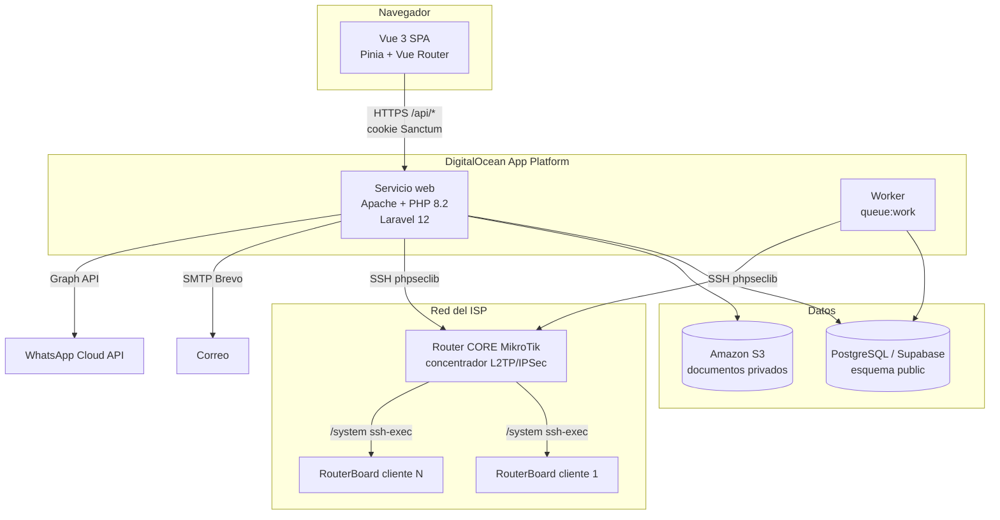
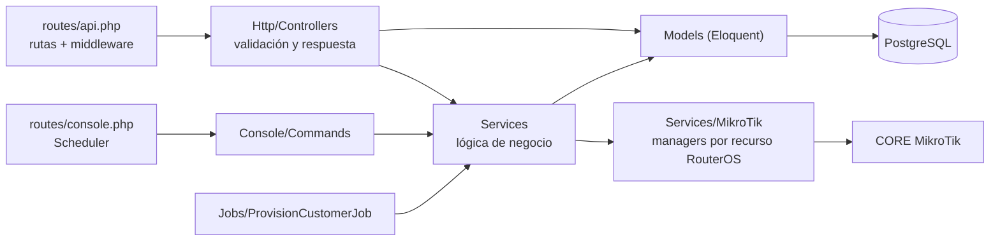
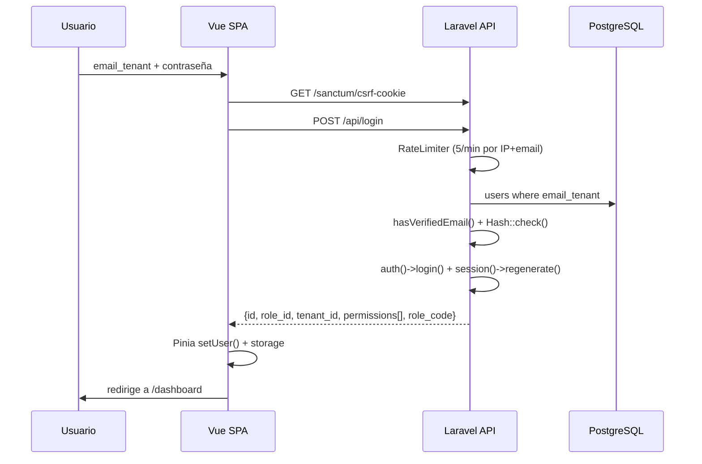
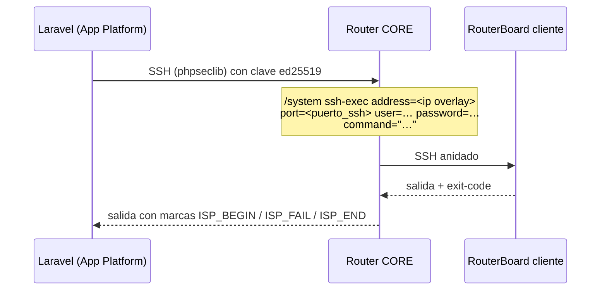
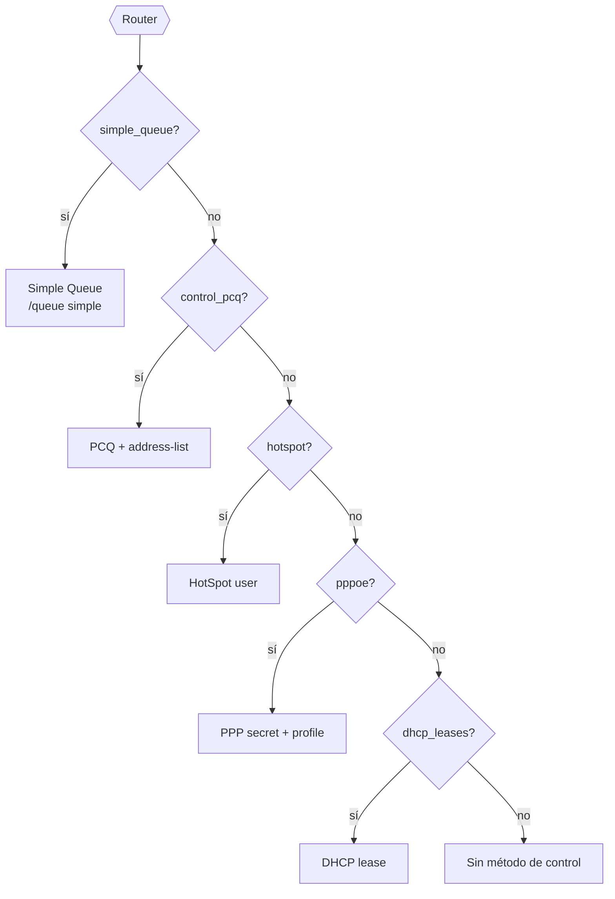
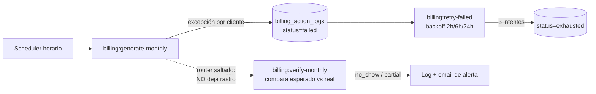
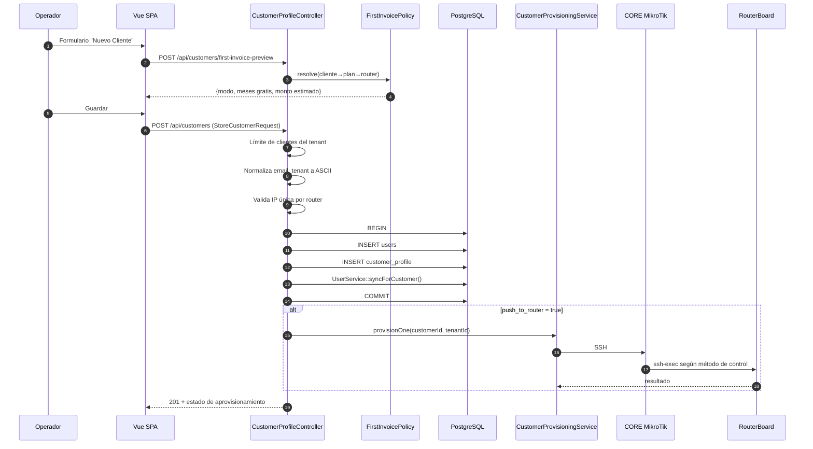

# ARQUITECTURA — ISPWatch

> Documento de arquitectura técnica. Todo lo aquí descrito está verificado contra el código
> del repositorio y contra el esquema real de la base de datos (`public` en Supabase).
> Cuando algo **no** puede inferirse del código se marca explícitamente como
> `⚠️ No inferible del código`.

**Última actualización:** 2026-07-30 · Rama analizada: `feat/first-invoice-free-months`

---

## Índice

1. [Visión general](#1-visión-general)
2. [Stack tecnológico](#2-stack-tecnológico)
3. [Arquitectura general](#3-arquitectura-general)
4. [Frontend](#4-frontend)
5. [Backend](#5-backend)
6. [Base de datos](#6-base-de-datos)
7. [Servicios externos](#7-servicios-externos)
8. [Integración MikroTik (el núcleo diferencial)](#8-integración-mikrotik-el-núcleo-diferencial)
9. [Multi-tenancy](#9-multi-tenancy)
10. [Automatización y planificador](#10-automatización-y-planificador)
11. [Flujo de datos extremo a extremo](#11-flujo-de-datos-extremo-a-extremo)
12. [Dependencias críticas](#12-dependencias-críticas)
13. [Despliegue](#13-despliegue)

---

## 1. Visión general

ISPWatch es una plataforma **multi-tenant** de gestión operativa para Proveedores de
Servicios de Internet (ISP). Combina en un solo sistema:

- **CRM/ERP de clientes** (altas, prospectos, instalaciones, documentos, inventario).
- **Facturación automática** dirigida por la configuración de cada router.
- **Aprovisionamiento y control de red** sobre routers MikroTik RouterOS.
- **Corte y reconexión automática** de clientes morosos.
- **Soporte técnico** (tickets, cargos por servicio, estadísticas).

La particularidad arquitectónica del producto es que **la facturación y el corte están
acoplados a la infraestructura de red**: cada router MikroTik lleva su propia configuración
de facturación (`billing`), y el sistema ejecuta acciones reales sobre el equipo
(colas, secrets PPPoE, reglas de firewall) como consecuencia del estado financiero del cliente.

---

## 2. Stack tecnológico

### Backend

| Componente | Versión | Rol |
|---|---|---|
| PHP | `^8.2` | Runtime |
| Laravel Framework | `^12.0` | Framework HTTP, ORM, cola, scheduler |
| Laravel Sanctum | `^4.2` | Autenticación SPA por cookie de sesión |
| Livewire + Volt | `^3.6` / `^1.7` | Scaffolding de auth heredado de Breeze (`routes/auth.php`) |
| barryvdh/laravel-dompdf | `^3.1` | Generación de PDF (facturas, contratos, actas) |
| maatwebsite/excel | `^3.1` | Importación/exportación masiva Excel |
| phpseclib/phpseclib | `^3.0` | SSH hacia el CORE MikroTik |
| league/flysystem-aws-s3-v3 | `^3.0` | Almacenamiento privado S3 de documentos |
| ezyang/htmlpurifier | `^4.17` | Saneado de HTML en plantillas de documentos |
| doctrine/dbal | `^4.4` | Cambios de esquema en migraciones |
| guzzlehttp/guzzle | `^7.9` | Cliente HTTP (WhatsApp Cloud API) |

### Frontend

| Componente | Versión | Rol |
|---|---|---|
| Vue | `^3.5` | SPA |
| Vue Router | `^4.6` | Enrutado con guardas de permisos |
| Pinia | `^3.0` | Estado de sesión (`stores/auth.js`) |
| Vite | `^6.4` | Bundler / dev server |
| TailwindCSS | `^3.4` | Estilos |
| Leaflet | `^1.9` | Mapa de clientes y topología |
| axios | `^1.16` | Cliente HTTP con interceptores |
| xlsx (SheetJS) | `^0.18` | Lectura de plantillas Excel en navegador |
| @vueup/vue-quill | `^1.2` | Editor de plantillas de documentos |
| oh-vue-icons / unplugin-icons | — | Iconografía |

### Datos e infraestructura

| Componente | Rol |
|---|---|
| PostgreSQL (Supabase, pooler) | Base de datos principal |
| PostGIS | Tipo geográfico en `sectorial.coordinates` |
| Driver `database` | Cache, cola y sesión en producción |
| DigitalOcean App Platform | Hosting (servicio web + worker de cola) |
| Amazon S3 | Documentos de cliente (bucket privado, URLs firmadas a 30 min) |
| Brevo SMTP | Correo transaccional |

---

## 3. Arquitectura general

Aplicación **monolítica Laravel** que sirve una **SPA Vue 3** desde el mismo dominio.
No hay separación de despliegue frontend/backend: `resources/js` se compila con Vite a
`public/build` y se entrega desde la vista Blade `resources/views/app.blade.php`.



### Capas del backend



**Regla de diseño observada:** los controladores validan y traducen HTTP; la lógica de
negocio vive en `app/Services`; el acceso a RouterOS está encapsulado en
`app/Services/MikroTik/*` con un *manager* por recurso (colas, secrets, hotspot, firewall…).

---

## 4. Frontend

### Estructura

```
resources/js/
├── main.js / app.js        # bootstrap de la SPA
├── router/index.js         # 40+ rutas, todas lazy-loaded
├── stores/auth.js          # Pinia: sesión, permisos, refresh
├── services/
│   ├── api.js              # instancia axios + interceptores
│   ├── auth.js             # helpers de permisos (localStorage)
│   ├── billing.js
│   └── api/                # 19 módulos: customers, routers, plans, …
├── composables/            # useNotification, usePermissions,
│                           # useProvisionPolling, useTableControls
├── layouts/DefaultLayout.vue
├── components/             # Sidebar, BillingPanel, DatePicker, …
├── pages/                  # 44 páginas + subcarpeta Billing/
└── utils/                  # customerName.js, image.js
```

### Sesión y permisos en el cliente

- El login (`POST /api/login`) devuelve el objeto de usuario con `permissions` (array
  proveniente de `role.permissions` en BD) y `role_code`.
- `stores/auth.js` lo guarda en `localStorage` (con "recordarme") o `sessionStorage`.
- La guarda de `vue-router` (`router.beforeEach`) bloquea la navegación si
  `to.meta.permission` no está en el array de permisos.
- `apiClient` inyecta `tenant`/`tenant_id` como query param en cada petición
  (**el backend lo ignora por seguridad**: el tenant se deriva del usuario autenticado).
- Un `401` en cualquier respuesta borra `userData` y redirige a `/`.



---

## 5. Backend

### Middleware registrado (`bootstrap/app.php`)

| Alias | Clase | Función |
|---|---|---|
| `permission` / `can_do` | `CheckPermission` | Exige un permiso concreto; **bypass si `role_id == 1`** |
| `staff_profile` | `CheckStaffProfile` | Exige que el usuario tenga fila en `staff_profile` |
| *(global)* | `SecurityHeaders` | CSP, HSTS, X-Frame-Options, COOP, etc. |
| *(api, prepend)* | `EnsureFrontendRequestsAreStateful` | Sanctum SPA |

`trustProxies(at: '*')` está activo (necesario tras el balanceador de DigitalOcean).
Las `QueryException` se traducen a JSON 422 con mensaje amigable vía `App\Helpers\ErrorMessages`.

### Servicios de dominio (`app/Services`)

| Servicio | Líneas | Responsabilidad |
|---|---|---|
| `BillingService` | 1432 | Generación mensual, numeración, pagos, asignación, anulación, notificación |
| `OverdueSuspensionService` | 412 | Corte automático por mora según config del router |
| `CustomerProvisioningService` | 338 | Aprovisionar un cliente según el **método de control** del router |
| `RouterProvisioningService` | 218 | Suspender/reactivar en el router |
| `RouterPolicyInstallerService` | 151 | Instalar reglas de bloqueo en el router |
| `InstallationBillingService` | 253 | Facturar la instalación (costo + adicionales − descuento) |
| `PaymentReminderService` | 157 | Recordatorios de pago (email/WhatsApp) |
| `TrafficHistoryService` | 164 | Muestreo y agregación de tráfico WAN |
| `VpnService` | 945 | Generación y verificación de scripts L2TP/IPSec |
| `RouterApiService` | 912 | Protocolo API nativo MikroTik (puerto 8728) |
| `MikroTikSshService` | 603 | SSH directo/vía CORE |
| `WhatsAppService` | 162 | WhatsApp Cloud API (Meta Graph v18) |
| `Templates/*` | — | Render, saneado y resolución de placeholders de documentos |

### Managers MikroTik (`app/Services/MikroTik`)

| Manager | Recurso RouterOS |
|---|---|
| `QueueManager` | `/queue simple` |
| `PcqManager` | `/queue type` + `/ip firewall address-list` |
| `HotspotManager` | `/ip hotspot user` + `user profile` |
| `PppProfileManager` / `PppSecretManager` | `/ppp profile`, `/ppp secret` |
| `DhcpLeaseManager` | `/ip dhcp-server lease` |
| `IpMacBindingManager` | ARP estático + filtro por par IP/MAC |
| `FirewallRulesManager` | `/ip firewall filter` + `address-list` de suspendidos |
| `SuspensionManager` | Alta/baja en la address-list de morosos |
| `InterfaceReader` | Lectura robusta de interfaces WAN (multi-variante) |
| `RouterEndpointResolver` | Resuelve la IP real del router en el overlay L2TP |
| `SshTunnel` / `SshTunnelManager` | Túnel SSH hacia el CORE |
| `MikroTikApiProtocol` / `MikroTikConnectionManager` | Protocolo binario API |

### Comandos Artisan (`app/Console/Commands`)

| Comando | Propósito |
|---|---|
| `billing:generate-monthly {period?}` | Genera facturas del periodo (idempotente) |
| `billing:retry-failed` | Reintenta facturas fallidas con backoff 2h/6h/24h |
| `billing:verify-monthly` | Auditoría de *no-show*: detecta routers que no facturaron |
| `billing:auto-cut` | Corte automático por mora |
| `billing:reconcile-suspensions` | Reconcilia DB ⇄ RouterBoard (re-corta lo no confirmado) |
| `billing:verify-cuts` | Auditoría de *no-show* de cortes |
| `billing:send-reminders` | Recordatorios de pago |
| `billing:process-overdue` | Procesamiento manual de morosos |
| `billing:simulate` | Simulador del ciclo completo |
| `billing:void-courtesy {period?}` | Anula facturas de planes de cortesía |
| `billing:generate-tenant {tenant} {period} {--dry-run}` | Facturación puntual por tenant |
| `traffic:collect` | Muestreo de contadores WAN |
| `traffic:prune {--days=30}` | Poda de muestras finas |
| `migrate:both` | **Aplica migraciones a `ispwatch_dev` y `public` a la vez** |
| `db:sync-dev` | Copia `public` → `ispwatch_dev` |
| `db:fix-sequences` | Repara secuencias de PostgreSQL desincronizadas |
| `documents:migrate-to-s3 {--dry-run}` | Migra documentos locales a S3 |
| `router:diagnose-wan` | Diagnóstico de interfaz WAN |

---

## 6. Base de datos

- **Motor:** PostgreSQL sobre Supabase (pooler `aws-0-us-east-1.pooler.supabase.com:5432`).
- **Separación dev/prod por esquema:** la variable `DB_SCHEMA` selecciona `public`
  (producción) o `ispwatch_dev` (desarrollo) **dentro de la misma base de datos**.
  Por eso existe el comando `migrate:both`.
- **55 tablas de aplicación** + tablas de infraestructura Laravel (`cache`, `jobs`,
  `sessions`, `migrations`, `personal_access_tokens`) + tablas PostGIS
  (`spatial_ref_sys`, vistas `geometry_columns`/`geography_columns`).
- **RLS activado** en el esquema `public` (rol `anon` recibe 401): el frontend ya no
  accede directamente a Supabase, todo el acceso a datos pasa por la API Laravel.

Detalle completo en [`BASE_DATOS.md`](BASE_DATOS.md).

---

## 7. Servicios externos

| Servicio | Uso | Configuración |
|---|---|---|
| **Supabase (PostgreSQL)** | Base de datos | `DB_*` |
| **Amazon S3** | Documentos de cliente (cédulas, contratos firmados) — bucket privado, URL temporal de 30 min | `AWS_*`, `FILESYSTEM_DISK` |
| **Brevo (SMTP)** | Correo transaccional: verificación, factura creada, recordatorio, tickets | `MAIL_*` |
| **WhatsApp Cloud API (Meta Graph v18)** | Plantillas de recordatorio de pago | `WHATSAPP_ACCESS_TOKEN`, `WHATSAPP_PHONE_NUMBER_ID`, `WHATSAPP_BUSINESS_ACCOUNT_ID` |
| **Google Maps JS API** | Mapa de clientes (clave **por tenant**, cifrada en BD) | `tenant.google_maps_api_key` |
| **MikroTik CORE** | Punto de entrada SSH/API a toda la red de routers | `MIKROTIK_CORE_*` |
| **Converza** | Sistema externo que lee `router_outage_events` en **solo lectura** y difunde por WhatsApp la falla masiva | Contrato de datos, no HTTP |

> ⚠️ El lado Converza de la integración de falla masiva **no está en este repositorio**;
> ISPWatch únicamente registra los eventos append-only.

---

## 8. Integración MikroTik (el núcleo diferencial)

### Topología de conexión

Los RouterBoards de los clientes **no son accesibles directamente desde Internet**.
Se conectan por túnel **L2TP/IPSec** contra un router **CORE** central. ISPWatch
alcanza cada router en dos saltos:



**Dos problemas resueltos explícitamente en el código** (`BuildsCoreSshExec`):

1. **Puerto SSH del cliente.** RouterOS asume 22; despliegues reales lo mueven
   (p. ej. `CORE_TOCAIMA` en 2200). Sin `port=` el operador veía
   `<connection failed> <ip>:22` y creía que el cliente bloqueaba.
   → columna `router.puerto_ssh`.
2. **Deriva de IP en el overlay.** El secret PPP no tiene `remote-address` fijo, así que
   el CORE reasigna del pool `pool-vpn-<tenant>` en cada reconexión y `router.ip`
   queda obsoleto. → `RouterEndpointResolver` lee `/ppp active` del CORE, empareja por
   `vpn_username` y **reescribe la IP en BD**.

**Escapado de comandos:** el comando interno usa comillas planas `"` (no `\"`), y una
única capa de `addslashes()` la aplica `coreSshExecCommand()`. Todo *statement* va
envuelto en `:do {} on-error={}` y delimitado con centinelas `ISP_BEGIN`/`ISP_FAIL`/`ISP_END`
para poder distinguir un fallo real de una salida vacía.

### Métodos de control (excluyentes)

Un router usa **uno y sólo uno** de estos modos, resuelto por
`CustomerProvisioningService::resolveControlMode()` en este orden de prioridad:



Sobre el modo elegido se pueden aplicar **aditivos**: `ip_bindings` (ARP estático) y
`amarre` (drop por par IP/MAC), gestionados por `IpMacBindingManager`.

### Bloqueo de morosos

`RouterPolicyInstallerService` + `FirewallRulesManager` instalan en el router cliente
(documentado en [`BLOQUEO_MOROSOS_MANUAL.md`](BLOQUEO_MOROSOS_MANUAL.md)):

- `address-list ISPWATCH_SUSPENDIDOS` (con un ancla `0.0.0.0`).
- En `chain=forward`, **al tope de la cadena**: `accept` hacia el portal de pago
  (`PORTAL_IP`) y `drop` incondicional para la lista.
- Al suspender se hace además **flush de conntrack** del cliente, porque sin ello las
  conexiones ya establecidas seguían pasando.

---

## 9. Multi-tenancy

**Modelo:** *shared database, shared schema* con columna `tenant_id`.

- El trait `App\Traits\BelongsToTenant` añade un **global scope** que filtra por
  `tenant_id` y rellena la columna al crear.
- **El `tenant_id` se deriva SIEMPRE del usuario autenticado**, nunca del request
  (mitigación OWASP A01/A04). Sólo en contexto de consola se acepta un `tenant` por
  query param como respaldo para jobs.
- Modelos con el trait: `Router`, `Plan`, `Sectorial`, `Invoice`, `SupportTicket`,
  `Expense`, `ExpenseCategory`, `CustomerInstallation`, `InventoryStock/Device/Provider/Branch`,
  `RouterOutageEvent`, `SectorialHistory/Note/Photo`.
- **Excepción deliberada:** `BulkProvisionRun` **no** lleva el scope, porque los jobs en
  cola corren sin sesión; el filtrado por tenant se hace explícito en el controlador.
- `Role` usa un scope propio que incluye roles del tenant **y** roles globales
  (`tenant_id IS NULL`).

> ⚠️ **Trampa conocida:** si el `tenant_id` del usuario no coincide con el de su rol,
> el scope anula el rol y se produce un falso `403 "No role assigned"`. Por eso tanto
> `AuthController@login` como `CheckPermission` cargan el rol con
> `withoutGlobalScope('tenant')`.

---

## 10. Automatización y planificador

Definido en `routes/console.php`. Requiere `schedule:run` cada minuto en el servidor.

| Frecuencia | Comando | Notas |
|---|---|---|
| Cada hora | `billing:generate-monthly` | `withoutOverlapping`; el gate de día **y hora** está dentro del servicio |
| Cada hora | `billing:retry-failed` | Sólo procesa filas con `next_retry_at` vencido |
| Cada hora | `billing:auto-cut` | Gate por `cut_day` + `cut_time` de cada router |
| Cada hora | `billing:reconcile-suspensions` | Failover DB ⇄ RouterBoard |
| Cada hora | `billing:send-reminders` | `withoutOverlapping`; idempotente por ciclo |
| Diario 06:00 | `billing:verify-monthly` | Auditoría *no-show* de facturación |
| Diario 07:00 | `billing:verify-cuts` | Auditoría *no-show* de cortes |
| Cada 5 min | `traffic:collect` | Sólo routers con `historial_trafico = true` |
| Diario | `traffic:prune --days=30` | Conserva los agregados diarios |

**Diseño de idempotencia y recuperación:** los comandos horarios no dependen de
ejecutarse en el minuto exacto. `generate-monthly` comprueba `today->day >= create_day`,
de modo que si el sistema estuvo caído el día de facturación, recupera al arrancar.



> El *failover* (`billing_action_logs`) sólo ve fallos **por cliente**. Un router entero
> saltado o un cron que nunca corrió no dejan rastro: ese punto ciego lo cubre
> `billing:verify-monthly`, que reconstruye el mismo *gating* y compara esperado vs. real.

---

## 11. Flujo de datos extremo a extremo

Ver el recorrido completo módulo a módulo en [`BITACORA_TECNICA.md`](BITACORA_TECNICA.md#10-flujo-completo-del-sistema).
Resumen del camino más representativo — **alta de cliente con aprovisionamiento**:



---

## 12. Dependencias críticas

Componentes cuyo fallo **detiene una función de negocio completa**:

| Dependencia | Qué rompe si falla | Mitigación existente en el código |
|---|---|---|
| **Router CORE MikroTik** | Todo aprovisionamiento, corte y reconexión | `suspension_action_logs` con reintentos + `billing:reconcile-suspensions` |
| **Cron `schedule:run` del servidor** | No se factura, no se corta, no se avisa | `billing:verify-monthly` / `verify-cuts` alertan el *no-show* |
| **PostgreSQL / Supabase** | Todo | — |
| **Worker de cola** | Aprovisionamiento masivo asíncrono queda "processing" | Endpoint de estado por `jobId`; el camino síncrono sigue disponible |
| **S3** | Subida y descarga de documentos y firmas | — |
| **SMTP Brevo** | Verificación de correo (bloquea el login de nuevos usuarios), facturas y recordatorios | Envío por WhatsApp como canal alterno en recordatorios |
| **Clave SSH del CORE** | Idéntico a fallo del CORE | Se materializa en `storage/keys/` en el arranque del contenedor |

---

## 13. Despliegue

**Plataforma:** DigitalOcean App Platform, buildpack `php` sobre Ubuntu 22,
región `atl`, egress con **IP dedicada** (necesario para que el CORE la incluya en su
lista blanca).

Dos componentes definidos en `.do/deploy.template.yaml`:

| Componente | Comando | Instancia |
|---|---|---|
| `ispwatch` (servicio web) | materializa la clave SSH → `php artisan migrate --force` → `heroku-php-apache2 public/` | `apps-s-1vcpu-0.5gb` |
| `worker` | materializa la clave SSH → `php artisan queue:work --tries=1 --timeout=120 --max-time=3600` | `apps-s-1vcpu-0.5gb` |

Despliegue automático por push a `main` del repositorio `ispwatchcol/ISPWatch`.
La clave privada SSH del CORE viaja como secreto base64 (`MIKROTIK_CORE_SSH_KEY_B64`) y se
escribe a `storage/keys/mikrotik_core_id_ed25519` con permisos `600` en cada arranque.

> ⚠️ **No existe un componente que ejecute `schedule:run`** en la definición de la app.
> Ver [`MEJORAS_RECOMENDADAS.md`](MEJORAS_RECOMENDADAS.md) — es un hallazgo de prioridad crítica
> y coincide con el incidente histórico de facturación no ejecutada.
