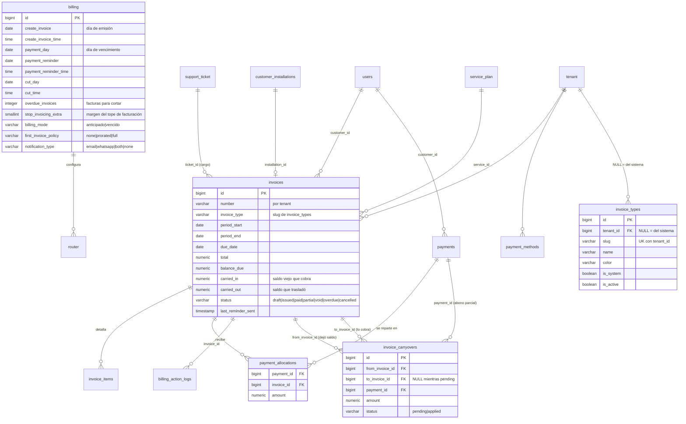
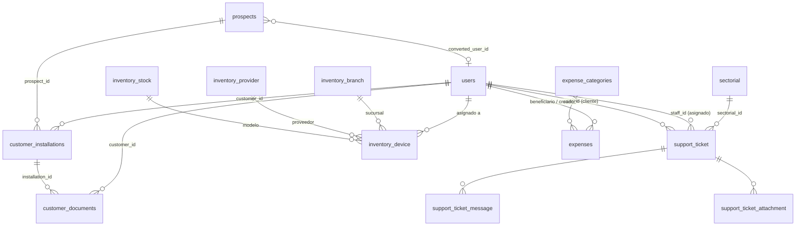

# BASE DE DATOS — ISPWatch

> Diccionario de datos, diagrama entidad-relación y explicación funcional.
> **El contenido de este documento fue extraído por introspección directa del esquema real**
> (`information_schema`, `pg_indexes`, `pg_constraint`) del esquema `public` en Supabase,
> no de las migraciones. Donde el esquema real y las migraciones difieren, manda el esquema real
> y se indica la diferencia.

**Última actualización:** 2026-07-30 · Motor: PostgreSQL (Supabase) + PostGIS

---

## Índice

1. [Convenciones y arquitectura de datos](#1-convenciones-y-arquitectura-de-datos)
2. [Inventario de tablas](#2-inventario-de-tablas)
3. [Diagrama entidad-relación](#3-diagrama-entidad-relación)
4. [Diccionario de datos](#4-diccionario-de-datos)
5. [Llaves foráneas completas](#5-llaves-foráneas-completas)
6. [Índices](#6-índices)
7. [Restricciones CHECK](#7-restricciones-check)
8. [Deuda técnica del esquema](#8-deuda-técnica-del-esquema)

---

## 1. Convenciones y arquitectura de datos

### Separación dev / producción por esquema

La misma base de datos Supabase aloja **dos esquemas**:

| Esquema | Uso | Variable |
|---|---|---|
| `public` | **Producción** | `DB_SCHEMA=public` |
| `ispwatch_dev` | Desarrollo | `DB_SCHEMA=ispwatch_dev` |

Por eso **nunca se usa `php artisan migrate` a secas**: el comando correcto es
`php artisan migrate:both`, que aplica en ambos esquemas. PostGIS vive en `public`, lo que
obliga a un *fallback* en el `search_path` para el esquema de desarrollo.

### Convenciones de nombres

- Tablas del dominio original **en singular** (`router`, `sectorial`, `role`, `billing`,
  `customer_profile`, `service_plan`, `support_ticket`, `inventory_*`, `type_billing`).
- Tablas añadidas después **en plural** (`invoices`, `payments`, `expenses`, `prospects`,
  `customer_installations`, `document_templates`, `traffic_samples`…).
- Esta inconsistencia es histórica y está consolidada; los modelos la resuelven con `$table`.

### Multi-tenancy

Casi toda tabla de negocio lleva `tenant_id`. El aislamiento **no** se apoya en la base de
datos sino en el trait `BelongsToTenant` (global scope de Eloquent). En `public` está
además activado **RLS** para bloquear el acceso del rol `anon` de Supabase.

### Identidad del cliente

Un cliente es **dos filas**: `users` (identidad y acceso) + `customer_profile` (datos del
servicio). `customer_profile.user_id` es a la vez PK y FK — relación 1:1 estricta.

### Los dos correos del usuario

| Columna | Significado |
|---|---|
| `users.email` | Correo **personal / de contacto** del cliente. Único. |
| `users.email_tenant` | Correo de **acceso (login)**. Autogenerado como `nombre.apellido@dominio-del-tenant` si no se indica. |

`User::sanitizeEmail()` normaliza a ASCII: `José Muñoz` → `jose.munoz@...`.
Las columnas de **nombre sí conservan** tildes y ñ.

---

## 2. Inventario de tablas

Volumetría medida en producción con **`COUNT(*)` real** (2026-07-30).

> ⚠️ Una versión anterior de este documento usaba `pg_stat_user_tables.n_live_tup`, que es
> una **estimación** actualizada por `autovacuum`/`ANALYZE`: en tablas pequeñas o nunca
> analizadas informa `0` aunque tengan filas. Eso llevó a dar por muertas a `cut_type`,
> `type_billing` y `script_version`, que sí tienen datos. Para decidir si una tabla está en
> uso, cuenta de verdad.

### Núcleo de identidad y tenant

| Tabla | Filas | Función |
|---|---:|---|
| `tenant` | 5 | Empresa/ISP. Identidad fiscal colombiana, marca, numeración de facturas |
| `users` | 1 003 | Identidad y acceso (clientes, staff, técnicos, admins) |
| `role` | 30 | Roles con permisos en JSON; `tenant_id NULL` = rol global |
| `customer_profile` | 988 | Perfil de servicio del cliente (1:1 con `users`) |
| `staff_profile` | 0 | Perfil de personal interno (1:1 con `users`) |

### Servicio y red

| Tabla | Filas | Función |
|---|---:|---|
| `service_plan` | 55 | Planes de internet (velocidad, precio, parámetros por tecnología) |
| `type_plans` | 4 | Catálogo de tipos de plan (Queue/PPPoE/Hotspot/PCQ) |
| `user_services` | 987 | **Contrato de servicio**: qué plan tiene cada cliente y en qué estado |
| `router` | 6 | RouterBoards MikroTik: credenciales, método de control, VPN |
| `sectorial` | 150 | Elementos de red: sectoriales, nodos, switches, OLT, splitter, NAP, mufa |
| `sectorial_history` | 157 | Bitácora de cambios sobre un elemento |
| `sectorial_note` / `sectorial_photo` | 0 / 0 | Notas y fotos del elemento |
| ~~`ip_range` / `router_ip_range` / `ip_assignment`~~ | 0 | **Eliminadas** por la migración `2026_07_31_000005` (0 filas, sin referencias) |
| `traffic_samples` | 1 252 | Muestras de contadores WAN cada 5 min |
| `traffic_daily` | 57 | Agregado diario de tráfico |
| `router_outage_events` | 0 | Falla masiva (append-only), consumido por Converza |
| `script_version` | 2 | Catálogo de versiones de script |

### Facturación

| Tabla | Filas | Función |
|---|---:|---|
| `billing` | 11 | **Configuración de facturación por router** (días, horas, modo, políticas) |
| `type_billing` | 3 | Catálogo de tipos de facturación |
| `cut_type` | 3 | Catálogo: `Corte Automático`, `Corte Manual`, `Sin Corte` |
| `invoices` | 1 168 | Facturas |
| `invoice_items` | 1 166 | Ítems de factura |
| `invoice_types` | 4 + propios | **Catálogo de tipos de factura** (4 del sistema + los del tenant) |
| `invoice_carryovers` | 0 | **Arrastre de saldo** por abono parcial (factura vieja → factura nueva) |
| `payments` | 1 086 | Pagos recibidos |
| `payment_allocations` | 1 061 | Asignación pago → factura (N:M con importe) |
| `payment_methods` | 16 | Formas de pago por tenant |
| `additional_services` | 0 | **Catálogo de servicios adicionales** reutilizables (alquiler de router, soporte…) |
| `customer_additional_services` | 0 | **Asignación** servicio adicional → cliente (desde cuándo, a qué precio) |
| `billing_action_logs` | 0 | Failover de generación + lápidas `suppressed` |
| `suspension_action_logs` | 31 | Failover de cortes/reconexiones |
| `expenses` / `expense_categories` | 4 / 15 | Gastos operativos |

### Comercial y operación

| Tabla | Filas | Función |
|---|---:|---|
| `prospects` | 9 | Clientes potenciales antes de convertirse en cliente |
| `customer_installations` | 7 | Órdenes de instalación con acta firmada y cobro |
| `customer_documents` | 13 | Documentos en S3 (cédula, contrato, acta) |
| `document_templates` | 0 | Plantillas HTML de factura/contrato/acta por tenant |
| `support_ticket` | 6 | Tickets de soporte |
| `support_ticket_message` / `_attachment` | 0 / 0 | Conversación y adjuntos |
| `inventory_stock` / `_device` / `_provider` / `_branch` | 0 / 0 / 2 / 0 | Inventario de equipos |
| `help_categories` / `help_articles` | 9 / 30 | Centro de ayuda embebido |
| `bulk_provision_runs` | 50 | Progreso de aprovisionamiento masivo asíncrono |
| `audit_logs` | 0 | Auditoría genérica de modelos |
| ~~`activity_log`~~ | 0 | **Eliminada** por la migración `2026_07_31_000005` |

### Infraestructura Laravel

`cache`, `cache_locks`, `jobs`, `job_batches`, `failed_jobs`, `sessions`,
`password_reset_tokens`, `personal_access_tokens`, `migrations`.

### PostGIS

`spatial_ref_sys` (tabla) y las vistas `geometry_columns` / `geography_columns`.
Usadas por el tipo geográfico de `sectorial.coordinates`.

---

## 3. Diagrama entidad-relación

### 3.1 Núcleo: cliente, servicio y red

```mermaid
erDiagram
    tenant ||--o{ users : "tiene"
    tenant ||--o{ role : "define"
    tenant ||--o{ router : "posee"
    tenant ||--o{ service_plan : "ofrece"
    tenant ||--o{ sectorial : "opera"

    role ||--o{ users : "asigna permisos"

    users ||--o| customer_profile : "1:1 perfil cliente"
    users ||--o| staff_profile : "1:1 perfil staff"
    users ||--o{ user_services : "contrata"

    service_plan ||--o{ user_services : "es contratado en"

    router ||--o{ customer_profile : "conecta"
    sectorial ||--o{ customer_profile : "sirve"
    sectorial ||--o{ sectorial : "parent_id (árbol FTTH)"
    sectorial ||--o{ customer_profile : "olt_id"

    router }o--o| billing : "billing_router_id"
    router }o--o| cut_type : "cut_type_id"

    users {
        bigint id PK
        varchar email UK "personal"
        varchar email_tenant "login"
        bigint role_id FK
        bigint tenant_id FK
        boolean status
        boolean is_superadmin
        json permissions
    }
    customer_profile {
        bigint user_id PK_FK
        varchar ip_user
        bigint service_id FK
        bigint router_id FK
        bigint sectorial_id FK
        bigint olt_id FK
        boolean status "true=activo"
        varchar service_status
        boolean is_fiber
        boolean exclude_from_billing
        boolean notify_invoice
        varchar first_invoice_mode
        numeric credit_balance
        date installation_date
    }
    router {
        bigint id PK
        varchar name
        varchar ip "overlay; fija en WireGuard, deriva en L2TP"
        varchar vpn_transport "wireguard | l2tp"
        varchar wg_address
        integer puerto_ssh
        boolean simple_queue
        boolean control_pcq
        boolean hotspot
        boolean pppoe
        boolean dhcp_leases
        boolean falla_general
        bigint billing_router_id FK
    }
```

### 3.2 Facturación



### 3.3 Comercial, soporte e inventario



---

## 4. Diccionario de datos

Leyenda: **PK** clave primaria · **FK** clave foránea · **UK** único · `NN` no nulo.

### 4.1 `tenant` — Empresa / ISP

Cada fila es un ISP cliente de la plataforma. Contiene la identidad fiscal colombiana
usada en los documentos, la marca y el contador de numeración de facturas.

| Columna | Tipo | Nulo | Default | Descripción |
|---|---|---|---|---|
| `id` | bigint | NN | serial | **PK** |
| `uuid` | uuid | NN | — | **UK**. Identificador público, generado en `Tenant::booted()` |
| `name` | varchar(255) | NN | — | Nombre visible |
| `domain` | varchar(255) | NN | — | Slug; base del `email_tenant` de los usuarios |
| `status` | varchar(255) | NN | `trial` | Estado comercial de la cuenta |
| `max_customers` | integer | NN | `30` | Límite de clientes; se valida al crear cliente |
| `next_invoice_number` | integer | NN | `1` | Contador secuencial de facturación |
| `contract_prefix` | varchar(20) | | | Prefijo del consecutivo de contratos (`CTR` si está vacío) |
| `next_contract_number` | integer | NN | `1` | Contador secuencial de contratos firmados |
| `logo` | varchar(255) | | | Ruta del logo |
| `brand_color` | varchar(7) | | | Color de marca en HEX |
| `document_footer_text` | text | | | Pie de página de los documentos |
| `legal_name` | varchar(255) | | | Razón social |
| `trade_name` | varchar(255) | | | Nombre comercial |
| `nit` | varchar(50) | | | NIT |
| `nit_verification_digit` | varchar(5) | | | Dígito de verificación |
| `tax_regime` | varchar(100) | | | Régimen tributario |
| `economic_activity` | varchar(255) | | | Actividad económica |
| `billing_email` | varchar(255) | | | Correo de facturación |
| `billing_phone` | varchar(50) | | | Teléfono de facturación |
| `billing_address` | varchar(255) | | | Dirección de facturación |
| `city` / `department` | varchar(100) | | | Ubicación |
| `country` | varchar(2) | | `CO` | ISO 3166-1 alfa-2 |
| `timezone` | varchar(255) | | | Zona horaria del ISP |
| `currency` | varchar(255) | NN | `COP` | Moneda |
| `google_maps_api_key` | text | | | **Cifrada en reposo** (cast `encrypted`) y en `$hidden` |
| `tel_tenant`, `email_tenant`, `address_tenant`, `zone_tenant`, `currency_tenant` | varchar | | | Campos heredados de contacto |
| `created_at` / `updated_at` | timestamp | | | |

### 4.2 `users` — Identidad y acceso

Contiene **todos** los actores: clientes, técnicos, staff y administradores. El rol
(`role_id`) determina la naturaleza. Los clientes tienen además `customer_profile`.

| Columna | Tipo | Nulo | Default | Descripción |
|---|---|---|---|---|
| `id` | bigint | NN | serial | **PK** |
| `name` | varchar(255) | NN | — | Derivado automáticamente de `user_name + user_lastname` en `User::booted()` |
| `user_name` / `user_lastname` | varchar(255) | | | Nombre y apellido |
| `email` | varchar(255) | NN | — | **UK**. Correo personal |
| `email_tenant` | varchar(255) | | | Correo de **login** (ASCII, sin tildes ni ñ) |
| `email_verified_at` | timestamp | | | Login bloqueado hasta verificar |
| `email_verification_token` | varchar(64) | | | Token de verificación |
| `password` | varchar(255) | NN | — | Bcrypt |
| `remember_token` | varchar(100) | | | |
| `tel` | varchar(255) | | | Teléfono |
| `role_id` | bigint | | | **FK** → `role.id` (SET NULL) |
| `tenant_id` | bigint | | | **FK** → `tenant.id` (SET NULL) |
| `service_id` | bigint | | | **FK** → `service_plan.id` (SET NULL) |
| `sectorial_id` | bigint | | | **FK** → `sectorial.id` (SET NULL) |
| `status` | boolean | NN | `true` | Activo/inactivo |
| `is_superadmin` | boolean | NN | `false` | Bandera de superadministrador |
| `permissions` | json | | | Permisos individuales *(el sistema efectivo lee `role.permissions`)* |
| `last_access` | timestamp | | | Último login |

### 4.3 `customer_profile` — Perfil de servicio del cliente

**PK = `user_id`** (también FK con `ON DELETE CASCADE`). Sin `timestamps`.

| Columna | Tipo | Nulo | Default | Descripción |
|---|---|---|---|---|
| `user_id` | bigint | NN | — | **PK/FK** → `users.id` |
| `name` / `last_name` | varchar(255) | NN | — | Nombre. Para empresas `last_name` va vacío |
| `is_company` | boolean | NN | `false` | Persona jurídica |
| `cedula` | varchar(20) | | | Documento de identidad |
| `document_type` / `document_number` | varchar | | | Campos heredados |
| `address`, `city`, `state`, `postal_code` | varchar | | | Dirección |
| `country` | varchar(100) | | `Colombia` | |
| `latitude` | numeric(10,8) | | | Georreferenciación |
| `longitude` | numeric(11,8) | | | |
| `estrato` | smallint | | | Estrato socioeconómico (1–6) |
| `precinto` | varchar(100) | | | Precinto de seguridad del equipo |
| `installation_date` | date | | | **Base del prorrateo y de los meses de cortesía** |
| `ip_user` | varchar(45) | | | IP asignada. **Única por router** (no por tenant) |
| `last_ip` | varchar(45) | | | Última IP observada |
| `service_id` | bigint | | | **FK** → `service_plan.id` (SET NULL) |
| `router_id` | bigint | | | **FK** → `router.id` (SET NULL) |
| `sectorial_id` | bigint | | | **FK** → `sectorial.id` (SET NULL) |
| `olt_id` | bigint | | | **FK** → `sectorial.id` (SET NULL). OLT/NAP de fibra |
| `nap_port` | varchar(20) | | | Puerto en el NAP |
| `is_fiber` | boolean | NN | `false` | Cliente FTTH |
| `status` | **boolean** | NN | `true` | ⚠️ **Booleano, no cadena.** `true` = activo |
| `service_status` | varchar(20) | NN | `activo` | Estado del servicio |
| `pppoe_username` | varchar(100) | | | **UK parcial** con `router_id` |
| `pppoe_password` | varchar(100) | | | En claro |
| `pppoe_local_address` | varchar(45) | | | |
| `hotspot_username` / `hotspot_password` | varchar(255) | | | Credenciales HotSpot |
| `mac_address` | varchar(17) | | | Para DHCP lease / amarre IP-MAC |
| `credit_balance` | numeric(12,2) | NN | `0` | Saldo a favor |
| `exclude_from_billing` | boolean | NN | `false` | **Excluye de TODO el ciclo automático** |
| `notify_invoice` | boolean | NN | `true` | Si es `false`, silencia el aviso de factura/recordatorio (email/WhatsApp); **no afecta** generación de factura ni mora/corte |
| `first_invoice_mode` | varchar(16) | | | `none`\|`prorated`\|`full`. `NULL` = hereda del plan/router |
| `retired_at` / `retired_reason` | timestamp / varchar(500) | | | Retiro del cliente |
| `comments` | text | | | Observaciones |

> **Pendiente de migrar a producción:** `first_invoice_free_months` (rama
> `feat/first-invoice-free-months`, migración `2026_07_30_000000`).

### 4.4 `service_plan` — Planes de internet

| Columna | Tipo | Nulo | Descripción |
|---|---|---|---|
| `id` | bigint | NN | **PK** |
| `name` | varchar(255) | NN | **UK** junto con `tenant_id` |
| `tenant_id` | bigint | NN | **FK** → `tenant.id` |
| `speed_down` / `speed_up` | varchar(255) | NN | Velocidades |
| `cost_product` | integer | | Precio mensual |
| `is_courtesy` | boolean | NN | Plan de cortesía → nunca se factura |
| `type_plan_id` | bigint | | **FK** → `type_plans.id` |
| `type` / `commit` | varchar(255) | | Clasificación |
| `priority`, `burst_download`, `burst_upload` | | | Parámetros **Queue** |
| `pppoe_pool`, `local_address` | varchar(255) | | Parámetros **PPPoE** |
| `shared_users`, `session_timeout`, `idle_timeout` | | | Parámetros **HotSpot** |
| `pcq_rate`, `address_mask` | varchar(255) | | Parámetros **PCQ** |
| `deleted_at` | timestamp | | Borrado lógico |

> **Pendiente de migrar:** `first_invoice_mode` y `first_invoice_free_months`
> (promoción vendida a nivel de producto).

### 4.5 `user_services` — Contrato de servicio

**Es la tabla que gobierna la facturación**: el job mensual factura las filas con
`status = 'active'`; ignora `gratis`.

| Columna | Tipo | Nulo | Default | Descripción |
|---|---|---|---|---|
| `id` | bigint | NN | serial | **PK** |
| `user_id` | bigint | NN | | **FK** → `users.id` (CASCADE) |
| `service_plan_id` | bigint | NN | | **FK** → `service_plan.id` (CASCADE) |
| `start_date` / `end_date` | timestamp | | | Vigencia |
| `status` | varchar(255) | NN | `active` | CHECK: `active`, `suspended`, `cancelled`, `expired`, `gratis` |
| `notes` | text | | | |

### 4.6 `router` — RouterBoard MikroTik

| Columna | Tipo | Nulo | Default | Descripción |
|---|---|---|---|---|
| `id` | bigint | NN | serial | **PK** |
| `name` | varchar(255) | NN | | **UK** junto con `tenant_id` |
| `tenant_id` | bigint | | | **FK** → `tenant.id` |
| `ip` | varchar(255) | | | IP en el overlay L2TP. **Puede quedar obsoleta**; `RouterEndpointResolver` la reescribe |
| `ipv6` | varchar(255) | | | |
| `puerto_api` | integer | NN | `8728` | Puerto API |
| `puerto_www` | integer | NN | `80` | Puerto web |
| `puerto_ssh` | integer | | | Puerto SSH (`NULL` ⇒ 22). ⚠️ El script de provisión ejecuta `/ip service set ssh port=22`, así que pisa cualquier otro valor |
| `vpn_transport` | varchar(16) | NN | `'l2tp'` | Transporte del túnel: `wireguard` (RouterOS ≥ 7.1) o `l2tp`. Permanente, no una migración en curso: v6 no soporta WireGuard |
| `wg_private_key` | text | | | Clave privada X25519 del router, **cifrada** por cast |
| `wg_public_key` | varchar(64) | | | Clave pública X25519. **Sin cifrar** a propósito: se compara contra los peers del CORE |
| `wg_address` | varchar(45) | | | IP del router en el overlay WireGuard (`172.18.<tenant>.<n>`). Fija por diseño |
| `wg_listen_port` | integer | | | Puerto local WireGuard del cliente. Se busca libre al provisionar (13231 suele estar ocupado por Back To Home) |
| `user_rb` / `password_rb` | varchar(255) | | | Credenciales de gestión (**texto plano**) |
| `user_rb_encrypted` / `password_rb_encrypted` | text | | | ⚠️ Contienen **texto plano** pese al nombre — ver §8 |
| `vpn_username` / `vpn_password` | varchar(255) | | | Credenciales L2TP |
| `vpn_username_encrypted` / `vpn_password_encrypted` | text | | | Igual advertencia |
| `lan_interface` / `wan_interface` | varchar(255) | | | Interfaces |
| `rangos_ip` | text | | | Rangos IP del router |
| `coordinates` | json | | | Ubicación |
| `cut_type_id` | bigint | | | **FK** → `cut_type.id`. "Corte Automático" / "Corte Manual" |
| `billing_router_id` | bigint | | | **FK** → `billing.id`. **Configuración de facturación** |
| `status` | varchar(255) | NN | `active` | CHECK: `active`, `inactive`, `maintenance` |
| `firmware_version` | varchar(255) | | | |
| `agregar_cliente_mkt` | boolean | NN | `false` | Alta automática en MikroTik |
| `historial_trafico` | boolean | NN | `false` | Habilita `traffic:collect` |
| `simple_queue` | boolean | NN | `false` | **Método de control** (excluyente) |
| `control_pcq` | boolean | NN | `false` | **Método de control** |
| `hotspot` | boolean | NN | `false` | **Método de control** |
| `pppoe` | boolean | NN | `false` | **Método de control** |
| `dhcp_leases` | boolean | NN | `false` | **Método de control** |
| `pppoe_limit_mode` | varchar(20) | NN | `dynamic` | Modo de límite PPPoE |
| `ip_bindings` | boolean | NN | `false` | Aditivo: ARP estático |
| `amarre` | boolean | NN | `false` | Aditivo: drop por par IP/MAC |
| `falla_general` | boolean | NN | `false` | Falla masiva activa (alerta en el panel) |
| `failover` / `external_id` | varchar(255) | | | |

### 4.7 `billing` — Configuración de facturación por router

Una fila de `billing` es un **perfil de facturación**; los routers la referencian por
`router.billing_router_id`. Las columnas de tipo `date` se usan **sólo por su día del mes**
(`Billing::dayOf()`), recortado al último día real del mes (`clampDayToMonth`).

| Columna | Tipo | Nulo | Default | Descripción |
|---|---|---|---|---|
| `id` | bigint | NN | serial | **PK** |
| `id_type` | bigint | | | **FK** → `type_billing.id` |
| `tenant_id` | bigint | | | **FK** → `tenant.id` |
| `create_invoice` | date | | | **Día del mes** en que se emiten las facturas |
| `create_invoice_time` | time | NN | `00:00:00` | **Hora** de emisión |
| `payment_day` | date | | | **Día del mes** de vencimiento |
| `payment_reminder` | date | | | **Día** del recordatorio |
| `payment_reminder_time` | time | NN | `00:00:00` | **Hora** del recordatorio |
| `payment_reminder_enabled` | boolean | NN | `true` | Activa/desactiva recordatorios |
| `cut_day` | date | | | **Día** del corte |
| `cut_time` | time | NN | `00:00:00` | **Hora** del corte |
| `overdue_invoices` | integer | NN | `0` | Nº de facturas vencidas que disparan el corte |
| `stop_invoicing_extra` | smallint | | `2` | **Tope de facturación**: margen sobre `overdue_invoices`. Al llegar a `overdue_invoices + stop_invoicing_extra` facturas **pendientes** el cliente deja de recibir mensualidades. `NULL` = sin tope |
| `billing_mode` | varchar(255) | NN | `anticipado` | `anticipado` (mes en curso) \| `vencido` (mes anterior) |
| `first_invoice_policy` | varchar(16) | NN | `none` | Política por defecto del router |
| `notificar_wpp` | boolean | NN | `false` | |
| `notification_type` | varchar(255) | NN | `email` | CHECK: `email`, `whatsapp`, `both`, `none` |
| `status` | varchar(255) | NN | `pending` | CHECK: `pending`, `paid`, `overdue`, `cancelled` |
| `amount` | numeric(10,2) | | | |
| `comments` | text | | | |

> **Pendiente de migrar:** `first_invoice_free_months`.

### 4.8 `invoices` — Facturas

| Columna | Tipo | Nulo | Default | Descripción |
|---|---|---|---|---|
| `id` | bigint | NN | serial | **PK** |
| `tenant_id` | bigint | | | **FK** → `tenant.id` (NO ACTION) |
| `customer_id` | bigint | NN | | **FK** → `users.id` (CASCADE) |
| `service_id` | bigint | | | **FK** → `service_plan.id` (SET NULL) |
| `ticket_id` | bigint | | | **FK** → `support_ticket.id` (SET NULL). Cargo por servicio |
| `installation_id` | bigint | | | **FK** → `customer_installations.id` (SET NULL) |
| `number` | varchar(255) | | | **UK** con `tenant_id` |
| `invoice_type` | varchar(255) | NN | `monthly` | Slug de `invoice_types`: los 4 del sistema (`monthly`, `service_charge`, `additional`, `installation`) o uno propio del tenant (`equipos`, `tv`…). Se guarda el texto, no una FK |
| `issue_date` / `due_date` | date | NN | | Emisión y vencimiento |
| `period_start` / `period_end` | date | NN | | Periodo cubierto (el prorrateo mueve `period_start`) |
| `currency` | varchar(255) | NN | `COP` | |
| `subtotal` / `tax` / `total` / `balance_due` | numeric(15,2) | NN | `0` | Importes |
| `carried_in` | numeric(12,2) | NN | `0` | Saldo de facturas anteriores que ESTA factura está cobrando (ver `invoice_carryovers`) |
| `carried_out` | numeric(12,2) | NN | `0` | Saldo que esta factura trasladó a la siguiente al cerrarse con un abono parcial |
| `status` | varchar(255) | NN | `draft` | CHECK: `draft`, `issued`, `paid`, `partial`, `void`, `overdue`, `cancelled` |
| `last_reminder_sent` | timestamp | | | Idempotencia del recordatorio |
| `notes` | text | | | |

> `carried_in` / `carried_out` son **denormalización para los listados**: la verdad
> contable vive en `invoice_carryovers`. Un abono parcial ya no deja la factura en
> `partial`: la cierra en `paid` con `carried_out > 0`.

### 4.8.1 `invoice_types` — Catálogo de tipos de factura

| Columna | Tipo | Nulo | Default | Descripción |
|---|---|---|---|---|
| `id` | bigint | NN | serial | **PK** |
| `tenant_id` | bigint | | | **FK** → `tenant.id` (CASCADE). **NULL = tipo del sistema**, compartido por todos los tenants |
| `slug` | varchar(50) | NN | | Lo que se guarda en `invoices.invoice_type`. **UK** con `tenant_id`. No se renombra nunca |
| `name` | varchar(100) | NN | | Etiqueta visible ("Factura de Equipos") |
| `color` | varchar(30) | NN | `slate` | Clave de paleta (`blue`, `emerald`, `purple`, `amber`, `rose`, `cyan`, `indigo`, `orange`, `teal`, `slate`). El front la traduce a clases |
| `description` | varchar(255) | | | |
| `is_system` | boolean | NN | `false` | Los del sistema son solo-lectura para el tenant |
| `is_active` | boolean | NN | `true` | Inactivo = no se puede emitir con él, pero las facturas viejas conservan la etiqueta |
| `sort_order` | integer | NN | `0` | Orden en los selectores |

Siembra (tenant_id NULL, is_system): `monthly`, `installation`, `additional`,
`service_charge`. La facturación automática, la instalación y los cargos de ticket
dependen de esos slugs, por eso la API rechaza editarlos o borrarlos (403).

### 4.8.2 `invoice_carryovers` — Arrastre de saldo por abono parcial

Movimientos de deuda que pasan de una factura a la siguiente. Es el espejo negativo
de `customer_profile.credit_balance` (que guarda el excedente de un pago de más).

| Columna | Tipo | Nulo | Descripción |
|---|---|---|---|
| `id` | bigint | NN | **PK** |
| `tenant_id` | bigint | NN | **FK** → `tenant.id` (CASCADE) |
| `customer_id` | bigint | NN | **FK** → `users.id` (CASCADE) |
| `from_invoice_id` | bigint | | **FK** → `invoices.id` (SET NULL). Factura que se cerró dejando el faltante |
| `to_invoice_id` | bigint | | **FK** → `invoices.id` (SET NULL). Factura que finalmente lo cobró. NULL mientras esté pendiente |
| `payment_id` | bigint | | **FK** → `payments.id` (SET NULL). Abono que lo originó |
| `amount` | numeric(12,2) | NN | Monto arrastrado |
| `status` | varchar(20) | NN | `pending` \| `applied` |
| `applied_at` | timestamp | | Cuándo lo absorbió `to_invoice_id` |

Ciclo de vida:

1. **`pending`** — el abono parcial cerró la factura; nadie ha cobrado el faltante.
   Revertir el pago (borrarlo, cambiarle el monto o "marcar como no pagada")
   devuelve el monto a `from_invoice_id` y **borra la fila**.
2. **`applied`** — la siguiente factura mensual lo cobró como un ítem `carryover`.
   A partir de aquí revertir el pago original **no** lo devuelve: cobrarlo dos veces
   sería peor. Si se borra `to_invoice_id`, la fila **vuelve a `pending`** para que
   la deuda no se pierda.

> Sólo la generación **mensual** absorbe arrastres. Un cargo adicional o una factura
> manual no cargan deuda ajena encima. Un mes de cortesía (factura en cero) tampoco:
> el saldo espera a la siguiente factura cobrable.

### 4.9 `invoice_items`, `payments`, `payment_allocations`, `payment_methods`

**`invoice_items`** — `invoice_id` (FK CASCADE), `type` (`plan` por defecto;
`carryover` para la línea de saldo arrastrado, `additional_service` para un servicio
adicional recurrente, `service`, `adjustment`…), `description`, `quantity` numeric(10,2),
`unit` varchar(30), `unit_price` y `amount` numeric(15,2), y
`customer_additional_service_id` (FK SET NULL, nullable — ver 4.9.1).

> `type` es **sólo una etiqueta**: se muestra tal cual en la vista de detalle y en el
> PDF, y ninguna lógica ramifica sobre su valor. Agregar tipos nuevos es seguro.

**`payments`** — `tenant_id`, `customer_id` (FK CASCADE), `amount` numeric(15,2),
`payment_date` date, `method` (default `cash`), `reference`, `notes`,
`status` CHECK `completed`\|`void`, `created_by` (FK → `users.id`, quién registró el pago).

**`payment_allocations`** — tabla pivote N:M con importe: `payment_id`, `invoice_id`
(ambos FK CASCADE) y `amount` numeric(15,2). Permite que un pago cubra varias facturas y
que una factura reciba varios pagos.

**`payment_methods`** — formas de pago por tenant (`name`, `description`, `is_active`).
Semilla: Efectivo, Tarjeta, Corresponsal, Transacción.

### 4.9.1 `additional_services` y `customer_additional_services` — Servicios adicionales recurrentes

Antes, un "servicio adicional" no era una entidad: la pantalla de Finanzas emitía una
factura suelta con ítems escritos a mano, así que el mismo concepto cobrado a veinte
clientes eran veinte textos sin relación entre sí. Estas dos tablas lo convierten en un
**catálogo reutilizable** que se **asigna** a varios clientes y se cobra **dentro de la
mensualidad de cada uno**, no en factura aparte.

**`additional_services`** (catálogo, uno por tenant)

| Columna | Tipo | Nota |
|---|---|---|
| `tenant_id` | FK CASCADE | |
| `name`, `description` | varchar(120) / varchar(255) | |
| `price` | numeric(15,2) | Precio de lista. **15,2 como `invoices`**, no 10,2 como `expenses`: estos montos terminan siendo ítems de factura |
| `charge_on_courtesy_month` | bool, **default `true`** | Si se cobra igual durante un mes de cortesía por instalación. Por defecto sí: la promoción vendida fue "internet gratis", no "equipos gratis" |
| `proration_mode` | varchar(20), **default `full`** | `none` \| `prorated` \| `full` — **el mismo vocabulario** que la política de primera factura de los planes. Default `full` (los planes usan `none`) porque un adicional suele ser algo ya entregado |
| `is_active`, `sort_order` | bool / int | Retirar sin borrar |

**`customer_additional_services`** (asignación — no es un pivote puro: tiene atributos e historia)

| Columna | Tipo | Nota |
|---|---|---|
| `tenant_id`, `customer_id`, `additional_service_id` | FK CASCADE | `customer_id` → **`users.id`**, la misma llave que `invoices.customer_id` |
| `price` | numeric(15,2) **nullable** | `null` = sigue el catálogo (y sus cambios); con valor = **congelado** para este cliente |
| `quantity` | int, default 1 | "Dos routers extra" sin duplicar la asignación |
| `starts_at` / `ends_at` | date / date null | Ventana de vigencia; `ends_at` programa la baja sin borrar |
| `is_active` | bool, default true | Interruptor inmediato |
| `assigned_at` | timestamp | **Fecha y hora en que se activó.** Aparte de `created_at`: al dar de baja y reactivar, `created_at` deja de decir la verdad |
| `assigned_by` | FK SET NULL | Quién lo activó |

Las asignaciones **no se borran** al darlas de baja: las facturas emitidas apuntan aquí y
el historial de cobro tiene que poder explicarse.

**`invoice_items.customer_additional_service_id`** cierra el círculo: da trazabilidad
("¿en qué facturas se cobró este servicio?"), el reporte de ingresos por servicio y —lo
más importante— **la idempotencia del cobro mensual**, que se *deriva* de estos ítems en
vez de guardarse como un "último periodo cobrado" en la asignación. Con un contador, si un
administrador borrara la factura del mes, quedaría adelantado y ese periodo no se cobraría
nunca; derivándolo, borrar la factura libera el periodo solo.

> **SQLite:** la FK de `invoice_items` sólo se crea en PostgreSQL — SQLite no admite
> agregar una `FOREIGN KEY` a una tabla existente. La columna sí existe en ambos, que es
> lo que el código y los tests necesitan.

### 4.10 `billing_action_logs` — Failover de facturación

Registra el resultado por **(tenant, cliente, periodo, acción)** — hay un índice único
`bal_unique_per_period`.

| Columna | Tipo | Descripción |
|---|---|---|
| `tenant_id` / `router_id` / `customer_id` / `invoice_id` | bigint | Contexto |
| `action` | varchar(64) | `generate_monthly_invoice` |
| `period_start` / `period_end` | date | Periodo |
| `status` | varchar(16) | `success` \| `failed` \| `exhausted` \| **`suppressed`** |
| `attempts` | smallint | Nº de intentos (máx. 3) |
| `last_error` | text | Mensaje del error |
| `next_retry_at` | timestamp | Backoff 2h / 6h / 24h |

> **`suppressed` es una lápida**: cuando un administrador borra una factura, se marca ese
> par (cliente, periodo) para que la generación mensual **nunca la resucite**. Sólo afecta
> a ese mes; el siguiente se factura con normalidad.

### 4.11 `suspension_action_logs` — Failover de cortes

| Columna | Tipo | Descripción |
|---|---|---|
| `router_id` / `customer_id` / `ip` | | Contexto |
| `action` | varchar(255) | CHECK: `SUSPEND`, `UNSUSPEND`, `INSTALL_POLICY` |
| `reason` | varchar(40) | `manual`, `auto_cut_overdue`, `reconcile`, `auto_reconnect_paid` |
| `status` | varchar(255) | CHECK: `success`, `failed`, `pending` |
| `attempts` | smallint | Máx. 4 |
| `next_retry_at` | timestamp | Backoff 30 min / 2h / 6h / 24h |
| `error_message` | text | |

Backoff más agresivo que en facturación por diseño: *un corte sin aplicar es fuga de ingreso*.

### 4.12 `sectorial` — Elementos de red

Modela **tanto la red inalámbrica como la planta externa de fibra**, en un árbol vía
`parent_id`.

| Columna | Tipo | Descripción |
|---|---|---|
| `name` | varchar(255) | **UK** con `tenant_id` |
| `element_type` | varchar(20) | `sectorial`, `switch`, `nodo`, `olt`, `splitter`, `nap`, `mufa` |
| `parent_id` | bigint | **FK autorreferencial** (SET NULL). Árbol FTTH: OLT → splitter → NAP |
| `split_ratio` | varchar(10) | Relación de división del splitter |
| `ports_total` | smallint | Puertos totales (los usados se **calculan**, no se almacenan) |
| `pon_port` | varchar(50) | Puerto PON de la OLT |
| `vlan` | integer | VLAN |
| `ip`, `user_rb`, `pass_rb` | varchar(255) | Acceso al equipo |
| `ssid`, `frequency`, `antenna_type`, `node_tower` | | Parámetros radio |
| `coordinates` | **USER-DEFINED** (PostGIS) | Geometría/geografía |
| `coverage_radius_meters` | integer | Radio de cobertura para el mapa |
| `zona_id` | integer | Zona |

### 4.13 `prospects` y `customer_installations`

**`prospects`** — cliente potencial: `name`, `last_name`, `cedula`, `email`, `tel`,
`address`, `city`, `state`, `estrato`, `notes`,
`status` (`interesado`\|`agendado`\|`instalado`\|`convertido`\|`rechazado`),
`converted_user_id` (FK → `users.id`), `converted_at`, `created_by`.

**`customer_installations`** — orden de instalación:

| Grupo | Columnas |
|---|---|
| Vínculo | `customer_id` (**nullable**: la orden puede colgar sólo de un prospecto), `prospect_id`, `created_by`, `technician_id`, `technician` |
| Agenda | `scheduled_date`, `status` (CHECK `pendiente`\|`completada`\|`cancelada`), `completed_at` |
| Contenido | `address`, `equipment`, `notes`, `sheet` (json: acta) |
| Firma | `customer_signature_path`, `technician_signature_path`, `signed_at` |
| Cobro | `payment_agreement`, `installation_cost`, `additional_charges`, `additional_items` (json), `discount`, `discount_reason`, `payment_method`, `payment_received`, `payment_notes` |
| Comercial | `customer_retention`, `special_attention`, `promotion_notes` |

### 4.14 `customer_documents` y `document_templates`

**`customer_documents`** — metadatos de archivos en S3 (`file_path`, `file_name`,
`file_size`, `mime_type`), `type` ∈ {`cedula`, `instalacion`, `contrato`, `otros`},
`signed` boolean, `customer_id` (nullable: puede pertenecer sólo a una instalación),
`installation_id`, `uploaded_by`. El accessor `url` genera una **URL firmada de 30 minutos**
— el bucket es privado.

`contract_number` (varchar(40), nullable) guarda el **consecutivo del contrato**, con
**UK** `(tenant_id, contract_number)`. Sólo lo llevan los contratos generados y firmados
por el sistema; en todo lo demás es `NULL` (en PostgreSQL y SQLite los `NULL` no chocan
entre sí dentro de un índice único). El contador vive en `tenant.next_contract_number` y
se reserva con `lockForUpdate`, igual que el de facturas — migraciones
`2026_08_04_120000` (esquema) y `2026_08_04_120100` (numeración retroactiva de los
contratos ya firmados, por orden cronológico y por tenant).

**`document_templates`** — plantilla HTML por tenant y tipo (**UK** `(tenant_id, type)`),
`type` ∈ {`invoice`, `contract`, `installation`}, `body_html`, `is_active`,
`is_advanced_mode` (boolean, default `false` — `false` = fragmento insertado en el shell
Blade fijo con allowlist acotado; `true` = documento HTML completo del tenant, saneado por
`AdvancedTemplateSanitizer` y renderizado con `Pdf::loadHTML()` directo, sin shell —
migración `2026_08_01_120000`), `page_size` / `page_orientation` (`varchar(10)`, defaults
`'a4'` / `'portrait'` — migración `2026_08_05_120000`), `updated_by`. Ver
`docs/ARQUITECTURA.md` § Plantillas de documentos para el pipeline completo de saneado y
sustitución de placeholders.

`page_size` ∈ {`a4`, `letter`, `legal`} y `page_orientation` ∈ {`portrait`, `landscape`}
son **columnas de texto, no enums**, a propósito: agregar un tamaño nuevo no debe requerir
una migración de tipo, y un enum de PostgreSQL no existe en el SQLite donde corre la suite
de tests. La whitelist real vive en `DocumentTemplate::PAGE_SIZES` / `PAGE_ORIENTATIONS`,
se valida en `UpdateDocumentTemplateRequest` y se vuelve a comprobar en
`TemplateRenderer::applyPaper()` antes de llegar a dompdf (una fila con basura cae al
default en vez de producir un canvas silenciosamente raro). Los defaults reproducen
exactamente el comportamiento previo a la migración, así que las plantillas ya guardadas
siguen saliendo idénticas.

### 4.15 `support_ticket` y derivadas

`support_ticket`: `user_id` (cliente), `staff_id` (asignado), `sectorial_id` (elemento
afectado), `subject`, `description`,
`status` CHECK {`open`,`in_progress`,`resolved`,`closed`},
`priority` CHECK {`low`,`medium`,`high`,`urgent`},
`category` CHECK {`technical`,`billing`,`services`,`general`}, `resolved_at`.

`support_ticket_message`: `ticket_id`, `user_id`, `message`, `is_internal`.
`support_ticket_attachment`: `ticket_id`, `user_id`, `file_name`, `file_path`, `file_size`, `mime_type`.

Un ticket puede generar facturas de tipo `service_charge` mediante `invoices.ticket_id`.

### 4.16 Inventario

| Tabla | Columnas |
|---|---|
| `inventory_stock` | `brand`, `model`, `desc` ⚠️(**tipo `date`**, ver §8), `price` numeric(10,2), `tenant_id` |
| `inventory_provider` | `name`, `email`, `phone`, `addr`, `city`, `identification`, `advisor_*` |
| `inventory_branch` | `name`, `dir`, `numero` |
| `inventory_device` | `stock_id`, `provider_id`, `branch_id`, `user_id`, `serial`, `mac` |

### 4.17 Tráfico y falla masiva

`traffic_samples`: `router_id`, `rx_bytes`, `tx_bytes`, `rx_counter`, `tx_counter`,
`sampled_at`. Muestreo cada 5 min; se poda a 30 días.

`traffic_daily`: `router_id`, `day`, `rx_bytes`, `tx_bytes`. **UK** `(router_id, day)`.
Agregado permanente.

`router_outage_events`: **append-only** (`timestamps = false`, sólo `created_at`).
`type` ∈ {`outage`, `restored`}, `affected_count`, `created_by`. Índices por
`(router_id, id)` y `(tenant_id, id)` para el consumo por **cursor de id** desde Converza.

### 4.18 Otras

| Tabla | Descripción |
|---|---|
| `expenses` | `expense_category_id`, `user_id` (beneficiario), `created_by`, `expense_date`, `amount`, `description`, `notes`, `status` (`activo`\|`anulado` — **no hay borrado físico**) |
| `expense_categories` | `name` por tenant |
| `bulk_provision_runs` | **PK uuid**. `status`, `total`, `processed`, `success_count`, `fail_count`, `pppoe_skipped_count`, `results` (json), `finished_at` |
| `audit_logs` | `user_id`, `action`, `model_type`, `model_id`, `old_values`/`new_values` (json), `ip_address`, `user_agent` |
| `help_categories` / `help_articles` | Centro de ayuda: `title`, `content`, `tips`, `is_published`, `display_order` |
| `role` | `name`, `code`, `permissions` (json array), `tenant_id` (`NULL` = rol global) |

---

> ### Qué se borra al eliminar un cliente
>
> Las claves foráneas en cascada **no bastan**: no alcanzan a los objetos de S3 (la cascada
> ocurre dentro de PostgreSQL y nunca pasa por PHP), ni a la configuración del router, ni a las
> tres tablas que tienen columna de cliente pero no clave foránea. Por eso el borrado se
> orquesta en `App\Services\CustomerDeletionService` y no se delega al motor.
> Ver `BITACORA_TECNICA.md` § 19.

## 5. Llaves foráneas completas

| Tabla.columna | → Referencia | ON DELETE |
|---|---|---|
| `activity_log.tenant_id` | `tenant.id` | SET NULL |
| `activity_log.user_id` | `users.id` | SET NULL |
| `additional_services.tenant_id` | `tenant.id` | CASCADE |
| `audit_logs.user_id` | `users.id` | SET NULL |
| `billing.id_type` | `type_billing.id` | SET NULL |
| `billing.tenant_id` | `tenant.id` | SET NULL |
| `billing_action_logs.customer_id` | `users.id` | CASCADE |
| `billing_action_logs.invoice_id` | `invoices.id` | SET NULL |
| `billing_action_logs.router_id` | `router.id` | SET NULL |
| `billing_action_logs.tenant_id` | `tenant.id` | CASCADE |
| `customer_additional_services.additional_service_id` | `additional_services.id` | CASCADE |
| `customer_additional_services.assigned_by` | `users.id` | SET NULL |
| `customer_additional_services.customer_id` | `users.id` | CASCADE |
| `customer_additional_services.tenant_id` | `tenant.id` | CASCADE |
| `customer_documents.customer_id` | `users.id` | CASCADE |
| `customer_profile.olt_id` | `sectorial.id` | SET NULL |
| `customer_profile.router_id` | `router.id` | SET NULL |
| `customer_profile.sectorial_id` | `sectorial.id` | SET NULL |
| `customer_profile.service_id` | `service_plan.id` | SET NULL |
| `customer_profile.user_id` | `users.id` | CASCADE |
| `document_templates.tenant_id` | `tenant.id` | CASCADE |
| `document_templates.updated_by` | `users.id` | SET NULL |
| `expense_categories.tenant_id` | `tenant.id` | CASCADE |
| `expenses.created_by` | `users.id` | SET NULL |
| `expenses.expense_category_id` | `expense_categories.id` | SET NULL |
| `expenses.tenant_id` | `tenant.id` | CASCADE |
| `expenses.user_id` | `users.id` | SET NULL |
| `help_articles.category_id` | `help_categories.id` | CASCADE |
| `inventory_branch.tenant_id` | `tenant.id` | SET NULL |
| `inventory_device.branch_id` | `inventory_branch.id` | SET NULL |
| `inventory_device.provider_id` | `inventory_provider.id` | SET NULL |
| `inventory_device.stock_id` | `inventory_stock.id` | SET NULL |
| `inventory_device.tenant_id` | `tenant.id` | SET NULL |
| `inventory_device.user_id` | `users.id` | SET NULL |
| `inventory_provider.tenant_id` | `tenant.id` | SET NULL |
| `inventory_stock.tenant_id` | `tenant.id` | SET NULL |
| `invoice_carryovers.customer_id` | `users.id` | CASCADE |
| `invoice_carryovers.from_invoice_id` | `invoices.id` | SET NULL |
| `invoice_carryovers.payment_id` | `payments.id` | SET NULL |
| `invoice_carryovers.tenant_id` | `tenant.id` | CASCADE |
| `invoice_carryovers.to_invoice_id` | `invoices.id` | SET NULL |
| `invoice_items.customer_additional_service_id` | `customer_additional_services.id` | SET NULL *(sólo en PostgreSQL)* |
| `invoice_items.invoice_id` | `invoices.id` | CASCADE |
| `invoice_types.tenant_id` | `tenant.id` | CASCADE |
| `invoices.customer_id` | `users.id` | CASCADE |
| `invoices.installation_id` | `customer_installations.id` | SET NULL |
| `invoices.service_id` | `service_plan.id` | SET NULL |
| `invoices.tenant_id` | `tenant.id` | NO ACTION |
| `invoices.ticket_id` | `support_ticket.id` | SET NULL |
| `ip_assignment.id_range` | `ip_range.id` | SET NULL |
| `ip_assignment.router_id` | `router.id` | SET NULL |
| `ip_range.tenant_id` | `tenant.id` | SET NULL |
| `payment_allocations.invoice_id` | `invoices.id` | CASCADE |
| `payment_allocations.payment_id` | `payments.id` | CASCADE |
| `payment_methods.tenant_id` | `tenant.id` | CASCADE |
| `payments.customer_id` | `users.id` | CASCADE |
| `payments.tenant_id` | `tenant.id` | NO ACTION |
| `role.tenant_id` | `tenant.id` | CASCADE |
| `router.billing_router_id` | `billing.id` | SET NULL |
| `router.cut_type_id` | `cut_type.id` | SET NULL |
| `router.tenant_id` | `tenant.id` | NO ACTION |
| `router_ip_range.range_id` | `ip_range.id` | CASCADE |
| `router_ip_range.router_id` | `router.id` | CASCADE |
| `router_outage_events.created_by` | `users.id` | SET NULL |
| `router_outage_events.router_id` | `router.id` | CASCADE |
| `router_outage_events.tenant_id` | `tenant.id` | CASCADE |
| `sectorial.parent_id` | `sectorial.id` | SET NULL |
| `sectorial.tenant_id` | `tenant.id` | SET NULL |
| `sectorial_history.sectorial_id` | `sectorial.id` | CASCADE |
| `sectorial_history.tenant_id` | `tenant.id` | CASCADE |
| `sectorial_history.user_id` | `users.id` | SET NULL |
| `sectorial_note.sectorial_id` | `sectorial.id` | CASCADE |
| `sectorial_note.tenant_id` | `tenant.id` | CASCADE |
| `sectorial_note.user_id` | `users.id` | SET NULL |
| `sectorial_photo.sectorial_id` | `sectorial.id` | CASCADE |
| `sectorial_photo.tenant_id` | `tenant.id` | CASCADE |
| `sectorial_photo.user_id` | `users.id` | SET NULL |
| `service_plan.tenant_id` | `tenant.id` | SET NULL / NO ACTION *(duplicada)* |
| `service_plan.type_plan_id` | `type_plans.id` | SET NULL |
| `sessions.user_id` | `users.id` | NO ACTION |
| `staff_profile.user_id` | `users.id` | CASCADE |
| `support_ticket.sectorial_id` | `sectorial.id` | SET NULL |
| `support_ticket.staff_id` | `users.id` | SET NULL |
| `support_ticket.tenant_id` | `tenant.id` | SET NULL |
| `support_ticket.user_id` | `users.id` | SET NULL |
| `support_ticket_attachment.ticket_id` | `support_ticket.id` | CASCADE |
| `support_ticket_attachment.user_id` | `users.id` | CASCADE |
| `support_ticket_message.ticket_id` | `support_ticket.id` | CASCADE |
| `support_ticket_message.user_id` | `users.id` | CASCADE |
| `suspension_action_logs.customer_id` | `users.id` | CASCADE |
| `suspension_action_logs.router_id` | `router.id` | SET NULL |
| `traffic_daily.router_id` | `router.id` | CASCADE |
| `traffic_samples.router_id` | `router.id` | CASCADE |
| `user_services.service_plan_id` | `service_plan.id` | CASCADE |
| `user_services.user_id` | `users.id` | CASCADE |
| `users.role_id` | `role.id` | SET NULL |
| `users.sectorial_id` | `sectorial.id` | SET NULL |
| `users.service_id` | `service_plan.id` | SET NULL |
| `users.tenant_id` | `tenant.id` | SET NULL |

> ⚠️ `customer_documents.installation_id`, `customer_installations.*` y
> `prospects.converted_user_id` **no tienen FK declarada** en el esquema real, aunque sí
> índices. La integridad se mantiene sólo en la aplicación.

---

## 6. Índices

### Índices únicos de negocio (más allá de las PK)

| Índice | Tabla | Definición | Motivo |
|---|---|---|---|
| `unique_tenant_invoice_number` | `invoices` | `(tenant_id, number)` | Numeración segura ante concurrencia |
| `bal_unique_per_period` | `billing_action_logs` | `(tenant_id, customer_id, period_start, action)` | Un solo registro de resultado por cliente/periodo |
| `customer_profile_pppoe_username_router_unique` | `customer_profile` | **parcial**: `(router_id, pppoe_username)` `WHERE pppoe_username IS NOT NULL AND <> '' AND router_id IS NOT NULL` | Evita que RouterOS **sobrescriba en silencio** el secret de otro cliente |
| `router_name_tenant_id_unique` | `router` | `(name, tenant_id)` | |
| `sectorial_name_tenant_id_unique` | `sectorial` | `(name, tenant_id)` | |
| `service_plan_name_tenant_id_unique` | `service_plan` | `(name, tenant_id)` | |
| `document_templates_tenant_id_type_unique` | `document_templates` | `(tenant_id, type)` | Una plantilla por tipo y tenant |
| `traffic_daily_router_id_day_unique` | `traffic_daily` | `(router_id, day)` | Upsert diario |
| `tenant_uuid_unique` | `tenant` | `(uuid)` | |
| `type_plans_code_unique` | `type_plans` | `(code)` | |
| `users_email_unique` | `users` | `(email)` | |

> La unicidad de **IP por router** (`customer_profile.ip_user`) se valida **sólo en la
> aplicación** (`CustomerProfileController`), no hay índice que la respalde.

### Índices de rendimiento

| Tabla | Índice |
|---|---|
| `audit_logs` | `action`, `created_at`, `model_type` |
| `billing_action_logs` | `action`, `status`, `next_retry_at`, `(tenant_id, status, period_start)` |
| `bulk_provision_runs` | `tenant_id`, `(customer_id, status)` |
| `customer_documents` | `(customer_id, type)`, `installation_id`, `tenant_id`, **UK** `(tenant_id, contract_number)` |
| `customer_installations` | `prospect_id`, `(tenant_id, customer_id)` |
| `customer_profile` | `olt_id` |
| `expenses` | `expense_date`, `status`, `tenant_id`, `(tenant_id, expense_date)` |
| `invoices` | `(customer_id, status)`, `(tenant_id, period_start)`, `(tenant_id, issue_date)`, **parcial** `due_date WHERE balance_due > 0` |
| `payment_allocations` | `payment_id`, `invoice_id` |
| `payments` | `created_by`, `(customer_id, payment_date)`, `(tenant_id, payment_date)` |
| `user_services` | `(user_id, status)` |
| `invoice_carryovers` | `(customer_id, status)`, `(tenant_id, status)`, `from_invoice_id`, `to_invoice_id` |
| `invoice_types` | `tenant_id` |
| `additional_services` | `(tenant_id, is_active)` |
| `customer_additional_services` | `(customer_id, is_active)` *(la consulta del ciclo mensual)*, `tenant_id` |
| `invoice_items` | `customer_additional_service_id` |
| `prospects` | `converted_user_id`, `(tenant_id, status)` |
| `router` | `tenant_id` |
| `router_outage_events` | `(router_id, id)`, `(tenant_id, id)` |
| `sectorial` | `parent_id` |
| `sectorial_history/note/photo` | `(sectorial_id, created_at)` |
| `support_ticket` | `sectorial_id` |
| `suspension_action_logs` | `action`, `next_retry_at`, `(customer_id, created_at)`, `(router_id, action)` |
| `traffic_samples` | `(router_id, sampled_at)`, `sampled_at` |

---

## 7. Restricciones CHECK

| Tabla | Restricción | Valores permitidos |
|---|---|---|
| `billing` | `notification_type` | `email`, `whatsapp`, `both`, `none` |
| `billing` | `status` | `pending`, `paid`, `overdue`, `cancelled` |
| `customer_installations` | `status` | `pendiente`, `completada`, `cancelada` |
| `invoices` | `status` | `draft`, `issued`, `paid`, `partial`, `void`, `overdue`, `cancelled` |
| `invoice_carryovers` | `status` | `pending`, `applied` *(sólo en PHP, sin CHECK)* |
| `ip_assignment` | `ip_asig` | `static`, `dynamic`, `reserved` |
| `ip_assignment` | `status` | `available`, `assigned`, `blocked` |
| `payments` | `status` | `completed`, `void` |
| `router` | `status` | `active`, `inactive`, `maintenance` |
| `support_ticket` | `status` | `open`, `in_progress`, `resolved`, `closed` |
| `support_ticket` | `priority` | `low`, `medium`, `high`, `urgent` |
| `support_ticket` | `category` | `technical`, `billing`, `services`, `general` |
| `suspension_action_logs` | `action` | `SUSPEND`, `UNSUSPEND`, `INSTALL_POLICY` |
| `suspension_action_logs` | `status` | `success`, `failed`, `pending` |
| `user_services` | `status` | `active`, `suspended`, `cancelled`, `expired`, `gratis` |

> No hay CHECK sobre `billing.billing_mode`, `billing.first_invoice_policy`,
> `customer_profile.first_invoice_mode`, `invoices.invoice_type`,
> `sectorial.element_type`, `prospects.status` ni `expenses.status`: esos dominios se
> validan sólo en PHP.

---

## 8. Deuda técnica del esquema

Hallazgos verificados y su estado tras la remediación del 2026-07-30. El detalle con
prioridad e impacto está en [`MEJORAS_RECOMENDADAS.md`](MEJORAS_RECOMENDADAS.md).

| # | Hallazgo | Evidencia | Estado |
|---|---|---|---|
| 1 | **Columnas `*_encrypted` de `router` contienen texto plano.** La migración `2026_05_14_000001` copió el valor con SQL crudo asumiendo que el cast cifraría. El propio modelo documenta que el cast `encrypted` está deshabilitado a propósito porque lanzaba `DecryptException` en toda lectura. | `app/Models/Router.php`, comentario en `$casts` | ✅ Resuelto: migración `2026_07_31_000002` cifra en la misma columna y elimina las duplicadas |
| 2 | **`inventory_stock.desc` es de tipo `date`** cuando funcionalmente es una descripción de texto. Hubo una migración de corrección (`2026_02_13_160000_fix_inventory_stock_brand_type`) que no cubrió esta columna. | `information_schema` | ✅ Resuelto: migración `2026_07_31_000003` |
| 3 | **FK duplicada en `service_plan.tenant_id`**: dos restricciones sobre la misma columna con reglas distintas (`SET NULL` y `NO ACTION`). | `information_schema` | ✅ Resuelto: migración `2026_07_31_000003` |
| 4 | **`invoices.tenant_id`, `payments.tenant_id` y `router.tenant_id` usan `NO ACTION`** mientras el resto del esquema usa `SET NULL`/`CASCADE`: borrar un tenant fallará con error de FK. | `information_schema` | ✅ Resuelto: homogeneizadas a `CASCADE` |
| 5 | **Tablas muertas**: `ip_range`, `router_ip_range`, `ip_assignment`, `activity_log` (0 filas reales, sin referencias en código). | `COUNT(*)` + búsqueda en `app/`, `routes/`, `resources/js/` | ✅ Eliminadas: migración `2026_07_31_000005`. **`cut_type`, `type_billing` y `script_version` NO estaban muertas** (3/3/2 filas): el análisis previo se basó en una estimación |
| 6 | **`customer_profile.status` es booleano** pero se parece a un campo de estado textual. Consultarlo como `'active'` lanza `SQLSTATE 22P02` en PostgreSQL y coincide con cero filas en SQLite (los tests no lo detectan). | `BillingService.php`, comentario explícito | ℹ️ Por diseño; documentado |
| 7 | **Contraseñas de servicio en texto plano**: `customer_profile.pppoe_password`, `hotspot_password`, `sectorial.pass_rb`, `router.password_rb`. | `information_schema` | ✅ Resuelto: cast `encrypted` en los tres modelos |
| 8 | ~~Migración pendiente en producción~~ | `migrate:status` | ❌ Falso positivo: `2026_07_30_000000` figura aplicada (batch 68) |
| 9 | `customer_documents.installation_id` y `prospects.converted_user_id` sin FK declarada. | `information_schema` | 📋 Pendiente |
| 10 | **`customer_installations.customer_id` y `bulk_provision_runs.customer_id` tampoco tienen FK**, sólo un índice. Al borrar un cliente la cascada de PostgreSQL no las toca y quedan apuntando a un `users.id` inexistente. | `information_schema` (2026-08-06) | ✅ Mitigado en código: `CustomerDeletionService` las borra explícitamente antes del cliente. La FK sigue sin declararse |
| 11 | **`customer_documents.customer_id` era nullable en producción pero `NOT NULL` en SQLite.** La migración `2026_05_27_223002` sólo escribió las ramas de pgsql y mysql, así que la suite no podía reproducir el caso real de una foto de instalación que cuelga de un prospecto. | `migrate` en sqlite vs `information_schema` | ✅ Resuelto: migración `2026_08_06_120000`, limitada a sqlite |
