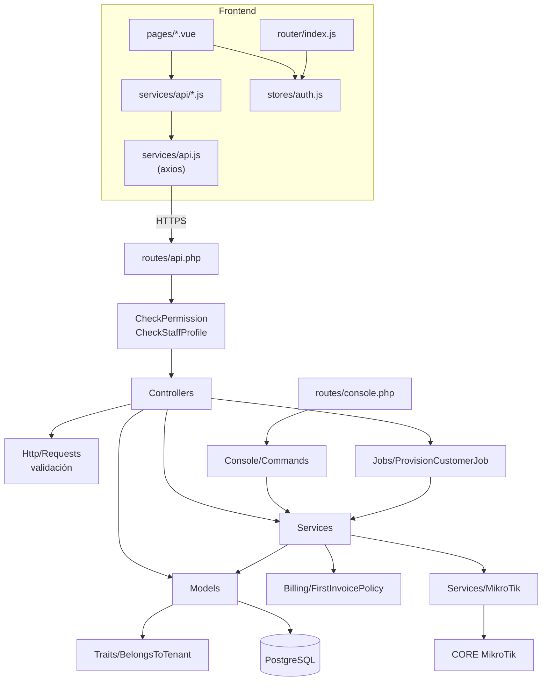
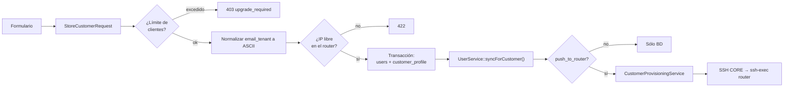
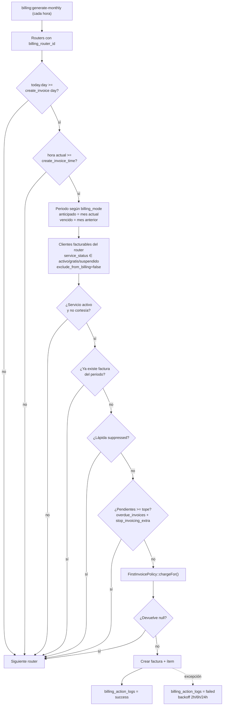
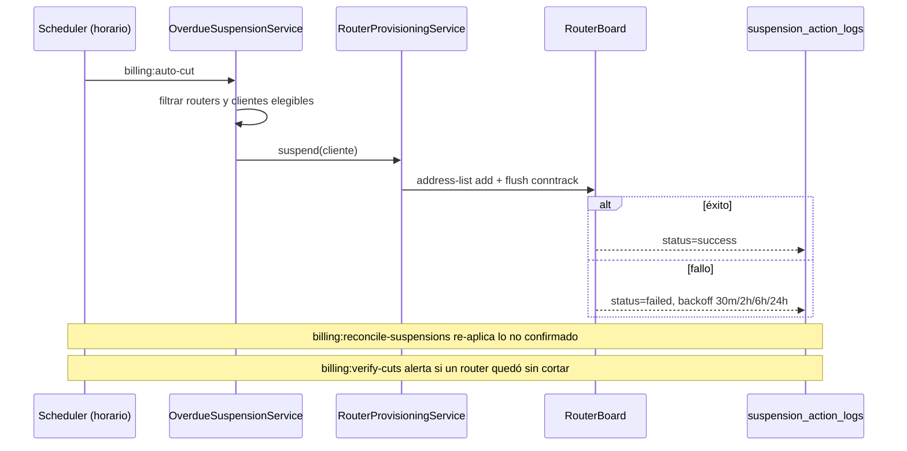
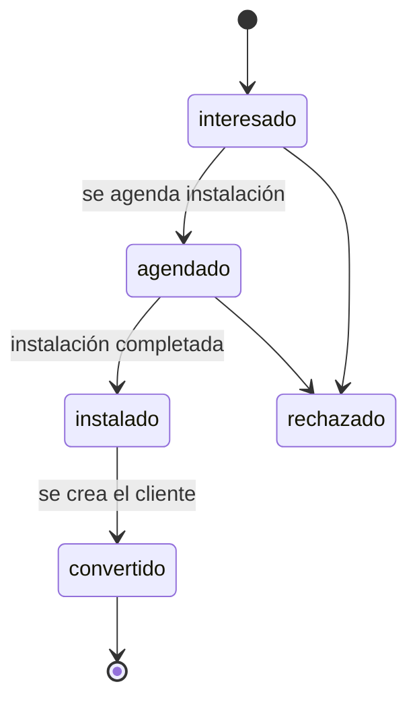
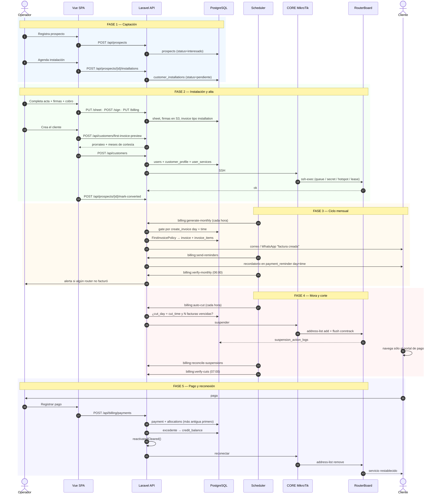
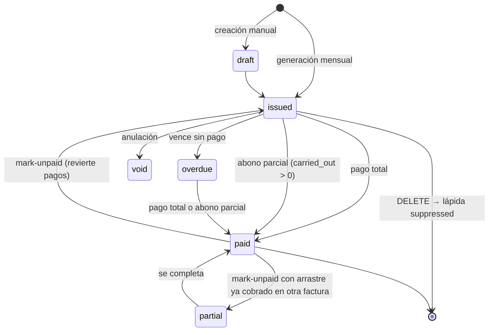

# BITÁCORA TÉCNICA — ISPWatch

> Inventario estructural del repositorio, responsabilidad de cada directorio y archivo
> relevante, módulos de negocio y trazabilidad entre componentes.
> Documento pensado para mantenimiento a largo plazo: **si cambias código, actualiza aquí.**

**Última actualización:** 2026-08-14 · Rama: `feat/contract-remote-signing`

Últimos bloques de trabajo, unificados en esta rama:

- **El contrato obligaba a un viaje (2026-08-14, § 30):** firmar sólo se podía sobre la pantalla
  de un empleado logueado, así que cada contrato costaba un desplazamiento y muchos clientes
  llevaban meses instalados sin firmar. Ahora se manda un enlace personal (correo, WhatsApp o
  copiado) y el cliente lee y firma desde el celular; el PDF remoto lleva constancia de fecha, IP
  y dispositivo, y el token sólo se guarda hasheado.
- **Facturación se revisaba a ciegas (2026-08-13, § 29):** la pantalla tenía un solo buscador
  para nueve columnas, así que "qué facturas de más de $100.000 vencen esta semana y siguen
  debiendo" sólo se podía responder exportando a Excel. Ahora hay una casilla bajo cada título,
  títulos ordenables y tamaño de página — la misma mecánica que ya usaba Recaudos.
- **Dos fallos que sólo el CI de PostgreSQL podía ver (2026-08-13, § 28):** un estado de
  instalación inventado que sqlite dejaba pasar porque pierde el CHECK del enum al reconstruir la
  tabla, y un `try` en la bitácora que daba falsa confianza: en PostgreSQL atrapar la excepción no
  descongela la transacción, hace falta un SAVEPOINT.
- **Túnel duplicado: la VPN "activa" que rompe la gestión (2026-08-13, § 28):** dos secrets L2TP
  discando desde la misma IP pública se reciclan entre sí y tumban todo lo que el CORE inicia hacia
  el router, mientras el túnel figura activo. ISPWatch no lo miraba; ahora lo detecta por
  `caller-id` y lo dice en los tres sitios donde el operador pregunta.
- **La lectura de interfaces WAN mentía sobre quién fallaba (2026-08-13, § 27):** un tiempo de
  espera que phpseclib no reporta como error hacía pasar media respuesta del CORE por una
  respuesta del router; de paso, un sondeo de túnel con falsos positivos, dos variantes de comando
  inalcanzables y una modal que al fallar no dejaba escribir la interfaz a mano.
- **Bitácora de flujo de caja y libro de saldo a favor (2026-08-11, § 26):** el saldo a favor deja
  de ser un escalar suelto y pasa a tener libro de movimientos; se arregla un bug que borraba
  dinero al anular pagos; y todo lo que mueve plata queda registrado con quién, cuándo y desde
  dónde —incluidas las cargas masivas, que eran el camino ciego.
- **Panel de Finanzas mensual, con gastos y balance (2026-08-06, § 24):** las cifras dejan de ser
  el acumulado histórico, se excluyen anuladas, entran los gastos y el tenant deja de viajar por
  la URL.
- **Inventario con custodia, consumibles y kardex (2026-08-06, § 23):** un equipo sabe quién lo
  tiene, los consumibles se llevan por saldo, una instalación puede descargar varios equipos, y
  todo movimiento queda escrito en una tabla append-only.
- **Plantillas de documentos y borrado de cliente (2026-08-06, §§ 16-19):** diagnóstico de
  marcadores migrados de otros sistemas, editor visual que no pierde el documento y muestra la
  hoja real, plantillas base reguladas de 6 países, y borrado de cliente sin residuos (archivos
  de S3, configuración del router y filas huérfanas).
- **Finanzas y servicios adicionales (2026-08-05, desde `main`):** auditoría de Finanzas
  Fases 1-6 (debounce e índices de listado, búsqueda en Gastos, paginación y agregados
  server-side, totales en dinero, exportación a CSV, unificación visual bajo el acento
  esmeralda) y **Servicios adicionales recurrentes Fases 1-6/6** (esquema, modelos, CRUD del
  catálogo, asignación por cliente, integración con el ciclo mensual, factura de excepción y
  detector de servicios sin cobrar).

---

## Índice

1. [Resumen ejecutivo](#1-resumen-ejecutivo)
2. [Estructura de carpetas](#2-estructura-de-carpetas)
3. [Backend — archivo por archivo](#3-backend--archivo-por-archivo)
4. [Frontend — archivo por archivo](#4-frontend--archivo-por-archivo)
5. [Relación entre componentes](#5-relación-entre-componentes)
6. [Módulos de negocio](#6-módulos-de-negocio)
7. [Reglas de negocio no evidentes](#7-reglas-de-negocio-no-evidentes)
8. [Flujo completo del sistema](#8-flujo-completo-del-sistema)
9. [Trazabilidad módulo → código → datos](#9-trazabilidad-módulo--código--datos)
10. [Registro de decisiones técnicas](#10-registro-de-decisiones-técnicas)
11. [Auditoría del manual de usuario — 2026-08-03](#11-auditoría-del-manual-de-usuario--2026-08-03)
12. [Consecutivo de contratos — 2026-08-04](#12-consecutivo-de-contratos--2026-08-04)
13. [El prefijo del consecutivo pasa a ser texto libre — 2026-08-05](#13-el-prefijo-del-consecutivo-pasa-a-ser-texto-libre--2026-08-05)
14. [Vista previa de la hoja de instalación y firma que no se dibujaba — 2026-08-05](#14-vista-previa-de-la-hoja-de-instalación-y-firma-que-no-se-dibujaba--2026-08-05)
15. [Tamaño/orientación de página y plantillas migradas de WispHub — 2026-08-05](#15-tamañoorientación-de-página-y-plantillas-migradas-de-wisphub--2026-08-05)
16. [La app explica por qué un marcador sale en blanco — 2026-08-06](#16-la-app-explica-por-qué-un-marcador-sale-en-blanco--2026-08-06)
17. [El editor perdía el documento al cambiar de modo, y abría en blanco — 2026-08-06](#17-el-editor-perdía-el-documento-al-cambiar-de-modo-y-abría-en-blanco--2026-08-06)
18. [El PDF salía con los textos montados: el editor mentía sobre el ancho — 2026-08-06](#18-el-pdf-salía-con-los-textos-montados-el-editor-mentía-sobre-el-ancho--2026-08-06)
19. [Borrar un cliente pasa a ser un borrado real, sin residuos — 2026-08-06](#19-borrar-un-cliente-pasa-a-ser-un-borrado-real-sin-residuos--2026-08-06)
20. [El PDF no se parecía al editor porque el modo avanzado estaba apagado — 2026-08-06](#20-el-pdf-no-se-parecía-al-editor-porque-el-modo-avanzado-estaba-apagado--2026-08-06)
21. [El PDF no se parecía al editor: cuatro causas medidas — 2026-08-06](#21-el-pdf-no-se-parecía-al-editor-cuatro-causas-medidas--2026-08-06)
22. [Las tarjetas de Inventario contaban dispositivos, no catálogos — 2026-08-06](#22-las-tarjetas-de-inventario-contaban-dispositivos-no-catálogos--2026-08-06)
23. [Custodia de inventario, consumibles y kardex — 2026-08-06](#23-custodia-de-inventario-consumibles-y-kardex--2026-08-06)
24. [El Panel de Finanzas era el acumulado histórico y no sabía de gastos — 2026-08-06](#24-el-panel-de-finanzas-era-el-acumulado-histórico-y-no-sabía-de-gastos--2026-08-06)
25. [API pública de solo lectura por llave — 2026-08-07](#25-api-pública-de-solo-lectura-por-llave--2026-08-07)
26. [El saldo a favor movía plata sin dejar asiento — 2026-08-11](#26-el-saldo-a-favor-movía-plata-sin-dejar-asiento--2026-08-11)
27. [El botón de WAN culpaba al router de un silencio nuestro — 2026-08-13](#27-el-botón-de-wan-culpaba-al-router-de-un-silencio-nuestro--2026-08-13)
28. [La WAN seguía sin leerse: había dos túneles peleándose — 2026-08-13](#28-la-wan-seguía-sin-leerse-había-dos-túneles-peleándose--2026-08-13)
28. [Dos fallos que sólo el CI de PostgreSQL podía ver — 2026-08-13](#28-dos-fallos-que-sólo-el-ci-de-postgresql-podía-ver--2026-08-13)
29. [Facturación se revisaba a ciegas: un solo buscador para nueve columnas — 2026-08-13](#29-facturación-se-revisaba-a-ciegas-un-solo-buscador-para-nueve-columnas--2026-08-13)

---

## 1. Resumen ejecutivo

### Propósito

ISPWatch es la plataforma operativa de un **Proveedor de Servicios de Internet**.
Unifica en un solo sistema la gestión comercial (prospectos, clientes, instalaciones),
la gestión financiera (facturación, pagos, gastos) y **el control efectivo de la red**
(aprovisionamiento, suspensión y reconexión sobre routers MikroTik RouterOS).

### Problema que resuelve

Un ISP pequeño o mediano suele operar con tres sistemas desconectados: una hoja de
cálculo para clientes, un software contable para facturar y acceso manual (Winbox) a cada
RouterBoard para dar de alta o cortar servicios. Esa desconexión produce tres fugas
concretas:

1. **Fuga de ingreso:** clientes morosos que siguen navegando porque nadie los cortó a mano.
2. **Fuga de tiempo:** cada alta exige entrar al router y crear cola/secret manualmente.
3. **Fuga de información:** no hay trazabilidad de quién cortó, cuándo, ni por qué.

ISPWatch cierra el ciclo: **la factura vencida dispara el corte real en el equipo, y el
pago registrado dispara la reconexión real**, con bitácora y reintentos automáticos.

### Funcionalidades principales

| Área | Capacidades |
|---|---|
| **Clientes** | Alta individual o masiva por Excel, mapa georreferenciado, documentos en S3, contrato firmado, exclusión de facturación por cliente |
| **Comercial** | Prospectos, agenda de instalaciones, acta de instalación firmada, cobro de instalación |
| **Facturación** | Generación mensual por router, prorrateo y meses de cortesía, numeración segura por tenant, tipos de factura administrables, PDF, recordatorios email/WhatsApp, pagos con asignación automática, saldo a favor y arrastre de abonos parciales |
| **Cobranza** | Corte automático por mora con día y hora configurables, reconexión automática al pagar, reconciliación DB ⇄ router |
| **Red** | Aprovisionamiento por método de control (Queue/PCQ/HotSpot/PPPoE/DHCP), reglas de bloqueo, scripts VPN L2TP/IPSec, lectura de interfaces, historial de tráfico WAN |
| **Planta externa** | Árbol FTTH (OLT → splitter → NAP → mufa), puertos calculados, topología visual |
| **Soporte** | Tickets con categorías, mensajes internos, adjuntos, cargos facturables |
| **Administración** | Multi-tenant, roles con permisos granulares, inventario, gastos, plantillas de documentos, centro de ayuda |

### Tipos de usuario

| Rol | `role_code` | Alcance típico |
|---|---|---|
| **Administrador** | `admin` | Acceso total. `role_id == 1` obtiene bypass en el backend |
| **Staff** | `staff` | Clientes, planes, sectoriales, inventario, soporte, facturación (lectura y registro de pagos) |
| **Técnico** | `technician` | Clientes, instalaciones, activar/desactivar, tráfico |
| **Contabilidad** | `accounting` | Facturas, pagos, gastos, transferencias |
| **Cliente** | `client` | Sin permisos en el panel; es el sujeto de la facturación |

Los roles son **editables por tenant**: `role.permissions` es un array JSON, y se pueden
crear roles personalizados desde `/roles`.

---

## 2. Estructura de carpetas

```
ISPWatch/
├── .do/                     # Especificación de despliegue DigitalOcean App Platform
│   ├── deploy.template.yaml #   web + worker + scheduler. SIN secretos (type: SECRET)
│   └── nginx.conf
├── .github/workflows/       # CI: suite en SQLite y en PostgreSQL+PostGIS
├── app/                     # Código de aplicación (PSR-4: App\)
│   ├── Billing/             #   Políticas de facturación puras (sin IO)
│   ├── Console/Commands/    #   19 comandos Artisan
│   ├── Constants/           #   Catálogo de permisos
│   ├── Exports/             #   Plantillas Excel de descarga
│   ├── Helpers/             #   Traducción de errores de BD
│   ├── Http/
│   │   ├── Controllers/     #   37 controladores de API
│   │   ├── Middleware/      #   Permisos, perfil staff, cabeceras de seguridad
│   │   └── Requests/        #   6 FormRequest con validación
│   ├── Imports/             #   Importadores Excel
│   ├── Jobs/                #   ProvisionCustomerJob
│   ├── Mail/                #   4 mailables
│   ├── Models/              #   43 modelos Eloquent
│   ├── Notifications/       #   Verificación de correo
│   ├── Policies/            #   CustomerInstallationPolicy
│   ├── Providers/           #   AppServiceProvider, SearchMacros, Volt
│   ├── Services/            #   Lógica de negocio
│   │   ├── MikroTik/        #     Managers por recurso RouterOS
│   │   │   └── Concerns/    #     Traits compartidos (SSH, escapado, verificación)
│   │   └── Templates/       #     Render y saneado de plantillas
│   ├── Traits/              #   BelongsToTenant, FixesSequences, InputSanitizer
│   └── View/Components/
├── backup/                  # Respaldos manuales
├── bootstrap/               # app.php: rutas, middleware, manejo de excepciones
├── config/                  # 14 archivos de configuración
├── database/
│   ├── factories/           #   PlanFactory, TenantFactory, UserFactory
│   ├── migrations/          #   134 migraciones
│   └── seeders/             #   13 seeders
├── docs/                    # ESTA DOCUMENTACIÓN
├── public/                  # Punto de entrada + assets compilados
├── resources/
│   ├── css/ · sass/
│   ├── js/                  #   SPA Vue 3
│   └── views/               #   Blade: shell de la SPA, PDFs, correos, portal de pago
├── routes/                  # api.php · web.php · console.php
├── scripts/                 # gen_favicon.py · supabase_lockdown_rls.sql
├── storage/                 # Logs, cache, claves SSH (keys/ está en .gitignore)
└── tests/                   # 27 archivos de prueba (245 tests, 0 fallos)
```

### Responsabilidad de cada directorio

| Directorio | Responsabilidad | Cuándo tocarlo |
|---|---|---|
| `app/Billing` | **Política de facturación pura**, sin acceso a base de datos ni IO. Hoy sólo `FirstInvoicePolicy` | Al cambiar reglas de prorrateo o cortesía |
| `app/Console/Commands` | Tareas ejecutables por cron u operador | Al añadir automatización |
| `app/Http/Controllers` | Traducir HTTP ⇄ dominio. **No debe contener lógica de negocio** | Al añadir endpoints |
| `app/Http/Requests` | Validación declarativa reutilizable | Al cambiar el contrato de entrada |
| `app/Models` | Esquema, relaciones, casts, constantes de dominio | Al cambiar el esquema |
| `app/Services` | Lógica de negocio y orquestación | La mayoría de los cambios funcionales |
| `app/Services/MikroTik` | Todo lo que habla RouterOS. **Un manager por recurso** | Al tocar la integración de red |
| `app/Traits` | Comportamiento transversal (multi-tenancy, secuencias) | Rara vez |
| `database/migrations` | Evolución del esquema. **Siempre `migrate:both`** | Al cambiar el esquema |
| `resources/js/pages` | Una página = una ruta del SPA | UI |
| `resources/js/services/api` | Cliente HTTP por dominio | Al añadir endpoints |
| `resources/views/documents` | Plantillas Blade de PDF y sus *shells* | Al cambiar documentos legales |
| `tests` | PHPUnit sobre **SQLite en memoria**; el CI repite la suite en PostgreSQL | Siempre que cambies lógica |

---

## 3. Backend — archivo por archivo

### 3.1 `app/Billing`

| Archivo | Descripción |
|---|---|
| `FirstInvoicePolicy.php` | **Fuente única** de la política de primera factura. Resuelve la cascada cliente → plan → router para dos ejes independientes (`mode` y `freeMonths`) y calcula el cargo del periodo. Usada por la generación mensual, la auditoría y la vista previa del formulario — **no hay una segunda copia de la fórmula** |

### 3.2 `app/Console/Commands`

| Archivo | Comando | Descripción |
|---|---|---|
| `GenerateMonthlyInvoices.php` | `billing:generate-monthly {period?}` | Dispara `BillingService::generateMonthlyInvoices()` |
| `RetryFailedInvoices.php` | `billing:retry-failed` | Reintenta filas `failed` con `next_retry_at` vencido |
| `VerifyMonthlyBilling.php` | `billing:verify-monthly` | Auditoría de no-show; alerta por log y correo |
| `AutoCutByRouter.php` | `billing:auto-cut` | Corte automático por router |
| `ReconcileSuspensions.php` | `billing:reconcile-suspensions` | Reconcilia DB ⇄ RouterBoard |
| `VerifyAutomaticCuts.php` | `billing:verify-cuts` | Auditoría de no-show de cortes |
| `SendPaymentReminders.php` | `billing:send-reminders` | Recordatorios de pago |
| `ProcessOverdueInvoices.php` | `billing:process-overdue` | Procesamiento manual de morosos |
| `SimulateBillingFlow.php` | `billing:simulate` | Simulador del ciclo completo |
| `VoidCourtesyInvoices.php` | `billing:void-courtesy {period?}` | Anula facturas de planes de cortesía |
| `GenerateTenantInvoicesOneOff.php` | `billing:generate-tenant {tenant} {period} {--dry-run}` | Facturación puntual |
| `CollectTrafficHistory.php` | `traffic:collect` | Muestrea contadores WAN |
| `PruneTrafficHistory.php` | `traffic:prune {--days=30}` | Poda muestras finas |
| `VerifyVpnTunnels.php` | `vpn:verify-tunnels {--stale=15} {--no-mail}` | Salud del túnel por router: `last-handshake` en WireGuard, `/ppp active` en L2TP. Solo lee |
| `MigrateBothSchemas.php` | `migrate:both` | **Aplica migraciones a `ispwatch_dev` y `public`** |
| `SyncDevFromPublic.php` | `db:sync-dev` | Copia producción → desarrollo |
| `FixSequences.php` | `db:fix-sequences` | Repara secuencias PostgreSQL |
| `MigrateDocumentsToS3.php` | `documents:migrate-to-s3 {--dry-run}` | Migra documentos locales a S3 |
| `DiagnoseRouterWan.php` | `router:diagnose-wan` | Diagnóstico de interfaz WAN |
| `SyncRolePermissions.php` | `permissions:sync` | Reconcilia los roles canónicos con el catálogo de permisos (aditivo) |

### 3.3 `app/Http/Controllers`

| Archivo | Líneas | Responsabilidad |
|---|---:|---|
| `CustomerProfileController.php` | 1385 | CRUD de clientes, estadísticas, mapa, IPs usadas, aprovisionamiento (individual, masivo síncrono y asíncrono), suspender/activar, vista previa de primera factura |
| `CustomerInstallationController.php` | 757 | Instalaciones: agenda, acta, fotos, firmas, cobro |
| `RouterController.php` | 650 | CRUD de routers, VPN, interfaces, reglas de bloqueo, pruebas de conexión, tráfico |
| `SupportTicketController.php` | 591 | Tickets, mensajes, estados, cargos, estadísticas |
| `BillingController.php` | 466 | Facturas, pagos, saldo, configs, disparadores del ciclo |
| `PlanController.php` | 327 | CRUD de planes + sincronización de perfiles al router |
| `RegistrationController.php` | 321 | Alta de tenant + administrador con verificación |
| `ImportController.php` | 301 | Plantillas y procesamiento de importaciones masivas |
| `DocumentTemplateController.php` | 281 | Plantillas de factura/contrato/acta con saneado |
| `UserController.php` | 277 | Personal (staff) |
| `AuthController.php` | 248 | Login con rate limiting y detección de inyección; `/auth/me` |
| `TenantController.php` | 242 | Datos de empresa, logo, config de mapas |
| `DashboardController.php` | 235 | Estadísticas del panel |
| `SectorialController.php` | 223 | Elementos de red y topología |
| `PaymentReminderController.php` | 218 | Recordatorios individuales y masivos |
| `CustomerDocumentController.php` | 189 | Documentos en S3, contrato |
| `RoleController.php` | 180 | Roles y catálogo de permisos |
| `ProspectController.php` | 173 | Prospectos y conversión |
| `BillingActionLogController.php` | 170 | Failover de facturación |
| `SuspensionActionLogController.php` | 145 | Failover de cortes + reconciliación |
| `HelpCenterController.php` | 125 | Centro de ayuda |
| `ExpenseController.php` / `ExpenseCategoryController.php` | — | Gastos |
| `InventoryDevice/Stock/Provider/BranchController.php` | — | Inventario |
| `SectorialPhoto/Note/HistoryController.php` | — | Anexos de elementos de red |
| `RouterOutageController.php` | — | Falla masiva |
| `CatalogController.php` | — | Catálogos globales |
| `PaymentMethodController.php` | — | Formas de pago |
| `InvoiceTypeController.php` | — | Catálogo de tipos de factura (sistema + propios del tenant) |
| `AdditionalServiceController.php` | — | Catálogo de servicios adicionales recurrentes (plantilla reutilizable) |
| `CustomerAdditionalServiceController.php` | — | Asignación de servicios adicionales a un cliente (rutas anidadas bajo el cliente) |
| `SettingsController.php` | — | Limpieza de cache |
| `VerificationController.php` | — | Verificación de correo |

### 3.4 `app/Services`

| Archivo | Líneas | Responsabilidad |
|---|---:|---|
| `BillingService.php` | ~1560 | Núcleo financiero: generación, numeración, primera factura, pagos, asignación, saldo a favor, **arrastre de abonos parciales**, anulación con lápida, reconexión al pagar, notificaciones |
| `VpnService.php` | 945 | Generación y verificación de scripts L2TP/IPSec |
| `RouterApiService.php` | 912 | Protocolo API nativo MikroTik |
| `MikroTikSshService.php` | 603 | SSH directo o vía CORE |
| `OverdueSuspensionService.php` | 412 | Corte automático: elegibilidad, gate de día/hora, ejecución |
| `CustomerProvisioningService.php` | 338 | Aprovisionar cliente según método de control. **Fuente única** para el job, el masivo y el alta |
| `InstallationBillingService.php` | 253 | Factura de instalación |
| `RouterProvisioningService.php` | 218 | Suspender/reactivar en el router |
| `TrafficHistoryService.php` | 164 | Muestreo y agregación de tráfico |
| `WhatsAppService.php` | 162 | WhatsApp Cloud API (Graph v18) |
| `PaymentReminderService.php` | 209 | Recordatorios (uno por cliente, con todas sus facturas pendientes) |
| `RouterPolicyInstallerService.php` | 151 | Instalación de reglas de bloqueo |
| `CustomerDeletionService.php` | — | **Borrado completo del cliente**: filas, archivos de S3 y configuración del router. El orden de las operaciones no es arbitrario — ver § 19 |
| `Templates/TemplateRenderer.php` | — | Render de plantillas |
| `Templates/TemplateSanitizer.php` | — | Saneado con HTMLPurifier |
| `Templates/PlaceholderResolver.php` | — | Resolución de placeholders |
| `Templates/TemplateDiagnostics.php` | — | Explica por qué un marcador sale en blanco (§ 16) |
| `Templates/DocumentStarterLibrary.php` | — | Catálogo de plantillas base editables (§ 17) |

### 3.5 `app/Services/MikroTik`

| Archivo | Líneas | Recurso RouterOS |
|---|---:|---|
| `InterfaceReader.php` | 912 | Lectura robusta de interfaces WAN (multi-variante v6/v7, envelope `:do/:put`, centinelas, puerto SSH del cliente propagado hasta el `ssh-exec`) |
| `FirewallRulesManager.php` | 753 | `/ip firewall filter` + address-list de suspendidos |
| `PppProfileManager.php` | 723 | `/ppp profile` |
| `MikroTikApiProtocol.php` | 602 | Protocolo binario del API |
| `PppSecretManager.php` | 592 | `/ppp secret` |
| `MikroTikConnectionManager.php` | 525 | Gestión de conexiones |
| `SuspensionManager.php` | 510 | Alta/baja en la lista de morosos |
| `SshTunnelManager.php` | 446 | Túnel SSH |
| `HotspotManager.php` | 387 | `/ip hotspot user` y `user profile` |
| `QueueManager.php` | 381 | `/queue simple` |
| `PcqManager.php` | 320 | `/queue type` + address-list |
| `DhcpLeaseManager.php` | 234 | `/ip dhcp-server lease` |
| `IpMacBindingManager.php` | 233 | ARP estático + drop por par IP/MAC |
| `CustomerDeprovisionManager.php` | — | **Contrapartida de borrado**: barre secret y sesión PPPoE, queue, HotSpot, lease, address-lists, ARP y amarre. Era el único manager de borrado; el resto sólo tenía `ensure*` |
| `SshTunnel.php` | 207 | Conexión SSH individual |
| `RouterEndpointResolver.php` | 157 | Resuelve la IP real desde `/ppp active` del CORE y la reescribe en BD |
| `Concerns/BuildsCoreSshExec.php` | — | Construye la línea `/system ssh-exec` (puerto + escapado) |
| `Concerns/DetectsSshExecFailures.php` | — | Distingue fallo real de salida vacía |
| `Concerns/NormalizesRouterComment.php` | — | Normaliza comentarios de objetos |
| `Concerns/VerifiesRouterOsObjectState.php` | — | Verifica que el objeto quedó como se pidió |

### 3.6 Otros directorios de `app`

| Archivo | Descripción |
|---|---|
| `Constants/Permissions.php` | Catálogo de **35 permisos** agrupados en 8 categorías + mapa rol → permisos. Reconciliado con la base por `permissions:sync` |
| `Helpers/ErrorMessages.php` | Traduce `QueryException` a mensajes en español |
| `Http/Middleware/CheckPermission.php` | Verifica permiso, con **semántica OR** (`permission:a,b`). Carga el rol con `withoutGlobalScope('tenant')`. Bypass `role_id == 1`. Consulta los permisos **efectivos** (rol ∪ usuario) |
| `Http/Middleware/CheckStaffProfile.php` | Pese al nombre, **no** exige fila en `staff_profile`: comprueba `role.code ∈ {admin, staff}` o `role_id == 1` |
| `Http/Middleware/SecurityHeaders.php` | CSP, HSTS, X-Frame-Options, COOP, Permissions-Policy |
| `Traits/BelongsToTenant.php` | Global scope + auto-relleno de `tenant_id` desde el usuario autenticado |
| `Traits/FixesSequences.php` | Repara secuencias PostgreSQL desincronizadas al crear |
| `Traits/InputSanitizer.php` | Saneado de entrada |
| `Providers/SearchMacrosServiceProvider.php` | Macros `whereLike`/`orWhereLike`: eligen `ilike` o `like` según el driver y escapan comodines |
| `Jobs/ProvisionCustomerJob.php` | Un job por cliente en el aprovisionamiento masivo asíncrono |
| `Imports/UnifiedImport.php` + `Sheets/*` | Importación de clientes, planes, routers y sectoriales en un solo archivo |
| `Imports/CustomersUpdateImport.php` | Actualización masiva de clientes |
| `Imports/InventoryImport.php` | Carga masiva de equipos |
| `Exports/*` | Plantillas descargables y exportación de errores |
| `Mail/InvoiceCreatedMail.php`, `PaymentReminderMail.php`, `SendTicketNotification.php`, `VerificationCodeMail.php` | Correos transaccionales |
| `Policies/CustomerInstallationPolicy.php` | Autorización de instalaciones |

### 3.7 Configuración y rutas

| Archivo | Descripción |
|---|---|
| `bootstrap/app.php` | Registro de rutas, alias de middleware, `trustProxies('*')`, manejo de `QueryException` → JSON 422 |
| `routes/api.php` | Toda la API REST. **Cada endpoint lleva su permiso** desde 2026-07-30; los de lectura usan semántica OR |
| `routes/web.php` | Redirección raíz, portal de pago, ruta CSRF de Sanctum, **catch-all de la SPA** |
| `routes/console.php` | Planificador: 9 tareas programadas |
| ~~`routes/auth.php`~~ | **Eliminado** (2026-07-30): no lo cargaba `bootstrap/app.php` y referenciaba un controlador y unas vistas Volt inexistentes |
| `config/database.php` | Conexiones. **Nota de seguridad:** `sqlite` no define `url` a propósito, para que `DB_URL` no pueda redirigir los tests a la base real |
| `config/cors.php` | Orígenes desde `CORS_ALLOWED_ORIGINS`; `supports_credentials = true`; `exposed_headers` incluye `X-Template-Warnings` (sin eso el aviso de la vista previa de plantillas no llega al JS en desarrollo, donde Vite y la API están en puertos distintos) |
| `config/sanctum.php` | Dominios stateful, guard `web`, sin expiración de token |
| `config/document_placeholders.php` | Placeholders disponibles en las plantillas |
| `config/filesystems.php` | Disco `s3` para documentos |

---

## 4. Frontend — archivo por archivo

### 4.1 Núcleo

| Archivo | Descripción |
|---|---|
| `router/index.js` | ~40 rutas, todas *lazy-loaded*. Guarda `beforeEach`: autenticación, `requiresStaff`, `meta.permission`, título de página |
| `stores/auth.js` | Pinia: `user`, `isAuthenticated`, `permissions`, `roleCode`, `isStaffOrAdmin`, `hasPermission()` (espejo exacto de `CheckPermission`, **con** bypass de superadmin), `refreshUserPermissions()` |
| `services/api.js` | Instancia axios y manejador global de `401`. El interceptor que inyectaba `tenant`/`tenant_id` se eliminó: el backend siempre lo ignoró |
| ~~`services/auth.js`~~ | **Eliminado**: duplicaba `hasPermission` con lógica distinta a la del store, que es la que usa el guard |
| `services/billing.js` | Cliente de facturación |
| `services/api/*.js` | 21 módulos por dominio: `auth`, `customers`, `routers`, `plans`, `staff`, `support`, `inventory`, `inventory-stock/-provider/-branch`, `sectorials`, `tenant`, `roles`, `prospects`, `catalogs`, `expense`, `expense-category`, `additional-service`, `customer-additional-service`, `document-templates`, `help-center` |

### 4.2 Composables

| Archivo | Descripción |
|---|---|
| `useNotification.js` | Notificaciones toast |
| `usePermissions.js` | Verificación de permisos en componentes |
| `useProvisionPolling.js` | Sondeo del progreso de aprovisionamiento masivo |
| `useTableControls.js` | Búsqueda, orden y paginación de tablas |

### 4.3 Páginas (44 + 8 de facturación)

| Grupo | Páginas |
|---|---|
| Acceso | `Login`, `Register`, `ResendVerification` |
| Panel | `Dashboard` |
| Clientes | `Customers`, `CustomerAdd`, `CustomerEdit`, `CustomerStatistics`, `CustomerMap` |
| Red | `Routers`, `RouterAdd`, `RouterEdit`, `Sectorial`, `SectorialAdd`, `SectorialEdit`, `SectorialDetail`, `FiberTopology` |
| Planes | `PlanList`, `PlanCreate`, `PlanEdit` |
| Facturación | `Billing/BillingDashboard`, `InvoicesList`, `InvoiceDetail`, `InvoiceEdit`, `PaymentsList`, `RegisterPayment`, `PaymentMethods`, `InvoiceTypes`, `AdditionalCharges` |
| Gastos | `Expenses`, `ExpenseCategories` |
| Soporte | `Support`, `SupportCreate`, `SupportDetail`, `SupportEdit`, `SupportStatistics`, `Installations`, `InstallationDetail` |
| Inventario | `Inventory`, `InventoryForm`, `StockList`, `ProviderList`, `BranchList` |
| Administración | `Staff`, `StaffNew`, `EditStaff`, `RolesManagement`, `Settings`, `MassActions` |
| Ayuda | `Manual`, `NotFound` |

### 4.4 Componentes

| Componente | Descripción |
|---|---|
| `Sidebar.vue` | Navegación por grupos: Usuarios, Soporte, Gestión, Inventarios, Finanzas. Filtra por permisos **y por `role_code`** |
| `BillingPanel.vue` | Panel de facturación del cliente |
| `IpRangeAnalyzer.vue` | Análisis de rangos IP |
| `DatePicker.vue` / `DayPicker.vue` | Selección de fecha / día del mes |
| `SearchableSelect.vue` | Selector con búsqueda |
| `StatCard.vue`, `NotificationToast.vue`, `TimezoneClock.vue`, `WhatsAppButton.vue`, `SubmenuItem.vue`, `SettingsSection.vue` | Piezas de UI |
| `customer/CustomerBilling · CustomerDocuments · CustomerInstallations · CustomerTickets` | Pestañas de la ficha de cliente |
| `customer/CustomerAdditionalServices.vue` | Servicios adicionales del cliente (asignar, editar, dar de baja) con el total recurrente. Segunda tarjeta de la pestaña Facturación |
| `billing/AdditionalServiceCatalog.vue` | Catálogo de servicios adicionales recurrentes (grid de tarjetas + alta/edición). Vive como pestaña de `Billing/AdditionalCharges`; emite `notify` al padre en vez de montar su propio toast |
| `import/ImportSection · CustomersUpdateSection · InventoryImportSection · ErrorsModal · FieldDocsModal` | Flujos de carga masiva |
| `settings/DocumentTemplatesSection.vue` | Editor de plantillas |
| `ui/ConfirmModal · Pagination` | Primitivas en uso real. `Pagination` acepta acento `blue` \| `indigo` \| `emerald` |
| `ui/PageHeader.vue` | Encabezado de página (chip de ícono + título + subtítulo + slot `actions`). **Lo usan los 7 módulos de Finanzas**; es lo que hace que la consistencia sea estructural y no copiada |
| `ui/StatCard.vue` | Tarjeta de cifra con el orbe de color en la esquina, distintivo de Finanzas. Importes en `tabular-nums` |
| `DatePicker.vue` | Calendario propio (`YYYY-MM-DD`), en español y con semana de lunes a domingo. Prop `accent`: `blue` (por defecto) \| `emerald` (Finanzas) |
| `MonthPicker.vue` | Gemelo del anterior con rejilla de meses (`YYYY-MM`). Sustituye al `<input type="month">` del filtro de Facturación, cuyo desplegable nativo no se puede estilar ni traducir |
| `ui/LoadingSkeleton · SearchBar · StatusBadge` | ⚠️ **Sin usar en ninguna vista** — andamiaje de un intento anterior de sistema de diseño. Ver P-9 en `MEJORAS_RECOMENDADAS.md` |

### 4.5 Vistas Blade

| Archivo | Descripción |
|---|---|
| `app.blade.php` | Shell de la SPA |
| `payment-portal.blade.php` | Portal de pago para clientes suspendidos (`/portal-pago`) |
| `billing/invoice_pdf.blade.php` | PDF de factura |
| `documents/contract_pdf.blade.php`, `installation_sheet_pdf.blade.php` | PDF de contrato y acta |
| `documents/shells/*.blade.php` | *Shells* donde se inserta el HTML editable de cada plantilla |
| `emails/*` | Factura creada, recordatorio, notificación de ticket, verificación |

---

## 5. Relación entre componentes



### Dependencias entre servicios

| Servicio | Depende de |
|---|---|
| `BillingService` | `WhatsAppService` (constructor), `FirstInvoicePolicy`, modelos de facturación |
| `OverdueSuspensionService` | `BillingService`, `RouterProvisioningService` |
| `CustomerProvisioningService` | `RouterEndpointResolver` + managers MikroTik |
| `RouterProvisioningService` | `SuspensionManager`, `FirewallRulesManager` |
| Todos los managers MikroTik | `BuildsCoreSshExec`, `DetectsSshExecFailures` |

---

## 6. Módulos de negocio

### 6.1 Módulo Clientes

**Objetivo.** Mantener el registro maestro del abonado y su configuración de servicio,
y reflejarla en el equipo de red.

**Funcionalidades.** Alta individual y masiva; edición con detección automática de fibra;
mapa georreferenciado; documentos y contrato; exclusión de facturación; suspensión y
activación manual; aprovisionamiento individual y masivo; **borrado completo sin residuos**
(filas, archivos de S3 y configuración del router — ver § 19).

**Dependencias.** `service_plan` (plan), `router` (equipo), `sectorial` (elemento de red /
OLT-NAP), `user_services` (contrato de facturación), `CustomerProvisioningService`,
`CustomerDeletionService` (borrado).

**Flujo interno.**



---

### 6.2 Módulo Facturación

**Objetivo.** Emitir la factura correcta a cada cliente en el momento correcto, cobrarla
y dejar trazabilidad de todo.

**Funcionalidades.** Generación mensual dirigida por router; política de primera factura;
numeración segura por tenant; PDF; recordatorios; registro de pagos con asignación
automática y saldo a favor; anulación con lápida; failover y auditoría.

**Dependencias.** `billing` (config del router), `user_services` (qué facturar),
`FirstInvoicePolicy`, `WhatsAppService`, Mail.

**Flujo interno de la generación mensual.**



**Regla clave — el día se recorta al mes.** Un `create_invoice` configurado en día 31 se
convierte en 30 en abril y 28 en febrero (`Billing::clampDayToMonth`), para que la
configuración "último día del mes" siga disparando.

**Regla clave — el corte NO congela la deuda; el tope sí.** La audiencia de la generación es
`service_status` (`CustomerProfile::BILLABLE_SERVICE_STATUSES`), no el booleano `status`: al
cliente **cortado por mora** se le siguen emitiendo mensualidades porque puede reconectarse
pagando. Lo que detiene la acumulación es el **tope de facturación**
(`Billing::invoiceStopThreshold()` = `overdue_invoices + stop_invoicing_extra`, `null` = sin
tope): al llegar a ese número de facturas **pendientes** (con saldo, de cualquier tipo, vencidas
o no) no se emite ninguna más. `retirado` y `cancelado` no facturan nunca. El mismo tope se
aplica en `retryFailedInvoice` (después de la idempotencia) y en `auditMonthlyBilling`, que
reporta esos clientes en la columna informativa `capped` para no dar falsos `partial`.

**Notificación al crear.** No se notifica la factura de un mes de cortesía ni la que **nace
saldada** con el saldo a favor del cliente (`balance_due = 0` tras `applyCreditToInvoice`). Si el
cliente arrastra deuda anterior, `InvoiceCreatedMail` incluye `pending_count`, `previous_due` y
`pending_total` para que el correo muestre la deuda total y no sólo el mes.

---

### 6.3 Módulo Cobranza y corte

**Objetivo.** Convertir la mora en una acción real sobre el equipo, y el pago en una
reconexión real.

**Condiciones de corte** (todas deben cumplirse):

1. El router tiene `cut_type` con nombre **`Corte Automático`**.
2. El router tiene configuración de facturación (`billing_router_id`).
3. `hoy.día >= billing.cut_day` (recortado al mes).
4. `hora actual >= billing.cut_time`.
5. El cliente acumula al menos `billing.overdue_invoices` facturas vencidas
   (`balance_due > 0` y `due_date < now`).

Los routers marcados **`Corte Manual`** no suspenden: sólo encolan y reportan los pendientes.



**Reconexión automática.** Al registrar un pago, `BillingService::reactivateIfCleared()`
comprueba si el cliente quedó al día y, **sólo si el corte fue de facturación**, lo reactiva
en el router. Un corte manual no se revierte solo.

> **Detalle no evidente:** `RouterProvisioningService::suspend`/`unsuspend` **no tocan**
> `customer_profile.status` — el estado real del corte vive en el router y en
> `suspension_action_logs`. Quienes sí lo escriben son los llamadores: el auto-cut
> (`OverdueSuspensionService`) y la suspensión manual dejan `status = false` +
> `service_status = 'suspendido'` antes de hablar con la RB, para que el reconciliador
> (que escanea `status = false`) cubra los cortes fallidos.
>
> Ese `service_status = 'suspendido'` **no** saca al cliente de la facturación: la generación
> mensual filtra por `CustomerProfile::BILLABLE_SERVICE_STATUSES` y sólo excluye
> `retirado`/`cancelado`. Ver §6.2 (tope de facturación).

---

### 6.4 Módulo Red / MikroTik

**Objetivo.** Ejecutar sobre el equipo lo que el sistema decide.

**Funcionalidades.** Aprovisionamiento por método de control; reglas de bloqueo; scripts
VPN; lectura de interfaces; historial de tráfico; falla masiva.

**Flujo interno.** Ver [`ARQUITECTURA.md §8`](ARQUITECTURA.md#8-integración-mikrotik-el-núcleo-diferencial).

**Puntos de fallo documentados en el propio código:**

| Síntoma | Causa real |
|---|---|
| `<connection failed> <ip>:22` | `router.ip` obsoleto por reasignación del pool L2TP **o** SSH en puerto distinto de 22 |
| Aprovisionamiento "exitoso" pero sin efecto | `ssh-exec` con `exit-code ≠ 0` se reportaba como éxito (corregido) |
| Perfil HotSpot no se crea | `/ip hotspot user profile` **no acepta `comment`** y el comando entero falla |
| Cliente en la lista de morosos sigue navegando | Faltaba `place-before`, dependencia de `out-interface=wan`, sin flush de conntrack y sin regla de acceso al portal (los cuatro corregidos) |
| "Actualiza pero no carga a la RB" | Timeout del gateway en el push PPPoE síncrono, no un error de datos |

---

### 6.5 Módulo Comercial (prospectos e instalaciones)

**Objetivo.** Acompañar al futuro cliente desde el interés hasta la instalación cobrada
y firmada.

**Flujo.**



La instalación registra costo, cargos adicionales (con ítems en JSON), descuento con motivo,
forma de pago y monto recibido; genera factura de tipo `installation`; guarda el acta en
JSON y las firmas del cliente y el técnico como imágenes en S3.

---

### 6.6 Módulo Soporte

**Objetivo.** Registrar y resolver incidencias, y cobrar lo que sea cobrable.

Ticket con categoría, prioridad, estado, cliente, staff asignado y **elemento de red
afectado** (`sectorial_id`). Los mensajes admiten la marca `is_internal`. Un ticket puede
generar facturas de tipo `service_charge`.

> **Detalle de permisos poco intuitivo:** **Instalaciones no tiene permiso propio**: todo el
> grupo Soporte (Tickets, Nuevo Ticket, Instalaciones, Estadísticas) se muestra con
> `view_support`. Quien pueda ver tickets puede ver instalaciones, y viceversa.
> Las operaciones de conversación y cargo exigen además fila en `staff_profile`.

---

### 6.7 Módulos de apoyo

| Módulo | Objetivo | Dependencias |
|---|---|---|
| **Inventario** | Equipos por serial/MAC, con stock, proveedor y sucursal | `BelongsToTenant`; importación masiva |
| **Gastos** | Registro de gastos operativos por categoría y beneficiario | Sin borrado físico: se anulan |
| **Plantillas de documentos** | HTML editable por tenant para factura, contrato y acta | `HTMLPurifier`, `PlaceholderResolver`, permiso propio |
| **Centro de ayuda** | Manual embebido por categorías y artículos | — |
| **Acciones masivas** | Importaciones, aprovisionamiento masivo, paneles de failover | `execute_mass_actions` |

---

## 7. Reglas de negocio no evidentes

Recopilación de decisiones que **no se deducen leyendo sólo el esquema** y que han causado
incidentes reales.

| # | Regla | Dónde vive |
|---|---|---|
| 1 | La facturación **se dirige por router**, no por tenant ni por cliente | `BillingService::generateMonthlyInvoices` |
| 2 | Se factura desde `user_services`, **no** desde `customer_profile.service_id` | `BillingService` |
| 3 | `is_courtesy` en el plan ⇒ el servicio queda en `gratis` ⇒ nunca se factura | `UserService::statusForPlan` |
| 4 | Una factura borrada **nunca se regenera** (lápida `suppressed`) | `BillingService::suppressRegeneration` |
| 5 | La política de primera factura tiene **dos ejes independientes** con cascada propia cliente → plan → router | `FirstInvoicePolicy::resolve` |
| 6 | El prorrateo **no cobra el día de instalación**: instalado el 20 de un mes de 30 ⇒ 10 días | `installationMonthCharge` |
| 7 | Los meses de cortesía son **posteriores** al de instalación y se emiten en **cero**, no se omiten | `chargeFor` |
| 8 | El método de control del router es **excluyente**; `ip_bindings` y `amarre` son aditivos | `resolveControlMode` |
| 9 | `customer_profile.status` es **booleano** | Comentario explícito en `BillingService` |
| 10 | `LIKE` es sensible a mayúsculas en PostgreSQL; hay que usar `ilike` por driver | Búsqueda de facturación |
| 11 | Los tests corren en **SQLite**: las migraciones deben evitar SQL exclusivo de PostgreSQL o protegerlo por driver | `tests/` |
| 12 | La IP es única **por router**, no por tenant | `CustomerProfileController` |
| 13 | El usuario PPPoE es único por router; sin ello RouterOS **sobrescribe en silencio** el secret de otro cliente | Índice parcial + `StoreCustomerRequest` |
| 14 | El correo de login se normaliza a ASCII; los nombres conservan tildes y ñ | `User::sanitizeEmail` |
| 15 | Un permiso nuevo **no llega solo** a los roles existentes: hay que ejecutar `permissions:sync` (o una migración de backfill) | `SyncRolePermissions` |
| 16 | El scope de tenant sobre `Role` puede anular el rol propio y producir un falso `403` | `CheckPermission`, `AuthController@login` |
| 17 | Los permisos efectivos son la **unión** de `role.permissions` y `users.permissions`; la unión sólo concede, nunca revoca | `User::effectivePermissions()` |
| 18 | `email_verified_at` **no está en `$fillable`**: `User::create()` lo descarta en silencio y el usuario nace sin verificar (login 403) | `User::$fillable` |
| 19 | En el grupo `api`, `SubstituteBindings` corre **antes** que el middleware de la ruta: un id inexistente da 404 antes de comprobar el permiso | `RouterController::destroy(Router $router)` |
| 20 | El modo de corte se compara con `CutType::matches()`, que normaliza tildes y mayúsculas: `'Corte Automatico'` sin tilde dejaba de cortar sin error | `CutType`, `OverdueSuspensionService` |
| 21 | Un **abono parcial cierra la factura** (`paid`, saldo 0) y el faltante viaja a la siguiente en `invoice_carryovers`. Efecto buscado: el cliente sale de mora y **se reconecta** aunque no haya pagado todo | `BillingService::carryOverShortfall` |
| 22 | Sólo la generación **mensual** absorbe arrastres; los cargos adicionales, las facturas manuales y los meses de cortesía **no** | `BillingService::applyPendingCarryoversTo` |
| 23 | Un arrastre ya `applied` **no se revierte** al anular el pago original: la deuda se queda en la factura que la cobró para no duplicarla | `revertPendingCarryoversOfPayment`, `markInvoiceUnpaid` |
| 24 | `invoices.invoice_type` guarda el **slug en texto**, no una FK a `invoice_types`: los tipos del sistema son globales (`tenant_id` NULL) y hay facturas anteriores al catálogo | `InvoiceType`, `Invoice::type()` |

---

## 8. Flujo completo del sistema

Recorrido de extremo a extremo: **desde que un prospecto llama hasta que su mora le corta
el servicio y su pago se lo devuelve.**



### Ciclo de vida de una factura



> **`partial` ya casi no se ve.** Desde el arrastre de saldo, un abono que no cubre la
> factura la deja en `paid` con `carried_out > 0`. El estado `partial` sólo aparece al
> revertir un pago cuyo arrastre **ya** lo cobró otra factura: entonces la original
> vuelve a deber sólo la parte que el abono había cubierto.

---

## 9. Trazabilidad módulo → código → datos

| Módulo | Página SPA | Endpoint | Controlador | Servicio | Tablas |
|---|---|---|---|---|---|
| Clientes | `Customers`, `CustomerAdd/Edit` | `/api/customers*` | `CustomerProfileController` | `CustomerProvisioningService` | `users`, `customer_profile`, `user_services` |
| Mapa | `CustomerMap` | `/api/customers/map`, `/api/tenant/maps-config` | `CustomerProfileController`, `TenantController` | — | `customer_profile`, `tenant` |
| Prospectos | `Installations` | `/api/prospects*` | `ProspectController` | — | `prospects` |
| Instalaciones | `InstallationDetail` | `/api/installations*` | `CustomerInstallationController` | `InstallationBillingService` | `customer_installations`, `customer_documents`, `invoices` |
| Facturación | `Billing/*` | `/api/billing/*` | `BillingController` | `BillingService`, `FirstInvoicePolicy` | `billing`, `invoices`, `invoice_items`, `invoice_carryovers`, `payments`, `payment_allocations` |
| Tipos de factura | `Billing/InvoiceTypes` | `/api/billing/invoice-types*` | `InvoiceTypeController` | — | `invoice_types` |
| Servicios adicionales (catálogo) | `Billing/AdditionalCharges` → `billing/AdditionalServiceCatalog` | `/api/billing/additional-services*` | `AdditionalServiceController` | — | `additional_services` |
| Servicios adicionales (asignación) | `customer/CustomerAdditionalServices` | `/api/billing/customers/{customer}/additional-services*` | `CustomerAdditionalServiceController` | — | `customer_additional_services` |
| Cobranza | `MassActions` | `/api/billing/suspension-logs*` | `SuspensionActionLogController` | `OverdueSuspensionService`, `RouterProvisioningService` | `suspension_action_logs`, `cut_type` |
| Failover facturación | `MassActions` | `/api/billing/action-logs*` | `BillingActionLogController` | `BillingService` | `billing_action_logs` |
| Routers | `Routers`, `RouterAdd/Edit` | `/api/routers*` | `RouterController` | `VpnService`, `RouterApiService`, managers MikroTik | `router` |
| Tráfico | `Routers` | `/api/routers/{id}/traffic` | `RouterController` | `TrafficHistoryService` | `traffic_samples`, `traffic_daily` |
| Falla masiva | `Routers` | `/api/routers/{id}/outage*` | `RouterOutageController` | — | `router_outage_events` |
| Sectoriales / FTTH | `Sectorial`, `FiberTopology` | `/api/sectorials*` | `SectorialController` + anexos | — | `sectorial`, `sectorial_history/note/photo` |
| Planes | `PlanList/Create/Edit` | `/api/plans*` | `PlanController` | `PppProfileManager`, `HotspotManager`, `PcqManager` | `service_plan`, `type_plans` |
| Soporte | `Support*` | `/api/support*` | `SupportTicketController` | — | `support_ticket`, `_message`, `_attachment`, `invoices` |
| Inventario | `Inventory`, `StockList`… | `/api/inventory*` | `InventoryDevice/Stock/Provider/BranchController` | — | `inventory_*` |
| Gastos | `Expenses` | `/api/expenses*` | `ExpenseController` | — | `expenses`, `expense_categories` |
| Personal / Roles | `Staff`, `RolesManagement` | `/api/staff*`, `/api/roles*` | `UserController`, `RoleController` | — | `users`, `staff_profile`, `role` |
| Empresa | `Settings` | `/api/tenants*`, `/api/document-templates*` | `TenantController`, `DocumentTemplateController` | `Templates/*` | `tenant`, `document_templates` |
| Acciones masivas | `MassActions` | `/api/import/*` | `ImportController` | `UnifiedImport` y afines | Múltiples |

---

## 10. Registro de decisiones técnicas

Decisiones deliberadas cuya justificación está documentada en el propio código.

| Decisión | Justificación registrada |
|---|---|
| El `tenant_id` se deriva **sólo** del usuario autenticado | Mitigación OWASP A01/A04 — el query param permitía fuga entre tenants |
| `BulkProvisionRun` **sin** global scope de tenant | Los jobs en cola corren sin sesión; el filtrado se hace explícito en el controlador |
| El rol propio se carga con `withoutGlobalScope('tenant')` | Un desajuste de `tenant_id` anulaba el rol y producía un falso 403 |
| `GET /api/roles` abierto a cualquier autenticado | Los desplegables de personal lo necesitan; la escritura sigue protegida |
| `manage_document_templates` separado de `manage_tenant` | Un rol creado para "cambiar el teléfono" no debe poder reescribir cláusulas de contrato |
| Sin `->where()` en la ruta `{type}` de plantillas | Un tipo inválido debe llegar al controlador y devolver 404 JSON, no caer en el catch-all de la SPA |
| Las columnas `*_encrypted` **no** llevan cast `encrypted` | La migración copió texto plano con SQL crudo; el cast lanzaba `DecryptException` en toda lectura |
| `config/database.php` omite `url` en la conexión `sqlite` | `ConfigurationUrlParser` mezcla `DB_URL` en **cualquier** conexión: los tests podían acabar escribiendo en la base real |
| `withoutOverlapping` en las tareas horarias | Una ejecución larga no debe apilarse con el siguiente tick |
| El corte usa `drop` incondicional en `chain=forward` | Funciona con cualquier topología: mono-WAN, multi-WAN, PCC, failover, PPPoE upstream |
| Backoff de cortes más agresivo (30 min) que el de facturación (2 h) | Un corte sin aplicar es fuga de ingreso directa |
| El aprovisionamiento es asíncrono **también en el alta individual y en el botón "Aprovisionar"**, no sólo en el masivo | Cada cliente tarda 17–34 s por el doble salto SSH; el síncrono provocaba timeout del gateway. El alta persiste el cliente de forma síncrona y encola sólo el tramo que toca RouterOS (`startAsyncProvision`, run dedicado con `total=1`), así que un fallo de cola nunca se reporta como fallo de creación |
| Las fotos de instalación se suben **de una en una** y comprimidas | Varias fotos juntas producían `413`/`504` sin JSON en el gateway |
| Los importadores no consultan por fila | Con 200 filas se alcanzaba el `504` del gateway |
| El transporte VPN es **por router**, no global (`router.vpn_transport`) | WireGuard existe desde RouterOS 7.1 y en v6 no lo hay: los dos transportes conviven de forma permanente |
| Ante un firmware ilegible se elige **L2TP**, no WireGuard | L2TP funciona en las dos ramas; emitir un script WireGuard a un v6 lo deja sin túnel |
| Las claves WireGuard las acuña **ISPWatch** (phpseclib X25519), no el router | Leer la clave pública del equipo exigiría un túnel previo, y un router recién instalado no tiene ninguno |
| El `listen-port` WireGuard del cliente se **busca libre** en tiempo de ejecución | 13231 es el default de RouterOS y lo ocupa el Back To Home VPN; al chocar, la interfaz queda deshabilitada. Como el cliente disca, el puerto local es indiferente |
| Las reglas `ISPWatch-CORE-no-nat` / `-no-mark` son **obligatorias** en el script L2TP | Con multi-WAN el IKE y los datos salen por IPs públicas distintas y el CORE rechaza el L2TP; en v6 es la única defensa posible |
| `wg_public_key` **no** lleva cast `encrypted` (`wg_private_key` sí) | Se compara contra los peers registrados en el CORE, y un valor cifrado no es consultable en SQL |
| `RouterEndpointResolver` no consulta `/ppp active` para routers WireGuard | No aparecen ahí: el "no encontrado" se confundiría con un túnel caído. En WireGuard la IP de overlay es fija por diseño |
| El sanitizer de plantillas corre **antes** de sustituir placeholders, no después | `TemplateSanitizer`/`AdvancedTemplateSanitizer` no saben qué es un placeholder — `{{token}}` es texto inerte para HTMLPurifier. Sanitizar después de insertar el HTML de bloque (tabla, fotos) lo destruiría, porque ese HTML necesita tags (``, `colspan`) prohibidos en el allowlist del tenant |
| Los placeholders de bloque se sustituyen vía marcador opaco + `DOMDocument`, nunca `str_replace` directo | Un tenant podría poner el token dentro de un atributo HTML (`title="{{factura.tabla_items}}"`); insertar HTML real ahí corrompería el atributo. El marcador sólo se expande si un recorrido de nodos de texto lo encuentra — un atributo no es un nodo de texto navegable, así que es estructuralmente imposible que se expanda ahí |
| Un marcador de bloque repetido reutiliza el **mismo** marcador (no uno por ocurrencia) | Consistencia con cómo ya se comportaban los placeholders escalares (mismo token = mismo valor en todas sus apariciones) |
| `PlaceholderResolver::apply()` escapa con `htmlspecialchars()` en vez de depender de una pasada de sanitización posterior | Una segunda pasada de sanitización después de insertar bloques destruiría el HTML de confianza (`` de fotos/firmas). Escapar en el momento de sustituir da la misma garantía sin ese conflicto |
| Un placeholder desconocido, con typo, o de **otro tipo de documento** se blanquea a `''`, no queda visible | Regla ya establecida desde la Fase 1 (`{{no.existe}} → ''`): un typo nunca debe romper el render. Sigue vigente — lo que cambió el 2026-08-06 es que además se **avisa** (`TemplateDiagnostics`), no que se deje de blanquear |
| `X-Template-Warnings` cubre **dos** fuentes distintas: bloques huérfanos (post-render) y diagnóstico del borrador crudo (pre-render) | Un bloque huérfano sólo se sabe después de renderizar (`BlockMarkerInjector`); un marcador ajeno o de otro tipo ni siquiera llega a generar un marcador, así que hay que detectarlo inspeccionando el HTML antes. Se unifican en un solo canal para que el editor tenga un único lugar donde mirar |
| Las equivalencias con marcadores de otros sistemas **no** se traducen automáticamente | La plantilla guardada diría una cosa y el PDF imprimiría otra; y una equivalencia puede no aplicar (`fecha_instalacion` = fecha de firma en contrato, fecha de la orden en instalación). Se avisa y se sugiere; el reemplazo lo hace el humano |
| El diagnóstico se topa en 12 hallazgos y va ordenado por severidad | Viaja en una cabecera HTTP: una plantilla migrada entera pasa del límite del proxy (8 KB en nginx) y el navegador se queda sin el PDF. Ordenar antes de topar garantiza que lo que se pierde sea lo cosmético |
| `cerdic/css-tidy` es dependencia de **producción**, no `--dev` | El modo avanzado lo necesita en tiempo de ejecución (`Filter.ExtractStyleBlocks`), no sólo para el spike de prueba que lo introdujo originalmente |
| El modo avanzado nunca activa `CSS.Trusted` ni `HTML.Trusted`, aunque el CSS permitido sea "amplio" | `CSS.Trusted` habilitaría `position`/`top`/`left`/`right`/`bottom`/`z-index` (overlays que ocultan/falsifican contenido en un documento fiscal); `HTML.Trusted` habilitaría `<script>`. Ninguno de los dos es necesario para lo que se pidió ("CSS amplio, excepto url()") |
| Ninguna propiedad CSS que sólo tenga sentido con `url()` está en el allowlist del modo avanzado (`background-image`, `background` shorthand, `list-style-image`) | Así `url()` queda excluido por diseño del allowlist, no sólo por el filtro de esquema de `URI.AllowedSchemes` — defensa en profundidad, no una sola capa |
| `<html>`/`<head>`/`<body>` del tenant en modo avanzado no se validan como tags permitidos | HTMLPurifier no está diseñado para sanear documentos completos, sólo contenido de body. Se descartan y el documento final se reconstruye con un esqueleto propio (`AdvancedTemplateSanitizer::sanitizeParts()`), inyectando ahí el `<style>` ya limpiado por `Filter.ExtractStyleBlocks` |
| `config/dompdf.php` se publicó y `enable_remote` quedó hardcodeado en `false`, no vía `env()` | El contenido de plantillas de tenant se renderiza con esta misma instancia de dompdf; no debe depender de un default del paquete que podría cambiar en una futura versión |
| `AdvancedTemplateSanitizer` habilita `id`/`style` en **todos** los tags del allowlist, y `Attr.EnableID=true` (auditoría 2026-08-03) | Diagnóstico sobre 2 plantillas reales exportadas de WispHub (contrato + hoja de instalación) mostró `<div style="page-break-before:always">` perdiendo `style` (sólo lo tenían div/span/td/th) y `#clausulas{...}` en `<style>` sin efecto porque el `id` correspondiente se descartaba en silencio. Verificado empíricamente vía tinker antes de activar: `Attr.EnableID` valida sintaxis y fuerza unicidad, no es un bypass; el riesgo típico del flag (colisión con la página anfitriona) no aplica porque la salida es siempre un PDF standalone |
| `{{empresa.logo}}` es un placeholder de **bloque**, no escalar, y rompe la invariante previa de "contrato sin bloques" | Una imagen no puede ser un placeholder escalar (texto plano escapado); se agregó a los 3 tipos de documento porque no hay razón de negocio para excluir logo del contrato — antes sólo instalación/factura tenían bloques |
| El logo se resuelve a una ruta **local** en disco (`public_path('storage/'.$tenant->logo)`), nunca una URL | Mismo patrón ya probado en `invoice_shell.blade.php`; más seguro que una URL (cero fetch de red, inmune a `enable_remote`) y sin riesgo de path traversal porque la ruta la construye el servidor, el tenant sólo escribe el token |
| `BlockPlaceholderResolver::resolveLogo()` normaliza `\` a `/` en la ruta antes de renderizar el partial | El serializador de libxml usado por `BlockMarkerInjector::spliceIntoDom()` (`DOMDocument::saveHTML()`) percent-codifica el backslash en atributos URI (`src`) — invisible en producción (Linux), pero rompe la ruta en un dev local Windows. Detectado al escribir el test end-to-end de este bloque, no era un supuesto de diseño previo |
| Una plantilla guardada **antes** de habilitar `Attr.EnableID` no recupera automáticamente sus `id` | La sanitización corre una sola vez, al guardar (`DocumentTemplateController::update()` persiste el HTML ya saneado, no el original) — un cliente con plantillas ya guardadas debe volver a pegar/guardar su HTML original para que sobrevivan los `id` |
| La corrupción de encoding (`ó` etc.) observada en las plantillas de prueba del usuario **no** la introduce `AdvancedTemplateSanitizer` | Verificado empíricamente: texto UTF-8 con tildes bien codificado sobrevive intacto a través del sanitizer real. La causa más probable es el origen del archivo `.txt` (exportación/copiado desde WispHub), no el pipeline de ISPwatch |
| **Incidente 2026-08-04**: el logo del tenant se veía "roto" en Configuración → Plantillas | Causa raíz confirmada en disco: `public/storage` era un directorio real, no el symlink de `storage:link` — creado como efecto colateral de los tests de `empresa.logo` del día anterior, que hacían `mkdir()` manual bajo `public_path('storage/...')` en un entorno donde el symlink todavía no existía (ver trampa #22 en `MANUAL_DESARROLLADOR.md`). El logo ya subido seguía intacto en `storage/app/public/tenant_logos/`, sólo era inalcanzable por la ruta pública. Corregido con `rm` del directorio real + `php artisan storage:link`, y los tests reescritos para no volver a causarlo |
| `loadTenantBranding()` en `DocumentTemplatesSection.vue` ahora reporta el error en vez de fallar en silencio | El `catch` vacío original hacía indistinguible "el GET falló" de "nunca se guardó nada" — el usuario reportó exactamente ese síntoma (color/pie de página vueltos a los valores por defecto en cada reingreso) sin ningún rastro para diagnosticarlo. El guardado (`PUT /tenant/config`) se verificó correcto de punta a punta (controlador → modelo → DB → GET), así que el defecto está en la visibilidad del fallo de carga, no en la persistencia — ahora con un toast/`console.error` que la expone |
| **Causa raíz real del "reseteo" de marca (2026-08-04):** `google_maps_api_key` (campo `encrypted`, ajeno a branding) no se puede desencriptar con la `APP_KEY` de este `.env` local — `TenantController::show()` tumbaba con 500 **todo** el payload del tenant por un campo sin relación alguna con lo que el usuario estaba editando | Reproducido fuera del navegador (mismo usuario, mismo middleware, vía el HTTP Kernel directo) para obtener el mensaje real: `DecryptException: The MAC is invalid`. Verificado que no es exclusivo de este campo (`Router.password_rb`, `wg_private_key`, `CustomerProfile.pppoe_password` fallan igual) ni del schema `ispwatch_dev` (falla igual apuntando a `public`, sólo lectura) — ver `MEJORAS_RECOMENDADAS.md` P-6 para la hipótesis de por qué (APP_KEY distinta por entorno, no necesariamente un incidente de producción) |
| `TenantController::safeGoogleMapsApiKey()` aísla el único campo `encrypted` que se lee fuera de un flujo que ya espera desencriptar (routers, VPN) | Un campo sin relación con el resto del payload no debe poder tumbar `show()`/`mapsConfig()` completos; degrada a `null` + `Log::warning`, nunca deja el `DecryptException` sin capturar |
| `{{contrato.firma_cliente}}` agregado como 2° placeholder de bloque de contrato (auditoría 2026-08-04) | Descubierto al preparar y probar end-to-end un HTML real de un cliente (WispHub) contra el modo avanzado: la firma capturada por `CustomerDocumentController::signContract()` nunca llegaba al PDF en modo avanzado porque no hay shell fijo que la imprima fuera de `body_html` — a diferencia de modo seguro. `BlockPlaceholderResolver::forContract()` ahora acepta `?string $signature` |
| `BlockMarkerInjector::replaceMarkersInTextNode()` salta `insertBefore()` cuando el fragmento del bloque es `''` | `insertBefore()` con un `DocumentFragment` sin hijos dispara un warning de PHP ("Document Fragment is empty") — inofensivo (el bloque igual queda vacío, como se espera) pero ruidoso en logs; ningún test end-to-end previo había ejercitado un bloque presente-pero-vacío hasta probar un HTML real completo |
| `AdvancedTemplateSanitizer::fixDompdfPaginationQuirks()` retira `page-break-before` del primer elemento y las alturas fijas de la familia `<table>` (auditoría 2026-08-04) | Diagnóstico por variantes controladas sobre un contrato real (una sola variable a la vez): quitar los saltos de página, la tabla más ancha que la hoja o los `<div>` anidados **no cambiaba nada**; quitar sólo las alturas llevaba el PDF de 8 páginas con 3 en blanco a 7 con 1. Se limita a `<table>`/`<tr>`/`<td>`/`<th>`: en ``/`<div>` la altura es legítima y no causa el problema. Ambas correcciones van en UNA pasada de DOM para no parsear dos veces |
| **NO** se automatiza la conversión de celdas de tabla sobredimensionadas a `<div>`, pese a ser la causa de la última página en blanco | dompdf no parte un `<td>` entre páginas: lo empuja entero y **recorta lo que no cabe en silencio** (medido: 15.847 → 17.682 caracteres al convertir ese bloque a `<div>`, con el texto fuente verificado idéntico — se estaban perdiendo ~1.800 caracteres de texto legal). Saber si desbordará exige renderizar primero, y convertir tablas a divs a ciegas alteraría el diseño de plantillas que hoy funcionan. Se corrige en la plantilla y se documenta; ver `MEJORAS_RECOMENDADAS.md` P-8 |
| Lección de método (2026-08-04): dos mediciones erróneas se colaron antes de llegar a la causa real | (1) Contar páginas vacías partiendo la salida de `pdftotext` por `\f` con `awk` daba un desfase — lo correcto es `pdftotext -f N -l N` página por página. (2) Un experimento de conversión con `str_replace` coincidió 3 veces en vez de 1 y destruyó el 34% del contenido, invalidando su resultado. Desde entonces, toda transformación estructural de prueba **verifica que el texto plano sea idéntico antes y después** antes de creerle al conteo de páginas |
| **`customer_profile.notify_invoice`** (2026-08-05) es un flag **separado** de `exclude_from_billing`, no una reutilización | `exclude_from_billing` saca al cliente de la generación misma (filtrado en las queries del ciclo mensual, recordatorios y corte); el pedido era "seguir facturando y calculando mora igual, sólo silenciar el aviso". Mezclar ambas semánticas en una columna habría hecho imposible pedir "factúrame pero no me avises" sin tocar la lógica de generación/mora/suspensión |
| El guard de `notify_invoice` vive **dentro** de `BillingService::notifyInvoiceCreated()` (tras la factura ya creada), no en `createMonthlyInvoiceFor()` | La creación de la factura y el envío de notificación ya estaban desacoplados por un `try/catch` (un fallo de notificación no revierte la factura); el guard nuevo es una condición más en ese mismo punto de salida, sin tocar el flujo de generación |
| `PaymentReminderService::sendDueReminders()` filtra `notify_invoice=true` en la **query** de selección de perfiles, no dentro del loop de envío | Sigue el mismo patrón ya usado ahí para `exclude_from_billing`: más barato excluir en SQL que iterar y descartar, y mantiene un único lugar por leer para saber quién entra al recordatorio |
| `PaymentReminderController::sendReminder()` (envío manual de un agente desde la ficha de una factura puntual) **no** respeta `notify_invoice` | Es una decisión explícita de un humano en el momento, distinta del envío automático que el flag está pensado para silenciar; se documenta como excepción intencional, no como deuda pendiente |
| **Auditoría de Finanzas (2026-08-05)**: el debounce que faltaba en `InvoicesList.vue` se trató como **bug de correctitud**, no como optimización | Sin `requestId`, dos respuestas del buscador pueden llegar desordenadas y la lenta pinta resultados obsoletos sobre los recientes — el usuario ve datos viejos indistinguibles de los correctos. `PaymentsList.vue` ya tenía resuelto el patrón completo (debounce 400 ms + guard + `refreshing` en vez de vaciar la tabla); se copió literal en vez de inventar una variante |
| Gastos: la búsqueda usa las macros `whereLike`/`orWhereLike`, nunca `LIKE` ni `ilike` a pelo | `LIKE` distingue mayúsculas en PostgreSQL pero no en SQLite: escrito a mano pasa los tests y falla en producción (ya ocurrió en la búsqueda de Facturación, ver `SearchMacrosServiceProvider`). El test lo deja explícito buscando "arriendo" contra un registro guardado como "Arriendo" |
| Los índices nuevos son `(tenant_id, issue_date)` y `(tenant_id, expense_date)`, pese a que ya existían índices sobre esas tablas | Ninguno cubría el acceso real del listado —filtrar por tenant **y** ordenar por fecha a la vez—: `invoices_tenant_period_idx` es sobre `period_start` (el filtro por período, no el orden por emisión) y en `expenses` los tres índices eran de una sola columna |
| **Gastos NO se paginó en la Fase 1, a propósito** | `Expenses.vue` calcula "Total del período filtrado" y el desglose por categoría en el cliente, sumando el array completo. Paginar sin mover esos agregados al servidor haría que las tarjetas sumen sólo la página visible y sigan rotuladas como total del período: un importe incorrecto mostrado con la misma confianza que uno correcto. Paginación y agregados server-side son una unidad indivisible — ver P-9 en `MEJORAS_RECOMENDADAS.md` |
| **Fase 2 (2026-08-05)**: el `summary` de gastos viaja en la **misma respuesta** que la página, no en un endpoint `/expenses/summary` aparte | Un endpoint separado obliga al cliente a mandar los mismos filtros dos veces y a mantenerlos sincronizados; en cuanto diverjan, la pantalla muestra un total que no corresponde a la lista que hay debajo — y nada lo delataría. En la misma respuesta eso es estructuralmente imposible |
| Los gastos anulados se excluyen del `summary` **aunque el filtro de estado no los excluya** | Es exactamente la regla que ya aplicaba la vista (`activeItems` = `status !== 'anulado'`) antes de mover el cálculo al servidor. Se conservó al pie de la letra: cambiar la semántica del total mientras se cambiaba dónde se calcula habría sido un segundo cambio invisible, imposible de atribuir si el número se veía raro |
| El listado de gastos ordena por `(expense_date desc, id desc)`, no sólo por fecha | `expense_date` es una fecha sin hora y se repite muchísimo (varios gastos el mismo día). Sin desempate estable, dos páginas consecutivas pueden repetir u omitir el mismo gasto — mismo problema que ya se había resuelto en el listado de recaudos |
| El desglose por categoría va por `toBase()` y resuelve "Sin categoría" en PHP, no con `COALESCE` en SQL | `toBase()` evita hidratar modelos y disparar los eager loads del listado en lo que es una agregación. El `COALESCE` se evitó para no depender de cómo agrupa cada motor una columna nula: agrupar por `expense_categories.name` y mapear el `null` después se comporta igual en PostgreSQL y en SQLite |
| **Fase 3 (2026-08-05)**: Facturación y Recaudos reutilizan la convención `summary` de Gastos en vez de inventar la suya | Tres listados financieros con tres formas distintas de devolver totales es deuda garantizada. La convención quedó fijada en la Fase 2 precisamente para esto: clave `summary`, en la misma respuesta que la página, calculada en SQL sobre el filtro completo |
| Las facturas `void`/`cancelled` se excluyen del `summary`, pero los recaudos **no** excluyen ningún estado | No es una inconsistencia: se verificó contra la base y el código. Las facturas sí tienen anulación (`VoidCourtesyInvoices` escribe `status = 'void'`, y la UI y `BillingService` tratan `void`/`cancelled` como no cobrables). Los pagos, en cambio, **sólo existen como `completed`**: no hay anulación, se eliminan con `deletePayment`, que revierte las asignaciones. Excluir estados en recaudos habría sido simetría cosmética sin nada que excluir |
| **Fase 6 (2026-08-05)**: Servicios Adicionales **no** recibió un listado propio; se le dio un enlace a Facturación ya filtrada por tipo | Un cargo adicional *es* una factura (`storeAdditionalCharge` crea un `Invoice` con su `invoice_type`). Un listado paralelo habría duplicado tabla, filtros, totales y exportación para un subconjunto de los mismos datos, y esas dos copias divergirían — el mismo razonamiento que mantuvo el `summary` dentro de la respuesta del listado (Fase 2) y los filtros del export compartidos con los del listado (Fase 4). Así el historial hereda gratis todo lo construido en las fases anteriores |
| Los filtros de Facturación se leen de la URL **una sola vez**, al construir la vista, y no con un `watch` sobre `route.query` | Aplicarlos después del montaje dispararía el `watch` de filtros y con él una segunda petición inmediata a un listado que acaba de cargar. Inicializar el `ref` desde `route.query` deja una única consulta |
| El enlace fuerza `period: ''` en vez de dejar el mes por defecto | El filtro de mes nace en el mes actual. Si el enlace lo respetara, un cargo generado el mes pasado no aparecería y la pantalla diría "No se encontraron facturas" justo al llegar desde "Ver cargos generados" — el peor momento posible para un vacío que parece un error |
| **Fase 5 · ajustes (2026-08-05)**: "A nombre de quién" (gastos) filtra por **ausencia de `customer_profile`**, no por presencia de `staff_profile` | El desplegable mezclaba clientes y personal, así que se podía dejar un gasto a nombre de un cliente. Lo obvio era filtrar por `staff_profile`, pero se consultó la base antes de escribirlo: esa tabla tiene **0 filas** frente a 214 perfiles de cliente, así que ese filtro habría dejado el desplegable vacío — peor que el defecto original. El filtro va como `?staff=1` opcional para no cambiar el contrato de los otros consumidores (inventario) |
| Las fechas se recortan con `slice(0, 10)` en vez de pasarlas por `new Date()` | El API entrega `expense_date` como ISO completo (`2026-08-06T00:00:00.000000Z`). Convertirlo con `new Date()` y formatear en local **resta un día** en cualquier huso al oeste de UTC: en Colombia (UTC-5) el gasto del 6 de agosto se mostraba como 5 de agosto. Se trabaja siempre con la parte de fecha como texto |
| El modal de edición de un gasto también recibía la fecha en ISO completo | `<input type="date">` sólo acepta `YYYY-MM-DD`: con el ISO completo el campo aparecía **vacío** al abrir "Editar". Se detectó al arreglar el formato de la tabla; era un defecto silencioso, no una consecuencia del cambio |
| Se creó `MonthPicker.vue` en vez de estilar el `<input type="month">` de Facturación | El desplegable del input nativo lo dibuja el navegador: no se puede estilar, sale en inglés ("August 2026", "This month") y en modo oscuro aparece con fondo claro. En la pantalla donde el mes es el filtro principal, eso no se podía dejar. `DatePicker` ganó una prop `accent` (azul por defecto, esmeralda en Finanzas) para no alterar las pantallas que ya lo usaban |
| Los minifiltros de fecha de la cabecera de Recaudos **siguen siendo inputs nativos**, con CSS global | Están dentro de un contenedor con `overflow-x-auto`: un desplegable posicionado en absoluto se recortaría con el scroll horizontal de la tabla. Se les aplica `color-scheme` (única forma de que el calendario del navegador se dibuje en oscuro) y `accent-color`; el resto de los formularios sí usa el componente |
| **Fase 5 (2026-08-05)**: la consistencia visual se resolvió con **componentes compartidos** (`ui/PageHeader`, `ui/StatCard`), no replicando el mismo marcado en cada vista | El hallazgo de la auditoría era precisamente que había tres lenguajes visuales en el mismo submenú porque cada pantalla se había escrito por su cuenta. Copiar un encabezado bonito siete veces habría reproducido el problema con mejor aspecto: al primer retoque vuelven a divergir. Los 7 módulos de Finanzas consumen hoy el mismo `PageHeader` |
| `ui/PageHeader.vue` se reescribió en vez de crear un componente nuevo | Ya existía, junto a `SearchBar`, `StatusBadge` y `LoadingSkeleton`, pero **ninguna vista del proyecto lo usaba** (verificado con una búsqueda global): era andamiaje muerto de un intento anterior. Reescribirlo era riesgo cero y evita dejar dos componentes con el mismo nombre y distinto criterio |
| El acento esmeralda se aplicó al *chrome*, nunca a los colores que codifican datos | Se conservaron intactos `INVOICE_TYPE_COLORS` (etiqueta por tipo de factura), `METHOD_COLORS` (forma de pago) y la paleta de estados (`paid` esmeralda, `overdue` rosa, `issued` azul…). Teñir esos de esmeralda habría hecho la sección más uniforme y **menos legible**: son información, no decoración. La regla queda: esmeralda = identidad de sección y acción primaria; rosa = deuda; ámbar = parcial; pizarra = dato neutro |
| Los importes usan `tabular-nums` | Con cifras proporcionales, una columna de montos queda desalineada y comparar de un vistazo cuesta más. Es la única decisión tipográfica de la fase, y responde al trabajo real de estas pantallas (leer y comparar dinero), no al gusto |
| Se unificaron también `RegisterPayment`, `InvoiceDetail` e `InvoiceEdit`, que no estaban en el alcance nombrado | Son el destino directo de los botones primarios de Facturación y Recaudos: dejarlas en índigo significaba que pulsar "Registrar pago" desde una pantalla esmeralda aterrizaba en una índigo. La consistencia pedida se rompía justo en el clic |
| **Fase 4 (2026-08-05)**: los tres exports comparten el constructor de consulta con su listado (`filteredInvoicesQuery`, `filteredPaymentsQuery`, `filteredExpensesQuery`), en vez de duplicar los filtros | Es el mismo riesgo que motivó poner el `summary` dentro de la respuesta del listado: dos copias de la misma lógica de filtrado divergen tarde o temprano, y un CSV que ya no corresponde a lo que el usuario vio en pantalla es indistinguible de uno correcto. La extracción se hizo **antes** de escribir la exportación, no después |
| El CSV usa `;`, BOM UTF-8 e importes con coma decimal, en vez de un CSV RFC "limpio" con comas | El destino real de estos archivos es Excel en un equipo con configuración regional de Colombia. Con comas, Excel es-CO apelmaza todo en una columna; sin BOM, las tildes salen como `ñ`; y `50000.00` se lee como texto y no suma. Un CSV formalmente correcto que el contador no puede usar no sirve de nada |
| La exportación va por `lazy(500)` y `StreamedResponse`, no por `get()` | El export cubre todo el filtro por decisión de producto, así que puede ser mucho mayor que cualquier respuesta normal del listado. `lazy()` (y no `cursor()`) porque recorre en lotes aplicando los eager loads por lote: con `cursor()` cada relación dispararía una consulta por fila |
| El CSV de gastos incluye los anulados; el de facturas los lista pero no los suma | No es incoherencia: son cosas distintas. El CSV es un **registro** de lo que pasó —esconder los anulados ocultaría las correcciones—, mientras que `summary` es **dinero**, y ahí un anulado no cuenta. Quien quiera sólo los vigentes filtra por estado antes de exportar, y el archivo respeta ese filtro |
| El listado de facturas también recibió desempate por `id` | Toda la facturación mensual comparte `issue_date`, así que el problema es aún más agudo que en gastos: sin desempate, dos páginas consecutivas pueden repetir u omitir facturas del mismo lote mensual |
| **Servicios adicionales — Fase 1 (2026-08-05)**: se creó un catálogo (`additional_services`) + asignaciones (`customer_additional_services`) en vez de reutilizar `user_services` | `user_services` es el contrato del plan de internet y apunta a `service_plan`; además la facturación toma sólo el **primer** servicio activo del cliente (`->first()`), así que colgar de ahí los adicionales o los volvía invisibles o cambiaba el plan facturado. Son dos conceptos distintos que comparten la palabra "servicio" |
| `customer_additional_services.customer_id` apunta a `users.id`, no a `customer_profile.id` | Es la misma llave que `invoices.customer_id`: el cobro mensual no tiene que traducir entre dos identificadores del mismo cliente en el punto más delicado del flujo |
| El precio de la asignación es **nullable**: `null` sigue al catálogo, con valor queda congelado | Sin esa distinción, subir el precio de lista o se lo cambia a 200 clientes de golpe o no se lo cambia a nadie nunca. El caso real —"a este cliente se lo dejamos al precio viejo"— no tenía forma de expresarse |
| La idempotencia del cobro se **deriva** de `invoice_items.customer_additional_service_id`, no de un "último periodo cobrado" en la asignación | Con un contador, si un administrador borra la factura del mes (flujo que ya existe y deja lápida en `billing_action_logs`), el contador queda adelantado y ese periodo **no se cobra nunca**. Derivándolo de los ítems, borrar la factura libera el periodo solo |
| `charge_on_courtesy_month` por defecto **true**, y `proration_mode` por defecto **`full`** (los planes usan `none`) | La promoción que se vende es "N meses de internet gratis", no "N meses de equipos gratis", y el equipo cuesta plata cada mes. Y un adicional suele ser algo físico ya entregado: `full` es el único modo cuyo monto el operador predice sin hacer cuentas, y `starts_at` ya permite empezar el mes siguiente |
| `proration_mode` reutiliza `Billing::FIRST_INVOICE_MODES` en vez de definir su propia lista | Mismas palabras y mismo significado que la política de primera factura de los planes: el operador no aprende dos idiomas para la misma decisión. Un test (`el_vocabulario_de_prorrateo_es_el_mismo_que_el_de_los_planes`) impide que las dos listas se separen |
| Los defaults de `CustomerAdditionalService` se repiten en `protected $attributes` | El default de la migración protege la **fila**, no el **objeto**: una instancia recién creada traía `is_active` y `quantity` en `null`. Lo cazó un test de esta fase, pero el daño real habría sido en el cobro — `unit_price * null` = cargo en cero, sin error. Ver trampa #29 del manual del desarrollador |
| La FK de `invoice_items` se crea sólo en PostgreSQL | SQLite (los tests corren en `:memory:`) no admite agregar una `FOREIGN KEY` a una tabla existente. La columna sí existe en ambos, que es lo que el código y los tests necesitan |
| **Servicios adicionales — Fase 2 (2026-08-05)**: el catálogo vive como pestaña de la pantalla existente (`/billing/additional-charges`), no como ruta nueva | Lo recurrente y lo puntual son cosas distintas y se gestionan distinto, pero para el operador ambas son "servicios adicionales": separarlas en dos entradas del menú obligaría a recordar cuál es cuál. Mantener la ruta además no rompe los enlaces del `Sidebar`, del router ni el "Volver a facturación" de Facturación |
| El catálogo es la pestaña por defecto, no el cargo puntual | Es el propósito principal del módulo a partir de ahora — lo que se cobra mes a mes — y coincide con el nombre de la entrada del menú. El cargo puntual sigue existiendo íntegro, a un clic |
| Sin guardas `can(...)` en el frontend del catálogo | Todo el grupo de rutas va bajo `permission:view_billing` y **no existe un `edit_billing`**: una guarda con ese nombre habría escondido el botón de "Nuevo servicio" para *todos* los usuarios. Se sigue el patrón de `InvoiceTypes` y `PaymentMethods`, que tampoco guardan en el front porque llegar a la pantalla ya implica el permiso |
| Un servicio con asignaciones **no se puede borrar** (422), sólo desactivar — y cuenta también las asignaciones dadas de baja | Los ítems de factura apuntan a la asignación y la asignación a este servicio: borrarlo dejaría sin explicación facturas ya emitidas. Se cuentan también las inactivas porque una asignación dada de baja **ya cobró** en meses anteriores. Mismo criterio que `InvoiceTypeController::destroy` con los tipos ya usados |
| Nombre único por tenant, sin distinguir mayúsculas, con `lower()` y no con la macro `whereLike` | Dos "Alquiler de router extra" en el desplegable de asignación son indistinguibles para quien asigna. `whereLike` no sirve aquí: añade comodines y compara "contiene", cuando hace falta igualdad exacta. `lower()` existe igual en PostgreSQL y en SQLite |
| `update` valida con `sometimes|required` en vez de `required` | Un PUT parcial (por ejemplo, sólo `is_active` desde la tarjeta) no debe resucitar los defaults y cambiarle en silencio el modo de prorrateo o la regla de cortesía a un servicio que ya se le está cobrando a clientes |
| **Servicios adicionales — Fase 3 (2026-08-05)**: las cuatro rutas de asignación van anidadas bajo el cliente (`/billing/customers/{customer}/additional-services/{id}`), incluidas `PUT` y `DELETE` | El ámbito viaja siempre en la URL y el controlador comprueba que la asignación sea **de ese cliente**. Con `PUT /billing/customer-additional-services/{id}` a secas, un id válido serviría para editar la asignación de cualquier otro cliente de la misma empresa: el scope de tenant no lo impediría porque ambos clientes son del mismo tenant |
| La relación a quien asignó se llama `assigner()`, no `assignedBy()` | Eloquent serializa la relación en snake_case: `assignedBy` saldría como `assigned_by` y **pisaría la columna FK del mismo nombre**. La misma clave sería un id o un objeto según el `->with()` del controlador. Ver trampa #30 del manual del desarrollador |
| `effective_price` NO está en `$appends`; se añade explícitamente en el controlador | El accesor lee `service->price` cuando la asignación no tiene precio propio: en `$appends` dispararía una consulta por fila en cada listado. El controlador ya trae la relación con `->with()`, así que lo añade después con `->each->append()` |
| Una segunda asignación **activa** del mismo servicio al mismo cliente se rechaza (422) y el mensaje remite a la cantidad | Dos filas activas cobrarían dos veces sin que se note en pantalla ni en la factura. El caso real ("dos routers extra") se expresa con `quantity`, que sí es explícito y viaja al ítem de factura. Una asignación **dada de baja** no bloquea: volver a contratar el servicio es legítimo |
| Reactivar una asignación refresca `assigned_at` y `assigned_by` | Es una nueva alta a efectos de historial: si conservara la fecha original, diría que el cliente lleva el servicio desde antes de la baja, que es justo lo que no pasó |
| El servicio del catálogo no se puede cambiar en una asignación existente | Sería otra asignación distinta con el historial de cobro de la anterior colgando de ella. El formulario muestra el servicio como texto fijo al editar |
| Borrar una asignación se permite **sólo si nunca facturó**; si tiene ítems de factura, 422 | Simétrico al catálogo, pero con el criterio correcto para este nivel: un alta por error (que nunca llegó a una factura) no tiene historial que proteger y estorbaría para siempre si no se pudiera borrar |
| El panel vive en la pestaña **Facturación** de la ficha del cliente, no en una pestaña propia | Es parte de lo que el cliente paga cada mes; en una quinta pestaña habría que mirar en dos sitios para saber cuánto se le factura. Se monta como segunda tarjeta, junto al resumen financiero que ya estaba |
| **Servicios adicionales — Fase 4 (2026-08-05)**: los adicionales entran en `createMonthlyInvoiceFor()`, entre el arrastre y el saldo a favor | Es el único punto por el que pasan **tanto la corrida mensual como los reintentos del failover** (`retryFailedInvoice`), así que el failover los hereda sin trabajo extra. Antes del crédito porque aplicarlo contra un total incompleto dejaría `balance_due` mal y el aviso al cliente con otra cifra |
| Se quitaron los atajos `'balance_due' => $free ? 0 : $total` y `'status' => $free ? 'paid' : 'issued'` | Cortocircuitaban la lógica correcta, que ya existía. Ahora el saldo sale del total y el estado de si hay algo que cobrar: un mes de cortesía sigue naciendo en cero **porque su subtotal es cero**, no porque se le fuerce, y si un adicional le suma algo la factura sube a `issued` sola. Hay un test de regresión para el caso sin adicionales |
| La notificación salió del `if (!$free)` y ahora la decide sólo `balance_due > 0` | Ese `if` era correcto cuando una cortesía siempre valía $0. Con adicionales dejaba **muda** una factura real: el cliente debía $20.000 de alquiler de equipo y nadie se lo decía. La guarda interna `balance_due > 0` ya expresaba la regla buena; la externa sobraba y estorbaba |
| La idempotencia del cobro se comprueba por **solape de periodos**, no por igualdad de `period_start` | Una primera factura prorrateada arranca el día de la instalación, no el 1º: una comparación exacta no la reconocería y cobraría el adicional dos veces |
| `applyAdditionalServicesTo` deriva el mes de `$periodEnd->startOfMonth()` y no usa el `$periodStart` que recibe | Ese `$periodStart` es `$charge['period_start']`, que en una primera factura prorrateada es el día de instalación. Los adicionales razonan sobre el mes natural: usar el otro habría prorrateado por error asignaciones antiguas. Cubierto por `la_primera_factura_prorrateada_del_plan_no_confunde_el_mes_del_adicional` |
| Las consultas usan `withoutTenantScope()` + `where('tenant_id', $invoice->tenant_id)` explícito, y el eager load del catálogo quita el scope global | El scope de `BelongsToTenant` deriva el tenant del usuario autenticado. Esto corre en el scheduler (sin sesión) y también desde la UI, donde quien dispara la corrida puede pertenecer a otro tenant que el de la factura: dejar que el scope decida haría que los adicionales de otras empresas se saltaran en silencio. Sin el `withoutGlobalScope` en la relación, `service` habría venido `null` y el cargo habría salido en cero |
| Un servicio **desactivado en el catálogo** se sigue cobrando a quien ya lo tiene | Desactivar significa "no ofrecerlo más al asignar", no "dejar de cobrárselo a 50 clientes de golpe y sin avisar". Para cortar el cobro está dar de baja la asignación, que es explícito y por cliente. Mismo criterio que los tipos de factura desactivados, que no borran la etiqueta de las facturas emitidas |
| La fórmula de prorrateo se extrajo a `FirstInvoicePolicy::prorate()` en vez de copiarse | El docblock de esa clase presume, con razón, de que "no hay una segunda copia de la fórmula en ningún otro lado". Mantenerlo vale más que ahorrarse el refactor: el próximo ajuste de redondeo se hace en un solo sitio. `installationMonthCharge()` ahora la llama |
| Se redondea el precio UNITARIO y después se multiplica por la cantidad | Así `unit_price × quantity = amount` cuadra exacto en la factura, que es lo que el cliente ve y lo que un operador va a recalcular a mano si le reclaman |
| **Servicios adicionales — Fase 5 (2026-08-05)**: la factura de excepción se emite sólo en **2** de los 7 motivos por los que la corrida mensual salta a un cliente | Los dos son "no hay **plan** que cobrarle" (sin `user_services` activo, plan de cortesía permanente): el cliente sigue vigente y puede estar alquilando un equipo. Los otros cinco son "no hay que **cobrarle**" — excluido, retirado, tope de mora, mes suprimido por borrado manual, política de primera factura — y en todos alguien ya lo decidió; facturarle sería desobedecerlo |
| La factura de excepción respeta el **tope de facturación** del router | Es el caso más delicado de los cinco: ese tope existe para dejar de inflar deuda incobrable en un moroso. Si la factura de adicionales lo ignorara, sabotearía el único freno que hay. Tiene test propio |
| Lleva `invoice_type = additional` y el `due_date` **del ciclo del router** | El tipo hace que ni `monthlyInvoiceExists()` ni `auditMonthlyBilling()` la confundan con la mensualidad que falta (ambos filtran por `monthly`). El vencimiento del ciclo —y no "hoy + 5 días" como el cargo puntual— la mete en el seguimiento de mora y en el corte igual que cualquier otra |
| `applyAdditionalServicesTo` se partió en calcular (`chargeableAdditionalServices`) y aplicar | La factura de excepción necesita saber si hay algo que cobrar **antes** de crear nada: emitir una factura vacía gastaría un consecutivo y confundiría al cliente. Partirlo evita la alternativa mala, que era duplicar el filtro en las dos rutas y dejarlas divergir |
| La excepción pasa `courtesyMonth = false` | `charge_on_courtesy_month` habla de los meses de cortesía **por instalación**, no de un plan de cortesía permanente. Aquí no hay factura de plan de la que ser cortesía, así que el interruptor no aplica y los adicionales se cobran normal |
| La factura de excepción **no** cobra el arrastre pendiente | Decisión consciente, registrada como deuda **P-10** en `MEJORAS_RECOMENDADAS.md`: esa factura cobra una cosa concreta e identificable, y mezclarle deuda de un abono viejo sorprendería. El caso es la intersección de tres situaciones poco frecuentes |
| **Servicios adicionales — Fase 6 (2026-08-05)**: el detector de "sin cobrar este mes" reutiliza `chargeableAdditionalServices()`, el mismo filtro del cobro | Un indicador que grita en falso se acaba ignorando, y entonces no sirve para nada. Con el filtro compartido es imposible que reporte como pendiente algo que el cobro no iba a cobrar de todos modos (asignación fuera de ventana, modo `none` en su primer mes, exclusión por cortesía) |
| El detector **calla** si el cliente no tiene factura vigente del periodo | Que no haya factura significa que el ciclo del router todavía no ha corrido, no que se haya saltado el cobro. Avisar ahí convertiría el indicador en ruido durante los primeros días de cada mes. Una factura anulada tampoco cuenta como factura del periodo |
| El barrido del tenant itera sólo los clientes **con adicionales activos**, no toda la base | Ese conjunto es pequeño por naturaleza, así que el barrido cuesta poco aunque el tenant tenga miles de clientes. Recorrer todos los clientes para preguntar por algo que casi ninguno tiene habría sido caro y sin motivo |
| `GenerateTenantInvoicesOneOff` se **redirigió** al método compartido (`addRecurringExtrasTo`) en vez de borrarse | Ese comando crea mensualidades por su cuenta, sin pasar por `createMonthlyInvoiceFor()`: sin el cambio facturaría de menos y en silencio. Se conservó porque es una herramienta de operaciones y borrarla sin que su dueño lo pida es una decisión que no me corresponde — pero sigue siendo una segunda ruta de creación de facturas, y eso es deuda (ver P-11) |
| `addRecurringExtrasTo()` es la única puerta pública a los adicionales | Cualquier camino nuevo que cree una mensualidad por su cuenta tiene que llamar ahí — o, mejor, no existir. Tenerla pública y documentada hace que el siguiente que escriba un comando de facturación tropiece con ella antes que con el bug |
| El consecutivo del contrato se reserva **antes** de renderizar el PDF | El número va impreso en el encabezado del documento. Un render fallido quema el número, y un hueco en la secuencia es preferible a dos contratos con el mismo número (§12) |
| Los contratos subidos a mano (`signed = false`) **no** reciben consecutivo | No se puede sellar por dentro un archivo que el sistema no generó; el número existiría sólo en la base y no en el papel (§12) |

---

## 11. Auditoría del manual de usuario — 2026-08-03

Repaso completo de `MANUAL_USUARIO.md` contra el código, para eliminar información que había
quedado desactualizada tras los cambios de julio. Se verificó afirmación por afirmación; lo que
sigue es lo que **estaba mal** y por qué.

| Afirmación del manual | Realidad verificada en código | Corregido en |
|---|---|---|
| «La búsqueda distingue mayúsculas» | Falso desde el 2026-07-30: `SearchMacrosServiceProvider` elige `ilike` en pgsql y `like` en sqlite; `BillingController::index` hace lo propio en línea | §5.1, §7.2, FAQ |
| «Sube las fotos de instalación de una en una» | Falso desde el fix de compresión en navegador (#195, en producción): el usuario las selecciona todas y el front las comprime y envía de a una | §6.2, FAQ |
| «Ingresos del mes = suma de las facturas pagadas este mes» | La respuesta devuelve `revenue.monthly => $monthlyPayments` — **pagos** recibidos en el mes. `$monthlyRevenue` se calcula y se descarta (ver `MEJORAS_RECOMENDADAS.md` P-11). Faltaban además `pending` y `collection_rate` | §4 |
| «La carga al router tarda 17–34 s; si sale timeout, reaprovisiona» | Ya no aplica: el alta encola el push (`startAsyncProvision`). El cliente se guarda de inmediato y no hay timeout que ver | §5.2 |
| Nada sobre `agregar_cliente_mkt` | Es la compuerta real del push y **por defecto viene en `false`**. Con ella apagada el alta se guarda y nunca llega al equipo, sin señal en pantalla. Causa raíz frecuente de "creé el cliente y no navega" | §5.2, §18.4, FAQ |
| «Eliminar un cliente borra su perfil, facturas y documentos» | Cierto pero incompleto: `destroy()` no desaprovisiona nada en RouterOS. El cliente sigue navegando y deja de ser visible (`MEJORAS_RECOMENDADAS.md` P-10) | §5.5, FAQ |
| «El aviso de falla masiva se difunde por WhatsApp» | `RouterOutageController` sólo registra el evento y marca `falla_general`; el envío depende de que el sistema de mensajería conectado consuma el registro. Si esa integración no está montada, no le llega nada al cliente | §11.6 |
| Nada sobre estados de servicio | `BILLABLE_SERVICE_STATUSES = ['activo','gratis','suspendido']`: al **suspendido se le sigue facturando** a propósito, y sólo `retirado`/`cancelado` son bajas definitivas. Dejar suspendido a quien se fue genera cartera incobrable | §5.4 (nueva) |
| Nada sobre la VPN como dependencia | Todo el control de red pasa por el túnel contra el CORE; con el túnel caído el sistema marca cortes que nunca llegan al equipo. `vpn:verify-tunnels` corre cada 30 min y sólo alerta | §9.4 y §11.7 (nuevas) |
| Catálogo de permisos incompleto | Faltaban 8 permisos de `Permissions::getAllPermissions()` y no se documentaban los roles de fábrica | §16.2 |

**Añadido además:** §9.4 (diagnóstico ordenado de "aparece cortado pero navega": VPN caída →
reglas por debajo en la cadena → conntrack → *Reconciliar*), retención real del historial de
tráfico (detalle 30 días, diario permanente), puertos de splitter derivados del `split_ratio`,
y la nota de que sin `PORTAL_IP` las reglas de bloqueo ni siquiera se pueden aplicar.

**Deuda detectada durante el repaso:** `MEJORAS_RECOMENDADAS.md` P-10 (borrado sin
desaprovisionamiento) y P-11 (`$monthlyRevenue` muerto).

### 11.1 El manual dentro de la app (Centro de Ayuda)

`MANUAL_USUARIO.md` no es lo que lee el usuario final: lo que ve en la app es el **Centro de
Ayuda** (`pages/Manual.vue`), que renderiza `help_categories` / `help_articles` sembrados por
`HelpCenterSeeder`. Los dos venían divergiendo por separado, así que el seeder se reescribió
para que sea el espejo del manual corregido.

| | Antes | Después |
|---|---:|---:|
| Categorías | 9 | **11** |
| Artículos | 30 | **41** |

**Categorías nuevas:** *Corte y Reconexión* (el diagnóstico de "aparece cortado pero navega",
qué ve el cliente cortado, y las bitácoras) y *Prospectos e Instalaciones*, que no existía en
la app pese a ser un módulo completo.

**Artículos nuevos:** estados del cliente, eliminar un cliente (con la advertencia de que no lo
saca del router), abonos parciales, clientes que no se facturan, el método de control del
router, herramientas de diagnóstico, la VPN, falla masiva, historial de tráfico, plantillas de
documentos, y aprovisionamiento masivo.

**Errores que tenía la versión en la app y que el `.md` ya no tenía** (además de todos los de
la tabla anterior, que también estaban replicados aquí):

| Decía el Centro de Ayuda | Realidad |
|---|---|
| «La suspensión automática corre una vez al día» | Corre **cada hora** (`billing:auto-cut`) |
| «Días de gracia» como campo del router | No existe: son día de vencimiento, día de corte y N facturas vencidas |
| «IP: déjala en blanco para asignación automática» | No hay asignación automática. El formulario carga los rangos del router y marca libres/ocupadas para que el operador **elija** |
| Estados del cliente: activo / suspendido / **inactivo** | Son `activo`, `gratis`, `suspendido`, `retirado`, `cancelado` |
| Estados de factura: pendiente / pagada / vencida | Faltaban **borrador**, **parcial** y **anulada** |
| «Generar script VPN: configura el túnel L2TP/IPSec» | Transporte dual desde julio: WireGuard en v7, L2TP sólo en v6 |
| Acciones del router: «Sincronizar colas», «Asignar IP libre» | No son botones reales; los de verdad son los 8 de diagnóstico |
| «Recordatorios: indica los días antes del vencimiento» | Se configuran por **día y hora del mes** en el router, no por días de antelación |
| «El nombre del plan debe coincidir con el perfil en MikroTik» | No es requisito del aprovisionamiento |
| Google Maps en «Configuración → Tenant» | Es **Configuración → Mapas** |

**Verificación:** estructura y HTML validados artículo por artículo, y el seeder se ejecutó
contra `ispwatch_dev` (11 categorías / 41 artículos). **`public` no se tocó** — ver la nota de
despliegue en `MEJORAS_RECOMENDADAS.md` P-12: `migrate:both --seed` omite `public` a propósito,
así que publicar contenido del Centro de Ayuda no tiene hoy un camino sancionado.

---

## 12. Consecutivo de contratos — 2026-08-04

### Qué se pidió

Que **todo contrato firmado lleve un número consecutivo**. Hasta esta fecha no existía nada:
`customer_documents` no tenía columna de número, el archivo se llamaba
`contrato_firmado_{Ymd_His}.pdf` (marca de tiempo, no consecutivo), el PDF no lo imprimía en
ninguna parte, y `config/document_placeholders.php` no exponía ningún token para insertarlo
desde una plantilla editable. La única secuencia del sistema era la de facturas.

### Qué se hizo

| Pieza | Archivo |
|---|---|
| Columnas `tenant.contract_prefix` / `tenant.next_contract_number` y `customer_documents.contract_number` + **UK** `(tenant_id, contract_number)` | `2026_08_04_120000_add_contract_numbering.php` |
| Numeración retroactiva de los contratos ya firmados | `2026_08_04_120100_backfill_contract_numbers.php` |
| Reserva del número | `App\Services\ContractNumberService` |
| Asignación al firmar + nombre del archivo | `CustomerDocumentController::signContract()` |
| Placeholder `{{contrato.numero}}` | `config/document_placeholders.php`, `PlaceholderResolver::forContract()` |
| Impresión en el PDF (ruta legacy y shell de plantilla) | `documents/contract_pdf.blade.php`, `documents/shells/contract_shell.blade.php` |
| Prefijo configurable | `UpdateTenantRequest`, `DocumentTemplatesSection.vue` |
| Número visible en la ficha y antes de firmar | `CustomerDocuments.vue` |

El formato es `PREFIJO-00001`; el prefijo sale de `tenant.contract_prefix` y cae a `CTR` si
está vacío.

### Decisiones y su porqué

| Decisión | Justificación |
|---|---|
| El número se reserva **antes** de renderizar | Va impreso en el encabezado del PDF; no se puede asignar después de generar el archivo. Un render fallido quema el número: un hueco en la secuencia es preferible a dos contratos con el mismo |
| La vista previa (`contract-data` y el preview de plantillas) **no** consume secuencia | Previsualizar no es firmar. Ambas rutas usan el helper estático `format()` sobre el contador actual, nunca `allocate()` |
| Los PDF **subidos a mano** (`signed = false`) no reciben número | No se puede sellar por dentro un archivo que el sistema no generó; un consecutivo que no aparece en el papel prometería una trazabilidad inexistente |
| El backfill numera por **orden cronológico de firma**, por tenant | El consecutivo refleja el orden real en que se celebraron los contratos. El PDF viejo no se regenera —ya está firmado— así que en los históricos el número existe sólo en la ficha |
| La lógica de formato está **duplicada** entre el servicio y la migración de backfill | Una migración tiene que poder re-ejecutarse aunque la clase de servicio cambie o desaparezca |
| ~~El prefijo se valida con `regex:/^[A-Za-z0-9\-]+$/`~~ · **Revertido el 2026-08-05**: el prefijo es texto libre | La restricción existía para proteger la clave de S3, pero le quitaba al ISP formatos legítimos (`CNO/`, `Contrato N° `). Se separaron las responsabilidades: `format()` respeta lo que el ISP escribió, `fileName()` sanea aparte lo que va al bucket. Ver §13 |

### Efecto colateral corregido: la hoja de instalación firmada no se veía

Mientras se revisaba el flujo de documentos apareció un síntoma reportado desde hacía tiempo
—«al firmar, los documentos no quedan cargados»— que ya **no** era el bug de almacenamiento
resuelto en `828865c` (paso del disco `public` efímero a S3), sino un filtro del frontend:
`InstallationDetail.vue` construía la lista de `photos` con
`documents.filter(d => /\.(jpe?g|png|webp)$/.test(d.file_name))`, así que la hoja de
instalación en PDF —generada correctamente y guardada en S3— quedaba fuera de la única lista
que esa pantalla pintaba. El PDF sólo era alcanzable desde la pestaña **Documentos** del
cliente, y en una instalación de prospecto sin convertir (con `customer_id = NULL`) no era
alcanzable desde ninguna parte hasta la conversión.

Se añadió el bloque **Documentos de la orden**, que lista todo lo que no es imagen con enlace
directo al PDF.

### El manual dentro de la app

`MANUAL_USUARIO.md` y el Centro de Ayuda son **dos fuentes distintas**: `Manual.vue` lee
`help_categories`/`help_articles` vía `api.helpCenter`, no el markdown. Se actualizaron los
tres artículos afectados en `HelpCenterSeeder` — *Editar y gestionar un cliente* (firma con
consecutivo), *Agendar y ejecutar una instalación* (el PDF firmado ya visible en la orden) y
*Plantillas de documentos* (campo de prefijo). Siguen siendo 41 artículos.

Publicarlos en producción sigue topando con **P-12**: `migrate:both --seed` omite `public` a
propósito y el seeder es un reemplazo total (`delete()` antes de sembrar), así que hay que
correr `db:seed --class=HelpCenterSeeder` a mano contra `public` asumiendo que borra lo que
alguien hubiera editado desde la UI.

### Deuda que queda

Los documentos subidos **antes** del paso a S3 (29-jul-2026) pueden estar perdidos: vivían en
el disco efímero del contenedor y `documents:migrate-to-s3` sólo sirve ejecutado desde la
misma instancia que los recibió. Las filas sobreviven y la interfaz las pinta con un enlace
roto, sin distinguirlas de las buenas — anotado en `MEJORAS_RECOMENDADAS.md`.

---

## 13. El prefijo del consecutivo pasa a ser texto libre — 2026-08-05

### Qué estaba mal

La primera versión validaba el prefijo con `regex:/^[A-Za-z0-9\-]+$/` y volvía a saltear
cualquier otro carácter en `format()`. La justificación era real —el prefijo acababa dentro
del nombre del archivo y de la clave de S3, donde una `/` crea una carpeta fantasma— pero la
solución era la equivocada: **se le quitó al ISP el control sobre su propio documento para
resolver un problema del sistema de archivos.** Formatos perfectamente legítimos y de uso
corriente en Colombia (`CNO/`, `Contrato N° `, `FIBRA_2026.`) quedaban prohibidos.

### Qué se hizo

Separar las dos responsabilidades que estaban mezcladas en un solo valor:

| | Quién manda | Función |
|---|---|---|
| Número impreso y guardado en `contract_number` | El ISP, tal cual lo escribió | `format()` |
| Nombre del archivo en S3 | El sistema, saneado | `fileName()` |

La validación ahora sólo rechaza caracteres de control (`regex:/^[^\p{C}]*$/u`), que nunca son
intencionales y romperían el PDF.

### Decisiones y su porqué

| Decisión | Justificación |
|---|---|
| El separador `-` se añade sólo si el prefijo termina en letra o dígito (`preg_match('/[\p{L}\p{N}]$/u')`) | Quien escribe `CNO/` ya eligió su separador; `CNO/-00001` sería un error del sistema, no del usuario |
| `contract_prefix` exceptuado de `TrimStrings` en `bootstrap/app.php` | El espacio final de `Contrato N° ` **es** el separador. El middleware global se lo comía y el número salía `Contrato N°00012`. Se detectó porque el test de extremo a extremo del prefijo libre falló con exactamente esa diferencia |
| `fileName()` usa `Str::ascii()`, no `transliterator_transliterate()` ni `iconv` | Con `iconv` (única vía disponible en este entorno, sin `intl`) `CÓRDOBA` salía `C-ORDOBA`: transliteraba a `'O` y la comilla se volvía guion. Peor aún, el resultado **dependía del entorno**, así que el mismo contrato tendría distinto nombre en el Windows del desarrollador que en el Linux del contenedor. `Str::ascii()` lleva su propio mapa de caracteres y es determinista |
| El nombre del archivo conserva siempre la parte numérica | Dos prefijos distintos pueden sanearse al mismo texto; el consecutivo es lo que garantiza que no colisionen dentro de la carpeta del cliente |
| Ningún cambio de esquema ni migración | `contract_prefix` ya era `varchar(20)`; sólo cambia qué se acepta dentro. Los contratos ya numerados no se tocan |

### Lo que no cambia

Los contratos ya firmados conservan su número. Cambiar el prefijo no renumera nada: la
secuencia sigue desde donde iba y sólo los contratos nuevos salen con el formato nuevo.

---

## 14. Vista previa de la hoja de instalación y firma que no se dibujaba — 2026-08-05

Dos problemas reportados juntos desde el detalle de instalación: no había forma de mostrarle
al cliente qué estaba firmando, y la firma **no se veía al trazarla ni quedaba guardada**.

### 14.1 Vista previa antes de firmar

`POST /api/installations/{installation}/sheet-preview` devuelve **el mismo PDF que genera
`/sign`**, con las firmas vacías, sin crear `customer_documents` y sin cerrar la orden.

`CustomerInstallationController::renderSheetPdf()` se partió en dos: `buildSheetPdf()` arma el
PDF (sin persistir) y `renderSheetPdf()` lo guarda como documento. La vista previa usa la
primera; la firma sigue usando la segunda. Así el documento que lee el cliente y el que se
archiva salen literalmente del mismo código, incluida la plantilla del tenant si la tiene.

| Decisión | Justificación |
|---|---|
| El body acepta `sheet` (los mismos campos que `PUT .../sheet`) y se mezcla **en memoria** | El técnico previsualiza con lo que acaba de escribir aunque no haya pulsado *Guardar hoja*. Una vista previa que muestre datos viejos no sirve para el propósito: que el cliente lea lo que firma |
| Las reglas de validación se extrajeron a `sheetValidationRules($presence)` | Guardar y previsualizar deben aceptar exactamente lo mismo; duplicarlas garantizaba que se separaran con el tiempo |
| Sin marca de agua "VISTA PREVIA" | Habría que atravesar todo el pipeline de plantillas con un flag. El PDF sale sin firmas —se distingue solo— y nunca se guarda |
| Permiso `view_support`, igual que `/sign` | Quien puede firmar la orden puede verla antes |

En el frontend el PDF se abre en un modal con `<iframe>` sobre un blob URL, con enlace
*Abrir en pestaña* como alternativa (los iframes con PDF no siempre renderizan en móviles).
El blob se revoca al cerrar y en `onBeforeUnmount`.

### 14.2 La firma no se veía ni se guardaba — causa raíz

El contexto 2D de cada canvas se cacheaba en dos variables sueltas del `<script setup>`
(`ctxCust` / `ctxTech`). El bloque completo de la orden vive dentro de un `v-if="loading"` /
`v-else`, así que **cada recarga desmonta y vuelve a montar los canvas**. Tras cualquier
recarga —subir fotos era el caso típico— la variable seguía apuntando al canvas viejo, ya
desconectado del DOM:

1. El trazo se dibujaba en un canvas fuera de pantalla → *no se ve la firma*.
2. `canvasCustomer.value.toDataURL()` leía el canvas nuevo, en blanco → *se guardaba un PNG
   transparente*, y el backend lo aceptaba porque es un PNG base64 válido.

Los tres arreglos, en orden de importancia:

| Arreglo | Qué resuelve |
|---|---|
| El contexto se cachea en un `WeakMap` **por elemento canvas** | Un canvas nuevo obtiene un contexto nuevo. La caché no puede volverse obsoleta |
| `loadInstallation({ silent: true })` en los refrescos (subida de fotos) | El spinner de pantalla completa ya no desmonta el bloque, así que una firma en curso sobrevive al refresco. En modo silencioso un error tampoco vacía `installation` |
| `canvasHasInk(canvas)` (barrido del canal alfa) decide si hay firma, en vez de la bandera reactiva | La bandera mentía cuando el canvas se re-montaba. Ahora es imposible cerrar una orden con una firma en blanco |

### 14.3 El visor salía en gris: `frame-src` faltaba en la CSP

Ya en producción, el modal abría pero el PDF no se pintaba (recuadro gris con el icono de
documento roto). No era el PDF: la CSP de `SecurityHeaders` **no declaraba `frame-src`**, así
que heredaba `default-src 'self' {origen}` y el navegador **rechazaba** el
`<iframe src="blob:…">`. Añadido `frame-src 'self' blob:` en las dos ramas (local y
producción).

`blob:` sólo habilita documentos generados por la propia página —quien pueda crear uno ya
ejecuta script— y el blob hereda la CSP del contexto que lo creó, así que no abre una vía de
escape. **No** se añadió `data:`, que sí es un vector clásico de XSS.

Lo importante del fallo no es la directiva sino cómo se manifestó: **una regresión de CSP no
rompe nada en el servidor**, falla en el navegador del usuario y no deja rastro en los logs de
la aplicación. Por eso ahora hay `tests/Feature/SecurityHeadersTest.php`, que fija
`frame-src 'self' blob:`, prohíbe `data:` en esa directiva y vuelve a comprobar las tres
restricciones de la auditoría de 2026-07-30 (`object-src 'none'`, sin `unsafe-eval`, sin
`unsafe-inline` en `script-src`).

Como segunda red, `previewSheet()` comprueba que la respuesta empiece por `%PDF-` antes de
abrir el modal: si el gateway devuelve 200 con HTML propio, sale un aviso claro en vez de un
visor gris. El modal ofrece además **Abrir en pestaña** y **Descargar** para los navegadores
móviles que no pintan PDFs dentro de un iframe.

> **Despliegue:** este arreglo es de **backend** (cabecera HTTP). Desplegar sólo el frontend
> deja el visor exactamente igual de gris.

### 14.4 Fuera las fotos del PDF, y un solo documento firmado por tipo

Dos cosas que salieron al usarlo de verdad en producción.

**Las fotos no van en la hoja.** El PDF traía una sección *Fotos de la Instalación* con
recuadros de imagen rota y el nombre del archivo debajo. Nunca funcionó: se referenciaban
como `public_path('storage/'.$file_path)` mientras que se almacenan en **S3**, así que dompdf
no encontraba nada. Además son redundantes — las fotos se consultan en los documentos del
cliente, que es su sitio. Retirado de la vista legacy, del shell y como bloque:

| Se eliminó | Consecuencia |
|---|---|
| Sección de fotos en `installation_sheet_pdf.blade.php` y `shells/installation_shell.blade.php` | La hoja ya no intenta pintar imágenes que no puede resolver |
| Bloque `{{instalacion.fotos}}` (config, resolver y su partial) | Una plantilla que todavía lo use se blanquea, como cualquier token desconocido — nunca deja el marcador ni el texto crudo a la vista (fijado en `TemplateRendererBlockPlaceholdersTest`) |
| Parámetro `$photos` en `renderInstallationSheet`/`previewInstallationSheet`/`forInstallation` | Ya no lo consume nadie; se quitó de la firma en vez de dejarlo muerto |

Si algún día se quieren fotos dentro del PDF, hay que **incrustarlas desde S3 como data URI**
— no basta con volver a poner el ``, que es exactamente el error que se retira aquí.

**Un solo documento firmado por tipo.** Firmar dos veces dejaba dos PDF casi idénticos entre
los documentos del cliente, sin forma de saber cuál vale. Ahora:

- `sign()` (hoja de instalación) devuelve **409** si la orden ya tiene su hoja firmada.
- `signContract()` devuelve **409** si el cliente ya tiene contrato firmado — comprobado
  **antes** de `allocate()`, porque rechazar después gastaría un número de la secuencia en un
  contrato que nunca se genera (fijado con un test que compara `next_contract_number`).
- El bloqueo mira los **documentos**, no una marca en la orden: borrar el anterior habilita
  volver a firmar, que es justamente el flujo pedido. Las fotos (`signed = false`) no cuentan.
- En la interfaz, mientras exista el documento firmado la zona de firma se sustituye por el
  aviso de eliminar el anterior, y **Documentos de la orden** estrenó botón *Eliminar*: sin
  él no había forma de rehacer una hoja mal firmada en una orden de prospecto.

`CustomerDocuments.vue` tenía el **mismo bug de contexto de canvas** que 14.2, latente hasta
que la sección de firma pasó a montarse y desmontarse; se le aplicó el mismo arreglo
(`WeakMap` por elemento + `canvasHasInk()`).

### 14.5 Efecto colateral en las pruebas

La migración `2026_05_27_223001_link_installations_to_prospects` dejaba `customer_id` como
`NOT NULL` en sqlite (sólo pgsql/mysql aplicaban el `DROP NOT NULL`), con un comentario que
lo daba por aceptable. No lo era: hacía **imposible representar una orden de prospecto en los
tests**, justo el caso que motivó la vista previa. Con Laravel 11+ `change()` ya no necesita
doctrine/dbal, así que la rama sqlite ahora hace lo mismo que las demás. La suite completa
(398 pruebas) sigue en verde.

---

## 15. Tamaño/orientación de página y plantillas migradas de WispHub — 2026-08-05

### 15.1 El reporte

Un tenant pegó en **modo avanzado** el HTML completo de su contrato exportado de WispHub —
un contrato CRC a dos columnas— y reportó que "el contrato no está tomando bien la
plantilla", subrayando que *ese mismo HTML sí funciona en el otro sistema*.

### 15.2 Diagnóstico: el sanitizer no tenía nada que ver

La sospecha natural era `AdvancedTemplateSanitizer`, porque es la capa que más recorta. Se
descartó midiendo, no razonando: pasando el HTML real por `sanitizeParts()`, el documento
salía **prácticamente intacto** (2664 → 2632 caracteres) y conservaba `width="964"`,
`page-break-before`, `class`, colores y la estructura de tablas completa. El allowlist ya
cubría este caso desde las auditorías del 03 y 04 de agosto (`Attr.EnableID`, `width` como
atributo HTML en `table`/`td`/`th`).

Las causas reales eran tres, y ninguna era de saneado:

1. **Los marcadores eran los de WispHub.** `PlaceholderResolver::apply()` blanquea en
   silencio cualquier `{{…}}` que no reconozca — comportamiento deliberado desde la Fase 1,
   para que un typo nunca rompa el render. De los 11 marcadores de la plantilla, **8 se
   estaban borrando**: `{{ plan_internet.precio }}`, `{{ fecha_instalacion }}`,
   `{{ cliente_nombre }}`, `{{ cliente_apellidos }}`, `{{ cliente.user.email }}`,
   `{{ plan_internet.nombre }}`, `{{cliente.localidad}}`, `{{cliente.ciudad}}`. Sólo
   coincidían por casualidad `cedula`, `telefono` y `direccion`.
2. **El logo apuntaba a una URL remota** (`https://wisphub.app/media/…`). Con
   `enable_remote = false` en `config/dompdf.php`, dompdf nunca hace un *fetch* de red: la
   imagen sale rota siempre. Para eso existe el bloque `{{empresa.logo}}`, que resuelve una
   ruta **local** en disco.
3. **El diseño no cabía en la página.** Éste era el único que requería código.

### 15.3 Por qué hizo falta la orientación configurable

El contrato es a dos columnas, con tablas declaradas a 475 px por columna: la fila necesita
~950 px. `TemplateRenderer` entregaba todo a `Pdf::loadHTML()`/`loadView()` **sin
`setPaper()`**, o sea siempre el default de `config/dompdf.php` (A4 vertical), que a 96 dpi
deja ~698 px útiles. dompdf apretaba el diseño y descuadraba la maquetación entera. A4
horizontal da ~1027 px y cabe intacto.

Las alternativas se descartaron por lo que costaban: rediseñar el contrato a una columna
significa tocar un **formato regulado por la CRC**, y forzar horizontal sólo para
`contract` afectaría a todos los tenants con un contrato ya en uso.

Se agregaron `page_size` / `page_orientation` a `document_templates` (migración
`2026_08_05_120000`, defaults `a4`/`portrait` = comportamiento previo exacto) y
`TemplateRenderer::applyPaper()`, aplicado en los 6 caminos (3 `render*` + 3 `preview*`) y
en ambos modos. La ruta legacy (sin fila) queda intacta a propósito.

**`applyPaper()` revalida contra la whitelist** aunque `UpdateDocumentTemplateRequest` ya
validó en la entrada. No es paranoia decorativa: `setPaper()` con un tamaño desconocido no
lanza excepción, se queda callado con un canvas raro. Una fila con basura (escritura directa
a la BD, migración desde otro sistema) cae al default en vez de producir un PDF absurdo.

**La vista previa usa la selección del editor, no la fila guardada** — mismo criterio que ya
tenía `is_advanced_mode`. Si usara lo persistido, cambiar a horizontal y previsualizar
seguiría mostrando el diseño roto en vertical, que es exactamente el momento en que el
usuario necesita la confirmación.

### 15.4 `cliente.ciudad` y `cliente.departamento`

Municipio y departamento del servicio son campos **obligatorios** en el formato de contrato
CRC, y no existían como marcador; se blanqueaban en silencio. Las columnas
`customer_profile.city` / `.state` existen desde `2025_12_22_163903`, así que sólo hubo que
exponerlas en `PlaceholderResolver::forContract()` y en la whitelist de
`config/document_placeholders.php`.

### 15.5 Deuda de los tests: mocks contra una API mágica

14 pruebas rompieron con `BadMethodCallException: Method Mockery_…_PDF::setPaper() does not
exist on this mock object`. La causa no era el cambio: `Barryvdh\DomPDF\PDF` **no define**
`setPaper()`, lo resuelve por `__call()` reenviando al `Dompdf` interno. Mockery valida
contra los métodos reales de la clase, así que un método mágico no existe para el mock.

Se resolvió con `->shouldIgnoreMissing(\Mockery::self())` en los 26 sitios donde se mockea
el PDF, que devuelve el propio mock para cualquier método no declarado — preserva el
encadenamiento fluido sin tener que declarar cada método mágico de dompdf uno por uno.

Vale registrarlo como patrón: **cualquier método nuevo que se llame sobre el wrapper de
dompdf va a romper estos mocks de la misma forma**, y el mensaje de error apunta al código
de producción, no a la causa.

`TemplateRendererPageSetupTest` verifica el **`/MediaBox` del PDF real**, no que se haya
llamado a `setPaper()`. Un mock probaría que el código invoca el método; sólo el PDF
generado prueba que dompdf de verdad produce la página en la orientación pedida, que es lo
único que le importa al usuario. Suite completa: **413 pruebas en verde**.

---

## 16. La app explica por qué un marcador sale en blanco — 2026-08-06

### 16.1 De dónde viene

El 2026-08-05 (§ 15) se diagnosticó el reporte "el contrato no toma bien la plantilla" y
resultaron ser tres causas, de las cuales **sólo una** requirió código (la orientación de
página). Las otras dos —marcadores con nombres de WispHub y logo enlazado a una URL remota—
se cerraron escribiendo una tabla de equivalencias en `MANUAL_USUARIO.md`.

Eso dejó el problema real sin resolver, y así quedó anotado como **P-13**: la tabla vive en
la documentación, y nadie va a leer la documentación en el momento exacto en que pega el
HTML. Desde la interfaz, "marcador que ISPwatch no conoce" y "el sistema no funciona" se ven
idénticos: HTML correcto, datos en blanco, cero pistas.

### 16.2 Qué se hizo

`App\Services\Templates\TemplateDiagnostics` — capa de inspección **separada del render**,
que no cambia una sola sustitución. Recibe el `body_html` crudo (antes de sanear: es lo que
el tenant ve en el editor) y devuelve hallazgos con el mensaje ya redactado. Seis tipos:

| `kind` | Detecta |
|---|---|
| `foreign_marker` | `NUMERO_CONTRATO_TAG`, `FIRMA_CLIENTE_NO_BORRAR` — sin llaves, aquí son texto y se imprimen literales |
| `foreign_placeholder` | `{{plan_internet.precio}}` y compañía, con equivalente conocido |
| `wrong_type` | Token válido pero del catálogo de otro tipo de documento (cierra **P-3**) |
| `unknown_placeholder` | Typo genuino; sugiere el más cercano por Levenshtein si lo hay |
| `remote_image` | ``, que dompdf nunca descarga |
| `orphaned_block` | Lo que ya reportaba `BlockMarkerInjector`, ahora por el mismo canal |

Se expone por `X-Template-Warnings` en la vista previa y por la clave `warnings` del JSON al
guardar. El frontend lo muestra en un panel debajo del editor.

Corrido contra el HTML real del contrato que originó el reporte: **10 hallazgos**, que son
exactamente las 3 causas del § 15 (7 marcadores de WispHub, 2 marcadores literales, 1 imagen
remota), y ni un falso positivo sobre los 4 marcadores que sí coincidían por casualidad
(`cedula`, `telefono`, `direccion`, `ciudad`). Cabecera resultante: 2123 bytes.

### 16.3 Decisiones y su porqué

**No se traduce automáticamente.** Sería trivial reescribir `plan_internet.precio` →
`plan.valor_mensual` al guardar, y se descartó por dos razones. La primera es que la
plantilla guardada diría una cosa y el PDF imprimiría otra, con el tenant sin forma de
entender qué se está renderizando de verdad. La segunda es que la equivalencia **no siempre
aplica**: `fecha_instalacion` es la fecha de firma en un contrato y la fecha de la orden en
una hoja de instalación. Por eso `config/document_placeholder_aliases.php` está partido por
tipo, y por eso es un catálogo de *diagnóstico*, no de *resolución* — `PlaceholderResolver`
sigue sin conocer ninguno de esos nombres.

**El mensaje se arma en PHP, no en el frontend.** Viaja ya escrito en la cabecera. Así se
verifica en `TemplateDiagnosticsTest` junto con la detección que lo origina, y el editor no
duplica el catálogo de equivalencias. El costo es el tamaño de la cabecera, que se paga con
el tope.

**Panel y no toast.** La vista previa abre el PDF en otra pestaña: un toast se dispara
mientras el usuario está mirando el PDF y se pierde. Un panel debajo del editor sigue ahí
cuando vuelve. Al guardar sí hay toast además, porque ahí no se cambia de pestaña.

**El aviso también va en `update()`, no sólo en `preview()`.** Guardar **activa** la
plantilla en el mismo request: sin esto, quien pega el HTML y le da directo a "Guardar y
activar" —que es el camino más probable— se queda con una plantilla activa generando
documentos con los datos en blanco y sin haber visto nunca el aviso.

**Umbral corto en la sugerencia por Levenshtein** (≤ 3 y ≤ 34 % de la longitud). Una
sugerencia equivocada es peor que ninguna: manda al tenant a cambiar el marcador que sí
estaba bien.

**Tope de 12 hallazgos, aplicado después de ordenar por severidad.** Los avisos viajan en una
cabecera HTTP y una plantilla migrada entera puede tener decenas de marcadores ajenos; pasarse
del límite del proxy dejaría al navegador sin el PDF, que es peor que un aviso incompleto.
Ordenar antes de topar garantiza que lo que se pierde sea lo cosmético (imagen remota) y no lo
que deja el documento sin datos. Por la misma razón el `json_encode` va **sin**
`JSON_UNESCAPED_UNICODE`: el escapado `\uXXXX` deja la cabecera en ASCII puro, que es lo único
que una cabecera HTTP garantiza transportar (los mensajes llevan tildes y comillas angulares).

### 16.4 Un bug encontrado de paso: los bloques no toleraban espacios

`BlockMarkerInjector::markify()` buscaba la forma exacta `{{token}}` con `str_contains`,
mientras que `PlaceholderResolver::apply()` siempre aceptó `{{ token }}` con espacios. Como
`apply()` corre **después** de `markify()` y blanquea todo `{{…}}` que no reconozca, un
bloque escrito con espacios —`{{ empresa.logo }}`— desaparecía sin dejar rastro: el mismo
síntoma que un token inventado, pero con el nombre perfectamente bien escrito.

Estaba documentado en `MANUAL_USUARIO.md` como si fuera una regla del sistema ("los bloques
van sin espacios por dentro"). No era una regla, era una inconsistencia entre dos capas que
corren una detrás de otra. `markify()` ahora usa el mismo patrón con `\s*` que `apply()`.

### 16.5 Estado

Suite completa: **434 pruebas en verde** (413 antes, +21 nuevas: 17 de
`TemplateDiagnosticsTest`, 3 de `DocumentTemplateControllerTest`, 1 de
`BlockMarkerInjectorTest`). Cierra **P-13** y **P-3** de `MEJORAS_RECOMENDADAS.md`.

---

## 17. El editor perdía el documento al cambiar de modo, y abría en blanco — 2026-08-06

### 17.1 Los dos reportes

Al probar el diagnóstico del § 16 con el contrato real, salieron dos problemas que no tenían
nada que ver con los marcadores:

1. **El editor abre en blanco.** No hay forma de partir del formato base ni de un formato
   regulado: o escribes un documento entero desde cero, o pegas el de otro sistema — que es
   exactamente de donde venían todos los reportes de plantillas migradas.
2. **Apagar el modo avanzado dejaba el editor vacío.** Con el HTML del contrato cargado en modo
   avanzado, al quitar el interruptor el editor visual aparecía sin nada.

### 17.2 El segundo no era un fallo de renderizado: era pérdida de datos

La lectura natural del reporte es "el editor visual no sabe mostrar ese HTML". El
comportamiento real era peor. El interruptor sólo decidía qué componente se monta sobre el
**mismo** `draftHtml`:

```
<textarea v-if="is_advanced_mode" v-model="draftHtml">
<QuillEditor v-else v-model:content="draftHtml" contentType="html">
```

Quill no guarda HTML: guarda un modelo propio (Delta) y **regenera** el HTML a partir de él.
Todo lo que su configuración no contempla —tablas, `<div>`, `<style>`, atributos de ancho, un
documento completo con `<head>`— no es que se muestre mal: no existe. Al montarse parseaba el
contrato, se quedaba con casi nada, y por el `v-model` **escribía ese casi nada de vuelta en
`draftHtml`**. El documento del tenant quedaba destruido en memoria; bastaba con guardar
después para destruirlo también en la base.

### 17.3 Qué se hizo: el editor visual pasa a ser un iframe

`resources/js/components/settings/HtmlDocumentEditor.vue` reemplaza a Quill en el modo seguro.
El contenido se edita dentro de un `<iframe>` con el `body` en `contentEditable`, y la barra de
herramientas actúa sobre el documento del iframe.

Un `contenteditable` normal en la misma página no servía, por dos razones independientes:

- **Preservación.** El navegador conserva el HTML que le das, sin normalizarlo a ningún modelo
  intermedio. Eso es justo lo que Quill no podía hacer y lo que el usuario pedía: el interruptor
  cambia **cómo** se edita, nunca **qué** se edita.
- **Aislamiento.** Las plantillas del tenant son documentos completos con su propio `<style>`.
  En la misma página, un `body { font-size: 11px }` o un `table { ... }` del tenant se aplicaría
  al panel de configuración entero y lo desmaquetaría. El iframe tiene su propio documento.

El componente recuerda si lo que recibió era un documento completo o un fragmento, y devuelve lo
mismo que le dieron: el modo seguro guarda un fragmento que va dentro del shell fijo y el
avanzado un documento entero — confundirlos rompe el render. Antes de escribir en el iframe se
quitan `<script>`, atributos `on-*` y `javascript:`; no sustituye al saneado del servidor (que
sigue corriendo al guardar), es la capa de esta pantalla, porque un borrador escrito en modo
avanzado todavía no pasó por ninguna.

**Lo que el interruptor sí sigue cambiando es cómo se GUARDA**, y eso no se tocó: el modo seguro
sanea con un allowlist estrecho que descarta tablas, `` y `<style>`. Ahora se avisa en rojo
cuando el contenido los usa, con un botón para activar el modo avanzado. La diferencia entre
"lo decides tú" y "se borró y no sé por qué".

Quill sigue instalado: `Manual.vue` lo usa y ahí sí es la herramienta correcta (texto con
formato, no documentos).

### 17.4 Plantillas base seleccionables

`DocumentStarterLibrary` + `config/document_template_starters.php` +
`resources/document-starters/{tipo}/{slug}.html`. Cuatro plantillas: la base del sistema para
cada uno de los 3 tipos, ya editables, y el **Contrato único CRC** a dos columnas.

Los cuerpos son **HTML plano y no vistas Blade**, a propósito: Blade interpretaría cada
`{{marcador}}` como una expresión PHP y reventaría al compilar. El catálogo lleva además el modo
y el papel con los que cada plantilla tiene sentido, y el frontend los aplica al cargarla — el
CRC en A4 vertical sale descuadrado, y en modo seguro el sanitizer le quitaría las tablas.

El `slug` llega por URL y es entrada del usuario: sólo se convierte en ruta de disco **después**
de existir en el catálogo. Concatenarlo directamente sería un salto de directorio
(`../../../.env`), y hay una prueba dedicada.

### 17.5 El contrato CRC pasó de 6 páginas a 2 midiendo, no razonando

La primera versión copiaba la estructura del original: una tabla de dos columnas donde cada celda
contenía media hoja de texto. Renderizada de verdad daba **6 páginas** en horizontal para un
documento diseñado como 2.

La causa es la limitación de dompdf ya registrada en § 15: parte una tabla **entre filas**, pero
no parte una **celda**. Con dos celdas gigantes no tiene dónde cortar y lo empuja todo. La
solución fue invertir la estructura: una sola tabla con siete filas cortas, una sección por
celda, de modo que ninguna celda llegue a ser más alta que la página. Mismo texto, mismo diseño
a dos columnas, **2 páginas**.

Vale como regla para cualquier plantilla futura: en dompdf, el layout a dos columnas se hace con
muchas filas cortas, nunca con dos columnas largas.

### 17.6 Estado

Suite completa: **445 pruebas en verde** (434 antes, +11: 6 de `DocumentStarterLibraryTest`,
5 de `DocumentTemplateControllerTest`). Dos de ellas son las que impiden que una plantilla base
rota llegue a producción: ninguna puede usar un marcador que el sistema no resuelva, y todas
tienen que renderizar un PDF real sin disparar avisos.

---

## 18. El PDF salía con los textos montados: el editor mentía sobre el ancho — 2026-08-06

### 18.1 El reporte

Con el editor visual ya funcionando (§ 17), el tenant reportó que **lo que ve en el editor no es
lo que sale en la vista previa**: el PDF traía los textos y las cajas superpuestos, las imágenes
mal, y lo mismo al firmar un contrato real. Además pidió los formatos regulados de más países.

### 18.2 No era dompdf portándose raro: era aritmética

La causa se calcula, no se adivina. A 96 dpi (el `dpi` de `config/dompdf.php`) un A4 vertical
mide 794 px, y dompdf mete 1.27 cm de margen por lado = 96 px en total, así que deja **698 px
imprimibles**. El contrato del tenant es a dos columnas con las cajas internas declaradas a
475 px cada una: pide **~950 px**.

dompdf encoge la tabla exterior a 698 px, pero **no encoge una tabla interna con ancho fijo**:
la deja desbordarse. Las cajas de la columna izquierda se salen sobre la derecha y el resultado
es exactamente lo que muestra el reporte — la caja "INFORMACIÓN DEL SUSCRIPTOR" invadiendo
"CESIÓN", y 8 páginas donde el original tiene 3.

Las cifras coinciden con las medidas el 2026-08-05 (§ 15.3: ~698 px vertical, ~1027 px
horizontal), lo que confirma el modelo: **ancho imprimible = papel a 96 dpi − 96 px**.

**Por qué el editor no lo mostraba.** El iframe era tan ancho como el panel de configuración,
o sea 1300-1600 px. Un diseño de 950 px cabía de sobra ahí. El editor no estaba mintiendo sobre
el HTML: estaba mintiendo sobre **el papel**.

### 18.3 Qué se hizo

`HtmlDocumentEditor` fija el ancho del body al área imprimible real y pinta la hoja sobre fondo
gris. Encima dibuja los cortes de página con `html::before` — un pseudo-elemento, que no existe
en el DOM y por tanto no puede acabar dentro del HTML guardado. La misma hoja de estilos marca
las `` remotas en rojo translúcido, porque el navegador sí las descarga y dompdf no
(`enable_remote = false`): sin marcarlas, el editor prometía una imagen que el PDF nunca iba a
mostrar. Todo eso vive en un `<style>` con id conocido que `readValue()` elimina de una copia
del documento antes de serializar, junto con el `contenteditable` del body.

El componente emite además una medición (`@fit`) y la pantalla la convierte en un aviso con los
números exactos y un botón para girar la hoja.

**Un bug propio, encontrado al revisar:** la primera versión de la medición usaba
`Math.max(body.scrollWidth, documentElement.scrollWidth)`. `documentElement.scrollWidth` es el
ancho del **iframe**, no del contenido — siempre mayor que la hoja — así que habría dado "no
cabe" en el 100 % de los documentos, incluidos los que caben de sobra. Sólo sirve
`body.scrollWidth`, porque el ancho del body está fijado al de la hoja.

### 18.4 Lo que NO se resolvió, y por qué se deja escrito

El editor es un navegador; el PDF lo genera dompdf, que implementa un subconjunto pobre de
CSS 2.1. Las tres causas reportadas (ancho de hoja, cortes de página, imágenes remotas) ya
están cubiertas, pero `float`, `position` y flexbox seguirán comportándose distinto entre los
dos. **La paridad exacta exige cambiar el motor de PDF por un navegador headless** (Browsershot
o Gotenberg), lo que significa meter Chrome en el droplet: es una decisión de infraestructura,
no un refactor. Anotado como **P-15**.

### 18.5 Plantillas base de seis países

Se sumaron cinco formatos regulados a los dos que ya había: México (IFT, en tamaño **Carta**),
Argentina (ENACOM), Perú (OSIPTEL), Chile (SUBTEL) y Bolivia (ATT). Cada uno lleva las secciones
propias de su regulador — velocidad mínima garantizada del 40 % en Perú, baja por el mismo medio
de contratación en Argentina, Carta de Derechos del IFT en México, descuento de oficio por
indisponibilidad en Chile.

Todos usan una sola columna en vertical, a diferencia del colombiano: el formato a dos columnas
es una particularidad del "contrato único" de la CRC, y una columna es además mucho más seguro
en dompdf. Verificado renderizando los 9: **1 o 2 páginas cada uno**, con el papel correcto y
sin marcadores inválidos.

Los formatos son la **estructura** que exige cada regulador, no asesoría jurídica ni
cumplimiento certificado; llevan huecos marcados en cursiva para completar y así está dicho en
la propia pantalla y en el manual.

### 18.6 Estado

Suite completa: **445 pruebas en verde**. Las dos pruebas que blindan las plantillas base
(marcadores válidos + PDF real sin avisos) recorren el catálogo, así que cubrieron las cinco
nuevas sin tocar el código de prueba.

---

## 19. Borrar un cliente pasa a ser un borrado real, sin residuos — 2026-08-06

### 19.1 Qué estaba mal

`CustomerProfileController::destroy()` hacía sólo `$profile->delete()` + `$user->delete()` y
confiaba en las claves foráneas en cascada. Eso limpia bien las tablas que **sí** tienen la
clave (facturas, pagos, documentos, servicios, arrastres, bitácoras de facturación y de cortes,
mensajes y adjuntos de tickets), pero dejaba tres clases de basura que ya nadie iba a poder
limpiar:

1. **Los archivos en S3.** `Storage::disk('s3')->delete()` sólo se ejecutaba en
   `CustomerDocumentController::destroy()`, o sea al borrar **un** documento a mano. La cascada
   ocurre dentro de PostgreSQL, que jamás pasa por PHP: desaparecían las filas de
   `customer_documents` y los objetos —contratos firmados, fotos de instalación— se quedaban en
   el bucket para siempre, sin nada que apuntara a ellos. Datos personales, pagando
   almacenamiento y sin forma de localizarlos.
2. **La configuración en el router.** No se llamaba a ningún manager de MikroTik. El cliente
   borrado **seguía navegando**, y sin ficha en ISPWatch ya no quedaba de dónde sacar la IP para
   ir a limpiarlo a mano. Fuga de ingreso silenciosa.
3. **Filas huérfanas** en las tres tablas que tienen columna de cliente pero **no** clave
   foránea, sólo un índice: `customer_installations`, `bulk_provision_runs` y
   `prospects.converted_user_id`.

Verificado contra `information_schema` del esquema real, no supuesto. `User` **no** usa
`SoftDeletes` pese a tener `deleted_at` en `$casts`: el borrado siempre fue real.

### 19.2 Qué se hizo

Dos piezas nuevas:

- **`App\Services\MikroTik\CustomerDeprovisionManager`** — la contrapartida de borrado que no
  existía. Todos los managers tenían sólo métodos `ensure*` (crear/actualizar). Barre secret y
  sesión PPPoE, simple queue, usuario y sesión de HotSpot, lease DHCP, entradas de address-list
  (PCQ y suspendidos), ARP estático y la regla de amarre.
- **`App\Services\CustomerDeletionService`** — orquesta el borrado completo.

### 19.3 El orden de las operaciones, que no es arbitrario

1. **Tomar la identidad de red antes de tocar nada.** Una vez borrado el cliente no hay de dónde
   sacar IP, usuario PPPoE ni MAC.
2. **Limpiar el router PRIMERO.** Si fallara después del borrado quedaría un cliente navegando
   sin ningún registro de quién era: irrecuperable. Al revés —router limpio, borrado fallido— el
   cliente sigue en ISPWatch y se re-aprovisiona con un clic.
3. **Borrar en base de datos** dentro de una transacción, con las tres tablas huérfanas
   explícitas antes del cliente.
4. **Borrar los archivos de S3 después del commit.** S3 no es transaccional: hacerlo antes
   significaría borrar los archivos de un cliente que sigue existiendo si la transacción se
   revierte.

**Un fallo al limpiar el router NO aborta el borrado** — un router caído dejaría clientes
imposibles de eliminar — pero se reporta explícitamente en el mensaje de la respuesta y en el
log, y el frontend lo muestra como aviso y no como éxito.

### 19.4 Detalles que no son evidentes

**Las fotos de instalación se recogen por `installation_id`, no por `customer_id`.** Esa columna
es nullable desde que las instalaciones pueden colgar de un prospecto, así que filtrar sólo por
cliente habría dejado fuera justamente el residuo más numeroso.

**El prospecto se desliga, no se borra.** Es un registro comercial propio que sobrevive al
cliente; lo único que quedaría colgando es el vínculo, y eso es lo que se pone a `NULL`.

**Todo el barrido del router va en un solo `ssh-exec`.** Cada viaje al CORE cuesta ~15 s, y no se
sabe de antemano por qué método estaba controlado el cliente: el método del router pudo cambiar
después del alta, dejando restos del anterior. Barrer todos los recursos por sus claves es más
barato y además limpia esos restos.

**Cada sentencia va envuelta en `:do { } on-error={}`.** En RouterOS un `remove [find ...]` que no
encuentra nada es un **error**, no un no-op: sin el envoltorio, el primer recurso ausente
abortaría el resto del barrido.

**Sin ninguna clave por la que buscar, no se manda nada.** Un `find` sin criterio borraría
recursos de otros clientes — el peor error posible en esta clase. Hay una prueba dedicada.

**La IP y la MAC se interpolan sin comillas**, así que se validan con `FILTER_VALIDATE_IP` y una
expresión regular canónica antes de entrar al script; un valor con formato inválido se descarta
en vez de llegar al router. Los nombres van entre comillas y se escapan con la misma regla que el
resto de managers.

### 19.5 Una divergencia dev/prod encontrada de paso

`customer_documents.customer_id` era **nullable en producción pero NOT NULL en sqlite**: la
migración `2026_05_27_223002` sólo escribió las ramas de pgsql y mysql. Como la suite corre en
sqlite, era imposible probar el caso real de una foto de instalación sin cliente — que es
exactamente la fila que ninguna clave foránea arrastra. Se corrigió con
`2026_08_06_120000`, limitada a sqlite: en pgsql la columna ya es nullable y relanzar un
`change()` allí arriesgaría la clave foránea con ON DELETE CASCADE sin ganar nada.

Es el mismo patrón ya registrado en la bitácora: las migraciones con SQL específico de un motor
tienen que cubrir **todos** los que se usan, o el entorno de pruebas deja de representar a
producción justo en el caso que importa.

### 19.6 Estado

Suite completa: **458 pruebas en verde** (445 antes, +13: 7 de `CustomerDeletionCleanupTest`,
6 de `CustomerDeprovisionManagerTest`). Cierra **P-16**.

**Queda una decisión de producto abierta:** un cliente con facturas pagadas es historia contable
y hoy se va entero. Si se quiere conservar, el camino es archivar (`SoftDeletes`) en vez de
borrar, y no se hizo porque cambia la semántica del módulo entero, no sólo este método.

---

## 20. La conversión de prospecto tiraba los datos técnicos de la orden — 2026-08-06

### 20.1 El síntoma reportado

*"Una vez que se cargan los datos del cliente cuando es prospecto y luego se llenan los datos
técnicos en detalle, no queda guardado al intentar convertir en cliente esta parte."*

Y, sobre la misma pantalla: hay que poder **elegir la IP de un desplegable, la del cliente, no
la local, porque se confunde**.

### 20.2 Tres causas distintas, no una

**1. El alta nunca leía la hoja de la orden.** `CustomerAdd.vue::loadProspect()` copiaba del
prospecto los datos personales y la fecha de instalación, y ahí paraba. Todo lo que el técnico
había cargado en `customer_installations.sheet` —core, plan, sectorial/caja, IP, credenciales
PPPoE, MAC del módem— se quedaba en la orden: la sección *Configuración del Servicio* salía en
blanco y había que digitarla de nuevo. Para el operador eso es indistinguible de "no se guardó".

**2. En cores PPPoE la IP del cliente se descartaba al guardar.** `buildSheetPayload()` hacía
`delete payload.client_ip` cuando el core tenía PPPoE activo. Ese dato **sí** existe en PPPoE
(es la IP que termina asignada al abonado, y la que el alta necesita); se borraba del payload
antes de salir del navegador, así que el backend nunca lo veía. Escribirlo y encontrarlo vacío
después era el comportamiento esperado del código.

**3. La tarjeta *Conexión / Red* no tenía botón de guardar.** El único `Guardar hoja` vivía en
la tarjeta siguiente (*Hoja técnica de instalación*) y guardaba las dos, pero nada en pantalla
lo decía. Llenar la primera tarjeta y salir perdía el trabajo, sin ningún aviso.

Encima, en cores PPPoE el campo *IP del cliente* estaba oculto (`v-if="!isPppoeRouter"`) y el
único selector de IPs visible era el de la **IP local** del secret. De ahí la confusión
reportada: el técnico llenaba la IP local creyendo que asignaba la del abonado.

### 20.3 Qué se hizo

- `applyInstallationSheet()` en `CustomerAdd.vue` vuelca la hoja sobre el formulario de alta.
  **Sólo rellena campos vacíos**: lo que el operador ya escribió manda. El router se asigna
  junto con el plan en el mismo tick, para que el watcher que descarta planes incompatibles con
  el modo de control del core vea el par completo y no borre el plan de la orden. Si el
  elemento de red es una caja **NAP**, activa el modo fibra y sube por `parent_id` hasta la OLT
  (con un `Set` de visitados: un árbol mal armado no puede colgar la pantalla).
- Si la orden elegida no tiene hoja, se busca la más reciente que sí la tenga — el técnico pudo
  llenarla en una visita anterior.
- Se dejó de borrar `client_ip` del payload en cores PPPoE, y el campo se pide **siempre**.
- Botón **Guardar datos técnicos** en la tarjeta *Conexión / Red* (mismo `saveSheet`).
- Desplegable de IPs libres pegado al campo, en las tres pantallas (`CustomerAdd`,
  `CustomerEdit`, `InstallationDetail` vía `IpRangeAnalyzer`), con el título del analizador
  diciendo a cuál pertenece: *IP del cliente* o *IP local PPPoE*.

### 20.4 Decisiones de diseño

**El desplegable tiene tope de 512 IPs por segmento.** Un `/20` son 4.094 hosts: un `<select>`
con esa cantidad de opciones es inservible en un teléfono. La grilla del analizador sigue
mostrando el rango entero, así que no se pierde ninguna IP — sólo se acota el atajo.

**Una IP escrita a mano deja el desplegable en blanco** en vez de mostrar otra seleccionada.
Mentir sobre cuál está elegida es peor que no mostrar nada. Por lo mismo, en *Editar cliente* la
IP actual se agrega como grupo aparte ("Asignada actualmente"): figura como ocupada —es suya— y
si no se agregara, el desplegable saldría vacío en cada edición.

**Prellenar sin pisar.** `setIfEmpty()` no toca un campo con valor. Si el operador corrigió algo
antes de que llegara la respuesta del prospecto, su valor sobrevive.

### 20.5 Deuda aceptada

El **puerto NAP** no se captura en la hoja de instalación, así que en fibra hay que escribirlo a
mano en el alta aunque todo lo demás venga prellenado (`MEJORAS_RECOMENDADAS.md` P-17).

---

## 20. El PDF no se parecía al editor porque el modo avanzado estaba apagado — 2026-08-06

### 20.1 El reporte

Con el editor mostrando el contrato CRC del tenant perfectamente maquetado, la vista previa
devolvía **la plantilla base del sistema** (cláusulas 1 a 3.5 con datos de ejemplo) y el
contenido del tenant desmaquetado al final, en 10 páginas.

### 20.2 La causa, medida

El tenant editaba un documento HTML completo con el **modo avanzado apagado**. El editor visual
es un iframe: un navegador que entiende todo y lo dibuja bien. Pero al renderizar, el modo seguro
pasa el cuerpo por `TemplateSanitizer` —allowlist estrecho— y lo incrusta dentro del shell fijo.

Medido sobre el contrato real del tenant:

| | Modo avanzado | Modo seguro |
|---|---:|---:|
| Bytes conservados | **95 %** | 51 % |
| Tablas | 2 | 2 |
| Imágenes | 2 | **0** |
| `width` / `background-color` | conservados | **0** |

Las tablas sobreviven, pero **sin anchos ni colores**: exactamente lo que sostiene un diseño a
dos columnas. Por eso el resultado no es "parecido pero peor", es otro documento.

Ya existía un aviso rojo en el editor, pero sólo hablaba de lo que pasa **al guardar** y estaba
lejos del botón. El momento en que el usuario descubre el problema es al previsualizar.

### 20.3 Qué se hizo

- **`TemplateDiagnostics::inspectRenderMode()`** — nuevo `kind: needs_advanced_mode`, el primero
  en severidad. `inspect()` recibe ahora el modo con el que se va a renderizar; `null` significa
  "no lo compruebes" (plantillas base, donde el modo lo decide quien las carga).
- **Confirmación antes de previsualizar.** Si el borrador es un documento completo y el modo
  avanzado está apagado, el editor lo dice antes de generar el PDF y ofrece activarlo. Se puede
  seguir adelante igual — a veces se quiere ver justamente eso.

### 20.4 Un segundo bug, del mismo contrato

`{{plan.valor_mensual}` (una sola llave de cierre) y `{{ cliente.cedula&nbsp;}}` (un `&nbsp;`
dentro) **no se blanquean: se imprimen tal cual en el PDF**. `PlaceholderResolver::apply()` sólo
reconoce `{{nombre.campo}}` bien formado; lo que no coincide con ese patrón ni siquiera es un
marcador para él, así que pasa como texto.

Es un síntoma distinto —"me sale un texto raro" en vez de "me sale vacío"— y por eso el escaneo
de marcadores no lo veía: sólo miraba los bien formados. Nuevo `kind: malformed_placeholder`,
que busca `{{...}` y `{{...}}` con contenido inválido y descarta los que sí coinciden con el
patrón real del resolver, para no reportar dos veces lo mismo.

Verificado contra el resolver real antes de escribir el código:

```
ENTRADA : A: {{plan.valor_mensual} B: {{plan.valor_mensual}} C: {{ cliente.cedula&nbsp;}}
SALIDA  : A: {{plan.valor_mensual} B: 80.000 C: {{ cliente.cedula&nbsp;}}
```

### 20.5 Sobre las líneas rojas del editor

Las guías de corte de página son **una regla, no una paginación**. El editor es un navegador
mostrando un flujo continuo: no reflowea el contenido para respetarlas, y un párrafo que las
cruza se queda cruzándolas. En el PDF, dompdf **sí** empuja a la página siguiente el bloque que
no cabe — salvo dentro de una celda de tabla, donde recorta sin avisar (§ 15). Las líneas sirven
para ver *dónde* va a cortar, no para forzar el corte.

### 20.6 Estado

Suite completa: **578 pruebas en verde** (573 antes, +5 de `TemplateDiagnosticsTest`).

---

## 21. El PDF no se parecía al editor: cuatro causas medidas — 2026-08-06

### 21.1 El reporte

> "El texto está encima de las líneas rojas, pero al descargar el PDF de la vista previa se ve
> horrible. Necesito que lo que se vea en el render sea sí o sí lo que se va a ver en el PDF, y
> que se previsualice la imagen del logo."

Sobre el mismo contrato CRC de § 20. La § 18 ya había metido el editor dentro de la hoja real y
la § 20 ya avisaba del modo seguro, pero seguía habiendo una brecha entre pantalla y PDF. Esta
vez no era una causa: eran cuatro, y tres de ellas silenciosas.

### 21.2 Causa 1 (la grave): el sanitizer borraba las reglas `body { … }`

`Filter.ExtractStyleBlocks` valida cada selector contra los elementos de `HTML.Allowed` y
**descarta la regla entera** si no lo reconoce. `body` y `html` no están —ni pueden estar:
declararlos lanza *"Element 'body' is not supported"*— así que toda regla que aplicara al
documento completo desaparecía al guardar. Medido sobre un `<style>` típico de Word:

```
ENTRADA : body { font-family: Arial, sans-serif; font-size: 11px; width: 900px; }
          html { margin: 0; }
          .tbl { width: 100%; }
          @media print { body { font-size: 10px; } }
SALIDA  : .tbl { width:100% }
          @media print { }
```

Ahí es exactamente donde una plantilla exportada de Word o de otro panel pone su tipografía
base. El PDF salía con los defaults de dompdf (Times 16 px) mientras el editor mostraba la
letra del tenant: el mismo documento, distinto en cada lado, **sin que nada fallara**.

Arreglo: enmascarado de ida y vuelta. Antes de purificar, los selectores `html`/`body` de cada
`<style>` se reescriben como clases (que HTMLPurifier sí acepta) y después se devuelven a su
nombre. El CSS se recorre carácter a carácter para tocar sólo la parte de **selector**, no las
declaraciones, incluidas las reglas anidadas en un `@media`. Las declaraciones siguen pasando
por el mismo allowlist: `position`, `behavior` y `url()` sobre `body` se caen igual, con test
dedicado.

> **Deuda asumida:** las plantillas guardadas antes de hoy ya perdieron esas reglas en disco.
> No hay migración posible —el original no se conservó—; hay que volver a pegar el HTML.
> Anotado en `MEJORAS_RECOMENDADAS.md` y en el manual de usuario.

### 21.3 Causa 2: el editor tenía su propia copia de la geometría, y estaba mal

`HtmlDocumentEditor.vue` calculaba el área imprimible con constantes propias: milímetros de
papel y "margen de dompdf = 48 px por lado". El margen real de dompdf es `@page{margin:1.2cm}`
= 45 px. Dos copias del mismo número en dos lenguajes, y nada las ataba.

| | Editor (antes) | Real |
|---|---|---|
| A4 vertical | 698 × 1027 px | **703 × 1032 px** |
| Margen/lado | 48 px (1,27 cm) | **45 px (1,2 cm)** |

5 px por lado no rompen un documento, pero son la prueba de que la copia podía derivar sin que
nadie se enterara — y ya había derivado.

Arreglo: `App\Services\Templates\PdfPageGeometry` como única definición, y el frontend deja de
calcular: pide `page_metrics` a `GET /document-templates/{type}`. `compileAdvanced()` inyecta
además un `@page{margin:1.2cm}` explícito en el PDF; no cambia cómo se ve nada (es el default
que dompdf ya aplicaba), pero fija el contrato para que el editor no tenga que adivinarlo.

`PdfPageGeometryTest` no comprueba la aritmética: lee los valores del dompdf **instalado**
(`lib/res/html.css`, `CPDF::$PAPER_SIZES`, `Css\Style::$default_line_height`,
`$default_font_size`) y del Blade de cada shell, y falla si se separan. Es la red que faltaba
la primera vez.

### 21.4 Causa 3: los defaults del navegador no son los de dompdf

Aun con la misma hoja y el mismo HTML, el texto caía en otro sitio:

| | Navegador | dompdf |
|---|---|---|
| `body` margin | 8 px | 0 |
| `line-height: normal` | ~1.15 (métricas de la fuente) | **1.2** (`Style::$default_line_height`) |
| Familia por defecto | Times New Roman | `serif` → Times-Roman |

El `line-height` es el caro: un 4 % de deriva vertical es casi una línea por página, y por eso
los cortes de página del editor no coincidían con los del PDF ni con la hoja bien medida.
`editorBaseCss()` fija los tres en el iframe (sólo en el editor: el PDF no cambia).

Y una cuarta diferencia, que sólo aplica al **modo seguro**: ahí el fragmento no es el
documento, va dentro de `.custom-block` del shell fijo. El editor lo mostraba en Times 13 px
mientras la factura salía en DejaVu Sans **9 px** — el mismo párrafo ocupaba casi el doble en
pantalla. `editorFragmentCss($type)` copia la tipografía de cada shell, y un test la lee del
Blade para que no puedan separarse.

### 21.5 Causa 4: el logo sólo se veía abriendo el PDF

`{{empresa.logo}}` era texto en el editor. Ahora se dibuja como la `` real, con las mismas
medidas que `documents/blocks/logo.blade.php`. La sustitución se hace **sólo en posiciones de
texto** (el HTML se parte en etiquetas y contenido; las etiquetas se devuelven intactas), por el
mismo motivo que `BlockMarkerInjector` no inserta bloques dentro de atributos: sustituir dentro
de un `alt="{{empresa.logo}}"` metería una etiqueta dentro de otra. `readValue()` lo devuelve a
texto sobre la copia que serializa, así que **la URL nunca se guarda** — si se guardara, cambiar
de logo dejaría los documentos con el viejo para siempre.

De paso, `URI.AllowedSchemes` acepta ahora `data`: es el único esquema que produce una imagen
que de verdad sale en el PDF (`enable_remote = false` mata http/https). No es un pase libre —
HTMLPurifier sólo admite `image/jpeg|gif|png`, comprueba el tipo **real de los bytes** y
reescribe la URI; SVG queda fuera porque puede llevar script.

### 21.6 Lo que zanja la duda: el PDF real al lado del editor

Las cuatro causas se arreglaron, pero el editor sigue siendo un navegador imitando a dompdf y
esa imitación tiene un techo (`float`, `position`, flexbox). En vez de prometer una paridad que
no se puede sostener, el editor muestra ahora el **PDF de verdad** en un panel a la derecha:
mismo endpoint `preview`, mismo `TemplateRenderer`, mismo dompdf que los documentos reales, con
*debounce* de 1,2 s. Las respuestas que llegan desordenadas se descartan por id de petición, y
mientras se regenera se sigue viendo el anterior — poder comparar el antes y el después de un
cambio es la mitad del valor.

Es la única forma honesta de cumplir "lo que se ve es lo que se imprime": no imitándolo mejor,
sino enseñando el original.

### 21.7 Y una quinta diferencia, ahora avisada

dompdf no lee las fuentes del sistema: sólo conoce las 14 base del PDF y las tres DejaVu que
trae empaquetadas. Una plantilla de Word con `font-family: Calibri` se ve perfecta en el editor
y en el PDF cae a Times, más angosta — el texto ocupa distinto y los saltos de página se mueven.
No se puede arreglar sin instalar fuentes, así que se avisa: nuevo `kind: unsupported_font`, que
**no** salta si la pila termina en una familia conocida (`Calibri, Arial, sans-serif` sí
funciona, porque dompdf recorre la lista) — el ruido es lo que hace que se ignore el panel
entero.

### 21.8 Estado

Suite completa: **599 pruebas en verde** (593 antes de empezar; +9 de `PdfPageGeometryTest`,
+6 de `AdvancedTemplateSanitizerTest`, +3 de `TemplateDiagnosticsTest`, +2 de
`DocumentTemplateControllerTest`).

---

## 22. Las tarjetas de Inventario contaban dispositivos, no catálogos — 2026-08-06

**Síntoma.** Con proveedores y sucursales ya creados, las cuatro tarjetas de
`resources/js/pages/Inventory.vue` mostraban **0**. Sólo empezaban a subir después de registrar
un dispositivo.

**Causa.** `calculateStats()` derivaba las cuatro cifras del array `devices`: los proveedores
eran `new Set(devices.map(d => d.provider_id))`, las sucursales lo mismo con `branch_id`, y "En
stock" era `devices.filter(d => d.stock_id).length`. Es decir, no contaba los catálogos sino
**cuántos catálogos distintos referenciaba el inventario** — con el inventario vacío, cero por
definición. La página ya cargaba `providers` y `branches` para los filtros; nadie los usaba para
las tarjetas.

**Arreglo.** `stats` pasa de `ref` recalculado a la mano a `computed` sobre los cuatro
catálogos, y se añade `loadStocks()` (`GET /inventory-stock`, mismo permiso
`view_inventory,view_support` que ya usaban los otros dos) porque el catálogo de modelos no se
cargaba en esta pantalla. Al ser `computed` desaparece la otra mitad del problema: `stats` sólo
se refrescaba desde `loadDevices()`, así que aunque los catálogos llegaran después no movían las
tarjetas.

**Efecto de contrato.** "En stock" cambia de significado: antes era *dispositivos con modelo
asignado*, ahora es *modelos en el catálogo*. Es lo que el nombre de la tarjeta y las otras tres
ya prometían — cada tarjeta cuenta su propia sección del menú de Inventarios.

---

## 23. Custodia de inventario, consumibles y kardex — 2026-08-06

**Lo que se pidió.** Que un técnico sólo pueda instalar los equipos que tiene él; que quede
registro de los movimientos; que una instalación pueda llevar varios equipos y no uno solo
(«agregué una LDF pero no me deja un router, el plato, los RJ»); y que *Modelo de antena*
desaparezca porque ese dato ya viene del equipo cargado.

### 23.1 De dónde partía

Tres limitaciones encadenadas, todas en el mismo sitio:

1. La hoja guardaba **un** `sheet.inventory_device_id` dentro de su JSON. Una visita = un equipo.
2. El filtro de "equipos disponibles" del frontend comparaba el custodio contra el **id del
   cliente**: `d.user_id === installation.customer_id`. Como esos dos identificadores nunca
   coinciden, la condición se resolvía por el `!d.user_id` de la izquierda y **salía cualquier
   equipo sin asignar, sin importar quién lo tuviera**.
3. No existía ninguna tabla de movimientos, y `inventory_device` no sabía decir "instalado".

Los consumibles directamente no existían: los RJ45 y el cable se escribían a mano en el campo de
texto *Materiales utilizados*.

### 23.2 El catálogo decide cómo se cuenta

`inventory_stock.is_serialized` parte el inventario en dos mundos que no se mezclan. Con serial:
una fila por aparato, como siempre. Por cantidad: **ninguna** fila por unidad y un saldo por
custodio en `inventory_balances`. Registrar 500 RJ45 uno por uno no lo iba a hacer nadie, y sin
esa alternativa el material seguiría fuera de todo control.

El custodio de un saldo es polimórfico (`holder_type` + `holder_id`, NOT NULL, sin FK) y no dos
columnas nulables `branch_id`/`user_id`. El motivo es el índice único
`(tenant_id, stock_id, holder_type, holder_id)`: PostgreSQL considera **distintos** dos NULL, así
que con columnas nulables el índice dejaría entrar saldos duplicados del mismo material — el bug
clásico que hace que un inventario deje de cuadrar sin que nadie sepa cuándo empezó. Se acepta a
cambio que borrar una sucursal deje saldos huérfanos: un saldo huérfano se ve y se traspasa, uno
borrado en cascada no se recupera.

### 23.3 `status` como árbitro de la custodia

`inventory_device` ya tenía `user_id` y `branch_id`, pero nada decía cuál de los dos mandaba. Un
equipo con las dos llenas podía estar en la bodega o en la mochila del técnico. Ahora `status`
(`stock` / `assigned` / `installed` / `retired`) decide qué columna es el custodio real, y la
migración hace el backfill respetando lo que la tabla ya significaba: lo que tenía "asignado a"
queda en `assigned`, el resto en `stock`. Ningún equipo existente cambia de dueño.

### 23.4 Todo pasa por `InventoryLedger`

Cada operación hace dos cosas que tienen que ocurrir juntas o no ocurrir: mover la existencia y
escribir la línea del kardex. Si eso viviera en los controladores, tarde o temprano alguno movería
existencias sin registrar el movimiento y el historial dejaría de explicar el saldo —que es
exactamente el problema que el módulo vino a resolver. Por eso el servicio es el único que toca
`inventory_device.status`, `inventory_balances` e `inventory_movements`, siempre en transacción, y
los saldos se leen con `lockForUpdate()` salvo en SQLite (donde corre la suite y no hay
concurrencia real).

`inventory_movements` es **append-only**: un movimiento equivocado se corrige con el contrario,
como en contabilidad. `device_serial` duplica el serial a propósito para que la traza sobreviva
al borrado del equipo.

### 23.5 La regla de quién puede tomar qué

Lo suyo siempre; la bodega sólo con `view_inventory`; la mochila de otro técnico, nadie.

Con una excepción que el trabajo real exige: en una orden también se puede descargar lo que carga
el **técnico asignado a esa orden**, aunque quien llene la hoja sea la secretaria. Sin ella,
cualquier hoja capturada en oficina obligaría a traspasar antes los equipos a nombre de quien
digita, y el kardex acabaría diciendo una mentira para poder registrar una verdad.

La pantalla de **Entregas** sí mueve equipos de cualquier custodio —recoger lo que un técnico no
usó es su función—, pero exige `view_inventory` y deja el traspaso escrito. La distinción es
entre *mover* con rastro y *consumir* en silencio.

### 23.6 Dos trampas que costaron encontrar

**La relación no podía llamarse `equipment()`.** `customer_installations` ya tiene una **columna**
`equipment` (el texto libre "equipo previsto" que se escribe al agendar). Eloquent resuelve
primero el atributo, así que `$installation->equipment` habría seguido devolviendo el string
incluso después de un `loadMissing()`, y la vista del PDF habría hecho `->count()` sobre un
texto. Se llama `equipmentItems()`.

**`/inventory/movements` se registra antes que `/inventory/{inventory}`.** Al revés, el parámetro
se traga la ruta literal y `movements` llega al controlador como si fuera un id.

### 23.7 Qué cambió de cara al usuario

- La hoja tiene un bloque **Equipos y materiales usados** con varias líneas, agrupadas por
  custodio, y un botón **Devolver** por línea.
- **Modelo de antena** desaparece: el primer equipo cargado rellena marca, modelo, MAC y serial.
  *Materiales utilizados* sigue existiendo pero pasa a ser explícitamente para lo que no está en
  el inventario.
- El PDF de la hoja imprime la lista de equipos **con serial** — es lo que el cliente firma que
  recibió.
- Dos pantallas nuevas: **Entregas y traspasos** y **Movimientos**.
- El cobro de adicionales ya sólo ofrece los equipos **realmente descargados** en esa
  instalación, para que factura y acta no puedan decir cosas distintas.

### 23.8 Estado

611 pruebas en verde (599 antes; +12 de `InventoryCustodyTest`, que cubre el filtro por custodia,
el rechazo de equipo ajeno, el descuento por cantidad, el saldo insuficiente, la devolución, el
traspaso, la entrada sin origen y el kardex por custodio).

---

## 24. El Panel de Finanzas era el acumulado histórico y no sabía de gastos — 2026-08-06

**Síntoma reportado.** «En la vista de facturación no se me están descontando los gastos, y
tampoco me lleva el balance mensual sino general desde siempre.»

**Lo que había.** `BillingController::getStats()` eran tres consultas sin un solo filtro:

```php
$totalInvoiced = Invoice::where('tenant_id', $tenantId)->sum('total');
$totalPaid     = Payment::where('tenant_id', $tenantId)->sum('amount');
$totalPending  = Invoice::where('tenant_id', $tenantId)->sum('balance_due');
```

Tres defectos, dos reportados y uno que apareció al mirar:

1. **Sin condición de fecha.** Las cuatro tarjetas eran el histórico completo del ISP y crecían
   para siempre.
2. **Los gastos no se consultaban.** La tabla `expenses` no aparecía. «Recaudado» era ingreso
   bruto; el panel nunca fue construido para restar nada.
3. **Sumaba facturas anuladas** (`void`/`cancelled`) y **pagos anulados** (`payments.status =
   void`). El listado de facturas sí las excluye desde hace tiempo, así que el panel y el listado
   daban cifras distintas para lo mismo. Además las anuladas inflaban lo facturado sin aportar
   pagos, así que **hundían la tasa de cobro**: el 77,34 % que se veía en pantalla era peor que
   el real.

Y un cuarto, de seguridad: el tenant salía del query param (`$request->tenant_id ?? $request->tenant`)
y el frontend lo mandaba desde `localStorage`. Cualquiera con `view_billing` podía pedir
`?tenant=<otra empresa>` y leer sus finanzas — la misma clase de agujero que la auditoría A-1
cerró en el resto de la API. Ahora sale de `$request->user()->tenant_id` y el frontend ya no lo
envía.

### 24.1 Flujo y saldo no se filtran igual

La decisión de diseño de fondo es que las tarjetas mezclaban dos naturalezas distintas:

- **Flujo** (facturado, recaudado, gastos): sólo significan algo dentro de un periodo.
- **Saldo** (cartera): es un acumulado por definición.

Por eso el panel es mensual **salvo la cartera**, que sigue siendo de todos los meses y lo dice
en su propia etiqueta ("Cartera total · acumulada, no sólo de este mes"). Hacerla mensual habría
escondido la mora vieja, que es exactamente la que hay que perseguir.

### 24.2 El balance es de caja, no de causación

`balance = total_paid − total_expenses`, no `total_invoiced − total_expenses`. Un ISP de este
tamaño decide con caja: una factura emitida y no pagada no cubre la nómina. La cifra de
causación se puede añadir después como dato secundario si hace falta, pero no debe ser *el*
balance.

### 24.3 La tasa de cobro no es recaudado ÷ facturado

Al pasar a mensual aparece un problema que en el acumulado no existía: si se cobra mora vieja,
ese dinero entra en `total_paid` del mes pero pertenece a facturas de meses anteriores.
`total_paid / total_invoiced` daría tasas por encima del 100 % que no significan nada.

Se mide contra las facturas del propio mes, uniendo por `payment_allocations` (que ya existía y
guarda cuánto de cada pago se imputó a cada factura), y descartando los pagos anulados en el
join. La prueba `the_collection_rate_measures_the_months_own_invoices` fija justo ese caso:
250.000 recaudados en el mes, de los cuales 100.000 son de una factura de mayo → 75 %, no 125 %.

### 24.4 Los gastos son de otro permiso

El panel exige `view_billing`, pero los gastos viven bajo `view_expenses` (el rol Contabilidad
los ve; uno de sólo facturación, no). `total_expenses` y `balance` llegan en **`null`** —no en
`0`— cuando falta el permiso, y el frontend esconde esas dos tarjetas. Devolver `0` habría
mostrado un balance falso igual al recaudado.

### 24.5 El barrido encontró un segundo caso, peor de lo que parecía

Buscar el mismo patrón por todos los controladores dio un único resultado más:
`RouterController::getFreeIps()` leía `?tenant_id`/`?tenant` y, cuando no llegaba, **no aplicaba
filtro alguno** (`if ($tenantId) { $usedQuery->where(...) }`). Y el frontend nunca lo enviaba
(`routers.js` llama a `/routers/{id}/free-ips` a secas), así que en producción esa consulta
llevaba tiempo corriendo sin filtro: marcaba como ocupadas las IPs de **todos** los tenants y por
tanto escondía direcciones libres en el analizador de IPs del alta de cliente. No es fuga de
datos —sólo devuelve direcciones— pero sí un defecto funcional que nadie podía ver. Corregido con
el mismo criterio: tenant del usuario autenticado y filtro siempre aplicado.

### 24.6 Estado

620 pruebas en verde (611 antes; +9 de `BillingStatsTest`: filtro por mes, exclusión de anuladas,
gastos y balance de caja, cartera acumulada, tasa de cobro por `payment_allocations`, mes actual
por defecto, aislamiento entre tenants aun pidiendo otro por URL, ocultamiento de gastos sin
permiso y rechazo de un `month` mal formado).

---

## 25. API pública de solo lectura por llave — 2026-08-07

**Motivo:** un ISP cliente necesita leer sus propios datos (clientes, facturación, soporte)
desde un sistema externo. El requisito explícito fue «super seguro, sin inestabilidad, y que
sólo vea su propio tenant».

### 25.1 Lo que el código ya tenía en contra

Tres cosas del estado previo definieron el diseño más que cualquier preferencia:

1. **`customer_profile` no tiene `tenant_id`.** Su frontera es el join con `users`
   (`CustomerProfileController` lo hace explícito en cada consulta). Un endpoint nuevo que
   se olvidara del join devolvería la base de clientes **completa de la plataforma** sin dar
   ningún error. Es el fallo más caro posible aquí y el que dirigió toda la estrategia de
   pruebas.
2. **`CheckPermission` tiene bypass por `role_id == 1`.** Cualquier identidad con ese rol
   pasa cualquier control. Colgar la llave de un usuario era jugar con eso.
3. **`sanctum.expiration` es `null`.** Un token sin caducidad explícita vive para siempre.

### 25.2 Por qué la identidad NO es un usuario

Se descartó el «usuario-máquina» en `users`: heredaría el camino de login, aparecería en los
listados de Personal y bastaría un `role_id = 1` mal puesto para abrir la aplicación entera.
En su lugar, tabla propia `api_clients` — `Authenticatable` con `HasApiTokens`, sin
contraseña y **sin rol que asignar**, de modo que ese error deja de ser posible.

Lo que sí se reutiliza es el aislamiento: `api_clients.tenant_id` hace que el global scope de
`BelongsToTenant` funcione igual que con un humano. No se creó ninguna resolución paralela
«llave → tenant» que pudiera divergir de la del panel.

### 25.3 El hallazgo: la separación salió estructural, no por middleware

El diseño inicial ponía un middleware (`DenyApiClients`) en el grupo del panel para impedir
que una llave de integración alcanzara `/api/customers`. Al escribir los tests apareció algo
mejor: **el guard de Sanctum comprueba que el dueño del token sea del modelo del provider del
guard**.

De hecho eso mismo fue lo que primero rompió el `ping` con un 401: `guards.sanctum.provider`
es `users`, así que un token de `ApiClient` no autenticaba en ninguna parte. La solución no
fue relajar la comprobación sino aprovecharla — un guard propio:

```php
'api_key' => ['driver' => 'sanctum', 'provider' => 'api_clients'],
```

Con eso, un token de integración da **401** contra las rutas del panel y un token de usuario
da 401 contra `/api/v1/partner/*`, sin que nadie tenga que acordarse de nada al agregar
rutas nuevas. El test que esperaba el 403 de `DenyApiClients` pasó a esperar 401 y a
documentar por qué. El middleware se conservó como segunda capa: hoy no llega a dispararse,
y existe para que una regresión en `config/auth.php` no se vuelva una fuga silenciosa.

### 25.4 Decisiones de contrato

- **Controladores propios** en `Api/Partner/`, nunca los del panel: esos devuelven el modelo
  entero, con `pppoe_password`, `hotspot_password` y credenciales de router. Cada endpoint
  declara su `select()` con columnas explícitas, así que agregar mañana una columna sensible
  a una tabla no la publica sola.
- **Filtro de tenant explícito en cada consulta**, aunque el modelo traiga el global scope.
  `Payment` ni siquiera usa el trait (sólo tiene la columna), y depender de qué modelo lo usa
  y cuál no es exactamente el detalle que se olvida al agregar un endpoint.
- **404 y no 403** al pedir un recurso de otro tenant: un 403 le confirmaría al integrador
  que ese id existe en la plataforma.
- **Allowlist de IPs obligatoria**, que falla cerrado si está vacía. Una llave sin IPs no es
  «sin restricción», es una llave inutilizable.
- **Sin ability comodín `*`**: Sanctum lo interpreta como «puede todo», y una llave que lo
  tuviera pasaría cualquier control futuro sin que nadie lo revise.
- **Revocar conserva la fila** (marca `revoked_at` y rompe el hash): un registro de auditoría
  que apunta a una llave borrada no sirve de nada.

### 25.5 Estabilidad

- Cubo de rate limit **propio del token** (60/min y 5.000/hora): el consumo del integrador no
  puede comerse la capacidad que el ISP necesita para cobrar y reconectar. Los 5.000/hora
  cortan el barrido sostenido de toda la base, que es la forma realista de exfiltrarla con
  una llave legítima.
- **Ningún endpoint habla con el router.** Una llamada al CORE tarda 17-34 s; un integrador
  con reintentos agotaría el pool y tumbaría el aprovisionamiento y el corte para todos.
- **Bug corregido de paso:** el limitador general `api` llaveaba por `$request->user()->id` a
  secas, así que el usuario 7 y el `ApiClient` 7 habrían compartido cubo. Ahora es `Clase:id`.

### 25.6 Deuda aceptada conscientemente

`trustProxies(at: '*')` (necesario en DigitalOcean App Platform) hace que `$request->ip()`
salga de `X-Forwarded-For`, una cabecera que el cliente controla. **La allowlist de IPs es,
por tanto, defensa en profundidad y no una frontera criptográfica**: el secreto primario
sigue siendo el token. Anotado en `MEJORAS_RECOMENDADAS.md`.

### 25.7 Estado

**644 pruebas en verde**, 24 de ellas nuevas en `tests/Feature/ApiKeys/`:

- `PartnerApiIsolationTest` (5): dos tenants poblados; cada listado afirma que sale
  **exactamente uno** —no que «salga algo»—, el detalle de otro tenant da 404 y la respuesta
  no contiene credenciales de red.
- `ApiKeySecurityTest` (12): allowlist (exacta, CIDR y vacía), abilities, revocación,
  caducidad, cliente desactivado, solo-lectura, las dos direcciones de la separación
  panel ⇄ API, y la bitácora.
- `ApiKeyManagementTest` (7): el admin de otro tenant no administra llaves, el texto plano se
  ve una sola vez, catálogo cerrado de abilities, IPs obligatorias, revocación que rompe el
  hash y `tenant_id` inmutable.

**Pendiente de despliegue:** `php artisan migrate:both` (4 migraciones) y decidir el
`API_KEYS_OPERATOR_TENANT_ID` real si no es el 1.

---

## 26. El saldo a favor movía plata sin dejar asiento — 2026-08-11

### 26.1 Cómo se detectó

Una clienta de Tocaima llegó a pagar y la factura le apareció en **$36.000** cuando ella paga
**$70.000** todos los meses. No era un error: su plan cuesta $60.000, viene pagando $70.000 desde
junio, y el sistema le venía descontando solo el saldo acumulado de la factura siguiente.

Al auditarlo apareció que no era un caso aislado: **101 clientes** tenían al menos una factura
cuyo monto a cobrar no era el precio de su plan, repartidos en las dos sedes (66 facturas en
Tocaima, 55 en Chaguaní).

### 26.2 Las causas, que eran cuatro y no una

De 129 pagos con excedente:

| Origen | Pagos | Clientes | Monto |
|---|---|---|---|
| Prepago de varios meses (múltiplo exacto del plan) — **legítimo** | 68 | 61 | $5.805.500 |
| Residuo que no cuadra con el plan — **el problema** | 61 | 42 | $1.473.358 |

Dentro del segundo grupo:

1. **Cambio de precio 56.000 → 60.000 desincronizado (Tocaima), 20 clientes.** En junio el sistema
   facturó $56.000 a 94 clientes mientras en la calle ya se cobraba $60.000. Cada uno pagó 60.000
   contra una factura de 56.000 y quedaron **$4.000 atascados**. Como el crédito se aplica solo,
   en julio y agosto a esos mismos clientes les siguió apareciendo $56.000 en vez de $60.000.
2. **Pagos registrados sin factura abierta, 53 clientes, $4.639.708.** El pago entra completo a
   saldo y la siguiente factura nace pagada.
3. **Clientes que pagan una cifra redonda distinta a su plan.**
4. **Errores puntuales:** un pago de $660.000 contra una factura de 60.000, un pago duplicado, y
   saldo sobre un plan de cortesía de $0.

### 26.3 El defecto estructural

`applyCreditToInvoice` bajaba el `balance_due` de la factura y el `credit_balance` del cliente
**sin crear ningún asiento**. Consecuencias medidas en producción:

- 66 pagos sin una sola fila en `payment_allocations`, por $4.639.708. El libro no cuadraba con la
  caja.
- Facturas en estado `paid` sin ningún peso asignado.
- Nadie podía explicarle al cliente en el mostrador de dónde salía el descuento.

### 26.4 El bug de pérdida de dinero

`reversePaymentAllocations` restaba el excedente **completo** del `credit_balance` al anular o
corregir un pago, sin mirar si ese excedente ya había sido consumido por una factura posterior. El
`max(0, ...)` tapaba el resultado.

Reproducido en test: cliente con dos pagos de $70.000 sobre facturas de $60.000. El primer
excedente ($10.000) ya se había gastado; al anular ese primer pago el saldo caía de $20.000 a
$10.000. **$10.000 reales desaparecían sin traza**, y venían del segundo pago.

### 26.5 Por qué observers y no instrumentar controladores

Fue la decisión de diseño central. El precio del plan de Tocaima se cambió desde `PlanController`,
pero los planes equivocados de Chaguaní se reasignaron en masa desde `CustomersUpdateImport`, que
no pasa por ningún controlador de planes. Instrumentar controladores habría dejado ciega justo la
mitad del problema.

`MoneyAuditObserver` cubre las cuatro puertas: panel, API, carga masiva y consola (incluido
tinker). Hay un test que lo comprueba por el camino del import, que es el que importaba.

### 26.6 Qué se construyó

- **`customer_credits`** — libro de movimientos del saldo a favor, espejo positivo de
  `invoice_carryovers`, que ya resolvía lo mismo para los faltantes y por la misma razón: para
  revertir con precisión hay que guardar movimientos, no un acumulado. Tipos `earned`, `applied`,
  `adjusted`, `reversed`. El campo `consumed` de cada `earned` es lo que hace posible anular un
  pago sin destruir saldo ajeno. `credit_balance` queda como caché denormalizada.
- **`audit_logs` reforzado** — se le agregó `tenant_id` (sin él era imposible filtrar por sede en
  un sistema multi-tenant) y `source` (`web`/`api`/`console`/`import`/`scheduler`), que es lo que
  distingue "lo cambió un operador" de "lo cambió un Excel".
- **`MoneyAuditObserver`** — lista blanca corta y deliberada por modelo. `credit_balance` queda
  fuera a propósito: lo cubre el libro con mucho más detalle.
- **`audit:backfill-money`** — reconstruye el histórico. **No mueve plata**: si el saldo
  reconstruido no coincide con el real, deja el real intacto y escribe un movimiento de descuadre.
- **Visor** en Ajustes → Auditoría y **extracto de saldo** en la ficha del cliente, que delata en
  pantalla si el libro y la caché divergen.

### 26.7 Deuda aceptada conscientemente

Al borrar una factura que había sido pagada con saldo, el saldo vuelve como `adjusted` sin
des-consumir los `earned` originales. Es el lado conservador —nunca destruye saldo— a costa de que
anular después el pago de origen ya no arrastre esa devolución. Anotado en
`MEJORAS_RECOMENDADAS.md`.

### 26.8 Estado

**667 pruebas en verde**, 23 nuevas:

- `CustomerCreditLedgerTest` (7): el asiento de `earned` y `applied`, el caso real de los tres
  meses reproducido al peso, la devolución del saldo vivo, el ajuste manual con motivo, y **el
  test del bug** — verificado que falla con el código anterior antes de darlo por bueno.
- `MoneyAuditTrailTest` (7): cambio de precio con valores viejo y nuevo, ruido descartado, alta y
  baja, **la carga masiva** (el camino ciego), día de corte, autoría y origen sin sesión.
- `BackfillMoneyAuditTest` (5): reconstrucción de excedentes y de créditos aplicados, el descuadre
  sin tocar la plata, idempotencia y dry-run que no escribe.
- `AuditLogApiTest` (4): permiso exigido, aislamiento entre sedes, filtro y detección de descuadre.

### 26.9 Ejecución en producción — 2026-08-11

`migrate:both` aplicado en `ispwatch_dev` y `public`. Backfill corrido: **117 clientes, 241
movimientos**. Invariante `SUM(amount) == credit_balance` verificado en los **100 clientes con
libro: 0 descuadrados**.

**El backfill hubo que reescribirlo.** La primera versión reutilizaba los métodos del modelo
cliente por cliente, que es más elegante pero eran 4-5 viajes a la base por movimiento: contra
Supabase se tradujo en **más de 10 minutos con la conexión `idle in transaction`**, que sobre un
pooler es la mejor forma de que te maten la conexión a medio camino. Es la misma lección que ya
había dejado la carga masiva de clientes —nada de consultas por fila en procesos masivos— y se
repitió igual. Ahora son tres consultas, replay en memoria e inserción por lotes de 500 en
transacciones cortas; el dry-run no escribe nada en absoluto. Pasó de >10 min a segundos.

### 26.10 Lo que destapó el backfill: pagos fuera del pipeline

Aparecieron **9 clientes por $1.252.000** con una firma idéntica: el histórico reconstruye saldo
positivo pero el `credit_balance` real es **0**.

| Cliente | Reconstruido | Real | Qué se ve |
|---|---:|---:|---|
| 636 GABRIEL BRAVO (T19) | 567.000 | 0 | Pago de **$630.000** sin asignar, con plan de 63.000 |
| 325 Normelys Garate (T16) | 224.000 | 0 | **Cuatro** pagos de 56.000 el 16-17 jun, todos sin asignar |
| 336, 854, 214, 339, 228, 212, 288 | 4.000 – 120.000 | 0 | Mismo patrón |

No es el bug de reversión ni dinero que el sistema haya destruido: son **pagos que entraron a la
base sin pasar por `BillingService::registerPayment`**. Por eso no generaron asignación ni
incrementaron el saldo. Los cuatro pagos idénticos de Normelys en dos días apuntan a carga directa
o duplicada, no a operación de mostrador.

Quedan registrados como movimiento `adjusted` de descuadre, **sin tocar el saldo de nadie**. Es
exactamente para lo que se diseñó así: el libro dice "aquí faltan $X sin explicar" en vez de
cuadrar cambiándole el saldo a alguien.

### 26.11 Lo que solo vio PostgreSQL

El CI tumbó los 5 tests de `PartnerApiIsolationTest`, **únicamente en el job de PostgreSQL**. En
local todo estaba verde porque `.env.testing` usa SQLite. Es exactamente la clase de divergencia
para la que ese segundo job existe, y esta vez la cobró entera.

**1. `audit_logs.user_id` tiene clave foránea contra `users`, pero no todo lo que se autentica es
un `User`.** La API pública autentica un `ApiClient`, cuyo id vive en otra tabla; estamparlo ahí
viola la foránea. **SQLite no aplica claves foráneas por defecto**, así que el error era invisible
en la suite rápida y habría reventado directamente en producción. `AuditContext::actorId()` ahora
comprueba el tipo del actor.

**2. Una excepción del observer se llevaba por delante la operación de negocio.** Verificado
quitando el `try`: `Payment::create()` revienta entero si falla el log. En PostgreSQL es peor que
perder el registro — la excepción deja la transacción **abortada** y todo lo que venga detrás falla
en cadena con «current transaction is aborted», que es justo la firma de que cayeran los 5 tests de
una misma clase y ninguno más. Ahora `MoneyAuditObserver::write()` traga y registra en
`Log::error`.

Las dos reglas quedaron escritas en `MANUAL_DESARROLLADOR.md`.

**Pendiente:** desplegar el código. Mientras prod corra sin él, cada pago con excedente moverá
`credit_balance` sin escribir en el libro; tras el despliegue hay que correr
`audit:backfill-money --force` para reconstruir el intervalo.

---

## 27. El botón de WAN culpaba al router de un silencio nuestro — 2026-08-13

### 27.1 Lo que veía el operador

Modal *Configurar Interfaz WAN* sobre `CORE_SAN_ISIDRO` (172.16.17.248), dos métodos y dos
diagnósticos, **los dos falsos**:

```
1. API directa (puerto 8728): Credenciales incorrectas en el router cliente: no_done
2. SSH vía CORE: El router respondió pero no se pudieron leer las interfaces.
   Respuesta del router: ISP_BEGIN
```

Ni las credenciales estaban mal, ni el router había respondido `ISP_BEGIN`.

### 27.2 La causa raíz: phpseclib no lanza excepción al vencer el tiempo

`SSH2::exec()` **no** lanza excepción cuando se agota el tiempo de operación. `get_channel_packet()`
captura la `TimeoutException` y devuelve `true`, que `exec()` interpreta como "canal cerrado":
retorna **los bytes que alcanzaron a llegar** y marca `isTimeout()`. Nadie miraba esa marca.

El guion que corre en el CORE empieza con `:put "ISP_BEGIN"` y luego entra al `/system ssh-exec`
contra el cliente. Ese `ssh-exec` tarda: es un *handshake* SSH completo contra un RouterBOARD
pequeño al otro lado del overlay. A los 15 s (el `$this->timeout` fijo del connection manager)
phpseclib se rendía y devolvía exactamente `"ISP_BEGIN\n"` con `success: true`. Aguas abajo:

- `parseSshExecEnvelope()` veía `ISP_BEGIN` sin `ISP_END` y lo trataba como "salida legado sin
  centinelas", devolviendo el centinela **como si fuera la respuesta del cliente**;
- el parser no encontraba interfaces en él y el mensaje resultante le atribuía al router una frase
  que había escrito el CORE.

**15 s no es un margen apretado: es insuficiente.** Un `ssh-exec` sano por el overlay contra un
equipo modesto pasa de 15 s con frecuencia. Es decir, el tiempo de espera no solo escondía la
causa — muy probablemente *era* la causa en los routers lentos.

### 27.3 Los otros tres defectos que salieron con el hilo

1. **`no_done` reportado como credenciales.** `loginDetailed()` devolvía `no_response` cuando el
   router no contestaba **nada** al login API, e `InterfaceReader` lo imprimía como *"Credenciales
   incorrectas en el router cliente"*. Un socket mudo no es un `!trap`: no hubo rechazo, hubo
   silencio. `readWord()` no distingue "palabra de longitud 0" (fin de sentencia legítimo) de "no
   llegó nada", así que ahora se consulta `stream_get_meta_data()['timed_out']` y existe el motivo
   `timeout`.

2. **El sondeo TCP daba falsos positivos.** `tryDirectClientConnection()` hacía `fsockopen()` al
   extremo local del `ssh -L`. Ese proceso acepta la conexión local **antes** de saber si el CORE
   puede abrir el canal remoto; si no puede, cierra el socket después. El sondeo decía
   "alcanzable" y el fallo reaparecía disfrazado de credenciales en el paso siguiente. Ahora se
   espera 400 ms: *timeout* de lectura = bien (la API MikroTik nunca habla primero), EOF inmediato
   = el canal se cayó. El stderr de ssh se traduce a causa concreta —`administratively prohibited`
   es el CORE sin `forwarding-enabled=both`, no el cliente—.

3. **Las variantes 2 y 3 eran código muerto.** El bucle `return`aba dentro de la primera iteración
   ante una salida no parseable, así que `output_field_envelope` y `legacy_autoprint` no llegaban a
   ejecutarse nunca. Existían justo para cubrir versiones de RouterOS que responden con otra forma.

4. **La modal era un callejón sin salida.** `v-if` / `v-else-if` encadenados: al mostrarse el error
   desaparecía la entrada manual. El propio mensaje decía "ingresa el nombre de la interfaz en el
   campo de texto" y no había campo de texto, con *Guardar* deshabilitado.

### 27.4 Qué se cambió

| Archivo | Cambio |
|---|---|
| `MikroTikConnectionManager` | `executeSsh($cmd, $timeoutSeconds = null)`; una salida truncada por tiempo vuelve como `success: false` + `timed_out: true` en vez de éxito silencioso. `$this->timeout` configurable (`MIKROTIK_CORE_SSH_TIMEOUT`) |
| `MikroTikConnectionManager` | Sondeo del túnel con verificación de EOF + `lastProbeError()` traducido del stderr de ssh |
| `MikroTikApiProtocol` | `loginDetailed()` distingue `timeout` de credenciales rechazadas |
| `InterfaceReader` | Ventana propia (`MIKROTIK_CORE_SSH_EXEC_TIMEOUT`, 25 s, acotada 10-50); estado `truncated` del sobre; mensaje de *timeout* con los tres pasos de verificación; el bucle recorre las tres variantes |
| `Routers.vue` | El error deja de ocultar la entrada manual; botón *Reintentar lectura* |
| `DiagnoseRouterWan` | Usa la misma ventana que producción y reporta el *timeout* aparte |

**Una variante que expira corta el intento entero**: las otras dos se colgarían igual contra el
mismo cliente mudo y tres esperas seguidas rebasarían el límite del *gateway* (~60 s). Solo se
reintenta con otra sintaxis cuando el CORE **sí** respondió algo.

### 27.5 Lo que este arreglo no puede arreglar

Si `CORE_SAN_ISIDRO` sigue sin leer sus interfaces después de esto, el mensaje dirá cuál de los dos
saltos falla y qué comprobar. Un router realmente inalcanzable seguirá siendo inalcanzable: lo que
cambia es que ISPWatch ya no le atribuye al router palabras que nunca dijo, y que la modal siempre
deja escribir la interfaz a mano.

---

## 28. Dos fallos que sólo el CI de PostgreSQL podía ver — 2026-08-13

### 28.1 El síntoma: verde en local, rojo en el CI

`php artisan test` en local: **672 pasadas, 0 fallos**, repetible. El mismo commit en CI:

| Job | Resultado |
|---|---|
| PHPUnit (SQLite, rápido) | ✅ |
| PHPUnit (PostgreSQL, motor real) | ❌ 6 fallos |

Es exactamente el escenario para el que se creó el segundo job en la auditoría (M-2). Los seis
fallos eran **dos defectos distintos**, ninguno visible en sqlite.

### 28.2 Un estado inventado que sqlite no podía rechazar

Los 5 fallos de `PartnerApiIsolationTest` eran todos el mismo `INSERT`, en el `setUp` compartido:

```
SQLSTATE[23514]: Check violation: new row for relation "customer_installations"
violates check constraint "customer_installations_status_check"
```

`seedCustomer()` insertaba `status => 'pending'`. El vocabulario real de la columna es **español**:
`enum('status', ['pendiente', 'completada', 'cancelada'])`, que es lo que usa todo
`CustomerInstallationController`. El valor simplemente no existe.

Lo interesante es **por qué sqlite lo aceptaba**, porque su gramática sí genera el CHECK
(`varchar check ("status" in (...))`). Lo pierde después: la migración
`link_installations_to_prospects` hace `customer_id` nullable, y en la rama sqlite eso se resuelve
con `->change()`. Laravel implementa `change()` en SQLite **reconstruyendo la tabla entera**, y en
esa reconstrucción regenera las columnas desde el tipo introspectado — el CHECK inline del enum no
sobrevive. En PostgreSQL la misma migración sólo emite `ALTER COLUMN ... DROP NOT NULL`, así que
ahí el CHECK sigue vivo.

> Consecuencia general, no sólo de este test: **la base de pruebas local no valida los enums de
> ninguna tabla que haya pasado por un `->change()`.** Anotado en `MEJORAS_RECOMENDADAS.md`.

### 28.3 Atrapar la excepción no basta: hace falta un SAVEPOINT

El sexto fallo era el test que se escribió el 2026-08-12 justamente para blindar esto:

```
SQLSTATE[25P02]: In failed sql transaction: current transaction is aborted,
commands ignored until end of transaction block
SQL: select exists(select * from "payments" where "id" = 11 and "amount" = 60000)
```

El `try/catch` que se le puso al observer **detiene la propagación pero no descongela la
transacción**. En PostgreSQL, cualquier sentencia que falla deja la transacción en estado abortado
y toda consulta posterior revienta hasta que haya un `ROLLBACK`; sólo un `ROLLBACK TO SAVEPOINT`
la recupera sin perder lo anterior. El test escribe el pago, la bitácora falla, el `catch` la
silencia — y el `assertDatabaseHas` siguiente cae igual.

**El fallo no era del test: el arreglo del día anterior estaba incompleto.** En producción la
consecuencia es la que el propio commit decía querer evitar: si `AuditLog::log()` falla dentro de
la transacción de registro de un pago, el pago se pierde de todos modos y el `try` sólo sirve para
que nadie se entere.

La escritura ahora va dentro de `transaction()`, que emite `SAVEPOINT` cuando ya hay una
transacción abierta y hace `ROLLBACK TO SAVEPOINT` al fallar. El daño queda acotado a la bitácora.

### 28.4 Qué se cambió

| Archivo | Cambio |
|---|---|
| `MoneyAuditObserver::write()` | La escritura va envuelta en `transaction()` → SAVEPOINT; el `catch` sigue registrando en `Log::error` |
| `PartnerApiIsolationTest::seedCustomer()` | `status` pasa de `'pending'` a `'pendiente'`, con nota de por qué sqlite no lo cazaba |

### 28.5 La regla que deja

Un `try/catch` alrededor de una escritura a base de datos **no es una red de seguridad en
PostgreSQL** si ocurre dentro de una transacción. Si el objetivo es que un fallo accesorio (bitácora,
métrica, notificación) no tumbe la operación principal, tiene que ir en su propio SAVEPOINT. En
sqlite la diferencia es invisible, así que este tipo de error sólo lo caza el job de PostgreSQL.

---

## 28. La WAN seguía sin leerse: había dos túneles peleándose — 2026-08-13

Continuación de § 27. Con los mensajes ya honestos, la modal decía la verdad —"el CORE se quedó
esperando al router 172.16.17.248:22"— pero el operador seguía sin poder leer la WAN, y con razón:
**el diagnóstico estaba bien, la causa era de red**.

### 28.1 Lo que dijo el CORE

Consultando `/ppp active` en producción, tres sesiones:

| Sesión | Overlay | `caller-id` | Uptime T1 (16:43:50) | Uptime T2 (16:44:57) |
|---|---|---|---:|---:|
| `mL6b8SjaHa` — CORE_TOCAIMA | 172.16.16.254 | 190.14.255.110 | 1h43m15s | 1h44m21s |
| `6hRZFLsOnM` — CORE_SAN_ISIDRO | 172.16.17.248 | **190.14.255.100** | 1m16s | 2m22s |
| `SV5YANDeKg` — VEN_CORE_VEGA | 172.16.17.249 | **190.14.255.100** | 2m20s | **45s** |

En 67 segundos `SV5YANDeKg` pasó de 2m20s a 45s: se cayó y volvió. Las dos sesiones que comparten
la pública 190.14.255.100 reciclan cada 1-2 minutos; la que no la comparte llevaba casi dos horas
sin moverse.

`/ppp secret` confirmó de quién es cada una: `SV5YANDeKg` es *"ISPWatch - VEN_CORE_VEGA"*, perfil
`vpn-isp-17` —el mismo tenant— y **no existe en la tabla `router`**. Es un secret huérfano cuyo
equipo sigue discando.

### 28.2 Por qué eso rompe justamente la lectura de la WAN

Es la patología de los dos flujos de `ARQUITECTURA.md` en su forma peor. El router acaba con dos
direcciones de overlay y dos rutas de vuelta al CORE. Cuando el CORE abre TCP contra .248, la
respuesta sale por la interfaz equivocada o no sale, y a los pocos segundos la sesión recicla y se
lleva la conexión por delante. De ahí, exactamente:

- **API:** el TCP figura aceptado y el login nunca recibe respuesta.
- **`ssh-exec`:** el CORE se queda esperando y no termina en 25 s.

Y explica el *"antes funcionaba"*: funcionó hasta que un segundo equipo empezó a discar desde esa
misma pública.

### 28.3 El hueco de ISPWatch

Ninguna de las dos comprobaciones que el operador tenía a mano miraba el `caller-id`:

- `isVpnConnected()` devolvía el **primer** match y respondía `✅ VPN ACTIVA`.
- `vpn:verify-tunnels` daba `UP`, porque el túnel efectivamente **no está caído**.
- `RouterEndpointResolver` tomaba la dirección y seguía.

Es decir: el sistema afirmaba que la VPN estaba bien y a continuación fallaba todo, sin nada que
relacionara ambas cosas. Un túnel duplicado era invisible por diseño.

### 28.4 Qué se construyó

| Archivo | Cambio |
|---|---|
| `PppSecretManager` | `sessionsSharingCallerId()`; `isVpnConnected()` devuelve `caller_id` y `duplicate_tunnels` |
| `RouterEndpointResolver` | `liveOverlayIp()` → `liveSession()` (la fila entera, no solo la IP); expone `duplicate_tunnels` y lo registra en el log |
| `VpnService::verifyConnection` | *Verificar VPN* deja de decir "activa" a secas cuando hay otro túnel en la misma pública |
| `RouterController::getInterfaces` | Si hay duplicado, encabeza el error: es la causa y deja sin sentido al resto de las pistas |
| `VerifyVpnTunnels` | Estado `DUPLICADO`, distinto de `DOWN`, con su propia frase en consola y en el email |

Verificado contra el CORE real: `#60 CORE_SAN_ISIDRO … DUPLICADO — otra sesión desde la misma
pública 190.14.255.100: SV5YANDeKg (172.16.17.249)`.

**Sin caller-id no se afirma nada.** Si la tabla no lo trae, no se reporta "sin duplicados": no se
sabe, y decirlo sería inventar. Hay un test para eso.

### 28.5 Lo que queda del lado de la red

ISPWatch ya sabe **nombrar** el problema; no puede resolverlo solo, y no debe: quitar un
`l2tp-client` o borrar un secret es tocar infraestructura en producción. Debe quedar **un solo
túnel discando desde 190.14.255.100**. Si `VEN_CORE_VEGA` ya no se gestiona, se le quita la
configuración al equipo y se borra su secret del CORE. Si son dos equipos reales en la misma sede,
con L2TP/IPsec no pueden compartir pública: uno tiene que ir a WireGuard (necesita v7, y
`CORE_SAN_ISIDRO` es v6) o salir por otra pública.

**Observación aparte, sin acción:** `CORE_TOCAIMA` está en WireGuard (`172.18.16.2`, handshake
fresco) y **además** mantiene una sesión L2TP viva (`mL6b8SjaHa`, 172.16.16.254). No colisiona
—su `caller-id` es único— pero es un resto de la migración que conviene revisar.

---

## 29. Facturación se revisaba a ciegas: un solo buscador para nueve columnas — 2026-08-13

Recaudos ya tenía una casilla debajo de cada título (§ auditoría de Finanzas, fases 1-6);
Facturación se había quedado con **un buscador general, dos selectores y el mes**. Para
comprobar algo tan corriente como *"qué facturas de más de $100.000 vencen esta semana y
siguen debiendo"* no había forma: había que exportar el CSV y filtrar en Excel — la propia
pantalla no podía responderlo.

### 29.1 Qué faltaba exactamente

| Pregunta del operador | Antes |
|---|---|
| Facturas de un rango de importe | No existía |
| Las que aún deben algo (saldo > 0) | Sólo aproximable por estado, y `partial` no cubre las emitidas con abono |
| Lo que vence entre dos fechas | No existía: el único filtro de fecha era el **mes del periodo**, que no es el vencimiento |
| Una factura por su número | Sólo por el buscador general, mezclado con el nombre del cliente |
| Un cliente por cédula | El buscador no miraba `cedula` (Recaudos sí) |

Además el listado estaba clavado en 20 por página sin poder cambiarlo, y no se podía ordenar
por ninguna columna: el orden era siempre `issue_date desc`.

### 29.2 Lo que se hizo

Se replicó tal cual la mecánica de Recaudos, no una variante:

| Capa | Cambio |
|---|---|
| `BillingController::validatedInvoiceFilters()` | Nuevo. Reglas de los filtros, compartidas por listado y exportación. `sort_by` es **lista blanca**: entra directo en el `ORDER BY` |
| `BillingController::filteredInvoicesQuery()` | Pasa a recibir los filtros ya validados. Suma `number`, `customer`, `due_from/to`, `total_min/max`, `balance_min/max` |
| `BillingController::index()` | `sort_by`/`sort_dir`/`per_page`, con desempate por `id` para cualquier columna de orden |
| `InvoicesList.vue` | Fila de minibuscadores bajo los títulos, títulos ordenables, selector de tamaño de página, "Limpiar filtros" |
| `InvoicesListFilterTest` | 10 casos, espejo de `PaymentsListFilterTest` |

Tres detalles que no son cosméticos:

**La búsqueda general pasó a las macros `whereLike`.** Tenía su propio `ilike` con escape a mano
y un `DB::getDriverName()` en línea —justo el patrón que `SearchMacrosServiceProvider` existe para
borrar—. De paso hereda `applyCustomerSearch()`, que ya buscaba por **cédula y nombre completo**:
esas dos coincidencias faltaban aquí y ya funcionaban en Recaudos.

**Estado y Tipo se bajaron a su columna.** Dejarlos también arriba habría puesto dos controles
sobre el mismo filtro en la misma pantalla. Arriba se quedan el buscador general y el mes, que no
tienen columna propia.

**El mes se apaga al buscar texto.** Ya pasaba con `search`; ahora también con `number` y
`customer`. Buscar una factura por su número teniendo el mes actual puesto por defecto devolvía
una tabla vacía sin decir por qué. `period` tampoco lo borra "Limpiar filtros": tiene su propio
selector a la vista y siempre tendría algo puesto.

### 29.3 Lo que NO se tocó

El `summary` sigue excluyendo `void`/`cancelled` y el tenant sigue saliendo del usuario
autenticado (se quitó el `tenant` que el frontend mandaba de más, que el backend ya ignoraba
desde la corrección de OWASP A01). La entrada por URL de Servicios Adicionales
(`/billing/invoices?invoice_type=…&period=`) sigue funcionando igual.

> **Deuda menor detectada, no corregida:** este documento tiene **dos secciones numeradas 28**
> (`Dos fallos que sólo el CI de PostgreSQL podía ver` y `La WAN seguía sin leerse`), resultado
> de dos ramas que añadieron sección a la vez. No se renumeran aquí para no romper las
> referencias cruzadas de otras ramas abiertas.

---

## 30. El contrato obligaba a un viaje: firma remota por enlace — 2026-08-14

### 30.1 El problema

Firmar el contrato existía desde el § 16, pero **sólo presencialmente**: el canvas vivía en
`CustomerDocuments.vue` y `POST /customers/{id}/contract-sign` estaba detrás de `auth:sanctum` +
`permission:edit_internet_service,add_clients`. Es decir, para que un cliente firmara hacía falta
un empleado logueado con su pantalla delante. En la práctica eso significa un desplazamiento por
contrato, y el resultado conocido: clientes meses instalados sin contrato firmado, que es
exactamente el documento que hace falta el día que hay un pleito.

### 30.2 Por qué una tabla y no un signed URL

Laravel ya trae `URL::temporarySignedRoute` y el proyecto lo usa para la verificación de correo
(`routes/api.php:62`). Cero migraciones, tentador. Se descartó:

| | Signed URL | `contract_signature_links` |
|---|---|---|
| Revocar | Sólo rotando `APP_KEY` (rompería también los correos de verificación) | `revoked_at` |
| Un solo uso | No | `signed_at` |
| Quién lo abrió y desde dónde | No hay dónde anotarlo | `opened_at`, `signer_ip`, `signer_user_agent` |
| Intentos fallidos | No hay dónde contarlos | `failed_attempts` |

Un contrato es un documento legal y lo que le da valor probatorio **es el rastro**. Sin sitio
donde escribirlo, el mecanismo barato no servía.

### 30.3 Lo que se construyó

| Archivo | Rol |
|---|---|
| `2026_08_13_150000_create_contract_signature_links.php` | Tabla + `customer_documents.content_sha256` |
| `ContractSignatureLink` | Estados del enlace (`isUsable`, `unusableReason`, scope `usable`) |
| `ContractSigningService` | **Punto único de firma**, compartido por los dos caminos, + `issueLink()` |
| `ContractAlreadySignedException` | El candado de contrato único, como excepción de dominio |
| `PublicContractController` | `show` / `verify` / `sign`, sin autenticación |
| `ContractSignatureLinkController` | Emisión, historial y anulación (lado ISP) |
| `ContractSignatureLinkMail` + vista | Envío e insistencia por correo |
| `RemindUnsignedContracts` | Un recordatorio a las 24 h, diario a las 09:00 |
| `PublicContractSign.vue` + `SignaturePad.vue` | Página pública y pad compartido |
| `public-contract.js` | Cliente axios propio, sin el interceptor de sesión |
| `signature_audit.blade.php` | Constancia de firma electrónica dentro del PDF |

### 30.4 Las cinco decisiones que no son obvias

**El token no se guarda, y eso mata el "reenviar".** `token_hash` es el SHA-256, igual que
`personal_access_tokens`. Ni el servidor puede reconstruir el enlace, así que **no existe**
endpoint de reenvío: reenviar es emitir uno nuevo, y emitirlo revoca el anterior en la misma
transacción. Dos enlaces vivos sólo sirven para que el cliente firme por el que nadie sigue.
Consecuencia práctica que la UI tuvo que asumir: el enlace se muestra **siempre** al generarlo,
incluso cuando salió por correo, porque puede ser la única copia que llegue a existir.

**`sign` vuelve a pedir los 4 dígitos.** El flujo es `show → verify → sign`, pero confiar en que
se pasó por `verify` habría sido regalar el único control de identidad: un `POST` directo a
`/sign` se lo salta sin despeinarse. La comprobación se repite en el servidor. Y un cliente **sin
cédula registrada** queda exento — lo contrario lo encerraría fuera de su propio contrato.

**La portada no filtra datos.** Antes de verificar sólo salen el nombre de pila y el del ISP.
Un enlace reenviado por error no puede convertirse en una cosecha de cédula, dirección y plan.
Hay un test que lo fija buscando la cédula en el cuerpo de la respuesta.

**El contrato se lee en HTML, no en un PDF embebido.** Fue el hallazgo que cambió el diseño:
Safari iOS no renderiza un `data:application/pdf` dentro de un iframe y el visor de Chrome
Android abre el documento **fuera** de la página, sacando al cliente del flujo a mitad de camino
— justo antes de firmar. `TemplateRenderer::renderContractHtml()` devuelve el mismo documento
como cadena y la página lo monta en un `<iframe srcdoc>`, que además lo aísla del CSS de la
página (el contrato trae selectores globales `* { … }` capaces de repintar los botones).

`renderContract()` **no** se reescribió para pasar por ahí: sus tests de caracterización fijan
que se llama `Pdf::loadView` con un nombre de vista concreto. La ramificación se extrajo a
`contractDocument()` y los dos métodos la consumen, así que el camino del PDF sigue siendo
literalmente el mismo.

**El inlineado de imágenes está acotado a `public/storage`.** El HTML del preview convierte a
data URI las imágenes que dompdf lee por ruta local (el logo), porque si no el cliente vería un
icono roto en el encabezado del contrato que está a punto de firmar. Pero en modo avanzado **el
HTML lo escribe el tenant**: sin esa restricción, un `` habría convertido
la vista previa en lectura arbitraria de archivos del servidor. Se restringe por `realpath()` bajo
`public/storage` y por extensión de imagen.

### 30.5 Qué NO cambia para el flujo existente

La firma presencial sale **byte a byte igual que antes**: `signatureAudit` llega `null` y el
bloque de constancia no se imprime. Es deliberado — un empleado presenció el acto, la constancia
es lo que suple esa ausencia en el flujo remoto. Los 4 tests de caracterización de
`CustomerContractSignTest` (§ 16) siguen pasando sin tocar una línea, que era la prueba de que la
extracción a `ContractSigningService` fue transparente.

`content_sha256` sí se llena en **ambos** caminos: es la huella del PDF almacenado y se calcula
sobre los bytes que se suben, no releyendo S3 (un hash de la relectura documentaría una corrupción
de escritura como si fuera lo firmado). No va impreso dentro del PDF: sería circular.

### 30.6 Alcance legal

Esto es **firma electrónica simple** en el sentido de la Ley 527 de 1999 — válida por
trazabilidad y consentimiento (la casilla de aceptación es obligatoria y explícita), no firma
digital certificada. Si algún día se exige lo segundo hace falta una autoridad certificadora, y
el diseño actual no lo estorba: la constancia y el hash ya están donde tienen que estar.

### 30.7 Deuda aceptada

Ver `MEJORAS_RECOMENDADAS.md`: envío automático por WhatsApp (hoy es un `wa.me` que dispara el
operador) y QR del enlace para el técnico en campo.
