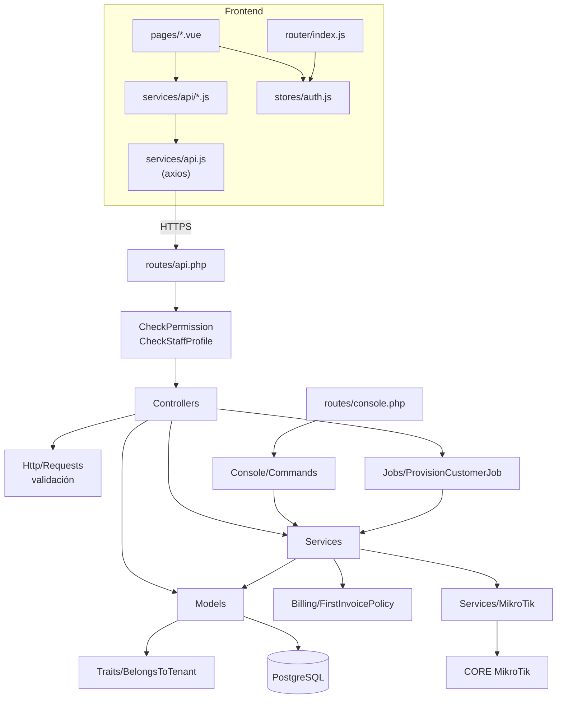
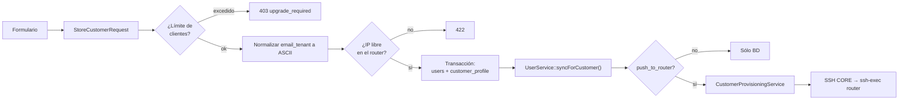
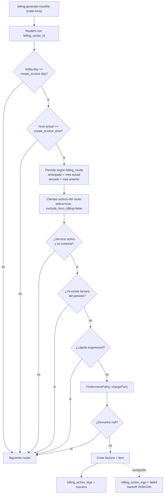
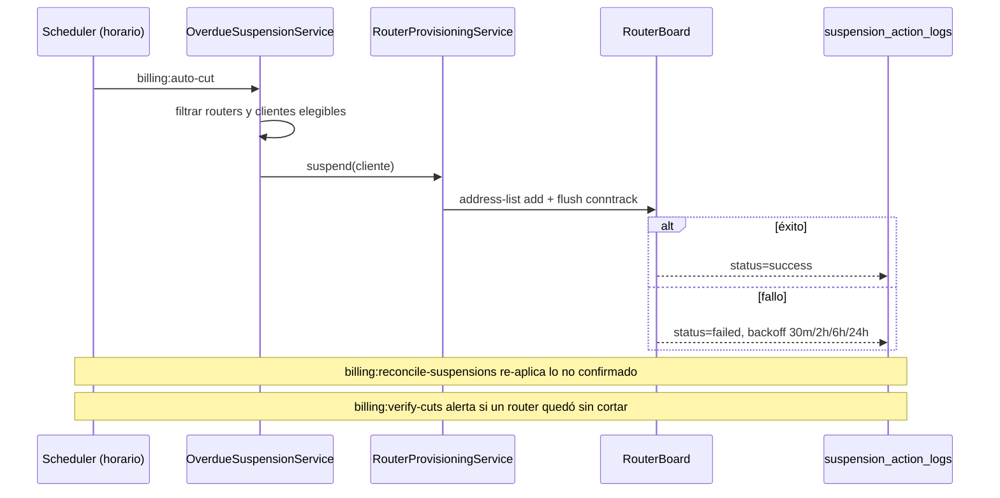
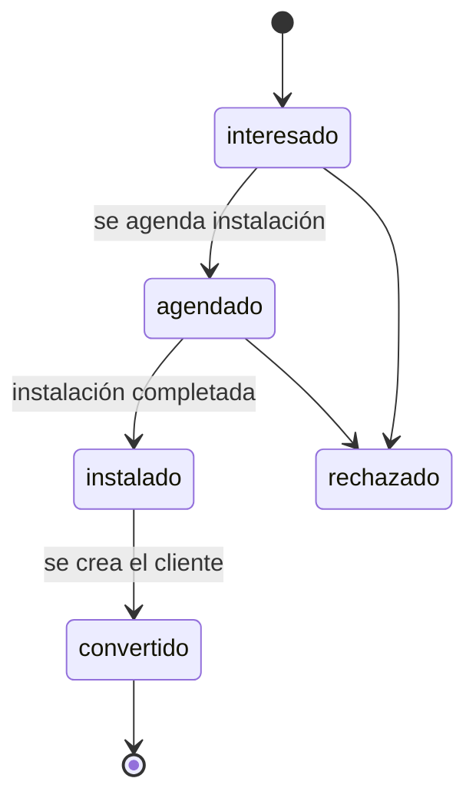
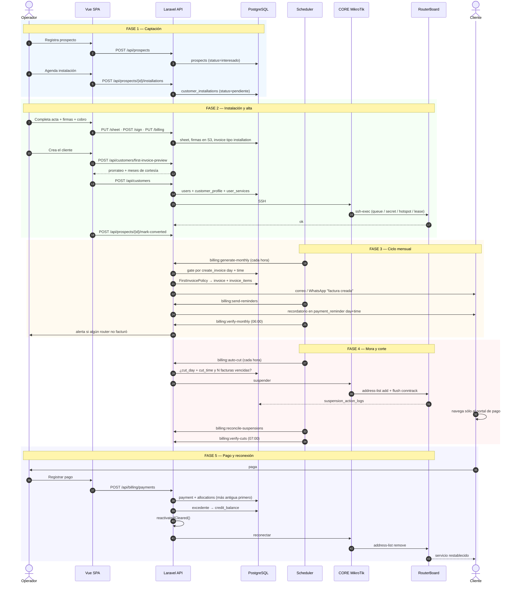
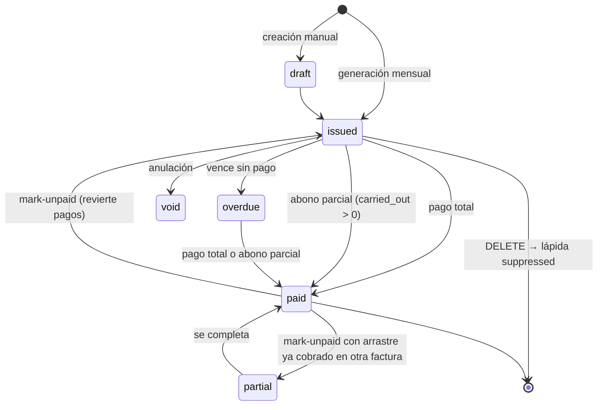

# BITÁCORA TÉCNICA — ISPWatch

> Inventario estructural del repositorio, responsabilidad de cada directorio y archivo
> relevante, módulos de negocio y trazabilidad entre componentes.
> Documento pensado para mantenimiento a largo plazo: **si cambias código, actualiza aquí.**

**Última actualización:** 2026-07-31 (arrastre de abonos parciales + catálogo de tipos de factura) · Rama: `feat/wireguard-dual-transport`

---

## Índice

1. [Resumen ejecutivo](#1-resumen-ejecutivo)
2. [Estructura de carpetas](#2-estructura-de-carpetas)
3. [Backend — archivo por archivo](#3-backend--archivo-por-archivo)
4. [Frontend — archivo por archivo](#4-frontend--archivo-por-archivo)
5. [Relación entre componentes](#5-relación-entre-componentes)
6. [Módulos de negocio](#6-módulos-de-negocio)
7. [Reglas de negocio no evidentes](#7-reglas-de-negocio-no-evidentes)
8. [Flujo completo del sistema](#8-flujo-completo-del-sistema)
9. [Trazabilidad módulo → código → datos](#9-trazabilidad-módulo--código--datos)
10. [Registro de decisiones técnicas](#10-registro-de-decisiones-técnicas)

---

## 1. Resumen ejecutivo

### Propósito

ISPWatch es la plataforma operativa de un **Proveedor de Servicios de Internet**.
Unifica en un solo sistema la gestión comercial (prospectos, clientes, instalaciones),
la gestión financiera (facturación, pagos, gastos) y **el control efectivo de la red**
(aprovisionamiento, suspensión y reconexión sobre routers MikroTik RouterOS).

### Problema que resuelve

Un ISP pequeño o mediano suele operar con tres sistemas desconectados: una hoja de
cálculo para clientes, un software contable para facturar y acceso manual (Winbox) a cada
RouterBoard para dar de alta o cortar servicios. Esa desconexión produce tres fugas
concretas:

1. **Fuga de ingreso:** clientes morosos que siguen navegando porque nadie los cortó a mano.
2. **Fuga de tiempo:** cada alta exige entrar al router y crear cola/secret manualmente.
3. **Fuga de información:** no hay trazabilidad de quién cortó, cuándo, ni por qué.

ISPWatch cierra el ciclo: **la factura vencida dispara el corte real en el equipo, y el
pago registrado dispara la reconexión real**, con bitácora y reintentos automáticos.

### Funcionalidades principales

| Área | Capacidades |
|---|---|
| **Clientes** | Alta individual o masiva por Excel, mapa georreferenciado, documentos en S3, contrato firmado, exclusión de facturación por cliente |
| **Comercial** | Prospectos, agenda de instalaciones, acta de instalación firmada, cobro de instalación |
| **Facturación** | Generación mensual por router, prorrateo y meses de cortesía, numeración segura por tenant, tipos de factura administrables, PDF, recordatorios email/WhatsApp, pagos con asignación automática, saldo a favor y arrastre de abonos parciales |
| **Cobranza** | Corte automático por mora con día y hora configurables, reconexión automática al pagar, reconciliación DB ⇄ router |
| **Red** | Aprovisionamiento por método de control (Queue/PCQ/HotSpot/PPPoE/DHCP), reglas de bloqueo, scripts VPN L2TP/IPSec, lectura de interfaces, historial de tráfico WAN |
| **Planta externa** | Árbol FTTH (OLT → splitter → NAP → mufa), puertos calculados, topología visual |
| **Soporte** | Tickets con categorías, mensajes internos, adjuntos, cargos facturables |
| **Administración** | Multi-tenant, roles con permisos granulares, inventario, gastos, plantillas de documentos, centro de ayuda |

### Tipos de usuario

| Rol | `role_code` | Alcance típico |
|---|---|---|
| **Administrador** | `admin` | Acceso total. `role_id == 1` obtiene bypass en el backend |
| **Staff** | `staff` | Clientes, planes, sectoriales, inventario, soporte, facturación (lectura y registro de pagos) |
| **Técnico** | `technician` | Clientes, instalaciones, activar/desactivar, tráfico |
| **Contabilidad** | `accounting` | Facturas, pagos, gastos, transferencias |
| **Cliente** | `client` | Sin permisos en el panel; es el sujeto de la facturación |

Los roles son **editables por tenant**: `role.permissions` es un array JSON, y se pueden
crear roles personalizados desde `/roles`.

---

## 2. Estructura de carpetas

```
ISPWatch/
├── .do/                     # Especificación de despliegue DigitalOcean App Platform
│   ├── deploy.template.yaml #   web + worker + scheduler. SIN secretos (type: SECRET)
│   └── nginx.conf
├── .github/workflows/       # CI: suite en SQLite y en PostgreSQL+PostGIS
├── app/                     # Código de aplicación (PSR-4: App\)
│   ├── Billing/             #   Políticas de facturación puras (sin IO)
│   ├── Console/Commands/    #   19 comandos Artisan
│   ├── Constants/           #   Catálogo de permisos
│   ├── Exports/             #   Plantillas Excel de descarga
│   ├── Helpers/             #   Traducción de errores de BD
│   ├── Http/
│   │   ├── Controllers/     #   37 controladores de API
│   │   ├── Middleware/      #   Permisos, perfil staff, cabeceras de seguridad
│   │   └── Requests/        #   6 FormRequest con validación
│   ├── Imports/             #   Importadores Excel
│   ├── Jobs/                #   ProvisionCustomerJob
│   ├── Mail/                #   4 mailables
│   ├── Models/              #   43 modelos Eloquent
│   ├── Notifications/       #   Verificación de correo
│   ├── Policies/            #   CustomerInstallationPolicy
│   ├── Providers/           #   AppServiceProvider, SearchMacros, Volt
│   ├── Services/            #   Lógica de negocio
│   │   ├── MikroTik/        #     Managers por recurso RouterOS
│   │   │   └── Concerns/    #     Traits compartidos (SSH, escapado, verificación)
│   │   └── Templates/       #     Render y saneado de plantillas
│   ├── Traits/              #   BelongsToTenant, FixesSequences, InputSanitizer
│   └── View/Components/
├── backup/                  # Respaldos manuales
├── bootstrap/               # app.php: rutas, middleware, manejo de excepciones
├── config/                  # 14 archivos de configuración
├── database/
│   ├── factories/           #   PlanFactory, TenantFactory, UserFactory
│   ├── migrations/          #   134 migraciones
│   └── seeders/             #   13 seeders
├── docs/                    # ESTA DOCUMENTACIÓN
├── public/                  # Punto de entrada + assets compilados
├── resources/
│   ├── css/ · sass/
│   ├── js/                  #   SPA Vue 3
│   └── views/               #   Blade: shell de la SPA, PDFs, correos, portal de pago
├── routes/                  # api.php · web.php · console.php
├── scripts/                 # gen_favicon.py · supabase_lockdown_rls.sql
├── storage/                 # Logs, cache, claves SSH (keys/ está en .gitignore)
└── tests/                   # 27 archivos de prueba (245 tests, 0 fallos)
```

### Responsabilidad de cada directorio

| Directorio | Responsabilidad | Cuándo tocarlo |
|---|---|---|
| `app/Billing` | **Política de facturación pura**, sin acceso a base de datos ni IO. Hoy sólo `FirstInvoicePolicy` | Al cambiar reglas de prorrateo o cortesía |
| `app/Console/Commands` | Tareas ejecutables por cron u operador | Al añadir automatización |
| `app/Http/Controllers` | Traducir HTTP ⇄ dominio. **No debe contener lógica de negocio** | Al añadir endpoints |
| `app/Http/Requests` | Validación declarativa reutilizable | Al cambiar el contrato de entrada |
| `app/Models` | Esquema, relaciones, casts, constantes de dominio | Al cambiar el esquema |
| `app/Services` | Lógica de negocio y orquestación | La mayoría de los cambios funcionales |
| `app/Services/MikroTik` | Todo lo que habla RouterOS. **Un manager por recurso** | Al tocar la integración de red |
| `app/Traits` | Comportamiento transversal (multi-tenancy, secuencias) | Rara vez |
| `database/migrations` | Evolución del esquema. **Siempre `migrate:both`** | Al cambiar el esquema |
| `resources/js/pages` | Una página = una ruta del SPA | UI |
| `resources/js/services/api` | Cliente HTTP por dominio | Al añadir endpoints |
| `resources/views/documents` | Plantillas Blade de PDF y sus *shells* | Al cambiar documentos legales |
| `tests` | PHPUnit sobre **SQLite en memoria**; el CI repite la suite en PostgreSQL | Siempre que cambies lógica |

---

## 3. Backend — archivo por archivo

### 3.1 `app/Billing`

| Archivo | Descripción |
|---|---|
| `FirstInvoicePolicy.php` | **Fuente única** de la política de primera factura. Resuelve la cascada cliente → plan → router para dos ejes independientes (`mode` y `freeMonths`) y calcula el cargo del periodo. Usada por la generación mensual, la auditoría y la vista previa del formulario — **no hay una segunda copia de la fórmula** |

### 3.2 `app/Console/Commands`

| Archivo | Comando | Descripción |
|---|---|---|
| `GenerateMonthlyInvoices.php` | `billing:generate-monthly {period?}` | Dispara `BillingService::generateMonthlyInvoices()` |
| `RetryFailedInvoices.php` | `billing:retry-failed` | Reintenta filas `failed` con `next_retry_at` vencido |
| `VerifyMonthlyBilling.php` | `billing:verify-monthly` | Auditoría de no-show; alerta por log y correo |
| `AutoCutByRouter.php` | `billing:auto-cut` | Corte automático por router |
| `ReconcileSuspensions.php` | `billing:reconcile-suspensions` | Reconcilia DB ⇄ RouterBoard |
| `VerifyAutomaticCuts.php` | `billing:verify-cuts` | Auditoría de no-show de cortes |
| `SendPaymentReminders.php` | `billing:send-reminders` | Recordatorios de pago |
| `ProcessOverdueInvoices.php` | `billing:process-overdue` | Procesamiento manual de morosos |
| `SimulateBillingFlow.php` | `billing:simulate` | Simulador del ciclo completo |
| `VoidCourtesyInvoices.php` | `billing:void-courtesy {period?}` | Anula facturas de planes de cortesía |
| `GenerateTenantInvoicesOneOff.php` | `billing:generate-tenant {tenant} {period} {--dry-run}` | Facturación puntual |
| `CollectTrafficHistory.php` | `traffic:collect` | Muestrea contadores WAN |
| `PruneTrafficHistory.php` | `traffic:prune {--days=30}` | Poda muestras finas |
| `VerifyVpnTunnels.php` | `vpn:verify-tunnels {--stale=15} {--no-mail}` | Salud del túnel por router: `last-handshake` en WireGuard, `/ppp active` en L2TP. Solo lee |
| `MigrateBothSchemas.php` | `migrate:both` | **Aplica migraciones a `ispwatch_dev` y `public`** |
| `SyncDevFromPublic.php` | `db:sync-dev` | Copia producción → desarrollo |
| `FixSequences.php` | `db:fix-sequences` | Repara secuencias PostgreSQL |
| `MigrateDocumentsToS3.php` | `documents:migrate-to-s3 {--dry-run}` | Migra documentos locales a S3 |
| `DiagnoseRouterWan.php` | `router:diagnose-wan` | Diagnóstico de interfaz WAN |
| `SyncRolePermissions.php` | `permissions:sync` | Reconcilia los roles canónicos con el catálogo de permisos (aditivo) |

### 3.3 `app/Http/Controllers`

| Archivo | Líneas | Responsabilidad |
|---|---:|---|
| `CustomerProfileController.php` | 1385 | CRUD de clientes, estadísticas, mapa, IPs usadas, aprovisionamiento (individual, masivo síncrono y asíncrono), suspender/activar, vista previa de primera factura |
| `CustomerInstallationController.php` | 757 | Instalaciones: agenda, acta, fotos, firmas, cobro |
| `RouterController.php` | 650 | CRUD de routers, VPN, interfaces, reglas de bloqueo, pruebas de conexión, tráfico |
| `SupportTicketController.php` | 591 | Tickets, mensajes, estados, cargos, estadísticas |
| `BillingController.php` | 466 | Facturas, pagos, saldo, configs, disparadores del ciclo |
| `PlanController.php` | 327 | CRUD de planes + sincronización de perfiles al router |
| `RegistrationController.php` | 321 | Alta de tenant + administrador con verificación |
| `ImportController.php` | 301 | Plantillas y procesamiento de importaciones masivas |
| `DocumentTemplateController.php` | 281 | Plantillas de factura/contrato/acta con saneado |
| `UserController.php` | 277 | Personal (staff) |
| `AuthController.php` | 248 | Login con rate limiting y detección de inyección; `/auth/me` |
| `TenantController.php` | 242 | Datos de empresa, logo, config de mapas |
| `DashboardController.php` | 235 | Estadísticas del panel |
| `SectorialController.php` | 223 | Elementos de red y topología |
| `PaymentReminderController.php` | 218 | Recordatorios individuales y masivos |
| `CustomerDocumentController.php` | 189 | Documentos en S3, contrato |
| `RoleController.php` | 180 | Roles y catálogo de permisos |
| `ProspectController.php` | 173 | Prospectos y conversión |
| `BillingActionLogController.php` | 170 | Failover de facturación |
| `SuspensionActionLogController.php` | 145 | Failover de cortes + reconciliación |
| `HelpCenterController.php` | 125 | Centro de ayuda |
| `ExpenseController.php` / `ExpenseCategoryController.php` | — | Gastos |
| `InventoryDevice/Stock/Provider/BranchController.php` | — | Inventario |
| `SectorialPhoto/Note/HistoryController.php` | — | Anexos de elementos de red |
| `RouterOutageController.php` | — | Falla masiva |
| `CatalogController.php` | — | Catálogos globales |
| `PaymentMethodController.php` | — | Formas de pago |
| `InvoiceTypeController.php` | — | Catálogo de tipos de factura (sistema + propios del tenant) |
| `SettingsController.php` | — | Limpieza de cache |
| `VerificationController.php` | — | Verificación de correo |

### 3.4 `app/Services`

| Archivo | Líneas | Responsabilidad |
|---|---:|---|
| `BillingService.php` | ~1560 | Núcleo financiero: generación, numeración, primera factura, pagos, asignación, saldo a favor, **arrastre de abonos parciales**, anulación con lápida, reconexión al pagar, notificaciones |
| `VpnService.php` | 945 | Generación y verificación de scripts L2TP/IPSec |
| `RouterApiService.php` | 912 | Protocolo API nativo MikroTik |
| `MikroTikSshService.php` | 603 | SSH directo o vía CORE |
| `OverdueSuspensionService.php` | 412 | Corte automático: elegibilidad, gate de día/hora, ejecución |
| `CustomerProvisioningService.php` | 338 | Aprovisionar cliente según método de control. **Fuente única** para el job, el masivo y el alta |
| `InstallationBillingService.php` | 253 | Factura de instalación |
| `RouterProvisioningService.php` | 218 | Suspender/reactivar en el router |
| `TrafficHistoryService.php` | 164 | Muestreo y agregación de tráfico |
| `WhatsAppService.php` | 162 | WhatsApp Cloud API (Graph v18) |
| `PaymentReminderService.php` | 157 | Recordatorios |
| `RouterPolicyInstallerService.php` | 151 | Instalación de reglas de bloqueo |
| `Templates/TemplateRenderer.php` | — | Render de plantillas |
| `Templates/TemplateSanitizer.php` | — | Saneado con HTMLPurifier |
| `Templates/PlaceholderResolver.php` | — | Resolución de placeholders |

### 3.5 `app/Services/MikroTik`

| Archivo | Líneas | Recurso RouterOS |
|---|---:|---|
| `InterfaceReader.php` | 912 | Lectura robusta de interfaces WAN (multi-variante v6/v7, envelope `:do/:put`, centinelas, puerto SSH del cliente propagado hasta el `ssh-exec`) |
| `FirewallRulesManager.php` | 753 | `/ip firewall filter` + address-list de suspendidos |
| `PppProfileManager.php` | 723 | `/ppp profile` |
| `MikroTikApiProtocol.php` | 602 | Protocolo binario del API |
| `PppSecretManager.php` | 592 | `/ppp secret` |
| `MikroTikConnectionManager.php` | 525 | Gestión de conexiones |
| `SuspensionManager.php` | 510 | Alta/baja en la lista de morosos |
| `SshTunnelManager.php` | 446 | Túnel SSH |
| `HotspotManager.php` | 387 | `/ip hotspot user` y `user profile` |
| `QueueManager.php` | 381 | `/queue simple` |
| `PcqManager.php` | 320 | `/queue type` + address-list |
| `DhcpLeaseManager.php` | 234 | `/ip dhcp-server lease` |
| `IpMacBindingManager.php` | 233 | ARP estático + drop por par IP/MAC |
| `SshTunnel.php` | 207 | Conexión SSH individual |
| `RouterEndpointResolver.php` | 157 | Resuelve la IP real desde `/ppp active` del CORE y la reescribe en BD |
| `Concerns/BuildsCoreSshExec.php` | — | Construye la línea `/system ssh-exec` (puerto + escapado) |
| `Concerns/DetectsSshExecFailures.php` | — | Distingue fallo real de salida vacía |
| `Concerns/NormalizesRouterComment.php` | — | Normaliza comentarios de objetos |
| `Concerns/VerifiesRouterOsObjectState.php` | — | Verifica que el objeto quedó como se pidió |

### 3.6 Otros directorios de `app`

| Archivo | Descripción |
|---|---|
| `Constants/Permissions.php` | Catálogo de **35 permisos** agrupados en 8 categorías + mapa rol → permisos. Reconciliado con la base por `permissions:sync` |
| `Helpers/ErrorMessages.php` | Traduce `QueryException` a mensajes en español |
| `Http/Middleware/CheckPermission.php` | Verifica permiso, con **semántica OR** (`permission:a,b`). Carga el rol con `withoutGlobalScope('tenant')`. Bypass `role_id == 1`. Consulta los permisos **efectivos** (rol ∪ usuario) |
| `Http/Middleware/CheckStaffProfile.php` | Pese al nombre, **no** exige fila en `staff_profile`: comprueba `role.code ∈ {admin, staff}` o `role_id == 1` |
| `Http/Middleware/SecurityHeaders.php` | CSP, HSTS, X-Frame-Options, COOP, Permissions-Policy |
| `Traits/BelongsToTenant.php` | Global scope + auto-relleno de `tenant_id` desde el usuario autenticado |
| `Traits/FixesSequences.php` | Repara secuencias PostgreSQL desincronizadas al crear |
| `Traits/InputSanitizer.php` | Saneado de entrada |
| `Providers/SearchMacrosServiceProvider.php` | Macros `whereLike`/`orWhereLike`: eligen `ilike` o `like` según el driver y escapan comodines |
| `Jobs/ProvisionCustomerJob.php` | Un job por cliente en el aprovisionamiento masivo asíncrono |
| `Imports/UnifiedImport.php` + `Sheets/*` | Importación de clientes, planes, routers y sectoriales en un solo archivo |
| `Imports/CustomersUpdateImport.php` | Actualización masiva de clientes |
| `Imports/InventoryImport.php` | Carga masiva de equipos |
| `Exports/*` | Plantillas descargables y exportación de errores |
| `Mail/InvoiceCreatedMail.php`, `PaymentReminderMail.php`, `SendTicketNotification.php`, `VerificationCodeMail.php` | Correos transaccionales |
| `Policies/CustomerInstallationPolicy.php` | Autorización de instalaciones |

### 3.7 Configuración y rutas

| Archivo | Descripción |
|---|---|
| `bootstrap/app.php` | Registro de rutas, alias de middleware, `trustProxies('*')`, manejo de `QueryException` → JSON 422 |
| `routes/api.php` | Toda la API REST. **Cada endpoint lleva su permiso** desde 2026-07-30; los de lectura usan semántica OR |
| `routes/web.php` | Redirección raíz, portal de pago, ruta CSRF de Sanctum, **catch-all de la SPA** |
| `routes/console.php` | Planificador: 9 tareas programadas |
| ~~`routes/auth.php`~~ | **Eliminado** (2026-07-30): no lo cargaba `bootstrap/app.php` y referenciaba un controlador y unas vistas Volt inexistentes |
| `config/database.php` | Conexiones. **Nota de seguridad:** `sqlite` no define `url` a propósito, para que `DB_URL` no pueda redirigir los tests a la base real |
| `config/cors.php` | Orígenes desde `CORS_ALLOWED_ORIGINS`; `supports_credentials = true` |
| `config/sanctum.php` | Dominios stateful, guard `web`, sin expiración de token |
| `config/document_placeholders.php` | Placeholders disponibles en las plantillas |
| `config/filesystems.php` | Disco `s3` para documentos |

---

## 4. Frontend — archivo por archivo

### 4.1 Núcleo

| Archivo | Descripción |
|---|---|
| `router/index.js` | ~40 rutas, todas *lazy-loaded*. Guarda `beforeEach`: autenticación, `requiresStaff`, `meta.permission`, título de página |
| `stores/auth.js` | Pinia: `user`, `isAuthenticated`, `permissions`, `roleCode`, `isStaffOrAdmin`, `hasPermission()` (espejo exacto de `CheckPermission`, **con** bypass de superadmin), `refreshUserPermissions()` |
| `services/api.js` | Instancia axios y manejador global de `401`. El interceptor que inyectaba `tenant`/`tenant_id` se eliminó: el backend siempre lo ignoró |
| ~~`services/auth.js`~~ | **Eliminado**: duplicaba `hasPermission` con lógica distinta a la del store, que es la que usa el guard |
| `services/billing.js` | Cliente de facturación |
| `services/api/*.js` | 19 módulos por dominio: `auth`, `customers`, `routers`, `plans`, `staff`, `support`, `inventory`, `inventory-stock/-provider/-branch`, `sectorials`, `tenant`, `roles`, `prospects`, `catalogs`, `expense`, `expense-category`, `document-templates`, `help-center` |

### 4.2 Composables

| Archivo | Descripción |
|---|---|
| `useNotification.js` | Notificaciones toast |
| `usePermissions.js` | Verificación de permisos en componentes |
| `useProvisionPolling.js` | Sondeo del progreso de aprovisionamiento masivo |
| `useTableControls.js` | Búsqueda, orden y paginación de tablas |

### 4.3 Páginas (44 + 8 de facturación)

| Grupo | Páginas |
|---|---|
| Acceso | `Login`, `Register`, `ResendVerification` |
| Panel | `Dashboard` |
| Clientes | `Customers`, `CustomerAdd`, `CustomerEdit`, `CustomerStatistics`, `CustomerMap` |
| Red | `Routers`, `RouterAdd`, `RouterEdit`, `Sectorial`, `SectorialAdd`, `SectorialEdit`, `SectorialDetail`, `FiberTopology` |
| Planes | `PlanList`, `PlanCreate`, `PlanEdit` |
| Facturación | `Billing/BillingDashboard`, `InvoicesList`, `InvoiceDetail`, `InvoiceEdit`, `PaymentsList`, `RegisterPayment`, `PaymentMethods`, `InvoiceTypes`, `AdditionalCharges` |
| Gastos | `Expenses`, `ExpenseCategories` |
| Soporte | `Support`, `SupportCreate`, `SupportDetail`, `SupportEdit`, `SupportStatistics`, `Installations`, `InstallationDetail` |
| Inventario | `Inventory`, `InventoryForm`, `StockList`, `ProviderList`, `BranchList` |
| Administración | `Staff`, `StaffNew`, `EditStaff`, `RolesManagement`, `Settings`, `MassActions` |
| Ayuda | `Manual`, `NotFound` |

### 4.4 Componentes

| Componente | Descripción |
|---|---|
| `Sidebar.vue` | Navegación por grupos: Usuarios, Soporte, Gestión, Inventarios, Finanzas. Filtra por permisos **y por `role_code`** |
| `BillingPanel.vue` | Panel de facturación del cliente |
| `IpRangeAnalyzer.vue` | Análisis de rangos IP |
| `DatePicker.vue` / `DayPicker.vue` | Selección de fecha / día del mes |
| `SearchableSelect.vue` | Selector con búsqueda |
| `StatCard.vue`, `NotificationToast.vue`, `TimezoneClock.vue`, `WhatsAppButton.vue`, `SubmenuItem.vue`, `SettingsSection.vue` | Piezas de UI |
| `customer/CustomerBilling · CustomerDocuments · CustomerInstallations · CustomerTickets` | Pestañas de la ficha de cliente |
| `import/ImportSection · CustomersUpdateSection · InventoryImportSection · ErrorsModal · FieldDocsModal` | Flujos de carga masiva |
| `settings/DocumentTemplatesSection.vue` | Editor de plantillas |
| `ui/ConfirmModal · LoadingSkeleton · PageHeader · Pagination · SearchBar · StatusBadge` | Primitivas reutilizables |

### 4.5 Vistas Blade

| Archivo | Descripción |
|---|---|
| `app.blade.php` | Shell de la SPA |
| `payment-portal.blade.php` | Portal de pago para clientes suspendidos (`/portal-pago`) |
| `billing/invoice_pdf.blade.php` | PDF de factura |
| `documents/contract_pdf.blade.php`, `installation_sheet_pdf.blade.php` | PDF de contrato y acta |
| `documents/shells/*.blade.php` | *Shells* donde se inserta el HTML editable de cada plantilla |
| `emails/*` | Factura creada, recordatorio, notificación de ticket, verificación |

---

## 5. Relación entre componentes



### Dependencias entre servicios

| Servicio | Depende de |
|---|---|
| `BillingService` | `WhatsAppService` (constructor), `FirstInvoicePolicy`, modelos de facturación |
| `OverdueSuspensionService` | `BillingService`, `RouterProvisioningService` |
| `CustomerProvisioningService` | `RouterEndpointResolver` + managers MikroTik |
| `RouterProvisioningService` | `SuspensionManager`, `FirewallRulesManager` |
| Todos los managers MikroTik | `BuildsCoreSshExec`, `DetectsSshExecFailures` |

---

## 6. Módulos de negocio

### 6.1 Módulo Clientes

**Objetivo.** Mantener el registro maestro del abonado y su configuración de servicio,
y reflejarla en el equipo de red.

**Funcionalidades.** Alta individual y masiva; edición con detección automática de fibra;
mapa georreferenciado; documentos y contrato; exclusión de facturación; suspensión y
activación manual; aprovisionamiento individual y masivo.

**Dependencias.** `service_plan` (plan), `router` (equipo), `sectorial` (elemento de red /
OLT-NAP), `user_services` (contrato de facturación), `CustomerProvisioningService`.

**Flujo interno.**



---

### 6.2 Módulo Facturación

**Objetivo.** Emitir la factura correcta a cada cliente en el momento correcto, cobrarla
y dejar trazabilidad de todo.

**Funcionalidades.** Generación mensual dirigida por router; política de primera factura;
numeración segura por tenant; PDF; recordatorios; registro de pagos con asignación
automática y saldo a favor; anulación con lápida; failover y auditoría.

**Dependencias.** `billing` (config del router), `user_services` (qué facturar),
`FirstInvoicePolicy`, `WhatsAppService`, Mail.

**Flujo interno de la generación mensual.**



**Regla clave — el día se recorta al mes.** Un `create_invoice` configurado en día 31 se
convierte en 30 en abril y 28 en febrero (`Billing::clampDayToMonth`), para que la
configuración "último día del mes" siga disparando.

---

### 6.3 Módulo Cobranza y corte

**Objetivo.** Convertir la mora en una acción real sobre el equipo, y el pago en una
reconexión real.

**Condiciones de corte** (todas deben cumplirse):

1. El router tiene `cut_type` con nombre **`Corte Automático`**.
2. El router tiene configuración de facturación (`billing_router_id`).
3. `hoy.día >= billing.cut_day` (recortado al mes).
4. `hora actual >= billing.cut_time`.
5. El cliente acumula al menos `billing.overdue_invoices` facturas vencidas
   (`balance_due > 0` y `due_date < now`).

Los routers marcados **`Corte Manual`** no suspenden: sólo encolan y reportan los pendientes.



**Reconexión automática.** Al registrar un pago, `BillingService::reactivateIfCleared()`
comprueba si el cliente quedó al día y, **sólo si el corte fue de facturación**, lo reactiva
en el router. Un corte manual no se revierte solo.

> **Detalle no evidente:** `suspend`/`unsuspend` **no tocan** `customer_profile.status`.
> Un cliente cortado automáticamente conserva `status = true`. El estado de corte vive en
> el router y en `suspension_action_logs`.

---

### 6.4 Módulo Red / MikroTik

**Objetivo.** Ejecutar sobre el equipo lo que el sistema decide.

**Funcionalidades.** Aprovisionamiento por método de control; reglas de bloqueo; scripts
VPN; lectura de interfaces; historial de tráfico; falla masiva.

**Flujo interno.** Ver [`ARQUITECTURA.md §8`](ARQUITECTURA.md#8-integración-mikrotik-el-núcleo-diferencial).

**Puntos de fallo documentados en el propio código:**

| Síntoma | Causa real |
|---|---|
| `<connection failed> <ip>:22` | `router.ip` obsoleto por reasignación del pool L2TP **o** SSH en puerto distinto de 22 |
| Aprovisionamiento "exitoso" pero sin efecto | `ssh-exec` con `exit-code ≠ 0` se reportaba como éxito (corregido) |
| Perfil HotSpot no se crea | `/ip hotspot user profile` **no acepta `comment`** y el comando entero falla |
| Cliente en la lista de morosos sigue navegando | Faltaba `place-before`, dependencia de `out-interface=wan`, sin flush de conntrack y sin regla de acceso al portal (los cuatro corregidos) |
| "Actualiza pero no carga a la RB" | Timeout del gateway en el push PPPoE síncrono, no un error de datos |

---

### 6.5 Módulo Comercial (prospectos e instalaciones)

**Objetivo.** Acompañar al futuro cliente desde el interés hasta la instalación cobrada
y firmada.

**Flujo.**



La instalación registra costo, cargos adicionales (con ítems en JSON), descuento con motivo,
forma de pago y monto recibido; genera factura de tipo `installation`; guarda el acta en
JSON y las firmas del cliente y el técnico como imágenes en S3.

---

### 6.6 Módulo Soporte

**Objetivo.** Registrar y resolver incidencias, y cobrar lo que sea cobrable.

Ticket con categoría, prioridad, estado, cliente, staff asignado y **elemento de red
afectado** (`sectorial_id`). Los mensajes admiten la marca `is_internal`. Un ticket puede
generar facturas de tipo `service_charge`.

> **Detalle de permisos poco intuitivo:** **Instalaciones no tiene permiso propio**: todo el
> grupo Soporte (Tickets, Nuevo Ticket, Instalaciones, Estadísticas) se muestra con
> `view_support`. Quien pueda ver tickets puede ver instalaciones, y viceversa.
> Las operaciones de conversación y cargo exigen además fila en `staff_profile`.

---

### 6.7 Módulos de apoyo

| Módulo | Objetivo | Dependencias |
|---|---|---|
| **Inventario** | Equipos por serial/MAC, con stock, proveedor y sucursal | `BelongsToTenant`; importación masiva |
| **Gastos** | Registro de gastos operativos por categoría y beneficiario | Sin borrado físico: se anulan |
| **Plantillas de documentos** | HTML editable por tenant para factura, contrato y acta | `HTMLPurifier`, `PlaceholderResolver`, permiso propio |
| **Centro de ayuda** | Manual embebido por categorías y artículos | — |
| **Acciones masivas** | Importaciones, aprovisionamiento masivo, paneles de failover | `execute_mass_actions` |

---

## 7. Reglas de negocio no evidentes

Recopilación de decisiones que **no se deducen leyendo sólo el esquema** y que han causado
incidentes reales.

| # | Regla | Dónde vive |
|---|---|---|
| 1 | La facturación **se dirige por router**, no por tenant ni por cliente | `BillingService::generateMonthlyInvoices` |
| 2 | Se factura desde `user_services`, **no** desde `customer_profile.service_id` | `BillingService` |
| 3 | `is_courtesy` en el plan ⇒ el servicio queda en `gratis` ⇒ nunca se factura | `UserService::statusForPlan` |
| 4 | Una factura borrada **nunca se regenera** (lápida `suppressed`) | `BillingService::suppressRegeneration` |
| 5 | La política de primera factura tiene **dos ejes independientes** con cascada propia cliente → plan → router | `FirstInvoicePolicy::resolve` |
| 6 | El prorrateo **no cobra el día de instalación**: instalado el 20 de un mes de 30 ⇒ 10 días | `installationMonthCharge` |
| 7 | Los meses de cortesía son **posteriores** al de instalación y se emiten en **cero**, no se omiten | `chargeFor` |
| 8 | El método de control del router es **excluyente**; `ip_bindings` y `amarre` son aditivos | `resolveControlMode` |
| 9 | `customer_profile.status` es **booleano** | Comentario explícito en `BillingService` |
| 10 | `LIKE` es sensible a mayúsculas en PostgreSQL; hay que usar `ilike` por driver | Búsqueda de facturación |
| 11 | Los tests corren en **SQLite**: las migraciones deben evitar SQL exclusivo de PostgreSQL o protegerlo por driver | `tests/` |
| 12 | La IP es única **por router**, no por tenant | `CustomerProfileController` |
| 13 | El usuario PPPoE es único por router; sin ello RouterOS **sobrescribe en silencio** el secret de otro cliente | Índice parcial + `StoreCustomerRequest` |
| 14 | El correo de login se normaliza a ASCII; los nombres conservan tildes y ñ | `User::sanitizeEmail` |
| 15 | Un permiso nuevo **no llega solo** a los roles existentes: hay que ejecutar `permissions:sync` (o una migración de backfill) | `SyncRolePermissions` |
| 16 | El scope de tenant sobre `Role` puede anular el rol propio y producir un falso `403` | `CheckPermission`, `AuthController@login` |
| 17 | Los permisos efectivos son la **unión** de `role.permissions` y `users.permissions`; la unión sólo concede, nunca revoca | `User::effectivePermissions()` |
| 18 | `email_verified_at` **no está en `$fillable`**: `User::create()` lo descarta en silencio y el usuario nace sin verificar (login 403) | `User::$fillable` |
| 19 | En el grupo `api`, `SubstituteBindings` corre **antes** que el middleware de la ruta: un id inexistente da 404 antes de comprobar el permiso | `RouterController::destroy(Router $router)` |
| 20 | El modo de corte se compara con `CutType::matches()`, que normaliza tildes y mayúsculas: `'Corte Automatico'` sin tilde dejaba de cortar sin error | `CutType`, `OverdueSuspensionService` |
| 21 | Un **abono parcial cierra la factura** (`paid`, saldo 0) y el faltante viaja a la siguiente en `invoice_carryovers`. Efecto buscado: el cliente sale de mora y **se reconecta** aunque no haya pagado todo | `BillingService::carryOverShortfall` |
| 22 | Sólo la generación **mensual** absorbe arrastres; los cargos adicionales, las facturas manuales y los meses de cortesía **no** | `BillingService::applyPendingCarryoversTo` |
| 23 | Un arrastre ya `applied` **no se revierte** al anular el pago original: la deuda se queda en la factura que la cobró para no duplicarla | `revertPendingCarryoversOfPayment`, `markInvoiceUnpaid` |
| 24 | `invoices.invoice_type` guarda el **slug en texto**, no una FK a `invoice_types`: los tipos del sistema son globales (`tenant_id` NULL) y hay facturas anteriores al catálogo | `InvoiceType`, `Invoice::type()` |

---

## 8. Flujo completo del sistema

Recorrido de extremo a extremo: **desde que un prospecto llama hasta que su mora le corta
el servicio y su pago se lo devuelve.**



### Ciclo de vida de una factura



> **`partial` ya casi no se ve.** Desde el arrastre de saldo, un abono que no cubre la
> factura la deja en `paid` con `carried_out > 0`. El estado `partial` sólo aparece al
> revertir un pago cuyo arrastre **ya** lo cobró otra factura: entonces la original
> vuelve a deber sólo la parte que el abono había cubierto.

---

## 9. Trazabilidad módulo → código → datos

| Módulo | Página SPA | Endpoint | Controlador | Servicio | Tablas |
|---|---|---|---|---|---|
| Clientes | `Customers`, `CustomerAdd/Edit` | `/api/customers*` | `CustomerProfileController` | `CustomerProvisioningService` | `users`, `customer_profile`, `user_services` |
| Mapa | `CustomerMap` | `/api/customers/map`, `/api/tenant/maps-config` | `CustomerProfileController`, `TenantController` | — | `customer_profile`, `tenant` |
| Prospectos | `Installations` | `/api/prospects*` | `ProspectController` | — | `prospects` |
| Instalaciones | `InstallationDetail` | `/api/installations*` | `CustomerInstallationController` | `InstallationBillingService` | `customer_installations`, `customer_documents`, `invoices` |
| Facturación | `Billing/*` | `/api/billing/*` | `BillingController` | `BillingService`, `FirstInvoicePolicy` | `billing`, `invoices`, `invoice_items`, `invoice_carryovers`, `payments`, `payment_allocations` |
| Tipos de factura | `Billing/InvoiceTypes` | `/api/billing/invoice-types*` | `InvoiceTypeController` | — | `invoice_types` |
| Cobranza | `MassActions` | `/api/billing/suspension-logs*` | `SuspensionActionLogController` | `OverdueSuspensionService`, `RouterProvisioningService` | `suspension_action_logs`, `cut_type` |
| Failover facturación | `MassActions` | `/api/billing/action-logs*` | `BillingActionLogController` | `BillingService` | `billing_action_logs` |
| Routers | `Routers`, `RouterAdd/Edit` | `/api/routers*` | `RouterController` | `VpnService`, `RouterApiService`, managers MikroTik | `router` |
| Tráfico | `Routers` | `/api/routers/{id}/traffic` | `RouterController` | `TrafficHistoryService` | `traffic_samples`, `traffic_daily` |
| Falla masiva | `Routers` | `/api/routers/{id}/outage*` | `RouterOutageController` | — | `router_outage_events` |
| Sectoriales / FTTH | `Sectorial`, `FiberTopology` | `/api/sectorials*` | `SectorialController` + anexos | — | `sectorial`, `sectorial_history/note/photo` |
| Planes | `PlanList/Create/Edit` | `/api/plans*` | `PlanController` | `PppProfileManager`, `HotspotManager`, `PcqManager` | `service_plan`, `type_plans` |
| Soporte | `Support*` | `/api/support*` | `SupportTicketController` | — | `support_ticket`, `_message`, `_attachment`, `invoices` |
| Inventario | `Inventory`, `StockList`… | `/api/inventory*` | `InventoryDevice/Stock/Provider/BranchController` | — | `inventory_*` |
| Gastos | `Expenses` | `/api/expenses*` | `ExpenseController` | — | `expenses`, `expense_categories` |
| Personal / Roles | `Staff`, `RolesManagement` | `/api/staff*`, `/api/roles*` | `UserController`, `RoleController` | — | `users`, `staff_profile`, `role` |
| Empresa | `Settings` | `/api/tenants*`, `/api/document-templates*` | `TenantController`, `DocumentTemplateController` | `Templates/*` | `tenant`, `document_templates` |
| Acciones masivas | `MassActions` | `/api/import/*` | `ImportController` | `UnifiedImport` y afines | Múltiples |

---

## 10. Registro de decisiones técnicas

Decisiones deliberadas cuya justificación está documentada en el propio código.

| Decisión | Justificación registrada |
|---|---|
| El `tenant_id` se deriva **sólo** del usuario autenticado | Mitigación OWASP A01/A04 — el query param permitía fuga entre tenants |
| `BulkProvisionRun` **sin** global scope de tenant | Los jobs en cola corren sin sesión; el filtrado se hace explícito en el controlador |
| El rol propio se carga con `withoutGlobalScope('tenant')` | Un desajuste de `tenant_id` anulaba el rol y producía un falso 403 |
| `GET /api/roles` abierto a cualquier autenticado | Los desplegables de personal lo necesitan; la escritura sigue protegida |
| `manage_document_templates` separado de `manage_tenant` | Un rol creado para "cambiar el teléfono" no debe poder reescribir cláusulas de contrato |
| Sin `->where()` en la ruta `{type}` de plantillas | Un tipo inválido debe llegar al controlador y devolver 404 JSON, no caer en el catch-all de la SPA |
| Las columnas `*_encrypted` **no** llevan cast `encrypted` | La migración copió texto plano con SQL crudo; el cast lanzaba `DecryptException` en toda lectura |
| `config/database.php` omite `url` en la conexión `sqlite` | `ConfigurationUrlParser` mezcla `DB_URL` en **cualquier** conexión: los tests podían acabar escribiendo en la base real |
| `withoutOverlapping` en las tareas horarias | Una ejecución larga no debe apilarse con el siguiente tick |
| El corte usa `drop` incondicional en `chain=forward` | Funciona con cualquier topología: mono-WAN, multi-WAN, PCC, failover, PPPoE upstream |
| Backoff de cortes más agresivo (30 min) que el de facturación (2 h) | Un corte sin aplicar es fuga de ingreso directa |
| El aprovisionamiento masivo es asíncrono | Cada cliente tarda 17–34 s por el doble salto SSH; el síncrono provoca timeout del gateway |
| Las fotos de instalación se suben **de una en una** y comprimidas | Varias fotos juntas producían `413`/`504` sin JSON en el gateway |
| Los importadores no consultan por fila | Con 200 filas se alcanzaba el `504` del gateway |
| El transporte VPN es **por router**, no global (`router.vpn_transport`) | WireGuard existe desde RouterOS 7.1 y en v6 no lo hay: los dos transportes conviven de forma permanente |
| Ante un firmware ilegible se elige **L2TP**, no WireGuard | L2TP funciona en las dos ramas; emitir un script WireGuard a un v6 lo deja sin túnel |
| Las claves WireGuard las acuña **ISPWatch** (phpseclib X25519), no el router | Leer la clave pública del equipo exigiría un túnel previo, y un router recién instalado no tiene ninguno |
| El `listen-port` WireGuard del cliente se **busca libre** en tiempo de ejecución | 13231 es el default de RouterOS y lo ocupa el Back To Home VPN; al chocar, la interfaz queda deshabilitada. Como el cliente disca, el puerto local es indiferente |
| Las reglas `ISPWatch-CORE-no-nat` / `-no-mark` son **obligatorias** en el script L2TP | Con multi-WAN el IKE y los datos salen por IPs públicas distintas y el CORE rechaza el L2TP; en v6 es la única defensa posible |
| `wg_public_key` **no** lleva cast `encrypted` (`wg_private_key` sí) | Se compara contra los peers registrados en el CORE, y un valor cifrado no es consultable en SQL |
| `RouterEndpointResolver` no consulta `/ppp active` para routers WireGuard | No aparecen ahí: el "no encontrado" se confundiría con un túnel caído. En WireGuard la IP de overlay es fija por diseño |
