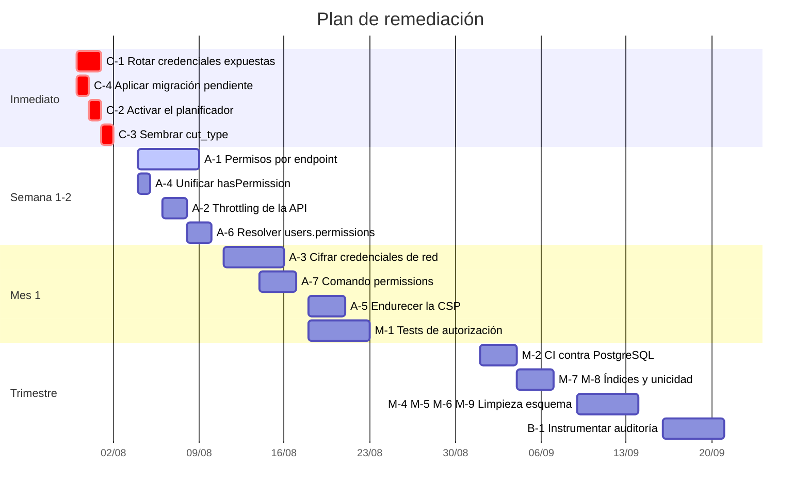

# BITÁCORA DE MEJORAS — ISPWatch

> Hallazgos de auditoría de código, esquema y configuración. **Todos están verificados
> contra el repositorio o contra el esquema real de producción**; cada uno incluye la
> evidencia. No se listan sospechas sin comprobar.

**Fecha de auditoría:** 2026-07-30 · Rama: `feat/first-invoice-free-months` · Commit base: `b381211`

---

## Índice

1. [Resumen por prioridad](#1-resumen-por-prioridad)
2. [Prioridad crítica](#2-prioridad-crítica)
3. [Prioridad alta](#3-prioridad-alta)
4. [Prioridad media](#4-prioridad-media)
5. [Prioridad baja](#5-prioridad-baja)
6. [Tabla consolidada](#6-tabla-consolidada)
7. [Plan de acción sugerido](#7-plan-de-acción-sugerido)
8. [Lo que ya está bien resuelto](#8-lo-que-ya-está-bien-resuelto)

---

## 1. Resumen por prioridad

| Prioridad | Cantidad | Naturaleza |
|---|---:|---|
| 🔴 **Crítica** | 4 | Secretos expuestos, ciclo automático sin ejecutor, corte inoperante |
| 🟠 **Alta** | 7 | Autorización incompleta, credenciales sin cifrar, sin límite de peticiones |
| 🟡 **Media** | 9 | Deuda de esquema, cobertura de pruebas, inconsistencias de UI |
| 🟢 **Baja** | 6 | Limpieza, documentación, ergonomía |

---

## 2. Prioridad crítica

### C-1 · Credenciales de producción en texto plano dentro del repositorio

**Problema.** `.do/deploy.template.yaml` está **versionado en Git** y contiene, sin cifrar:

| Secreto | Valor expuesto |
|---|---|
| `APP_KEY` | Clave de cifrado de la aplicación |
| `DB_PASSWORD` | Contraseña de la base de datos Supabase de producción |
| `DB_USERNAME` + `DB_HOST` | Usuario y host de la base de datos |
| `MIKROTIK_CORE_API_PASS` | Contraseña de administrador del router CORE |
| `MIKROTIK_CORE_SSH_PASS` | Contraseña SSH del CORE |
| `MIKROTIK_CORE_SSH_KEY_PASSPHRASE` | Frase de la clave privada |
| `MIKROTIK_IPSEC_SECRET` | Secreto IPSec |
| `MIKROTIK_VPN_PASSWORD` | Contraseña VPN |
| `MAIL_PASSWORD` | Clave SMTP de Brevo |
| `VITE_SUPABASE_ANON_KEY` | Clave anónima de Supabase |

**Evidencia.** `git ls-files | grep .do/` devuelve el archivo; su contenido está en claro
salvo `MIKROTIK_CORE_SSH_KEY_B64`, que sí usa `type: SECRET`.

**Impacto.** Compromiso total: base de datos de todos los tenants, **acceso administrativo
al router CORE y por tanto a toda la red de clientes**, capacidad de descifrar las claves de
Google Maps almacenadas, y suplantación de correo desde el dominio de la empresa.
El repositorio es privado, pero cualquier colaborador presente o pasado, cualquier fork y
cualquier copia local tienen estos valores. **El historial de Git los conserva aunque se
borren hoy.**

**Recomendación.**

1. **Rotar de inmediato y en este orden:** contraseña del CORE (API y SSH), secreto IPSec,
   contraseña de la base de datos, clave SMTP, claves de Supabase.
2. `APP_KEY`: **no se puede rotar sin más** — cifra `tenant.google_maps_api_key`.
   Procedimiento: descifrar con la clave actual, rotar, re-cifrar y re-guardar.
3. Convertir cada `value:` sensible en `type: SECRET` en la especificación, o quitarlas del
   archivo y gestionarlas sólo en el panel de DigitalOcean.
4. Purgar el historial (`git filter-repo`) o asumir el compromiso y rotar todo.
5. Añadir `.do/deploy.template.yaml` a `.gitignore` y versionar una plantilla con
   marcadores.

---

### C-2 · El planificador no está definido en el despliegue

**Problema.** `.do/deploy.template.yaml` define un servicio web y un worker de cola, pero
**ningún componente ejecuta `php artisan schedule:run`**.

**Evidencia.** Los `run_command` de ambos componentes son `heroku-php-apache2 public/` y
`php artisan queue:work` respectivamente. No hay `schedule:run` ni `schedule:work` en
ninguna parte de la especificación.

**Impacto.** **Nada del ciclo automático ocurre en producción**: no se generan facturas, no
se envían recordatorios, no se corta a los morosos, no se reconcilian los cortes, no se
recolecta tráfico. Es el fallo más grave de negocio del sistema y **ya se materializó**: el
comando `billing:verify-monthly` existe precisamente porque el cron de producción no corría
y el failover no lo detectaba (sólo ve fallos por cliente, no un job que nunca se ejecutó).

**Recomendación.** Añadir un tercer componente:

```yaml
workers:
  - name: scheduler
    run_command: php artisan schedule:work
```

o un cron externo a `schedule:run` cada minuto. Verificar después con
`billing:verify-monthly` y `billing:verify-cuts` (deben reportar `ok`, no `no_show`).
Considerar además una alerta si `verify-monthly` no produce salida en 24 h.

---

### C-3 · La tabla `cut_type` está vacía en producción

**Problema.** `OverdueSuspensionService` decide si un router corta comparando el **nombre
literal** de su tipo de corte:

```php
if ($cutTypeName === 'Corte Manual') { … }
if ($cutTypeName !== 'Corte Automático') { … no action … }
```

La tabla `cut_type` tiene **0 filas** en el esquema `public`.

**Evidencia.** `pg_stat_user_tables`: `ROWS|cut_type|0`. Además `router.cut_type_id` es
nullable con `ON DELETE SET NULL`, y el servicio filtra por `whereNotNull('cut_type_id')`.

**Impacto.** **Ningún cliente se corta automáticamente**, con independencia de su mora.
El sistema registra que revisó los routers y no encuentra ninguno elegible. Fuga de ingreso
directa y silenciosa.

**Recomendación.**

1. Sembrar `cut_type` con `Corte Automático` y `Corte Manual` (existe `CutTypeSeeder`, pero
   los seeders **nunca corren sobre `public`** por diseño de `migrate:both`). Hacerlo con
   una **migración** de datos, no con un seeder.
2. Sustituir la comparación por nombre por **constantes o un `code`** en la tabla: un cambio
   de texto (una tilde, un espacio) deja el corte inoperante sin ningún error.
3. Añadir a `billing:verify-cuts` la detección explícita de "router sin `cut_type_id`".

---

### C-4 · Migración pendiente de aplicar en producción

**Problema.** `2026_07_30_000000_add_first_invoice_free_months_and_plan_policy` está
pendiente. El esquema `public` no tiene `billing.first_invoice_free_months`,
`customer_profile.first_invoice_free_months`, `service_plan.first_invoice_mode` ni
`service_plan.first_invoice_free_months`.

**Evidencia.** `php artisan migrate:status` → 1 pendiente; `migrations` tiene 128 filas
frente a 129 archivos.

**Impacto.** El código de la rama lee esas columnas. Si se despliega sin migrar, cualquier
resolución de política de primera factura fallará con columna inexistente, **rompiendo la
generación mensual completa**.

**Recomendación.** Aplicar con `php artisan migrate:both` **antes** de fusionar a `main`
(el despliegue es automático por push). Verificar que el `migrate --force` del arranque
del contenedor la cubre, y comprobar `migrate:status` tras el despliegue.

---

## 3. Prioridad alta

### A-1 · Autorización incompleta en la API

**Problema.** La mayor parte de los `apiResource` sólo exige autenticación, sin permiso:

| Recurso | Middleware actual |
|---|---|
| `customers` (CRUD completo) | sólo `auth:sanctum` |
| `routers` (CRUD completo) | sólo `auth:sanctum` |
| `plans`, `sectorials`, `inventory`, `support` | sólo `auth:sanctum` |
| `inventory-stock/-providers/-branches` | sólo `auth:sanctum` |
| Instalaciones, prospectos, documentos de cliente | sólo `auth:sanctum` |
| Centro de ayuda (**escritura incluida**) | sólo `auth:sanctum` |

**Evidencia.** `routes/api.php` líneas 116–124, 229–258, 338–344.

**Impacto.** El control de acceso real a esas pantallas lo impone la guarda de `vue-router`,
que es **puramente cosmética**: cualquier usuario autenticado —incluido un rol "Cliente" sin
ningún permiso— puede llamar la API directamente y **crear, modificar o eliminar clientes,
routers y planes**. Es una vulnerabilidad OWASP A01 (Broken Access Control).

**Recomendación.** Aplicar el permiso correspondiente a cada recurso. Ejemplo:

```php
Route::middleware('permission:view_clients')->group(function () {
    Route::get('/customers',      [CustomerProfileController::class, 'index']);
    Route::get('/customers/{id}', [CustomerProfileController::class, 'show']);
});
Route::middleware('permission:add_clients')->post('/customers', …);
Route::middleware('permission:edit_internet_service')->put('/customers/{id}', …);
```

Priorizar `customers`, `routers` y el centro de ayuda. Añadir un test por recurso que
verifique que un usuario sin el permiso recibe `403`.

---

### A-2 · Sin límite de peticiones en la API

**Problema.** No hay `throttle` en el grupo `api`. El único límite es el `RateLimiter`
manual dentro de `AuthController::login`.

**Evidencia.** `bootstrap/app.php` sólo antepone `EnsureFrontendRequestsAreStateful`;
no hay `throttleApi()` ni middleware `throttle` en `routes/api.php`.

**Impacto.** Cualquier endpoint autenticado se puede llamar sin límite: enumeración de
clientes, abuso de los endpoints de aprovisionamiento (que abren sesiones SSH al CORE y
tardan 20–30 s cada una — **agotan el pool de conexiones del CORE**), y denegación de
servicio trivial contra la base de datos.

**Recomendación.**

```php
$middleware->api(prepend: [ … ]);
$middleware->throttleApi();   // 60/min por usuario
```

Y un límite más estricto para los endpoints costosos:

```php
Route::post('/customers/{id}/provision', …)
     ->middleware(['permission:activate_deactivate_clients', 'throttle:10,1']);
```

---

### A-3 · Credenciales de red y de servicio almacenadas en texto plano

**Problema.** Contraseñas guardadas sin cifrar en la base de datos:

| Tabla.columna | Contenido |
|---|---|
| `router.password_rb` | Contraseña de administración del RouterBoard |
| `router.password_rb_encrypted` | **También texto plano**, pese al nombre |
| `router.vpn_password` / `vpn_password_encrypted` | Contraseña VPN |
| `sectorial.pass_rb` | Contraseña del equipo sectorial |
| `customer_profile.pppoe_password` | Contraseña PPPoE del cliente |
| `customer_profile.hotspot_password` | Contraseña HotSpot del cliente |

**Evidencia.** Comentario explícito en `app/Models/Router.php`: la migración
`2026_05_14_000001_encrypt_router_credentials` copió **texto plano** con SQL crudo, asumiendo
erróneamente que el cast cifraría; el cast `encrypted` se deshabilitó porque lanzaba
`DecryptException` en toda lectura.

**Impacto.** Un volcado de base de datos entrega el control administrativo de toda la red.
Combinado con **C-1** (contraseña de la base expuesta en el repositorio), la cadena de
compromiso está completa.

**Recomendación.**

1. Migración de re-guardado: leer en claro, cifrar con `Crypt::encryptString()`, escribir en
   la columna `*_encrypted`, **vaciar** la columna en claro.
2. Activar el cast `encrypted` **sólo después** de que la migración haya corrido con éxito
   en ambos esquemas.
3. Eliminar las columnas en claro en una migración posterior.
4. Contemplar el caso de las contraseñas PPPoE/HotSpot: se envían al router, así que deben
   ser descifrables (no *hasheables*).

---

### A-4 · El guardián del frontend no reproduce el bypass de administrador

**Problema.** Hay **dos** implementaciones de `hasPermission` con lógica distinta:

| Archivo | Bypass de admin |
|---|---|
| `resources/js/services/auth.js` | **Sí**: `role_id == 1 \|\| role_name === 'Administrador' \|\| permissions.includes('*')` |
| `resources/js/stores/auth.js` (**la que usa el router**) | **No**: sólo `permissions.includes('*')` |

**Evidencia.** Comparación directa de ambos archivos. `router/index.js` importa
`useAuthStore`, es decir la versión **sin** bypass.

**Impacto.** Un administrador (`role_id == 1`) cuyo array `role.permissions` no contenga un
permiso concreto **es rechazado por la navegación del frontend**, aunque el backend sí le
daría acceso por el bypass de `CheckPermission`. Es exactamente el síntoma que produjo el
incidente del permiso `manage_document_templates`: administradores con 34 de 35 permisos que
no veían la pestaña Plantillas.

**Recomendación.** Unificar en una sola función. La del store debe replicar el criterio del
backend:

```js
function hasPermission(permission) {
    if (!user.value) return false
    if (Number(user.value.role_id) === 1) return true      // espejo de CheckPermission
    if (permissions.value.includes('*')) return true
    return permissions.value.includes(permission)
}
```

Eliminar después `services/auth.js` o convertirlo en un envoltorio del store.

---

### A-5 · Política de seguridad de contenido permisiva

**Problema.** La CSP de producción incluye `'unsafe-inline'` y `'unsafe-eval'` en
`script-src`, además de `https://unpkg.com` como origen permitido.

**Evidencia.** `app/Http/Middleware/SecurityHeaders.php`, rama de producción.

**Impacto.** `'unsafe-eval'` y `'unsafe-inline'` desactivan buena parte de la protección
contra XSS que la CSP debería aportar. `unpkg.com` es un CDN público: si se compromete o si
un atacante logra inyectar una etiqueta `<script src>`, la CSP no lo detiene.
Es especialmente relevante aquí porque el sistema **permite HTML editable por el usuario**
en las plantillas de documentos.

**Recomendación.** Vite genera bundles: `'unsafe-eval'` no debería hacer falta en producción.
Sustituir `'unsafe-inline'` por hashes o *nonces*, alojar localmente lo que hoy viene de
`unpkg.com`, y verificar que `TemplateSanitizer` (HTMLPurifier) bloquea `<script>` y
atributos `on*` en las plantillas.

---

### A-6 · `users.permissions` es una columna muerta que induce a error

**Problema.** `users.permissions` (json) existe en el esquema y está en `$fillable` y
`$casts` de `User`, pero **el sistema efectivo lee siempre `role.permissions`**: así lo hacen
`CheckPermission`, `AuthController@login`, `/auth/me` y el frontend.

**Evidencia.** Ninguna lectura de `$user->permissions` en el flujo de autorización.

**Impacto.** Un administrador que asigne permisos individuales a un usuario esperará que
surtan efecto y **no ocurrirá nada**. Fallo silencioso de configuración.

**Recomendación.** Decidir explícitamente: o se implementa la unión
`role.permissions ∪ users.permissions` en `CheckPermission` y en el store del frontend, o se
elimina la columna. **No dejar el estado intermedio actual.**

---

### A-7 · `getPermissionsByRole()` y `role.permissions` pueden divergir

**Problema.** `Permissions::getPermissionsByRole()` define en código qué permisos
corresponde a cada rol, pero la autorización real lee el array JSON **sembrado en la base**.
Ambas fuentes pueden desincronizarse y nada las reconcilia.

**Evidencia.** `CheckPermission` usa `$user->role->hasPermission()`, que lee la columna;
`getPermissionsByRole()` no se consulta en tiempo de ejecución.

**Impacto.** Es la causa raíz de que cada permiso nuevo requiera una migración de backfill
manual (patrón ya establecido en `2026_07_27_120000`). Fácil de olvidar; el síntoma —una
pestaña que desaparece— es difícil de diagnosticar.

**Recomendación.** Un comando idempotente `permissions:sync` que reconcilie los roles
canónicos (`admin`, `staff`, `technician`, `accounting`) con `getPermissionsByRole()`,
respetando los roles personalizados. Ejecutarlo en el despliegue y añadir un test que falle
si un permiso de `Permissions` no está en el rol admin sembrado.

---

## 4. Prioridad media

### M-1 · Cobertura de pruebas desequilibrada

Facturación y documentos están bien cubiertos (13 + 4 archivos). **Sin cobertura
significativa:** clientes (el controlador más grande, 1385 líneas), prospectos, sectoriales,
soporte, gastos, roles y permisos.

**Recomendación.** Priorizar por riesgo: (1) autorización por endpoint —cubre A-1 y evita
regresiones—, (2) alta de cliente con sus reglas de unicidad, (3) conversión de prospecto.

---

### M-2 · Los tests en SQLite ocultan diferencias reales de PostgreSQL

| Aspecto | PostgreSQL | SQLite | Consecuencia |
|---|---|---|---|
| Booleano vs cadena | `SQLSTATE 22P02` | Cero filas en silencio | Ya causó un fallo de facturación |
| `LIKE` | Sensible a mayúsculas | Insensible | Búsquedas que fallan sólo en producción |
| Índices parciales | Sí | No | Migraciones que hay que proteger por driver |

**Recomendación.** Añadir un *job* de CI que ejecute la suite contra PostgreSQL además de
SQLite. Como mínimo, las suites `Feature/Billing` y las de búsqueda.

---

### M-3 · `LIKE` sensible a mayúsculas sin corregir en todas partes

**Evidencia.** El problema se corrigió en la búsqueda de facturación pero
`SupportTicketController` conserva el patrón.

**Recomendación.** Un ámbito reutilizable:

```php
$q->where($col, DB::getDriverName() === 'pgsql' ? 'ilike' : 'like', "%{$term}%");
```

Aplicarlo a toda búsqueda de texto libre.

---

### M-4 · `inventory_stock.desc` tiene tipo `date`

Una columna que funcionalmente es una descripción está declarada como fecha.
Hubo una migración de corrección de tipos (`2026_02_13_160000`) que no la cubrió.

**Recomendación.** Migración `ALTER COLUMN desc TYPE varchar(255) USING desc::text`,
protegida por driver.

---

### M-5 · Llave foránea duplicada en `service_plan.tenant_id`

Dos restricciones sobre la misma columna con reglas distintas (`SET NULL` y `NO ACTION`).

**Recomendación.** Eliminar la redundante y dejar `SET NULL`, coherente con el resto.

---

### M-6 · Reglas `ON DELETE` inconsistentes

`invoices.tenant_id`, `payments.tenant_id` y `router.tenant_id` usan `NO ACTION` mientras el
resto del esquema usa `SET NULL` o `CASCADE`. Borrar un tenant fallará con error de FK.

**Recomendación.** Definir la política de baja de tenant (¿archivar o borrar en cascada?) y
homogeneizar. Documentar la decisión.

---

### M-7 · Índices de rendimiento ausentes en las tablas más grandes

`invoices` (1 168 filas) sólo tiene la PK y el único `(tenant_id, number)`. Las consultas
habituales filtran por `customer_id`, `status`, `due_date` y `period_start`. Igual en
`payments` (1 086) y `user_services` (987).

**Recomendación.**

```sql
CREATE INDEX invoices_customer_status_idx ON invoices (customer_id, status);
CREATE INDEX invoices_due_date_idx        ON invoices (due_date) WHERE balance_due > 0;
CREATE INDEX invoices_tenant_period_idx   ON invoices (tenant_id, period_start);
CREATE INDEX user_services_user_status_idx ON user_services (user_id, status);
```

El volumen actual es pequeño, pero el corte automático y la generación mensual recorren
estas tablas por cada cliente y por cada ejecución horaria.

---

### M-8 · Sin índice que garantice la unicidad de IP por router

La regla "un cliente por IP en cada router" se valida **sólo en `CustomerProfileController`**.
Cualquier otra vía de escritura (importación masiva, tinker, actualización masiva) puede
violarla.

**Recomendación.** Índice único parcial, análogo al que ya protege `pppoe_username`:

```sql
CREATE UNIQUE INDEX customer_profile_ip_router_unique
  ON customer_profile (router_id, ip_user)
  WHERE ip_user IS NOT NULL AND ip_user <> '' AND router_id IS NOT NULL;
```

---

### M-9 · Tablas muertas en el esquema

`ip_range`, `router_ip_range`, `ip_assignment`, `activity_log`, `script_version`,
`type_billing` — todas con 0 filas y sin escritura activa. `activity_log` está además
duplicada funcionalmente por `audit_logs`.

**Recomendación.** Confirmar que no se usan, documentarlo y eliminarlas en una migración.
Reducen ruido en el diccionario y en las herramientas de esquema.

---

## 5. Prioridad baja

### B-1 · `audit_logs` está implementado pero vacío

El modelo `AuditLog` expone un método `log()` completo, hay migración e índices, pero la
tabla tiene **0 filas**: nadie lo invoca.

**Recomendación.** O se instrumentan las acciones sensibles (borrado de factura, cambio de
rol, suspensión manual, edición de plantilla), o se elimina. La trazabilidad de "quién borró
esta factura" es un requisito habitual de auditoría en un ISP.

---

### B-2 · `.env.testing` versionado

Contiene una `APP_KEY` (de pruebas, sin valor real) pero está listado en `.gitignore` y aun
así **sigue siendo trackeado** — `.gitignore` no destrackea.

**Recomendación.** `git rm --cached .env.testing` y versionar `.env.testing.example`.

---

### B-3 · El parámetro `tenant`/`tenant_id` del interceptor de axios es residual

El interceptor lo añade a **toda** petición; el backend lo ignora deliberadamente.

**Recomendación.** Eliminarlo del interceptor. Hoy sugiere —falsamente— que el cliente
controla el tenant, lo que induce a error a quien lea el código por primera vez.

---

### B-4 · Convención de nombres de tabla inconsistente

Singular en las tablas antiguas (`router`, `sectorial`, `billing`), plural en las nuevas
(`invoices`, `payments`, `expenses`).

**Recomendación.** No renombrar (el coste supera el beneficio). **Documentarlo** —hecho en
[`BASE_DATOS.md §1`](BASE_DATOS.md#1-convenciones-y-arquitectura-de-datos)— y fijar la
convención para tablas futuras.

---

### B-5 · `README.md` desactualizado respecto al código

La versión anterior afirmaba que `billing:generate-monthly` es un *closure* sin argumentos y
que el planificador corre "día 1 a las 00:00". Ambas cosas dejaron de ser ciertas: hoy es una
clase de comando con argumento `{period?}` y el planificador es horario con nueve tareas.

**Estado:** corregido en esta documentación. **Recomendación:** incluir la revisión de
documentación en la definición de "terminado" de cada PR.

---

### B-6 · Restos de Livewire/Volt sin uso aparente

`routes/auth.php` define rutas Volt (login, registro, recuperación de contraseña) heredadas
de Breeze, mientras la autenticación real vive en la SPA y en `routes/api.php`.

**Recomendación.** Verificar si `/login` Volt sigue accesible en producción; si lo está, es
una **superficie de autenticación paralela** sin el rate limiting ni la detección de
inyección de `AuthController`. Eliminar o proteger.

---

## 6. Tabla consolidada

| ID | Problema | Impacto | Prioridad | Recomendación |
|---|---|---|---|---|
| **C-1** | Credenciales de producción en texto plano en `.do/deploy.template.yaml` versionado | Compromiso total: BD, CORE MikroTik, SMTP, Supabase | 🔴 Crítica | Rotar todo, convertir a `type: SECRET`, purgar historial |
| **C-2** | Sin componente que ejecute `schedule:run` | No se factura, no se recuerda, no se corta | 🔴 Crítica | Añadir worker `schedule:work` o cron externo |
| **C-3** | `cut_type` vacía + comparación por nombre literal | Ningún cliente se corta automáticamente | 🔴 Crítica | Sembrar por migración y sustituir por `code`/constante |
| **C-4** | Migración `2026_07_30_000000` pendiente en producción | Rompe la generación mensual al desplegar la rama | 🔴 Crítica | `migrate:both` antes de fusionar a `main` |
| **A-1** | `apiResource` de clientes, routers, planes… sin permiso | Cualquier autenticado puede crear/borrar clientes y routers | 🟠 Alta | Aplicar `permission:` por recurso + tests de 403 |
| **A-2** | Sin `throttle` en la API | Enumeración, DoS, agotamiento del pool SSH del CORE | 🟠 Alta | `throttleApi()` + `throttle:10,1` en endpoints costosos |
| **A-3** | Contraseñas de router/VPN/PPPoE/HotSpot en texto plano | Un volcado de BD entrega el control de la red | 🟠 Alta | Migración de re-guardado + activar cast `encrypted` |
| **A-4** | El store de Pinia no replica el bypass de admin del backend | Administradores bloqueados en el frontend | 🟠 Alta | Unificar `hasPermission` con el criterio de `CheckPermission` |
| **A-5** | CSP con `'unsafe-inline'`, `'unsafe-eval'` y `unpkg.com` | Protección XSS mermada con HTML editable por usuario | 🟠 Alta | Hashes/nonces, alojar assets localmente |
| **A-6** | `users.permissions` es columna muerta | Los permisos individuales no surten efecto, en silencio | 🟠 Alta | Implementarla o eliminarla |
| **A-7** | `getPermissionsByRole()` y `role.permissions` divergen | Cada permiso nuevo exige backfill manual; fácil de olvidar | 🟠 Alta | Comando `permissions:sync` + test de coherencia |
| **M-1** | Sin cobertura en clientes, roles, soporte, prospectos | Regresiones no detectadas en el módulo mayor | 🟡 Media | Tests de autorización y de alta de cliente |
| **M-2** | Tests sólo en SQLite | Fallos que sólo aparecen en producción | 🟡 Media | CI adicional contra PostgreSQL |
| **M-3** | `LIKE` sensible a mayúsculas sin corregir en soporte | Búsquedas que no encuentran resultados | 🟡 Media | Ámbito reutilizable `ilike` por driver |
| **M-4** | `inventory_stock.desc` de tipo `date` | Campo inutilizable para su fin | 🟡 Media | `ALTER COLUMN ... TYPE varchar` |
| **M-5** | FK duplicada en `service_plan.tenant_id` | Comportamiento de borrado ambiguo | 🟡 Media | Eliminar la redundante |
| **M-6** | `ON DELETE` inconsistente en `tenant_id` | Borrar un tenant falla | 🟡 Media | Homogeneizar y documentar |
| **M-7** | Faltan índices en `invoices`, `payments`, `user_services` | Degradación al crecer; se recorren cada hora | 🟡 Media | Índices compuestos por consulta real |
| **M-8** | Unicidad de IP por router sólo en el controlador | Importaciones pueden duplicar IPs | 🟡 Media | Índice único parcial |
| **M-9** | Seis tablas muertas | Ruido en el esquema | 🟡 Media | Confirmar y eliminar |
| **B-1** | `audit_logs` implementado pero nunca invocado | Sin trazabilidad de acciones sensibles | 🟢 Baja | Instrumentar o eliminar |
| **B-2** | `.env.testing` versionado | Higiene | 🟢 Baja | `git rm --cached` + `.example` |
| **B-3** | Parámetro `tenant` residual en axios | Induce a error al leer el código | 🟢 Baja | Eliminar del interceptor |
| **B-4** | Nombres de tabla singular/plural mezclados | Confusión | 🟢 Baja | Documentado; fijar convención futura |
| **B-5** | Documentación desincronizada del código | Decisiones sobre información falsa | 🟢 Baja | Revisión de docs en cada PR |
| **B-6** | Rutas Volt de autenticación heredadas | Posible superficie de login paralela sin rate limiting | 🟢 Baja | Verificar accesibilidad; eliminar o proteger |

---

## 7. Plan de acción sugerido



### Orden recomendado y por qué

1. **C-1 primero.** Mientras las credenciales estén expuestas, cualquier otra medida se
   construye sobre una base comprometida.
2. **C-4 antes de fusionar** la rama actual: `main` despliega automáticamente.
3. **C-2 y C-3 juntos.** Son las dos causas independientes de que el ciclo automático no
   funcione. Arreglar una sin la otra no restablece el corte.
4. **A-1 y A-4 en el mismo bloque.** Ambos tocan autorización; hacerlos juntos evita que
   endurecer el backend rompa la navegación del frontend.
5. **A-3 después de C-1.** No tiene sentido cifrar credenciales que ya fueron rotadas
   incorrectamente; rota primero, cifra después.

---

## 8. Lo que ya está bien resuelto

Registro explícito de las decisiones acertadas, para que una refactorización futura no las
deshaga sin conocer su motivo.

| Acierto | Por qué importa |
|---|---|
| **`tenant_id` derivado sólo del usuario autenticado** | Cierra la fuga entre tenants por query param (OWASP A01/A04) |
| **Cliente de otro tenant = "no encontrado"** | Evita enumeración entre tenants en el aprovisionamiento |
| **`created_by` sellado desde la sesión** | El cliente no puede falsear quién registró un pago o un gasto |
| **Idempotencia de la facturación** | Las ejecuciones horarias adicionales son no-ops seguras |
| **Recuperación ante caídas** (`today->day >= create_day`) | Si el sistema estuvo caído el día de facturación, recupera al arrancar |
| **Lápida `suppressed`** | Una factura borrada a conciencia no resucita, y sólo afecta a ese mes |
| **Failover con backoff diferenciado** | Cortes cada 30 min (fuga de ingreso), facturas cada 2 h |
| **Auditoría de no-show** (`verify-monthly` / `verify-cuts`) | Cubre el punto ciego que el failover por definición no puede ver |
| **`FirstInvoicePolicy` como fuente única** | Generación, auditoría y vista previa usan la misma fórmula: no puede divergir |
| **`RouterEndpointResolver`** | Resuelve la deriva de IP del overlay leyendo la verdad del CORE |
| **Índice único parcial de `pppoe_username` por router** | Impide que RouterOS sobrescriba en silencio el secret de otro cliente |
| **`config/database.php` sin `url` en `sqlite`** | Hace estructuralmente imposible que los tests escriban en la base real |
| **Aprovisionamiento masivo asíncrono** | Reconoce el coste real (17–34 s/cliente) en vez de pelear con el timeout |
| **`manage_document_templates` separado de `manage_tenant`** | Acota el radio de acción de un rol personalizado sobre texto legal |
| **Comentarios que explican el *porqué*, no el *qué*** | Buena parte de esta auditoría fue posible gracias a ellos |
