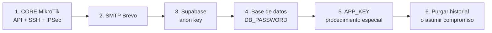

# RUNBOOK — Rotación de secretos expuestos

> Procedimiento operativo para el hallazgo **C-1** de
> [`MEJORAS_RECOMENDADAS.md`](MEJORAS_RECOMENDADAS.md).
> **Requiere acciones manuales fuera del repositorio.** El código ya está saneado;
> lo que queda es rotar las credenciales en cada proveedor.

**Creado:** 2026-07-30 · **Estado:** ⏳ pendiente de ejecución por el equipo

---

## 1. Qué pasó

Hasta el 2026-07-30, el archivo `.do/deploy.template.yaml` estaba **versionado en Git**
con las credenciales reales de producción en texto plano. Cualquiera con acceso al
repositorio, a un fork o a un clon local las tuvo, y **el historial de Git las conserva
aunque el archivo ya esté saneado**.

### Secretos comprometidos

| Secreto | Alcance del compromiso | Rotar |
|---|---|---|
| `DB_PASSWORD` + `DB_USERNAME` + `DB_HOST` | Lectura y escritura de **todos los tenants** | 🔴 Sí |
| `MIKROTIK_CORE_API_PASS` | Administración del router CORE por API | 🔴 Sí |
| `MIKROTIK_CORE_SSH_PASS` | Administración del CORE por SSH | 🔴 Sí |
| `MIKROTIK_CORE_SSH_KEY_PASSPHRASE` | Frase de la clave privada SSH | 🔴 Sí |
| `MIKROTIK_IPSEC_SECRET` | Secreto IPSec de los túneles | 🔴 Sí |
| `MIKROTIK_VPN_PASSWORD` | Contraseña de los scripts VPN generados | 🔴 Sí |
| `MAIL_PASSWORD` | Envío de correo desde el dominio de la empresa | 🔴 Sí |
| `VITE_SUPABASE_ANON_KEY` | Clave anónima de Supabase (mitigada por RLS) | 🟠 Sí |
| `APP_KEY` | Descifrado de `tenant.google_maps_api_key` | 🟠 Procedimiento especial |

> El **acceso administrativo al CORE es lo más grave**: desde ahí se alcanza toda la red
> de RouterBoards de los clientes.

---

## 2. Orden de rotación

El orden importa: rotar la base de datos antes que el CORE dejaría la aplicación sin
poder registrar las bitácoras del corte.



---

## 3. Paso a paso

### 3.1 CORE MikroTik

```
# En el CORE, por Winbox o consola:
/user set admin password="<NUEVA_CONTRASEÑA>"
/ip ipsec identity set [find] secret="<NUEVO_SECRETO>"
```

Regenerar además la clave SSH:

```bash
ssh-keygen -t ed25519 -f ./mikrotik_core_id_ed25519 -C "ispwatch-app-platform"
base64 -w0 ./mikrotik_core_id_ed25519 > key.b64      # valor de MIKROTIK_CORE_SSH_KEY_B64
```

Subir la clave pública al CORE (`/user ssh-keys import`) y **eliminar la anterior**.

Actualizar en el panel de DigitalOcean, en **los tres componentes**
(`ispwatch`, `worker`, `scheduler`):
`MIKROTIK_CORE_API_PASS`, `MIKROTIK_CORE_SSH_PASS`,
`MIKROTIK_CORE_SSH_KEY_PASSPHRASE`, `MIKROTIK_CORE_SSH_KEY_B64`, `MIKROTIK_IPSEC_SECRET`,
`MIKROTIK_VPN_PASSWORD`.

**Verificar:** `GET /api/routers/test-core-connection` debe responder correctamente, y
`GET /api/routers/{id}/test-ssh-connection` sobre un router real.

> ⚠️ Los túneles L2TP/IPSec de los routers **se caerán** al cambiar el secreto IPSec.
> Hay que regenerar y reaplicar el script VPN en cada RouterBoard
> (`GET /api/routers/{id}/vpn-script`). Planifícalo en ventana de mantenimiento.

### 3.2 SMTP Brevo

Panel de Brevo → SMTP & API → revocar la clave actual y generar una nueva.
Actualizar `MAIL_PASSWORD` en `ispwatch` y `scheduler`.

**Verificar:** provocar un correo de verificación de cuenta.

### 3.3 Supabase (anon key)

Panel de Supabase → Settings → API → *Rotate anon key*.
Actualizar `VITE_SUPABASE_ANON_KEY`.

> El impacto es bajo porque RLS ya bloquea al rol `anon` (devuelve 401) y el frontend
> dejó de acceder directamente a Supabase. Aun así, rótala: no debe quedar una clave
> pública conocida.

### 3.4 Base de datos

Panel de Supabase → Settings → Database → cambiar la contraseña del usuario.
Actualizar `DB_PASSWORD` en `ispwatch`, `worker` y `scheduler`.

**Verificar:** `php artisan migrate:status` desde la consola de la app.

> Hay corte de servicio entre el cambio y el redespliegue. Hazlo en horario de baja carga.

#### Tres formas de creer que ya lo hiciste

El 2026-08-20 este paso se ejecutó a medias y costó quince horas de caída total (§ 48 de
la bitácora). El procedimiento de arriba era correcto y estaba escrito; lo que faltó fue
saber cómo se ve un paso incompleto. Se ve así:

**1. Editar la variable no la aplica.** Sólo existe cuando un despliegue *aterriza*. Y si
ese despliegue falla —por ejemplo, porque `migrate --force` corre en el arranque y tampoco
puede conectar— App Platform revierte **incluyendo la variable que acabas de corregir**. Se
puede editar diez veces seguidas sin ningún efecto. Confirma siempre en la pestaña
*Activity* que el despliegue terminó en verde.

**2. Corregir un componente no corrige los demás.** Cada componente tiene su propio bloque
de variables y no hereda nada. Si sólo actualizas `ispwatch`, el `worker` sigue reiniciándose
en bucle, la app queda en *Degraded*, el sitio sigue sin funcionar — y el arreglo correcto
parece equivocado, que es lo que más tiempo hace perder.

**3. El panel no dice lo que está corriendo.** Muestra la especificación, no el contenedor
vivo. Para ver la verdad, pestaña *Console* del componente:

```bash
echo $DB_PASSWORD          # ¿es la nueva, o el rollback dejó la vieja?
php artisan migrate:status # el error crudo, sin el mensaje genérico encima
```

**Verificación final, obligatoria en toda rotación:**

```bash
curl -s https://ispwatch-crm.app/health/deep | grep -o '"status":"[a-z]*"' | head -1
```

Debe responder `"status":"ok"`. Ese endpoint comprueba base de datos, caché, cola,
planificador y migraciones pendientes: si la rotación quedó a medias en cualquier
componente, lo dice. No des por cerrada una rotación sin esta línea en verde.

### 3.5 `APP_KEY` — procedimiento especial

**No se puede rotar cambiando la variable sin más.** `APP_KEY` cifra
`tenant.google_maps_api_key` (cast `encrypted`). Si se cambia sin migrar los datos,
toda lectura lanzará `DecryptException` y el mapa de clientes dejará de funcionar.

```php
// Con la APP_KEY ANTIGUA todavía activa: exportar en claro.
$claves = DB::table('tenant')->pluck('google_maps_api_key', 'id')
    ->map(fn ($v) => $v ? Crypt::decryptString($v) : null);
// Guardar $claves fuera de la base de datos, temporalmente.

// Cambiar APP_KEY, redesplegar y re-cifrar:
foreach ($claves as $id => $plano) {
    if ($plano === null) { continue; }
    DB::table('tenant')->where('id', $id)
        ->update(['google_maps_api_key' => Crypt::encryptString($plano)]);
}
```

Al cambiar `APP_KEY` **se invalidan todas las sesiones** (`SESSION_ENCRYPT=true`):
todos los usuarios tendrán que volver a iniciar sesión. Avísalo.

> Si en el momento de la rotación se ha aplicado ya el hallazgo **A-3** (cifrado de
> credenciales de red), este paso debe cubrir **también** `router.*_encrypted` y
> `customer_profile.pppoe_password` / `hotspot_password`. Ejecuta A-3 **después** de
> rotar `APP_KEY`, no antes.

### 3.6 Historial de Git

Dos caminos. Elige uno de forma explícita y déjalo registrado:

**A) Purgar el historial** (limpio, pero reescribe hashes y obliga a todo el mundo a
re-clonar):

```bash
pip install git-filter-repo
git filter-repo --path .do/deploy.template.yaml --invert-paths
# Volver a añadir la plantilla saneada y forzar el push (coordinado con el equipo).
```

**B) Asumir el compromiso**: no purgar, dar por quemadas las credenciales antiguas y
confiar en la rotación. Es aceptable **sólo si los pasos 3.1 a 3.5 están completos**.

---

## 4. Lista de verificación

- [ ] Contraseña admin del CORE rotada (API y SSH)
- [ ] Clave SSH regenerada y la anterior eliminada del CORE
- [ ] Secreto IPSec rotado y scripts VPN reaplicados en cada RouterBoard
- [ ] `MIKROTIK_VPN_PASSWORD` rotada
- [ ] Clave SMTP de Brevo revocada y sustituida
- [ ] Clave anónima de Supabase rotada
- [ ] `DB_PASSWORD` rotada
- [ ] `APP_KEY` rotada con re-cifrado de `tenant.google_maps_api_key`
- [ ] Variables actualizadas en los **tres** componentes de App Platform
- [ ] **El despliegue posterior terminó en verde** (pestaña *Activity*) — un despliegue
      fallido revierte las variables junto con el resto
- [ ] **`echo $DB_PASSWORD` en la consola de cada componente** devuelve el valor nuevo
- [ ] **`/health/deep` responde `"status":"ok"`**
- [ ] Decisión sobre el historial de Git tomada y registrada
- [ ] `test-core-connection` y `test-ssh-connection` verificados
- [ ] Un correo de prueba enviado correctamente
- [ ] `billing:verify-monthly` reporta `ok`

---

## 5. Prevención

Ya aplicado en el repositorio:

| Medida | Estado |
|---|---|
| `.do/deploy.template.yaml` sin secretos, con marcadores `<<<CAMBIAR:...>>>` | ✅ |
| Todo valor sensible declarado como `type: SECRET` | ✅ |
| `.do/deploy.yaml` y `.do/*.local.yaml` en `.gitignore` | ✅ |
| `.env.testing` destrackeado; se versiona `.env.testing.example` | ✅ |

Pendiente de decisión del equipo: añadir un *pre-commit hook* o un escáner de secretos
(gitleaks, trufflehog) al CI para que un descuido no vuelva a llegar al repositorio.
